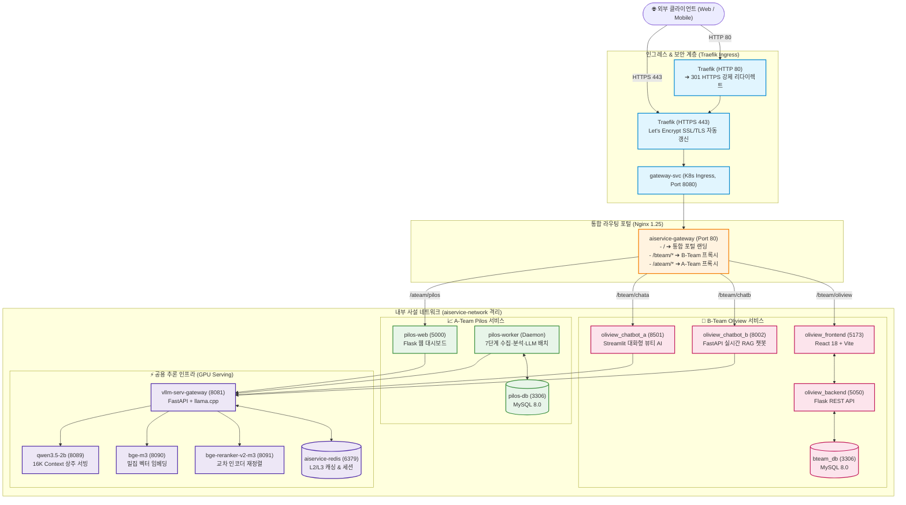

# AISERVICE: 통합 AI 서비스 단일 진입 게이트웨이 및 분산 플랫폼

> **A-Team(주식 수급 감정지수 분석 Pilos)**과 **B-Team(화장품 리뷰 감정분석 Oliview & AI 챗봇)**을 공인 HTTPS 단일 도메인(`https://ezenitac.duckdns.org`, Let's Encrypt 자동 발급) 및 사설 격리 네트워크로 통합한 엔터프라이즈 AI 서비스 플랫폼입니다.

---

## 🏛️ 통합 아키텍처 개요 (Architecture Overview)



---

## 🌐 단일 진입 URL 라우팅 맵

| 서비스 명칭 | 공인 접속 URL | 백엔드 기술 스택 | 주요 기능 및 역할 |
|---|---|---|---|
| **통합 포털 랜딩** | `https://ezenitac.duckdns.org/` | Nginx Static Portal | 4대 AI 서비스 바로가기 대시보드 |
| **B-Team Oliview** | `https://ezenitac.duckdns.org/bteam/oliview` | React 18 + Flask | 화장품 리뷰 감정 분석 & 속성별 비교 통계 |
| **B-Team 올리챗** | `https://ezenitac.duckdns.org/bteam/chata` | Streamlit + BGE-M3 | 초보자 맞춤 대화형 뷰티 가이드 AI |
| **B-Team 올원챗** | `https://ezenitac.duckdns.org/bteam/chatb` | FastAPI + 하이브리드 RAG | 실시간 SSE 스트리밍 뷰티 솔루션 챗봇 |
| **A-Team Pilos** | `https://ezenitac.duckdns.org/ateam/pilos` | Flask + Chart.js | 종목토론방 수급 감정지수 시각화 & 리포트 |
| **A-Team Worker** | *(Internal Daemon)* | Python Background Daemon | 7단계 수집·분석·LLM 리포트 10분 주기 실행 |

---

## 🚀 빠른 시작 (Quickstart)

### 1. 환경 설정 파일 준비
```bash
cp .env.example .env
```

### 2. 전체 시스템 원클릭 기동 (10개 마이크로서비스)
- **Windows 환경**:
  ```cmd
  run_all_services.bat up
  ```
- **Linux / WSL 환경**:
  ```bash
  chmod +x run_all_services.sh
  ./run_all_services.sh up
  ```

### 3. A-Team 수집·분석 파이프라인 수동 즉시 트리거
```bash
docker exec -it pilos-worker python -m pilos.jobs.run_service_pipeline
```

---

## 🐧 네이티브 Ubuntu 24.04 LTS 마이그레이션 환경 (dev-rtx3060)

- **타겟 하드웨어**: Intel Core i7-4770 (AVX2), 16GB RAM, NVIDIA GeForce RTX 3060 12GB (Compute Capability 8.6, sm_86)
- **운영 모드**: `APP_RUN_MODE=DEMO` (PoC/DEMO 수용 기준)
- **터널 진입점 연동**: 로컬 게이트웨이 포트 5개(`3000`, `8001~8004`)가 `dist_client_a` 역방향 터널을 통해 공인 게이트웨이에 연결됨
- **상세 수용 검증 가이드**: [specs/001-aiservice-platform-migration/quickstart.md](../specs/001-aiservice-platform-migration/quickstart.md)

### 테스트 실행 명령
```bash
# 계약 및 런타임 테스트 실행
pytest tests/contract -v
pytest tests/integration -v
pytest model_gateway/tests/contract -v
```

---

## 📚 상세 기술문서 목차 (Documentation)

각 서브 도메인별 심층 구현 아키텍처 및 상세 사양은 아래의 전용 문서에서 확인하실 수 있습니다:

0. 🎯 **[001 마이그레이션 수용 가이드](../specs/001-aiservice-platform-migration/quickstart.md)**
   - Ubuntu 24.04 LTS 네이티브 복원, 9개 핵심 헬스체크 및 롤백 검증 절차
1. 🏛️ **[통합 시스템 및 인프라 아키텍처 상세](docs/architecture.md)**
   - K8s Ingress, Traefik HTTPS 암호화, Nginx 라우터 및 사설 도커 브리지 네트워크 격리 구조
2. ⚡ **[Model Gateway & GPU 추론 서빙 상세](docs/model_gateway.md)**
   - `qwen3.5-2b` (16K ctx) 단일 상주 서빙, `SINGLE_MODEL_MODE` 토글, 실측 VRAM(~4.1GB) 토폴로지
3. 💄 **[B-Team Oliview 뷰티 리뷰 분석 플랫폼 & 챗봇 상세](docs/bteam_oliview.md)**
   - React 18 대시보드, 챗봇 A (Streamlit), 챗봇 B (FastAPI RAG 스트리밍 & 벡터 검색)
4. 📈 **[A-Team Pilos 주식 수급 감정지수 플랫폼 & 워커 데몬](docs/ateam_pilos.md)**
   - 네이버 종토방 크롤링, Kiwi 형태소 분석, Ridge v4 감정 추론 모델 및 7단계 배치 데몬
5. 🛡️ **[보안 가드레일 및 하이브리드 토큰 정책 상세](docs/security_guardrails.md)**
   - 4단계 CPU 심층 방어 가드레일(0MB VRAM 점유) 및 3단계 하이브리드 토큰 예산 정책

---

## 📄 라이센스 (License)

본 프로젝트는 **[MIT License](LICENSE)** 하에 배포됩니다. 자세한 내용은 `LICENSE` 파일을 참조하세요.
