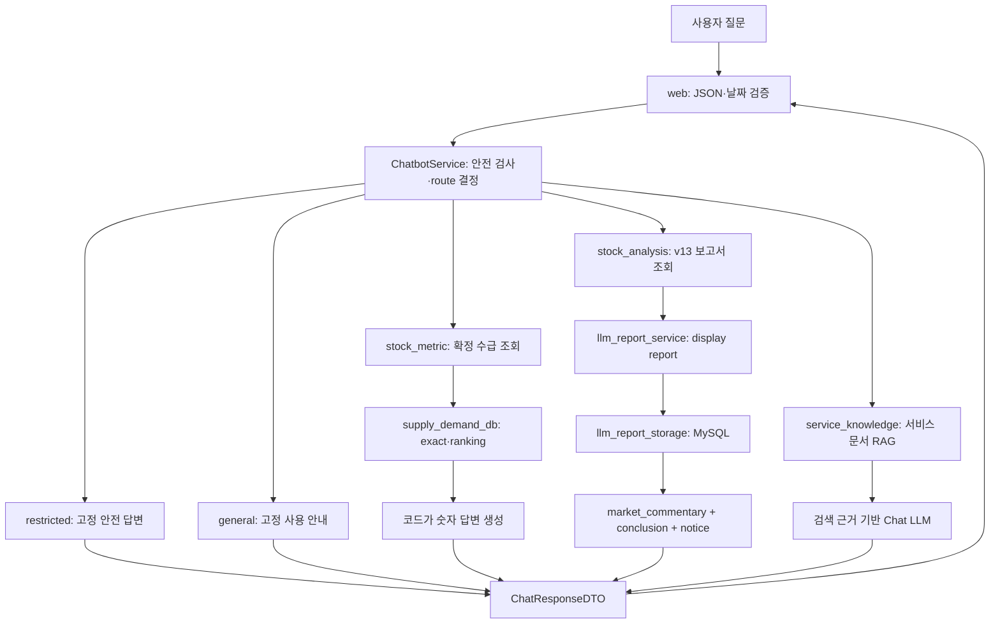
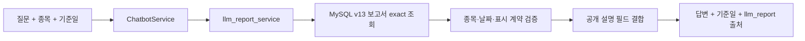

# PILOS 근거 기반 챗봇 구현 가이드

> 문서 상태: `대체됨`
>
> 이 문서는 구현 전 설계·검토 이력입니다. 현재 서비스 계약은
> [`chatbot-service.md`](chatbot-service.md)와 `docs` 정본을 사용합니다.
> 아래의 미확정 표현과 예시를 현재 구현으로 해석하지 않습니다.

## 0. 문서 상태와 적용 기준

- 문서 상태: PR #12 병합 완료·현재 계약과 구현 사실 반영
- 확인 기준: `develop@cbc5602`, 2026-08-10
- 대상 독자: 챗봇 구현·검증·운영과 후속 유지보수 담당자
- 현재 코드 기준: v13 일별 보고서, 확정 수급 조회, 서비스 지식 RAG와 공개 Chat API가 `develop`에 통합됨
- 현재 서비스 기준: calibration 기반 `댓글 수급 신호`와 실제 수급을 구분해 설명
- 수정 범위: 이 기능 명세 한 파일

이 문서는 PILOS 챗봇이 따라야 하는 도메인 규칙, 데이터 경계, 금지사항,
API 계약, 상태 처리와 현재 확인된 구현 사실을 기록하는 기능 명세다. v13 보고서의
현재 추적 명세는 `specs/comment-signal-daily-report.md`이며, 효력이 있는 계약은
정본 문서와 `develop`의 통합 코드를 함께 확인한다.

초기 calibration·일별 보고서 개편 지시에서 승인된 도메인 방향은 챗봇 설계에
반영됐다. 현재 DTO, API 필드, prompt/report/evidence schema version과 저장 형태는
생산 코드와 정본 문서에서 확인한다. 이 문서는 시점이 다른 사실을 혼용하지 않도록
내용을 다음 상태로 구분한다.

| 상태 | 의미 |
|---|---|
| 현재 계약 | 지금 챗봇이 반드시 지켜야 하는 규칙과 공통 경계 |
| 현재 구현 | 현재 `develop`에 실제 존재하는 동작 |
| 해결된 과거 충돌 | v13 전환 과정에서 발생했지만 현재는 해결된 문제 |
| 확정 대기 | 팀 합의·운영 증거·후속 구현이 더 필요한 항목 |
| 후속 선택 범위 | 현재 필수가 아니며 별도 근거와 승인이 있을 때만 진행할 기능 |

프로젝트 공통 정본은 계속 다음 문서다.

- 구조와 호출 방향: `docs/ARCHITECTURE.md`
- 필드와 데이터 의미: `docs/DATA_CONTRACT.md`
- 효력이 생긴 기술 결정: `docs/DECISIONS.md`

코드보다 문서를 먼저 가정해 공통 계약을 확정하지 않는다. 생산 코드나 정본이
변경되면 팀장이 승인한 최종 상태에 맞춰 이 가이드를 다시 동기화한다.

## 0.1 현재 `develop` 반영 결과

현재 `develop`에는 다음 통합 결과가 반영돼 있다.

- PR #7: calibration 기반 댓글 수급 신호와 `market_commentary_v13` 보고서
- PR #11: 크롤링 실행 경계와 관련 코드 리팩터링
- PR #12: 챗봇 MVP, 확정 수급 조회·순위, v13 보고서 소비와 서비스 지식 RAG
- `POST /api/chat`: JSON·action·metric·종목·날짜 검증과 공개 응답
- `restricted`, `general`, `service_knowledge`, `stock_metric`, `stock_analysis` 다섯 공개 route
- `stock_metric`: MySQL의 `data_status='confirmed'` 수급값과 고정 순위 조회
- `stock_analysis`: 저장된 v13 표시 보고서를 추가 LLM 호출 없이 공개 답변으로 변환
- `service_knowledge`: 활성 문서 버전의 완료 청크를 사용하는 BM25 + Vector + RRF + Rerank

현재 공개 Chat API는 질문 한 건을 독립적으로 처리한다. `session_id`는 응답 상관관계
표시용이며 대화 이력 저장·사용자별 격리·Multi-turn 문맥에는 사용하지 않는다.
자연어 종목·날짜 추출과 챗봇 UI도 현재 Backend 계약에 포함되지 않는다. 임의의
시작일·종료일을 받는 자유 기간 분석은 구현하지 않았고, `stock_analysis`는 저장된
v13 보고서에 포함된 전일·최근 평균 비교만 설명한다.

---

# 1. 변경되는 프로젝트 의미

PILOS는 일반적인 긍정·부정 감성분석기, 주가 예측기 또는 미래 수급 예측기가 아니다.

기본 분석 구조는 다음과 같다.

```text
종목·날짜별 투자자 댓글
→ Kiwi 토큰화
→ TF-IDF
→ positive 또는 negative Ridge
→ 같은 날짜 개인투자자 수급과 학습한 모델 반응
```

개편 후 사용자에게 설명할 핵심 문장은 다음이다.

> 온라인 투자자 댓글의 언어 패턴과 실제 개인투자자 수급 사이에서 학습된 관계를
> 기반으로, 현재 댓글에 대한 모델 반응이 과거 동일 수급 방향 대비 어느 정도
> 수준인지 수치화한다.

짧은 사용자용 이름은 `댓글 기반 수급 연계 신호` 또는 `댓글 수급 신호`를 사용한다.
`sentiment_score`, 감성 확률, 긍정 확률과 같은 이름은 사용하지 않는다.

## 1.1 실제 수급 방향과 댓글 신호의 분리

실제 방향과 신호 강도는 서로 다른 값이다.

```text
actual_supply_index
→ supply_direction 결정

선택된 방향의 Ridge predicted_score
+ 해당 모델 calibration
→ comment_signal_score 계산
```

예를 들어 다음 두 값은 모두 85점일 수 있다.

```text
supply_direction = BUY,  comment_signal_score = 85
supply_direction = SELL, comment_signal_score = 85
```

첫 번째는 과거 매수 우위 구간에서 모델 반응이 높은 수준이라는 뜻이고, 두 번째는
과거 매도 우위 구간에서 모델 반응이 높은 수준이라는 뜻이다. 85점 자체가 긍정이나
부정을 의미하지 않는다.

`50`도 감성 중립이 아니다. 같은 모델의 과거 출력 분포에서 중간 정도라는 뜻이다.

## 1.2 개편 전후 일별 보고서

```text
기존
Ridge 결과
→ 기여 키워드
→ 대표 댓글
→ LLM이 단어·댓글 문맥 해석
→ 보고서

현재 v13
Ridge raw score
→ calibration 기반 0~100 신호
→ 실제 수급·전일·최근 평균·댓글 수 결합
→ batch LLM 보고서 생성·저장
→ Chat API가 저장된 공개 설명을 결정적으로 조합
```

일별 LLM은 분석 결과를 만드는 주체가 아니다. 코드와 모델이 계산한 정형 결과를
사람이 읽기 쉽게 편집하는 역할만 맡는다.

---

# 2. 챗봇의 목표와 비목표

## 2.1 목표

챗봇은 다음 질문을 프로젝트 데이터에 근거해 처리한다.

| 현재 지원하는 사용자 요구 | 정본 또는 검색 수단 | 챗봇 역할 |
|---|---|---|
| 특정 종목·기준일의 확정 매수량·매도량·수급지수 | MySQL 확정 수급 조회 | 값을 바꾸지 않고 표시 |
| 여러 종목의 확정 수급 수치 순위 | MySQL의 허용된 고정 조회 | 기준일과 비교 범위를 명시 |
| 특정 종목·기준일의 분석 보고서 | MySQL의 저장된 v13 보고서 | 공개 설명 필드를 순서대로 조합 |
| 신호 의미·calibration·모델 한계 | 승인 서비스 지식 RAG | 검색 근거 안에서 교육 |
| 인사와 지원 질문 범위 | 고정 안내 | 외부 호출 없이 답변 |
| 매수·매도 지시와 수익 보장 | 안전 정책 | 외부 호출 없이 제한 |

임의 기간 시계열 분석, 정확한 댓글 신호 수치의 독립 조회, 장중 추정 수급 응답은
현재 공개 Chat API의 지원 범위가 아니다. 이를 추가할 때는 이 문서의 후속 선택
항목을 현재 계약으로 승격하고 DTO·조회·테스트를 함께 확정한다.

핵심 원칙은 다음과 같다.

> 수치와 일별 상태는 구조화 데이터에서 찾고, 서비스 의미는 승인 문서에서 찾으며,
> LLM은 제공된 정형 값과 검색 근거를 넘어 분석하지 않는다.

## 2.2 비목표

- 미래 주가·수급 예측, 목표가, 매수·매도 시점과 수익 보장
- 사용자 문장 또는 LLM이 생성한 임의 SQL 실행
- signal score를 감성 확률 또는 방향 판단값으로 표현
- keyword·대표 댓글을 이용해 수급 원인을 생성
- 제공되지 않은 뉴스, 실적, 시장 사건과 인과관계 추정
- raw 댓글 전체 또는 DB 행 전체를 ChromaDB에 저장
- 질문마다 보고서를 전부 읽고 다시 임베딩
- 초기 LangGraph, 멀티에이전트와 자율 도구 선택
- 인증·보존·삭제 정책 없는 대화 영구 저장
- 단일 댓글 결과에 일별 calibration 적용

---

# 3. 챗봇 대비 설계에서 확정한 사항

1. 공개 API 진입점은 `POST /api/chat` 하나를 유지한다.
2. 공개 route는 `general`, `restricted`, `service_knowledge`,
   `stock_metric`, `stock_analysis`를 유지한다.
3. 챗봇은 calibration percentile, 모델 방향 선택, signal level을 직접 계산하지
   않는다. 보고서 생산 계층이 저장한 v13 결과를 소비한다.
4. `stock_metric`은 확정 매수량·매도량·수급지수의 정확 값과 순위를 MySQL 기반으로
   처리한다. 현재 구현은 `data_status='confirmed'`인 행만 사용한다.
5. `stock_analysis`는 종목·기준일에 저장된 v13 보고서 한 건을 조회한다. 임의 기간
   시계열 조회는 현재 구현하지 않는다.
6. 기존 keyword·대표 댓글 기반 “왜 이런 결과인가” 공개 설명은 v13 Chat 소비 경로에서
   제거됐다.
7. 사용자가 원인을 물어도 제공된 수치 이상의 원인·사건·댓글 내용을 만들지 않는다.
8. 서비스 지식 RAG의 BM25 + Vector + RRF + Rerank 흐름은 유지한다.
9. 일별 LLM 보고서 Chroma 인덱스는 초기 필수 구현에서 제외한다. 새 보고서가
   정형 숫자 중심이므로 정확·기간 질문은 SQL이 더 적합하다.
10. 향후 최종 `market_commentary`에 검색할 가치가 있는 자유 서술이 확인될 때만
    보고서 검색 인덱스를 별도 결정으로 검토한다.
11. 종목·날짜의 누락 개수로 MySQL과 Chroma를 선택하지 않는다. 질문의 데이터
    성격으로 저장소를 선택한다.
12. UI 또는 API 호출자는 `stock_code`, `model_date`를 별도 필드로 제공한다. 자연어
    종목·날짜 추출은 후속 작업이다.
13. 보고서 schema를 필드 존재 여부로 조용히 추측하지 않는다. 명시적인
    report/evidence schema version으로 구분한다.
14. legacy schema와 v13 schema를 하나의 소비 경로나 prompt에 섞지 않는다.
15. `stock_analysis`는 요청 시 Chat LLM을 호출하지 않는다. 저장된 v13 보고서가 없거나
    유효하지 않으면 상태를 구분하고 일반 LLM 지식으로 채우지 않는다.

---

# 4. 질문 route와 내부 의도

## 4.1 분류 순서

```text
1. 투자 지시·수익 보장인가?                    → restricted
2. 모델·신호·calibration 의미 질문인가?         → service_knowledge
3. 정확한 수치 또는 종목 순위 질문인가?          → stock_metric
4. 저장된 보고서의 근거·요약 질문인가?            → stock_analysis
5. 제공되지 않은 원인·뉴스·댓글 내용 질문인가?   → 원인 추정 금지 규칙 적용
6. 그 밖의 지원 범위 안내인가?                  → general
```

현재 `classify_chat_route()`는 위 우선순위에 따라 키워드 포함 여부만 검사한다.
요청에 `action`이 있으면 안전 제한 검사를 먼저 수행한 뒤 허용된 action을 사용한다.
분류 LLM은 현재 사용하지 않는다.

현재 marker 목록에는 `투자심리 점수`, `텍스트 점수`, `기여 키워드`, `대표 댓글` 등
legacy 표현이 남아 있고 `댓글 수급 신호`, `calibration` 같은 v13 표현의 coverage가
충분하지 않다. 또한 일부 marker는 현재 허용 metric 세 종류와 일치하지 않아
`not_ready`로 끝날 수 있다. marker 정비와 질문 카탈로그 검증은 후속 보완 항목이다.

## 4.2 내부 의도

| 공개 route | 현재 처리 분기 | 예시 |
|---|---|---|
| `stock_metric` | exact metric | “8월 5일 삼성전자 확정 매수량은?” |
| `stock_metric` | ranking metric | “8월 5일 매수량이 가장 높은 종목은?” |
| `stock_analysis` | stored v13 report | “8월 5일 삼성전자 분석 내용을 요약해줘.” |
| `service_knowledge` | Hybrid RAG | “댓글 수급 신호는 무엇이야?” |

exact/ranking 구분은 공개 DTO의 별도 값이 아니라 `stock_metric` 내부의 질문 marker로
조회 함수를 선택하는 분기다. `daily_state`, `trend_comparison`, `unsupported_cause`는
현재 코드의 내부 enum이나 공개 API 값이 아니다.

## 4.3 필수 문맥

| 현재 처리 분기 | 종목 | 기준일 | 처리 |
|---|---:|---:|---|
| exact metric | 필수 | 필수 | 확정 수급 MySQL 정확 조회 |
| ranking metric | 불필요 | 필수 | 날짜별 확정 수급 고정 순위 조회 |
| stored v13 report | 필수 | 필수 | v13 보고서 exact 조회 |
| service knowledge | 불필요 | 불필요 | 승인 서비스 문서 검색 |

정확 조회에서 종목이나 날짜가 부족하면 Chroma 검색으로 대신하지 않고
`needs_clarification`을 반환한다.

현재 분류기는 제공되지 않은 원인 질문을 별도의 고정 제한 응답으로 분리하지 않는다.
이 질문이 `stock_analysis`로 분류되더라도 저장 보고서 밖의 원인·사건·댓글 내용을
추가해서는 안 된다. 별도 `unsupported_cause` 응답은 후속 구현 항목이다.

---

# 5. 전체 데이터 흐름



Chatbot service와 Flask는 calibration, 모델 방향, signal level과 보고서 내용을
다시 계산하지 않는다. 수급 숫자는 확정 수급 저장소에서 조회하고, 분석 설명은 보고서
생산 계층이 미리 생성해 저장한 v13 결과를 소비한다. 요청 시 학원 Chat LLM을 호출하는
경로는 `service_knowledge`뿐이다.

---

# 6. `stock_metric` 처리 계약

## 6.1 현재 허용 지표

공개 Chat API의 `stock_metric`은 다음 세 지표만 지원한다.

| 공개 metric | 사용자 표현 | 조회 값 |
|---|---|---|
| `individual_buy_volume` | 매수량 | 확정 개인투자자 매수량 |
| `individual_sell_volume` | 매도량 | 확정 개인투자자 매도량 |
| `supply_demand_index` | 수급지수 | 확정 개인투자자 수급지수 |

조회는 `data_status='confirmed'`인 행과 명시적인 확정 필드만 사용한다. 장중 추정값,
댓글 수, 댓글 수급 신호와 signal level은 현재 `stock_metric`의 허용 metric이 아니다.
지원하지 않는 지표를 다른 필드로 추측해 답하지 않는다.

현재 수급지수 계산식은 다음과 같다.

```text
supply_demand_index = (buy_volume - sell_volume) / (buy_volume + sell_volume)
```

결과 범위는 `-1.0`부터 `1.0`까지다. 매수량과 매도량 합이 0이면 정상 숫자를
만들 수 없으므로 데이터 없음 또는 계산 불가 상태로 처리한다. 이 계산은
`pilos/analysis/supply_demand.py`의 책임이며 챗봇에서 다시 구현하지 않는다.

`predicted_score`는 내부 추적·검증값이므로 공개 여부를 별도 결정한다.
contribution keyword는 단일 댓글·모델 검수용이지 일별 챗봇 핵심 지표가 아니다.

## 6.2 정확 수치

예: “삼성전자의 2026-08-05 확정 매수량은 얼마야?”

```text
message 또는 명시적 metric → 허용 목록 확인
→ stock_code + model_date 확인
→ 확정 수급 exact 조회
→ 요청과 조회 결과의 종목·날짜 검증
→ 코드가 단위와 의미를 붙여 답변
→ source=mysql_metric
```

정확 숫자는 Chat LLM이 다시 작성하지 않는다. 예시는 다음 성격이어야 한다.

```text
2026-08-05 005930의 확정 개인투자자 매수량은 1,234,567주입니다.
```

## 6.3 종목 순위

예: “2026-08-05 개인투자자 매수량이 가장 높았던 종목은 뭐야?”

기본 의미는 다음과 같다.

- `매수`: 개인투자자 `confirmed_individual_buy_volume`
- `기준일`: 요청의 `model_date`
- `비교 범위`: 해당 기준일에 `data_status='confirmed'`인 서비스 대상 종목
- `가장 높음`: `confirmed_individual_buy_volume DESC`, 기본 `LIMIT 1`

```text
message → ranking marker 확인
→ metric=confirmed_individual_buy_volume, operation=maximum, limit=1
→ 요청의 model_date 확인
→ data_status='confirmed' 조건이 포함된 허용된 고정 순위 SELECT 실행
→ 결과·기준일 검증
→ 사용자 답변
```

사용자 표현 `매수`를 순매수나 `supply_demand_index`로 임의 변환하지 않는다.
추정값과 확정값을 같은 순위에 섞지 않는다. 날짜가 없으면 최신 날짜를 추측하지 않고
`needs_clarification`을 반환한다. 현재 구현은 동률 전체 반환이나 최소 coverage 검증 없이
정렬 결과의 첫 행 한 건을 반환하므로, 해당 정책은 후속 확정이 필요하다.

---

# 7. `stock_analysis` 처리 계약

## 7.1 현재 일별 보고서 설명

예: “삼성전자의 2026-08-05 분석 상태를 설명해줘.”



현재 답변 본문은 display report의 다음 필드를 순서대로 결합한다.

1. `market_commentary`
2. `conclusion`
3. `notice`

요청 시 새 Chat LLM prompt를 만들지 않으며, 키워드와 대표 댓글을 다시 넣지 않는다.
세 필드가 모두 비어 있거나 표시 계약이 유효하지 않으면 `unavailable`로 처리한다.

## 7.2 임의 기간 변화 설명은 미구현

예: “삼성전자의 최근 5거래일 댓글 신호 변화를 알려줘.”

```text
현재 지원하지 않음
```

이 기능을 추가할 경우 Vector 검색이 아니라 구조화 시계열 조회로 구현한다. 기간,
휴장일, model/calibration version 혼합과 비교 방식의 계약을 먼저 확정해야 한다.

## 7.3 원인 질문의 제한

예: “실적 때문에 신호가 오른 거야?”, “대표 댓글에서 어떤 이유가 나왔어?”

현재 v13 공개 계약에는 뉴스·실적·대표 댓글·키워드 문맥이 없다. 따라서 다음과 같은
인과 답변을 만들 수 없다.

```text
잘못된 답변
실적 우려 댓글이 증가했기 때문에 매도 신호가 강해졌습니다.
```

허용되는 답변은 계산 근거와 한계를 설명하는 수준이다.

```text
제공된 일별 데이터만으로 실적이 원인이라고 판단할 수 없습니다.
확인 가능한 근거는 실제 수급 방향, 댓글 수급 신호, 전일 대비 변화와 댓글 수입니다.
```

사용자의 “분석 근거”는 `정형 수치와 저장 보고서의 공개 설명`을 뜻한다. `원인 설명`과
구분해야 한다. 현재 분류기는 이 질문을 별도의 제한 응답으로 완전히 분리하지 않으므로,
전용 제한 응답을 추가하기 전에도 보고서 밖의 원인을 생성해서는 안 된다.

## 7.4 외부 서비스 장애 시 동작

`stock_analysis`는 요청 시 Chat LLM을 호출하지 않으므로 학원 Chat 서버 장애와
무관하게 이미 저장된 정상 v13 보고서를 반환할 수 있다.

```text
v13 보고서 정상 조회 → ready
보고서 생성 대기 → not_ready
보고서 없음 → not_found
저장소·표시 계약 오류 → unavailable
```

`service_knowledge`는 Embedding·Rerank·Chat LLM 외부 경로를 사용하므로 해당 단계가
실패하면 `unavailable`을 반환한다. 일반 LLM 지식으로 검색 근거를 대신하지 않는다.

---

# 8. 서비스 지식 RAG

서비스 지식은 다음 내용을 설명한다.

- 댓글 수급 신호의 의미
- `50`이 감성 중립이 아닌 이유
- BUY·SELL 방향과 signal score의 관계
- positive·negative Ridge를 나눈 이유
- calibration과 percentile의 사용자용 설명
- `model_date`, `comment_count`, signal level의 의미
- no-feature와 neutral 상태
- 미래 예측과 투자 권고가 아닌 이유

## 8.1 현재 검색 흐름

```text
승인 Markdown 인덱싱
→ 의미 단위 청킹
→ 학원 BGE-M3 Embedding
→ pilos_service_knowledge Chroma collection

사용자 질문
→ Chroma 저장 청크로 BM25
→ 질문 Embedding + Vector 검색
→ 로컬 RRF
→ 학원 Rerank Embedding + 로컬 cosine 재평가
→ 상위 원문 청크
→ 학원 Chat LLM
→ service_document 출처
```

현재 구현값은 BM25 상위 10건과 Vector 상위 10건을 가져와 `k=60`인 RRF로
통합한 뒤 상위 10건을 Rerank 대상으로 전달하고, 최종 상위 5건을 Chat LLM의
Context로 사용한다. Vector collection의 distance는 cosine 기준이며, 활성 문서
버전에서 `completed` 상태인 청크만 검색한다.

RRF는 1부터 시작하는 각 검색 순위에 대해 다음 값을 더한다.

```text
RRF(chunk) = 1 / (60 + BM25 순위) + 1 / (60 + Vector 순위)
```

한 경로에 없는 청크는 그 경로의 항을 더하지 않는다. BM25 원점수와 Vector distance를
직접 합산하지 않는다.

공용 문서를 질문마다 다시 읽거나 문서 전체를 다시 임베딩하지 않는다. 현재 코드는
Chroma 청크 전체를 읽어 요청마다 BM25 객체를 만들기 때문에 규모가 커질 때 캐시나
별도 lexical index를 검토한다.

## 8.2 서비스 지식 원문 갱신 조건

현재 로컬 `data/rag/pilos-service-knowledge.md`에는 구 보고서의 keyword·주요 기여
표현이 남아 있다. 이 원문은 Git 추적 정본이 아니라 운영 인덱스 입력 자료이므로,
v13 사용자 표현으로 검토·승인한 뒤 문서 버전을 올려 인덱스를 명시적으로 다시
구축해야 한다. 갱신·재구축 전 원문을 현재 승인 서비스 지식으로 간주하지 않는다.

현재 인덱스 구축은 파일 변경을 자동 감지하는 상시 동작이 아니다.
`build_rag_index`를 실행할 때 원문 hash와 문서 버전을 기준으로 등록 상태를 관리한다.
동일한 원문으로 작업을 다시 실행해도 현재 job은 Embedding 호출을 생략하지 않는다.
hash는 결정적 chunk ID와 metadata에 사용될 뿐, “문서가 바뀐 경우에만 Embedding”하는
자동 skip 기능은 아직 없다.

---

# 9. LLM 보고서 Chroma 적용 판단

이전 가이드에서는 여러 LLM 보고서를 별도 Chroma collection에 넣는 것을 필수
계획으로 두었다. 신규 일별 보고서 방향에서는 이를 초기 필수 범위에서 제외한다.

이유는 다음과 같다.

1. keyword, 대표 댓글, key expression과 comment ref가 제거된다.
2. 사용자가 비교할 핵심 값은 날짜, 방향, 신호, 변화량과 댓글 수 같은 구조화 값이다.
3. “신호가 높은 종목”, “최근 증가한 종목”은 Vector 검색보다 SQL이 정확하다.
4. 새 보고서에는 원인 검색에 사용할 뉴스·댓글 문맥이 존재하지 않는다.
5. 숫자 중심 commentary를 임베딩해도 정형 필터보다 정확성이 좋아진다는 근거가 없다.

따라서 현재 구조는 다음과 같다.

```text
서비스 의미 질문 → 서비스 지식 Chroma RAG
확정 수급 수치·순위 질문 → MySQL 확정 수급 조회
일별 분석 설명 → MySQL에 저장된 v13 보고서
```

향후 다음 조건을 모두 만족할 때만 `pilos_llm_reports`를 검토한다.

- 최종 새 report schema에 검색 가치가 있는 공개 자유 서술이 존재함
- 실제 질문 카탈로그에 의미 검색 요구가 반복적으로 존재함
- SQL로 해결할 수 없는 검색임
- 평가 Dataset에서 BM25 + Vector + RRF + Rerank가 기준선을 개선함
- 검색 후보를 최종 MySQL 원본과 다시 대조할 수 있음

보고서 collection을 만들지 않더라도 BM25, Vector, RRF, Rerank 기술은
`service_knowledge`에서 실제 사용한다.

---

# 10. calibration과 저장 경계

## 10.1 챗봇이 하지 않는 일

챗봇은 다음 작업을 직접 하지 않는다.

- 모델 학습 데이터 재추론
- calibration quantile 생성
- positive/negative percentile 방향 계산
- calibration artifact 저장·버전 연결
- no-feature 판정 기준 생성
- signal level 구간 계산

이 작업은 모델·일별 분석 생산 경로의 책임이다.

## 10.2 현재 챗봇이 검증할 값

현재 Chat 소비 경계는 다음을 방어적으로 확인한다.

- `stock_metric` 조회 결과의 `stock_code`, `trade_date`가 요청과 일치하는지
- `stock_analysis` 표시 결과의 `stock_code`, `model_date`가 요청과 일치하는지
- 공개 설명 중 `market_commentary`, `conclusion`, `notice`가 하나 이상 존재하는지
- RAG source가 공개 가능한 `service_document`이며 label·version이 있는지

`comment_signal_score` 범위, 실제 수급 방향, 모델 variant, calibration version,
neutral과 no-feature 검증은 v13 보고서 생산·표시 계약의 책임이다. ChatbotService에서
이를 다시 계산하거나 별도 기준으로 재판정하지 않는다.

## 10.3 DB 원칙

- 챗봇은 calibration/history 테이블이나 보고서 schema를 생성·변경하지 않는다.
- calibration 재추론과 artifact 연결은 모델·보고서 생산 경계의 책임이다.
- `stock_metric`은 parameter binding된 고정 exact·ranking SQL만 사용한다.
- `stock_analysis`는 활성 모델 context와 일치하는 저장 보고서를 exact 조회한다.
- 사용자 질문이나 LLM이 생성한 SQL은 실행하지 않는다.
- DB migration의 실제 적용 환경은 배포 시 별도로 확인한다.

---

# 11. 단일 댓글 분석과의 경계

단일 댓글 분석은 프로젝트 개편 범위에 포함되지만 초기 챗봇 route에는 포함하지
않는다. 별도 모델 체험 기능으로 취급한다.

```text
사용자 댓글 한 건
→ 기존 전처리
→ Kiwi
→ TF-IDF transform
→ positive Ridge + negative Ridge
→ TF-IDF × coefficient contribution
```

단일 댓글 결과에는 일별 calibration을 적용하지 않는다. `댓글 신호 84점`처럼
표시하지 않는다. 기존 `analyze_text_contributions`, `SingleCommentInferenceDTO`,
`KeywordContributionDTO`와 feature contribution 계산 로직은 이 기능 때문에
유지한다.

일별 보고서에서 keyword evidence를 제거하는 것과 모델 검수·단일 댓글에서
contribution 산출물을 제거하는 것은 서로 다른 결정이다.

---

# 12. DTO·API 대비 계약

## 12.1 현재 공개 Chat API

```http
POST /api/chat
Content-Type: application/json
```

```json
{
  "message": "이 날짜의 댓글 수급 신호를 설명해줘.",
  "session_id": "session-1",
  "stock_code": "005930",
  "model_date": "2026-08-05"
}
```

| 필드 | 필수 | 현재 규칙 |
|---|---:|---|
| `message` | 필수 | 공백이 아닌 문자열 |
| `action` | 선택 | `stock_analysis`, `stock_metric`, `service_knowledge` 중 하나 |
| `metric` | 선택 | `supply_demand_index`, `individual_buy_volume`, `individual_sell_volume` 중 하나 |
| `session_id` | 선택 | 현재는 응답 상관관계 표시용 |
| `stock_code` | 조건부 | exact metric과 stock analysis에서 문자열로 전달, 수급 조회는 최대 6자리 숫자를 6자리로 정규화 |
| `model_date` | 조건부 | stock metric·ranking·analysis에서 `YYYY-MM-DD` |

`stock_code`, `model_date`는 API 전체의 무조건 필수 필드가 아니다. 정확한 일별
상태를 조회할 때는 둘 다 필요하지만 종목 순위 질문은 종목이 필요하지 않다. 명시적
`action`도 restricted marker보다 우선하지 않으며, `metric`은 허용 목록 밖의 값을
받지 않는다.

현재 `metric` 필드 자체는 route를 `stock_metric`으로 바꾸지 않는다. 가이드형 UI가
명시적 metric을 보낼 때는 `action="stock_metric"`도 함께 보내야 한다. exact 조회는
명시적 metric을 사용할 수 있지만 ranking 조회의 지표는 현재 질문 문구의 매수량·매도량·
수급지수 marker로 결정한다.

## 12.2 현재 v13 보고서 소비 계약

`stock_analysis`는 `pilos.service.llm_report_service.get_llm_report_for_display()`가
생산한 v13 표시 dict를 소비한다. 생산 계약의 주요 필드는 다음과 같다.

```text
stock_code
model_date

actual_supply_index
supply_direction

active_model_variant
predicted_score              # 내부 추적용 가능

comment_signal_score
signal_level
signal_status

previous_signal_score        # 자연스럽게 제공 가능할 때
signal_change                # 자연스럽게 제공 가능할 때
signal_ma5                   # 자연스럽게 제공 가능할 때

comment_count
market_commentary
conclusion
notice

model/artifact/calibration version
report_schema_version
evidence_schema_version
```

현재 Chat 응답 조립은 위 필드 전체를 다시 계산하지 않는다. `stock_code`와
`model_date`를 검증하고 `market_commentary`, `conclusion`, `notice`의 비어 있지 않은
공개 문장을 순서대로 결합한다. v13 표시 dict가 없거나 형식이 다르면 임의의 구
schema로 fallback하지 않고 상태별 오류로 변환한다.

`evidence_schema_version`은 keyword evidence가 사라졌다는 이유만으로 삭제하지
않는다. 실제 수급, 방향, 신호, 변화, 이동 평균과 댓글 수로 구성되는 정형 근거
계약의 버전으로 생산 보고서에 보존한다.

## 12.3 구 schema와 신 schema

- 구 schema: key expression, representative comment, used comment ref와 keyword
  contribution 해석 중심
- 신 schema: 실제 수급, calibration 신호, 변화량, 댓글 수와 숫자 commentary 중심

현재 Chat 경로는 v13 표시 계약만 소비하며 구 schema의 keyword/comment decoder로
fallback하지 않는다. 과거 보고서를 다시 노출해야 한다면 별도 승인과 명시적 legacy
renderer가 필요하며, 두 schema를 한 소비 경로나 prompt에 섞지 않는다.

## 12.4 Chat 응답

현재 공개 응답 필드는 유지한다.

```json
{
  "status": "ready",
  "answer": "구조화 근거에 기반한 답변",
  "route": "stock_analysis",
  "session_id": "session-1",
  "stock_code": "005930",
  "as_of": "2026-08-05",
  "sources": [
    {
      "type": "llm_report",
      "label": "005930 2026-08-05 분석 보고서",
      "stock_code": "005930",
      "model_date": "2026-08-05"
    }
  ],
  "warnings": []
}
```

현재 source type은 `mysql_metric`, `llm_report`, `service_document`다.
`stock_metric`은 `mysql_metric`, `stock_analysis`는 `llm_report`,
`service_knowledge`는 `service_document`를 사용한다. 내부 DB ID, artifact 경로,
provider response ID, 토큰 수, calibration 원본과 서버 주소는 공개하지 않는다.

---

# 13. LLM 사용 경계

## 13.1 `service_knowledge`의 요청 시 Chat LLM

요청 시 Chat LLM을 사용하는 현재 route는 `service_knowledge`뿐이다. 입력은 사용자
질문과 Hybrid Retrieval·Rerank로 선정된 승인 서비스 문서 상위 청크로 제한한다.
검색 결과가 없으면 Chat LLM을 호출하지 않으며, 검색 근거 밖의 서비스 사실을
만들지 않는다.

LLM 입력과 출력에 다음 정보를 포함하지 않는다.

- 내부 DB ID와 전체 DB 행
- API Key, 환경변수와 서버 인증정보
- provider response ID와 토큰 사용량
- 내부 파일 경로와 Chroma collection 운영 정보
- 원문에 없는 미래 예측, 투자 권고와 수익 보장

## 13.2 `stock_analysis`의 LLM 경계

현재 `stock_analysis` 요청은 Chat LLM을 새로 호출하지 않는다. v13 보고서 생성기의
LLM 입력·출력 규칙은 `specs/comment-signal-daily-report.md`가 담당하며, 챗봇은 저장된
공개 표시 결과만 소비한다. 다음 legacy evidence를 Chat prompt로 재구성하지 않는다.

- `key_expressions`
- positive·negative contribution keyword
- representative comments
- used comment refs
- strengthening·weakening keyword 설명

## 13.3 코드가 직접 생성하는 답변

`restricted`, `general`, `stock_metric`은 코드가 답변을 직접 생성한다. 정확 수급
숫자와 순위는 LLM이 다시 쓰거나 단위를 변경하지 않는다. `stock_analysis`도 저장된
공개 문장을 정해진 순서로 결합할 뿐, 누락된 내용을 LLM으로 보완하지 않는다.

---

# 14. 상태와 예외 처리

| 상황 | Chat status | 처리 |
|---|---|---|
| 정상 v13 보고서 조회 | `ready` | 저장된 공개 설명과 실제 기준일 표시 |
| 확정 수급 정상 조회 | `ready` | 확정값과 기준일을 표시 |
| 정확 조회의 종목·날짜 누락 | `needs_clarification` | 필요한 필드 질문 |
| 확정 수급 행 없음 | `not_ready` | 장중 추정값으로 대체하지 않음 |
| 보고서 추론·생성 대기 | `not_ready` | 임의 보고서 생성 금지 |
| 요청한 보고서 없음 | `not_found` | 다른 날짜를 추측하지 않음 |
| DB·보고서 표시 계약 접근 실패 | `unavailable` | 일반 LLM 지식으로 대체하지 않음 |
| 서비스 지식 검색 결과 없음 | `not_found` | LLM 미호출 |
| Embedding·Rerank·Chat LLM 실패 | `unavailable` | 서비스 지식 외부 단계 실패 warning |
| service가 올린 `RuntimeError`·`ValueError` | Chat DTO 없음 | HTTP 503 일반 오류 JSON |
| 그 밖의 예상하지 못한 내부 오류 | Chat DTO 없음 | HTTP 500 일반 오류 JSON |
| schema/version 불일치 | `unavailable` | 조용히 구 필드로 fallback 금지 |

정상적인 도메인 status인 `ready`, `needs_clarification`, `not_ready`, `not_found`,
`unavailable`은 현재 모두 HTTP 200의 Chat 응답 안에 표현된다. `ChatStatus`의 `failed`는
현재 service가 생성하지 않는다.

neutral과 no-feature는 보고서 생산 계약의 정상 도메인 상태다. 챗봇은 저장된 v13
표현을 그대로 소비하며, 이를 처리 실패나 임의의 positive·negative 신호로 바꾸지 않는다.

---

# 15. 계층별 책임과 호출 경계

| 영역 | 한 줄 역할 | 챗봇·일별 분석 책임 |
|---|---|---|
| `web` | HTTP를 다룬다 | JSON·날짜 검증, 응답 직렬화 |
| `service` | 요청 한 건의 실행 순서를 조합한다 | route, clarification, 수급·보고서·RAG 호출 |
| `storage` | 저장 매체를 읽고 쓴다 | 확정 수급·보고서 MySQL, Chroma adapter |
| `analysis` | 전달받은 데이터로 계산한다 | 청킹, BM25, RRF와 Rerank 후처리 |
| `collection` | 외부 서버를 호출한다 | 학원 Chat, Embedding, Rerank |
| `jobs` | 배치 실행 순서를 조합한다 | 보고서 생성, RAG 인덱스 구축 |
| `dto` | 영역 사이 계약을 전달한다 | 일별 분석, 단일 댓글, Chat 요청·응답 |

`ChatbotService`는 일별 signal 계산 로직을 구현하지 않고 저장된 v13 표시 보고서를
소비한다. `web`은 percentile과 모델 variant를 계산하지 않는다. `storage`는 사용자
질문의 의미를 판단하지 않는다. `analysis`는 DB와 학원 서버를 직접 호출하지 않는다.

현재 RAG service가 `collection`을 호출하지만 `docs/ARCHITECTURE.md`의 웹 호출
목록에는 `service → collection`이 아직 없다. 최종 구현 뒤 실제 호출 방향을 정본에
반영해야 한다.

---

# 16. v13 전환 이력과 현재 구현

## 16.1 현재 구현된 파일

| 파일 | 현재 기능 | 현재 계약 상태 |
|---|---|---|
| `pilos/web/app.py` | `POST /api/chat` 요청 검증·응답 | 공개 경계 활성화, Flask import 차단 해소 |
| `pilos/dto/chat_dto.py` | Chat route·status·source DTO | 현재 공개 Chat 계약 |
| `pilos/service/chatbot_service.py` | 규칙 기반 route와 route별 실행 | 확정 수치·순위·v13 보고서·제한 응답 조합 |
| `pilos/service/rag_service.py` | 서비스 지식 하이브리드 RAG | 검색 코드는 현재 계약, 원문 갱신·재인덱싱 필요 |
| `pilos/collection/ai_clients/llm_client.py` | Chat 호출·재시도 | `service_knowledge` 답변 생성에 사용 |
| `pilos/collection/ai_clients/embedding_client.py` | BGE-M3 Embedding | 서비스 지식 Vector 검색에 사용 |
| `pilos/collection/ai_clients/reranker_client.py` | Rerank Embedding 호출 | RRF 후보 재평가에 사용 |
| `pilos/storage/vector_storage.py` | 서비스 지식 Chroma | 활성 문서와 완료 청크 저장·조회 |
| `pilos/jobs/build_rag_index.py` | 서비스 문서 인덱싱 | 명시적 실행으로 문서 등록·재구축 |
| `pilos/storage/sentiment_index_storage.py` | 종목·날짜별 모델 결과 조회 | `stock_metric`과 보고서 조회의 기반 |
| `pilos/analysis/supply_demand.py` | 수급지수 계산·추정값 검증 | 계산식은 재사용하고 챗봇에서 복제하지 않음 |
| `pilos/dto/supply_demand_dto.py` | 추정·확정 수급 전달 객체 | 수급 데이터 상태 구분 계약 |
| `pilos/jobs/collect_supply_demand.py` | 추정·확정·backfill 실행 순서 | 챗봇 호출 대상이 아닌 선행 데이터 생산자 |
| `pilos/storage/supply_demand_db.py` | 추정·확정 수급 저장·조회 | 확정 수치와 순위의 근거 |
| `pilos/storage/llm_report_storage.py` | v13 보고서 exact 조회 | 저장된 report JSON과 schema version 검증 |
| `pilos/service/llm_report_service.py` | v13 display report 구성 | `market_commentary`, `conclusion`, `notice` 제공 |

## 16.2 v13 전환에서 제거한 legacy 의존

PR #12 반영으로 일별 Chat 답변 경로에서 다음 의존을 제거했다.

- `display_report.key_expressions`
- `display_report.representative_comments`
- `_build_public_comments()`
- keyword matched words와 feature contribution 공개 context
- 대표 댓글과 수급의 관계를 설명하게 하는 prompt 문구
- Chat LLM 실패를 전체 `unavailable`로 바꾸는 처리

현재 경로에서는 다음 개념을 유지한다.

- `stock_code`, `model_date` 요청·결과 일치 검증
- MySQL 저장 결과가 없거나 미완료인 상태 구분
- 내부 ID·provider metadata를 prompt와 source에서 제외
- 구조화 근거와 저장된 v13 보고서만 사용자 답변에 사용
- `as_of`를 실제 조회 결과 날짜로 설정

## 16.3 2026-08-07 전환 당시 테스트 기록

다음 결과는 PR #12 병합 전 소비 계약 불일치를 확인한 역사적 기록이다.

```text
uv run python -m unittest discover -s tests -v
Ran 101 tests
FAILED (failures=3, errors=5)
```

당시 확인한 문제는 legacy `LLMReportDTO` import로 인한 Flask 앱 로드 차단,
preview 함수명 불일치, 구 보고서 prompt·댓글 그룹 예산 테스트 불일치였다. PR #12는
챗봇 소비자를 v13 계약에 연결하고 관련 route·service 테스트를 추가해 앞의 import와
소비 계약 문제를 해소했다.

위 101건 결과는 현재 `develop`의 상태를 의미하지 않는다.
`specs/comment-signal-daily-report.md`에는 2026-08-10 기준 v13 비DB 테스트 271건 통과가
기록되어 있다. 다만 이 기록만으로 현재 HEAD의 Chat 전체 회귀와 실제 MySQL·학원
서버 smoke까지 보증하지 않으므로, 운영 상태 판단에는 23장의 검증을 별도로 실행한다.

---

# 17. v13 전환 정리 원칙과 현재 상태

## 17.1 전환 항목별 현재 상태

| 항목 | 상태 | 현재 사실 |
|---|---|---|
| 확정 수급 정확 조회·순위 | 적용 완료 | `stock_metric`은 확인된 MySQL 값과 고정 순위 조회를 사용 |
| 숫자 답변 renderer | 적용 완료 | 정확 수치와 순위 답변은 Chat LLM 없이 생성 |
| v13 보고서 소비 | 적용 완료 | legacy DTO import를 제거하고 v13 display report에 연결 |
| Flask Chat API 복구 | 적용 완료 | `POST /api/chat` 공개 경계 사용 가능 |
| 공개 route·안전 제한 | 적용 완료 | `restricted`, `service_knowledge`, `stock_metric`, `stock_analysis`, `general` 사용 |
| v13 질문 marker coverage | 후속 필요 | legacy 표현이 남아 있고 일부 v13 표현·허용 metric과 불일치 |
| 원인 질문 고정 제한 응답 | 미구현 | 현재는 별도 `unsupported_cause` 분기가 없음 |
| 저장 보고서 기반 일별 설명 | 적용 완료 | v13의 `market_commentary`, `conclusion`, `notice`를 결정적으로 조합 |
| 서비스 지식 원문 | 후속 필요 | 로컬 Markdown의 구 보고서 설명을 v13 표현으로 승인·갱신해야 함 |
| RAG 재인덱싱 | 후속 필요 | 승인 원문 갱신 뒤 새 문서 버전으로 명시적 재구축 필요 |
| 임의 기간 추세 비교 | 미구현 | 현재 API는 임의 시작일·종료일 시계열 분석을 제공하지 않음 |

## 17.2 유지

- 기존 TF-IDF·positive/negative Ridge 학습과 추론
- raw `predicted_score`
- `recognized_feature_count`
- `sentiment_index_result`의 contribution 저장 계약
- 단일 댓글용 `analyze_text_contributions`
- `SingleCommentInferenceDTO`, `KeywordContributionDTO`
- `llm_client.py`, `llm_capability.py`
- `embedding_client.py`, `reranker_client.py`
- `rag_chunking.py`, `bm25_retriever.py`, `rrf.py`, `rag_reranker.py`
- `rag_service.py`와 서비스 지식 Chroma 인덱스
- `/api/chat`과 `chat_dto.py` 공개 경계
- `supply_demand.py`의 계산식과 입력 검증
- `supply_demand_dto.py`의 추정·확정 구분
- `collect_supply_demand.py`의 선행 데이터 생산 순서
- `supply_demand_db.py`의 확정값 역행 방지 저장 규칙

## 17.3 v13 적용 후 제거된 legacy 경로

- 일별 LLM request의 keyword contribution decoding
- representative comment selection과 context 연결
- strengthening/weakening keyword group
- used comment ref와 key expression 생성
- keyword/comment evidence 전용 공개 context
- 구 schema만을 위한 챗봇 공개 context 변환

feature contribution 계산 자체는 단일 댓글과 모델 검수에서 사용하므로 일괄
삭제하지 않는다.

## 17.4 파일 정리 주의

- 없는 `preview_llm_report_market_commentary_standalone_batch_v4.py`를 복원하거나
  새로 만들지 않는다.
- 현재 존재하는 preview 파일은 실제 import와 테스트 사용처를 확인하기 전 삭제하지
  않는다.
- `preview_llm_report_json_object_fixed.py`가 임시 실험본인지 정식 사용처를 확인한
  뒤에만 정리한다.
- `generate_llm_reports.py`의 `FAILED_IDS`와 stdout 블록은 임시 디버그 잔재로
  확인될 때만 제거한다.
- PR #7과 PR #12는 이미 `develop`에 병합되었다. 과거 feature 브랜치 병합 대기
  지시를 현재 작업 지시로 재적용하지 않는다.

---

# 18. v13 전환 단계와 현재 상태

| 단계 | 상태 | 현재 범위 |
|---|---|---|
| 확정 수급 조회·순위 | 적용 완료 | 지원 지표의 확인된 값과 동일 기준일 순위 |
| v13 계약 수신·앱 복구 | 적용 완료 | report/storage/service와 `/api/chat` 연결 |
| 서비스 지식 RAG 코드 | 적용 완료 | Hybrid Retrieval과 Chat LLM 답변 경로 |
| 서비스 지식 원문·인덱스 | 후속 필요 | v13 표현 승인, 문서 갱신, 재인덱싱 |
| 일별 상태 설명 | 적용 완료 | 저장된 v13 보고서의 결정적 응답 |
| 임의 기간 추세 비교 | 미구현 | 시작일·종료일 시계열 조회와 비교 없음 |
| 운영 검증 | 부분 확인 | 자동 테스트 소스는 있으나 실제 DB·외부 서버 전체 결과 미확정 |
| 선택 기능 | 미구현 | 자연어 추출, 대화 저장, LangGraph 등 |

## 18.1 적용 완료: v13 계약과 Chat API

- 챗봇의 legacy `LLMReportDTO` 소비 경로를 v13 report/display 계약으로 교체했다.
- `stock_code`, `model_date`, schema version을 조회 경계에서 검증한다.
- `/api/chat`은 단일 질문 요청을 받아 공개 Chat 응답 DTO로 반환한다.
- 정확 수치와 순위는 확인된 DB 값만 사용하며 사용자 질문이나 LLM이 SQL을 만들거나
  실행하지 않는다.

## 18.2 후속 필요: 서비스 지식 갱신

작업:

- 댓글 수급 신호, 방향, calibration, 50점, neutral, no-feature 설명 검토
- 구 감성·keyword 중심 보고서 문구 제거
- 승인 후 새 문서 버전으로 서비스 지식 Chroma 재구축

완료 조건:

- “84점이 긍정 확률인가?”에 올바르게 답변
- “BUY와 SELL에서 84점 차이”를 설명
- 검색 source가 승인된 현재 서비스 문서로 표시

## 18.3 적용 완료: `stock_metric`

- 허용 지표와 사용자 표현을 고정 mapping한다.
- 종목·날짜의 확정값과 같은 기준일의 확정 행 순위를 조회한다.
- 숫자 답변은 Chat LLM 없이 생성한다.
- 매수, 매도, 순매수와 수급지수를 서로 다른 지표로 취급한다.
- 추정 행과 확정 행을 한 순위에 섞지 않는다.

## 18.4 적용 완료: 저장된 `stock_analysis` 보고서

- 현재 구현은 구조화 일별 결과와 저장된 v13 보고서를 조회한다.
- 응답 본문은 `market_commentary`, `conclusion`, `notice`를 순서대로 조합한다.
- 이 route에서 새 Chat LLM 호출이나 keyword·대표 댓글 기반 원인 생성을 하지 않는다.
- 보고서가 없거나 계약 검증에 실패하면 상태를 구분하고 임의 내용으로 보완하지 않는다.

## 18.5 미구현: 임의 기간 추세 비교

현재 v13 보고서에 전일 변화나 최근 평균 정보가 포함될 수 있지만, 사용자가 지정한
임의 기간의 일별 시계열을 조회·계산하는 기능과 시작일·종료일 API 계약은 없다.
구현하려면 날짜·휴장일·model/calibration version 혼합 정책을 먼저 확정한다.

## 18.6 부분 확인: 질문 분류와 운영 검증

규칙 기반 route와 route별 단위 테스트는 구현되어 있다. 완료 판단에는 다음을 모두
확인해야 한다.

- 전체 자동 테스트 통과
- MySQL·학원 Chat·Embedding·Rerank 실제 요청 성공
- timeout, 인덱스 없음, DB 실패와 schema mismatch 구분
- `not_ready`, `not_found`, `unavailable`과 정상 fallback 구분
- `git diff --check` 통과

## 18.7 선택 기능

다음 기능은 현재 계약이 아니며 실제 요구와 평가 근거가 있을 때만 추가한다.

- 자연어 종목명·날짜 추출
- 대화 저장과 사용자별 격리
- LLM 보고서 자유 서술 Chroma 검색
- BM25 캐시·영속 lexical index
- LangGraph

---

# 19. 필수 테스트

## 19.1 v13 생산 계약 regression

- positive raw score 증가 시 signal 감소 금지
- negative raw score가 더 음수일 때 signal 증가
- `0 <= signal <= 100`
- 분포 밖 값 0 또는 100 clamp
- 중앙값 부근 약 50
- no-feature에서 signal null
- neutral에서 방향 모델 임의 선택 금지
- calibration artifact와 model version 불일치 차단

이 계산의 단위 테스트는 보고서 생산 analysis 책임이다. 챗봇은 저장된 v13 표시
결과의 소비 동작을 통합 테스트한다.

## 19.2 Chat route

- 허용된 매수량·매도량·수급지수 질문이 `stock_metric`으로 처리됨
- 순위 marker가 exact 조회가 아니라 고정 ranking 조회를 선택함
- 실제값·완료값 질문은 `confirmed` 수급만 사용함
- 확정 행이 없을 때 장중 추정값으로 대체하지 않음
- 종목·날짜 누락 시 추측하지 않고 `needs_clarification`을 반환함
- 일별 설명이 저장된 v13 보고서 한 건을 사용함
- 명시적 action보다 restricted 안전 검사가 먼저 실행됨
- 투자 지시 질문이 모든 외부 호출 전에 차단됨

## 19.3 LLM request 경계

`stock_analysis` 요청에서는 Chat LLM 호출이 없어야 한다. `service_knowledge`의 Chat
LLM 입력에는 승인된 검색 청크만 포함하며, 다음 legacy 보고서 필드를 추가하지 않는다.

```text
key_expressions
positive_contribution_keywords
negative_contribution_keywords
representative_comments
used_comment_refs
```

## 19.4 응답

- 정확 숫자가 원본과 일치
- 실제 `model_date`가 `as_of`에 표시
- source가 코드에서 생성됨
- route별 source type이 `mysql_metric`, `llm_report`, `service_document`와 일치
- 서비스 지식 외부 단계 실패가 `unavailable`과 warning으로 변환됨
- internal ID, provider metadata와 calibration 원본 비공개
- score를 감성 확률·미래 예측으로 표현하지 않음

## 19.5 regression

- 기존 Ridge artifact 로딩과 predict 유지
- 단일 댓글 두 모델 추론과 contribution 유지
- 서비스 지식 BM25 + Vector + RRF + Rerank 유지
- 기존 Flask 비챗봇 API에 의도치 않은 영향 없음

## 19.6 후속 기능을 추가할 때 필요한 테스트

현재 미구현 기능을 추가하면 다음 검증을 같은 변경에 포함한다.

- 장중 추정 응답의 source type·warning과 확정값 혼합 방지
- 임의 기간 질문의 날짜·휴장일·version 혼합 처리
- 제공되지 않은 실적·뉴스·댓글 원인 질문의 고정 제한 응답
- 자연어 종목명·날짜 추출의 모호성·오인식 처리

---

# 20. 해결된 계약과 현재 확정 대기

## 20.1 현재 코드와 정본에서 해결됨

- 추정·확정 수급 필드와 `data_status` 의미
- v13 일별 보고서 DTO·표시 필드와 schema version
- calibration artifact와 활성 모델 연결
- signal level의 사용자용 구간명과 `market_commentary` 저장 계약
- 정형 근거의 `evidence_schema_version`
- Chat source type `mysql_metric`, `llm_report`, `service_document`

## 20.2 현재 확정 대기 또는 후속 선택

- 추정·확정 수급 schema가 실제 서비스 DB에 적용된 시점과 환경
- 범용 `buy_volume`·`sell_volume`·`supply_demand_index`의 외부 노출 유지 여부
- 장중 추정 수급을 Chat에서 지원할지와 source type·warning 문구
- 임의 기간 historical 분석의 실제 제공 범위와 version 혼합 정책
- 기존 구 schema 보고서의 사용자 노출·보존 기간
- 최신 종목 순위의 최소 coverage와 동률 처리
- 날짜 없는 종목 질문에서 최신 완료일을 자동 사용할지
- 도메인 status별 최종 HTTP status mapping
- 단일 댓글 분석을 챗봇 route로 노출할지 별도 UI로만 둘지
- 제공되지 않은 원인 질문의 별도 고정 제한 응답
- 자연어 종목·날짜 추출과 챗봇 UI의 최종 입력 계약
- 대화 저장·인증·보존·삭제 정책
- 로컬 서비스 지식 Markdown의 승인 주체·현재 버전과 재인덱싱 시점

확정 전 기본 동작은 안전하게 선택한다. 정확 조회 날짜가 없으면 묻고, version이
다르면 비교하지 않으며, 정형 근거가 없으면 LLM 지식으로 채우지 않는다. 사용자가
실제값·확정값·순위를 물으면 명시적 확정 필드와 상태를 사용한다.

---

# 21. 금지사항 요약

- Ridge를 새 모델로 교체하지 않는다.
- TF-IDF와 positive/negative 모델을 임의 변경·통합하지 않는다.
- calibration 값을 예시 숫자로 하드코딩하지 않는다.
- calibration 재추론 전체 행을 운영 DB에 저장하지 않는다.
- 챗봇이나 Flask에서 calibration 계산을 중복 구현하지 않는다.
- single comment 결과에 일별 calibration을 적용하지 않는다.
- signal score를 감성 확률, 긍정도, 미래 예측값으로 표현하지 않는다.
- keyword·대표 댓글로 수급 원인을 만들어내지 않는다.
- 신 경로 검증 전에 contribution 계산 코드를 일괄 삭제하지 않는다.
- 현재 없는 standalone preview를 새로 만들지 않는다.
- 사용자 질문이나 LLM이 생성한 SQL을 실행하지 않는다.
- 확정되지 않은 DTO·DB 필드를 문서만으로 정본 계약으로 만들지 않는다.

---

# 22. 구현 완료 보고 형식

챗봇 적응 작업이 끝나면 다음 순서로 보고한다.

## 1. 적용한 생산·소비 계약

- 최종 일별 DTO
- report/evidence schema version
- calibration version 연결

## 2. 변경 파일

각 파일별로 한 줄 역할, 변경 이유와 핵심 함수를 기록한다.

## 3. route별 최종 흐름

- `stock_metric`
- `stock_analysis`
- `service_knowledge`
- `restricted`

## 4. 제거한 legacy 의존

- keyword evidence
- representative comments
- 구 report context와 prompt

## 5. 유지한 기능

- 서비스 지식 RAG
- 단일 댓글 contribution
- Ridge·TF-IDF regression

## 6. DB·artifact 영향

- schema 변경 여부
- calibration artifact 연결
- migration/backfill 필요 여부

## 7. API와 화면 전달 계약

- 최종 Chat 요청·응답
- source와 status
- 실제 예시 한 건

## 8. 테스트

- 실행 명령
- 통과·실패 수
- 실제 서버·DB smoke 결과

## 9. 남은 위험

이번 작업 범위에서 실제로 해결하지 못한 항목만 기록한다.

---

# 23. 검증 명령

```powershell
uv run python -m unittest discover -s tests -v
uv run python -m pilos.jobs.check_llm_capabilities
uv run python -m pilos.jobs.build_rag_index `
  data/rag/pilos-service-knowledge.md `
  --source-label "PILOS 서비스 안내" `
  --document-version "현재 승인 버전"
uv run flask --app pilos.web.app run
git diff --check
```

실제 학원 서버와 MySQL 명령은 로컬 `.env`와 model/calibration artifact 접근이
준비된 환경에서 실행한다. `.env`, API Key, DB 계정과 서버 인증정보를 출력하거나
Git에 추가하지 않는다.

---

# 24. 문서와 시스템 영향

이 가이드 수정 자체는 재라벨, 재학습, 재추론, 재집계, DB schema와 기존 API를
변경하지 않는다.

v13 calibration·일별 보고서와 Chat 소비 경로는 현재 `develop`에 구현되어 있다.
챗봇은 확정 수급과 저장된 v13 표시 결과를 소비하며 모델 계산을 다시 구현하지 않는다.
이 명세를 현재 사실에 맞춘 변경은 runtime 데이터나 인덱스를 자동으로 갱신하지 않는다.

별도 후속 작업으로 서비스 지식 Markdown을 v13 표현으로 승인·갱신하면 Chroma 인덱스를
새 문서 버전으로 다시 구축해야 한다. 이는 이 명세 수정과 분리된 운영 작업이다.

현재 코드와 정본 사이에 남은 호출 방향·표시 범위 차이는 팀장 승인 아래 해당 정본을
별도로 최신화한다. 이번 변경은 `README.md`, `AGENTS.md`, `docs/*.md`, 다른 기능 명세를
수정하지 않는다.

영향 요약:

- 재라벨·재학습·재추론·재집계: 영향 없음
- DB schema·migration·저장 데이터: 영향 없음
- 공개 API·DTO·화면 전달 계약: 영향 없음
- RAG 원문·Chroma 인덱스: 이번 변경으로 자동 변경되지 않음

---

# 25. 관련 근거

## 프로젝트 정본과 기능 명세

- `docs/ARCHITECTURE.md`
- `docs/DATA_CONTRACT.md`
- `docs/DECISIONS.md`
- `specs/comment-signal-daily-report.md`
- `specs/sentiment-flask-web-integration.md`

## 현재 챗봇 코드

- `pilos/web/app.py`
- `pilos/dto/chat_dto.py`
- `pilos/service/chatbot_service.py`
- `pilos/service/rag_service.py`
- `pilos/analysis/bm25_retriever.py`
- `pilos/analysis/rag_chunking.py`
- `pilos/analysis/rag_reranker.py`
- `pilos/analysis/rrf.py`
- `pilos/collection/embedding_client.py`
- `pilos/collection/reranker_client.py`
- `pilos/collection/llm_client.py`
- `pilos/service/llm_report_service.py`
- `pilos/storage/llm_report_storage.py`
- `pilos/storage/sentiment_index_storage.py`
- `pilos/analysis/supply_demand.py`
- `pilos/dto/supply_demand_dto.py`
- `pilos/jobs/collect_supply_demand.py`
- `pilos/storage/supply_demand_db.py`
- `pilos/storage/vector_storage.py`
- `pilos/jobs/build_rag_index.py`

## 운영 서비스 지식 입력

- `data/rag/pilos-service-knowledge.md`: 로컬 RAG 입력 자료이며 `/data/*` ignore 대상이다.
  Git 추적 정본으로 간주하지 않고 승인된 문서 버전과 인덱스 등록 상태를 별도로 관리한다.

## 학습 근거

- 강사 `RAGChatSystem`
- `D:\CODE\BIGDATA\05.LLMAPI`
- `D:\CODE\BIGDATA\09.RAG`
- `D:\CODE\BIGDATA\10.RAGChat`
- `D:\CODE\BIGDATA\13.llmserv`
