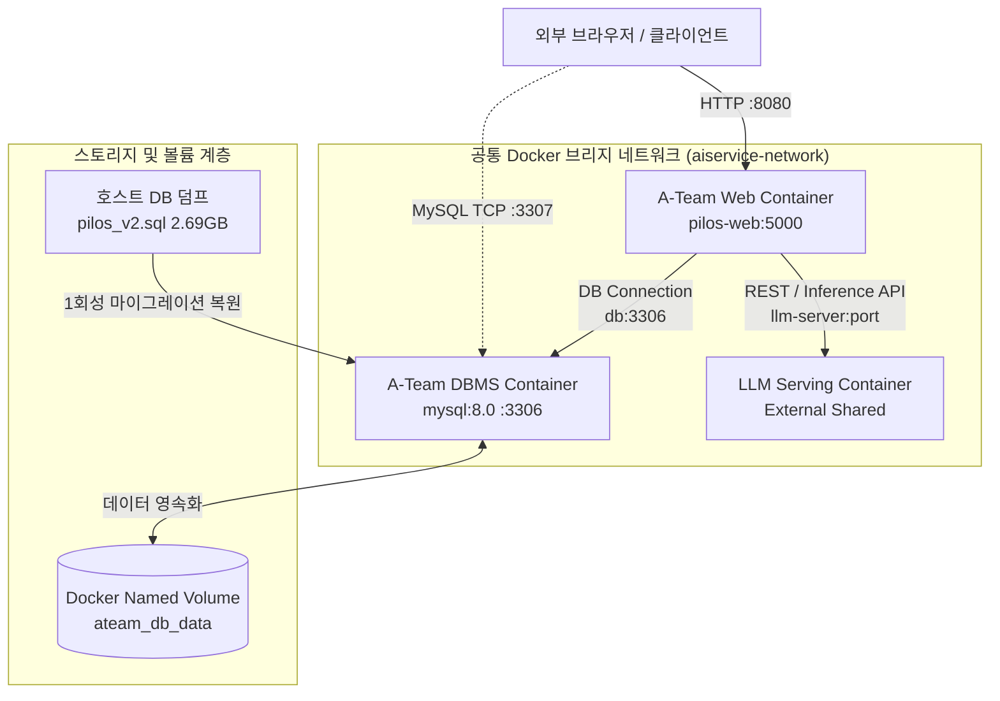
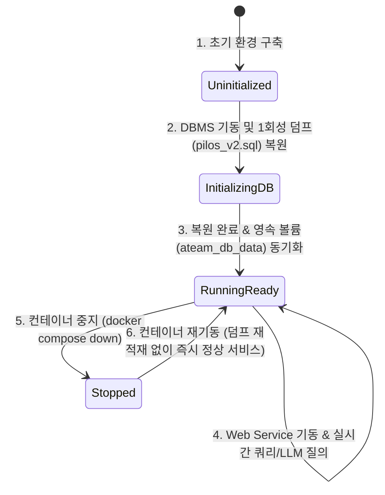

# Data Model & Architecture Entities: A-Team 컨테이너 환경

## 1. 컨테이너 서비스 모델 (Container Service Entities)

### 1.1 Web Application Service (`pilos-web`)
* **역할**: A-Team 감성 분석 웹 대시보드, 일별 지수 조회, 챗봇 대화 및 리포트 인터페이스 제공
* **베이스 이미지**: `python:3.12-slim`
* **내부 바인딩 포트**: `5000` (컨테이너 내부)
* **호스트 노출 포트**: `${WEB_PORT:-8080}`
* **환경 변수 주입**: DB 접속 정보, LLM 엔드포인트 정보, Flask Secret Key
* **종속성**: `pilos-db` 컨테이너 (`healthy` 상태 확인 후 통신)

### 1.2 Database Service (`pilos-db`)
* **역할**: 주식 커뮤니티 댓글, 수집 데이터, 감성 분석 지수 및 사용자 데이터 저장
* **베이스 이미지**: `mysql:8.0` (또는 `mysql:8.4`)
* **내부 바인딩 포트**: `3306` (컨테이너 내부)
* **호스트 노출 포트**: `${DB_PORT:-3307}`
* **데이터베이스명**: `pilos_v2`
* **마운트 볼륨**: `ateam_db_data:/var/lib/mysql`
* **초기화 소스**: `C:\AISERVICE\ateam\pilos_v2.sql` (2.69GB 덤프)

### 1.3 LLM Serving Service (`llm-server`)
* **역할**: 공용 텍스트 생성, 임베딩, BGE 리랭커 API 제공
* **연결 방식**: `aiservice-network` 공유 네트워크를 통해 컨테이너 명칭 및 엔드포인트 URL로 직접 통신
* **프로토콜**: OpenAI-compatible REST API

---

## 2. 환경 설정 스키마 (Configuration Schema)

| 변수명 | 타입 | 기본값 | 필수여부 | 설명 |
|---|---|---|---|---|
| `WEB_PORT` | Integer | `8080` | Optional | A-Team 웹 서비스 호스트 노출 포트 (B-Team 충돌 방지) |
| `DB_PORT` | Integer | `3307` | Optional | MySQL 호스트 노출 포트 (B-Team 충돌 방지) |
| `DB_HOST` | String | `pilos-db` (또는 `db`) | Required | 내부 Docker 네트워크 상의 DB 컨테이너 이름 |
| `DB_USER` | String | `root` (또는 `pilos_user`) | Required | MySQL 데이터베이스 사용자 계정 |
| `DB_PASSWORD` | String | `pilos_password` | Required | MySQL 데이터베이스 비밀번호 (보안 주입) |
| `DB_NAME` | String | `pilos_v2` | Required | 데이터베이스 스키마명 |
| `FLASK_SECRET_KEY` | String | (임의 해시값) | Required | Flask 세션 서명용 비밀키 |
| `LLM_BASE_URL` | String | `http://llm-server:8000/v1` | Required | LLM 챗봇 및 리포트 추론 서버 엔드포인트 |
| `LLM_API_KEY` | String | `EMPTY` | Optional | LLM API 인증키 |
| `CHAT_LLM_MODEL` | String | (지정 모델명) | Required | 챗봇 모델명 |
| `EMBEDDING_BASE_URL` | String | `http://llm-server:8000/v1` | Required | BGE-M3 임베딩 서버 엔드포인트 |
| `RERANK_BASE_URL` | String | `http://llm-server:8000` | Required | BGE Reranker 서버 엔드포인트 |

---

## 3. 영속성 및 상태 전이 모델 (Persistence & Lifecycle)

