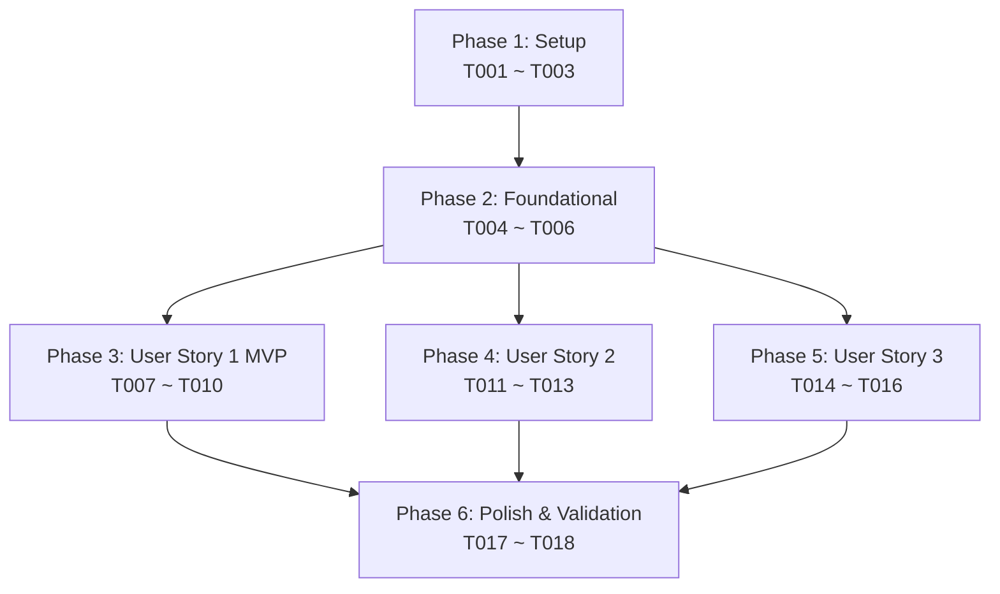

# Tasks: A-Team 컨테이너 기반 개발 및 서비스 환경 구축 (Containerize A-Team Environment)

**Feature Branch**: `001-containerize-ateam-env`
**Spec**: [`specs/001-containerize-ateam-env/spec.md`](spec.md)
**Plan**: [`specs/001-containerize-ateam-env/plan.md`](plan.md)

---

## Phase 1: Setup (공통 인프라 초기화)

**Purpose**: 프로젝트 컨테이너화 기본 파일 및 공유 네트워크 초기화 스크립트 작성

- [x] T001 `pilos-sentiment-index/.dockerignore` 생성하여 불필요한 캐시, 가상환경, 테스트 임시 파일 빌드 컨텍스트 제외
- [x] T002 [P] `scripts/init_network.ps1` 및 `scripts/init_network.sh`에 공통 Docker 브리지 네트워크(`aiservice-network`) 생성 스크립트 작성
- [x] T003 [P] 루트 디렉터리에 기본 오케스트레이션 정의 파일 `docker-compose.yml` 초기 구조 생성

---

## Phase 2: Foundational (필수 기반 인프라)

**Purpose**: 모든 User Story 착수 전 선행되어야 하는 핵심 Dockerfile, Compose 서비스 및 환경변수 템플릿 정의

**⚠️ CRITICAL**: 이 단계가 완료되어야 개별 User Story 구현 및 검증을 진행할 수 있습니다.

- [x] T004 `pilos-sentiment-index/.env.example`에 컨테이너 내부 통신 호스트(`db`), 포트(`8080`/`3307`), LLM 엔드포인트 기본값 갱신
- [x] T005 [P] `pilos-sentiment-index/Dockerfile`에 `python:3.12-slim` 베이스의 Python 3.12 웹 애플리케이션 멀티스테이지/경량화 빌드 파일 작성
- [x] T006 [P] `docker-compose.yml`에 `mysql:8.0` 기반 `db` 서비스 정의 및 `mysqladmin ping` 헬스체크 설정

**Checkpoint**: 기본 컨테이너 빌드 및 DBMS 서비스 정의 완료 - User Story 구현 진행 가능

---

## Phase 3: User Story 1 - A-Team 웹 애플리케이션 및 DBMS 컨테이너 구동 & 데이터 복원 (Priority: P1) 🎯 MVP

**Goal**: 마이그레이션된 2.69GB SQL 덤프(`pilos_v2.sql`)를 DBMS 컨테이너에 안전하게 복원하고, 영속 볼륨을 통해 Web 서비스에서 데이터를 정상 조회할 수 있는 MVP 환경 구축

**Independent Test**: `scripts/import_db_dump.ps1` 실행 후 `docker compose up -d`를 수행하여 브라우저(`http://localhost:8080/api/stocks`)에서 복원된 데이터가 정상 반환되는지 확인

### Implementation for User Story 1

- [x] T007 [US1] `scripts/import_db_dump.ps1` 및 `scripts/import_db_dump.sh`에 2.69GB `pilos_v2.sql` 스트리밍 복원 및 완료 검증 1회성 스크립트 구현
- [x] T008 [P] [US1] `docker-compose.yml`에 `ateam_db_data` 명명 볼륨(Named Volume) 설정 및 MySQL 데이터 디렉터리(`/var/lib/mysql`) 영속화 바인딩
- [x] T009 [US1] `docker-compose.yml`에 `web` 서비스 빌드 컨텍스트 지정 및 `db` 헬스체크 의존성(`condition: service_healthy`) 구성
- [x] T010 [US1] `scripts/verify_db.py`에 복원된 테이블 건수 및 핵심 감성 지수 데이터 무결성 검증 스크립트 작성

**Checkpoint**: User Story 1 완료 - 2.69GB 덤프 데이터가 복원된 상태에서 A-Team 웹 서비스가 정상 구동 및 데이터 조회 가능 (MVP 달성)

---

## Phase 4: User Story 2 - 컨테이너화된 LLM 추론 서버 연동 (Priority: P2)

**Goal**: 별도 컨테이너로 실행 중인 LLM/임베딩 추론 서버와 공통 Docker 브리지 네트워크(`aiservice-network`, `model_gateway_default`)를 통해 DNS 기반으로 질의/응답을 수행

**Independent Test**: 챗봇 질의 API(`POST /api/chat`)를 호출하여 LLM 추론 서버로부터 정상적인 감성 분석/챗봇 답변이 반환되는지 확인

### Implementation for User Story 2

- [x] T011 [P] [US2] `docker-compose.yml`의 `web` 및 `db` 서비스에 외부 공유 네트워크(`aiservice-network`, `model_gateway_default`) 연결 설정
- [x] T012 [US2] `pilos-sentiment-index/.env`에 LLM 내부 엔드포인트(`LLM_BASE_URL=http://vllm-serv-gateway:8081/v1`) 및 타임아웃 파라미터 적용
- [x] T013 [US2] `scripts/test_llm_connection.py`에 공통 네트워크 상의 LLM 서버 헬스체크 및 텍스트 생성/임베딩 API 연결 테스트 스크립트 작성

**Checkpoint**: User Story 2 완료 - A-Team 웹 서비스와 독립 LLM 컨테이너 간의 통신 및 챗봇/리포트 질의 정상 동작

---

## Phase 5: User Story 3 - B-Team과의 포트 충돌 방지 및 독립적인 외부 서비스 라우팅 구성 (Priority: P3)

**Goal**: B-Team의 기존 점유 포트와의 충돌 없이 A-Team 서비스(Web `8080`, DB `3307`)를 외부에 오픈하고, 환경 변수를 통해 유연한 포트 변경 지원

**Independent Test**: `netstat` 또는 포트 검사 스크립트를 통해 `8080`, `3307` 포트 바인딩을 확인하고, B-Team 컨테이너와 동시 구동 시 정상 접속 검증

### Implementation for User Story 3

- [x] T014 [P] [US3] `docker-compose.yml`에 환경 변수 기반 포트 매핑(`${HOST_WEB_PORT:-8080}:5000`, `${HOST_DB_PORT:-3307}:3306`) 구성
- [x] T015 [US3] 루트 디렉터리에 원클릭 컨테이너 기동/중지 스크립트 `run_ateam_services.bat` 및 `run_ateam_services.sh` 작성
- [x] T016 [US3] `scripts/check_ports.ps1`에 A-Team 및 B-Team 포트 충돌 사전 점검 스크립트 작성

**Checkpoint**: User Story 3 완료 - 다중 팀 환경에서 포트 충돌 없이 안정적인 외부 서비스 접속 환경 확립

---

## Phase 6: Polish & Cross-Cutting Concerns

**Purpose**: 프로젝트 운영 매뉴얼 작성, 전체 통합 검증 및 정리

- [x] T017 [P] `docs/CONTAINER_SETUP.md` 및 `pilos-sentiment-index/README.md`에 컨테이너 환경 설정 및 마이그레이션 가이드 최신화
- [x] T018 `specs/001-containerize-ateam-env/quickstart.md`에 명시된 4개 시나리오 전체 엔드투엔드 실증 검증 실행

---

## Dependencies & Execution Order

### Phase Dependencies

* **Setup (Phase 1)**: 선행 의존성 없음 - 즉시 착수 가능
* **Foundational (Phase 2)**: Setup 완료 후 진행 - 모든 User Story 착수를 차단(Block)하는 선행 필수 조건
* **User Story 1 (Phase 3)**: Foundational 완료 후 진행 - 핵심 데이터 복원 및 MVP 제공
* **User Story 2 (Phase 4)**: Foundational 완료 후 진행 - LLM 네트워크 연동
* **User Story 3 (Phase 5)**: Foundational 완료 후 진행 - 포트 바인딩 및 원클릭 실행 스크립트
* **Polish (Phase 6)**: 모든 User Story 완료 후 최종 검증 및 문서화 수행

### Parallel Opportunities

* **Setup 병렬 작업**: `T002`(`init_network`)와 `T003`(`docker-compose.yml`) 병렬 작성 가능
* **Foundational 병렬 작업**: `T005`(`Dockerfile`)와 `T006`(`MySQL Compose`) 병렬 작성 가능
* **User Story 1 병렬 작업**: `T008`(`Volume 설정`)과 `T007`(`DB 적재 스크립트`) 병렬 진행 가능
* **User Story 2/3 병렬 작업**: `T011`(`Network 설정`), `T014`(`Port 매핑`) 병렬 적용 가능

---

## Implementation Strategy

### MVP First (User Story 1 달성)

1. Phase 1 (Setup) 및 Phase 2 (Foundational) 완료
2. Phase 3 (User Story 1) 구현 및 2.69GB DB 덤프 복원 실행
3. **체크포인트 검증**: `http://localhost:8080/api/stocks` 호출을 통한 데이터베이스 정상 조회 확인 (MVP 릴리즈 완료)

### Incremental Delivery (점진적 확장)

1. MVP 달성 후 Phase 4 (User Story 2) 진행 → LLM 컨테이너 연동 및 챗봇 질의 검증
2. Phase 5 (User Story 3) 진행 → B-Team 포트 충돌 방지 및 원클릭 스크립트 적용
3. Phase 6 (Polish) 진행 → `quickstart.md` 전 시나리오 최종 실증 및 문서 최신화
