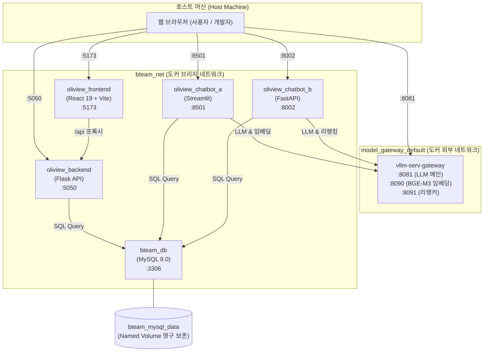

# Oliview B-Team 통합 개발 환경 (Unified Docker Environment)

본 프로젝트는 윈도우 환경에 분산되어 있던 B팀의 커머스 분석 플랫폼(`Oliview_Project`), RAG 챗봇 서비스 2종(`Oliview_chatbot_a`, `Oliview_chatbot_b`), ML 파이프라인(`Oliview_aspect_*`, `Oliview_LLM`)을 단일 도커 오케스트레이션(`docker-compose.yml`)으로 통합한 표준 개발 환경입니다.

---

## 🏗️ 시스템 아키텍처 및 서비스 토폴로지



---

## 📌 서비스 및 포트 매핑 매트릭스

| 서비스명 | 디렉토리 경로 | 기술 스택 | 호스트 포트 | 역할 및 설명 |
|---|---|---|:---:|---|
| **`bteam_db`** | 루트 `oliview_project_backup_0813.sql` | MySQL 8.0 | `3306` | 공통 DB 인스턴스 (1.25GB 백업 자동 복원) |
| **`oliview_backend`** | `Oliview_Project/backend` | Flask 3.x | `5050` | 메인 백엔드 REST API & 이메일 인증 |
| **`oliview_frontend`** | `Oliview_Project/frontend` | React 19 + Vite | `5173` | 메인 사용자/관리자 웹 대시보드 UI |
| **`oliview_chatbot_a`** | `Oliview_chatbot_a` | Streamlit | `8501` | ChromaDB + Kiwi + RRF 하이브리드 검색 챗봇 |
| **`oliview_chatbot_b`** | `Oliview_chatbot_b` | FastAPI | `8002` | 경량 RAG 검색 API & 웹 UI |
| *(로컬 게이트웨이)* | `C:\AISERVICE\model_gateway` | vLLM / llama.cpp | `8081` (LLM)<br>`8090` (Embed)<br>`8091` (Rerank) | 로컬 LLM / 임베딩 / 리랭커 추론 서버 |

---

## 🚀 빠른 시작 가이드 (Quick Start)

### 1. 사전 준비
- Docker Desktop이 실행 중이어야 합니다.
- 로컬 Model Gateway 컨테이너(`vllm-serv-gateway`)가 구동 중이어야 합니다 (`curl http://127.0.0.1:8081/health`).
- 환경변수 파일 `.env`를 생성합니다 (기본 템플릿 제공):
  ```bash
  cp .env.example .env
  ```

### 2. 전체 서비스 일괄 빌드 및 상시 구동
```bash
# 전체 컨테이너(메인 웹 + DB + 챗봇 A + 챗봇 B) 빌드 및 백그라운드 구동
docker compose --profile all up -d --build

# 서비스 상태 확인
docker compose ps
```

### 3. 웹 서비스 접속 확인
- **메인 프론트엔드**: [http://localhost:5173](http://localhost:5173)
- **메인 백엔드 API**: [http://localhost:5050](http://localhost:5050)
- **챗봇 A (Streamlit)**: [http://localhost:8501](http://localhost:8501)
- **챗봇 B (FastAPI RAG)**: [http://localhost:8002](http://localhost:8002)

---

## 🧪 데이터베이스 접속 정보 (DB Credentials)

- **호스트**: `127.0.0.1` (컨테이너 내부 통신 시 `bteam_db`)
- **포트**: `3306`
- **데이터베이스명**: `oliview_project`
- **서비스 계정**: `GP` / `GP123!`
- **관리자 계정**: `root` / `ezen123!`
- **문자셋/콜레이션**: `utf8mb4` / `utf8mb4_0900_ai_ci`

---

## ⚙️ ML 및 데이터 배치 파이프라인 로컬 실행 (`uv`)

배치 스크립트는 `uv` 패키지 관리자를 통해 로컬에서 직접 실행할 수 있습니다:

```bash
# 1. 속성 기반 문장 분리 파이프라인 실행
cd Oliview_aspect_sentence_split
uv run python analyze_db_reviews.py --limit 10

# 2. 감정 분석 파이프라인 실행
cd ../Oliview_aspect_sentiment
uv run python analyze_db_sentiments.py --limit 10

# 3. LLM 요약 파이프라인 실행
cd ../Oliview_LLM
uv run python 02_llm_one_product_test_db.py
```

---

## 🛑 서비스 종료 및 정리

```bash
# 컨테이너 중지 (DB 볼륨 데이터는 영구 보존됨)
docker compose --profile all down

# 컨테이너 및 볼륨 완전 초기화
docker compose --profile all down -v
```
