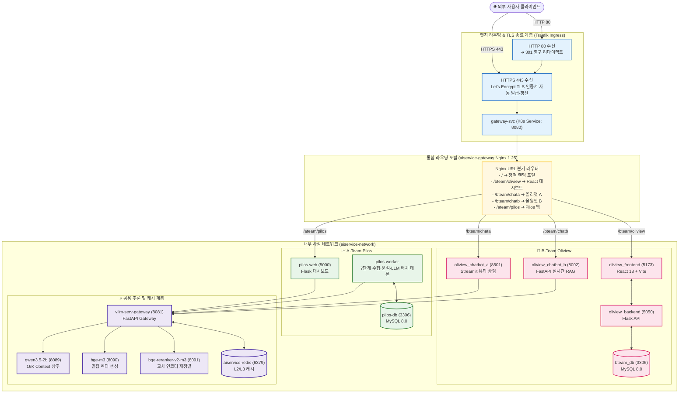

# AISERVICE 시스템 및 인프라 아키텍처 상세 (Architecture)

| 항목 | 내용 |
| :--- | :--- |
| **문서 버전** | v1.2 (2026-08) |
| **적용 도메인** | 전체 엔터프라이즈 통합 인프라 및 네트워크 |
| **공인 엔드포인트** | `https://ezenitac.duckdns.org` (SSL/TLS Let's Encrypt) |
| **네트워크 격리** | Docker Bridge `aiservice-network` (사설 서브넷) |
| **라이센스** | MIT License |

---

## 1. 아키텍처 설계 의도 및 비즈니스 가치 (Why & How)

### 💡 설계 의도 (Architectural Rationale)
1. **단일 진입점(Single Entrypoint) 일원화**:
   - A-Team과 B-Team의 서로 다른 기술 스택(React, Vite, Flask, Streamlit, FastAPI)을 사용자가 단 하나의 공인 도메인(`https://ezenitac.duckdns.org`)을 통해 접근할 수 있도록 Nginx 리버스 프록시로 라우팅을 추상화했습니다.
2. **보안 심층 격리 (Defense in Depth)**:
   - 외부에 노출되는 포트는 오직 표준 웹 포트(HTTP 80, HTTPS 443)뿐이며, 데이터베이스(3306)와 GPU 추론 서빙 포트(8081, 8089, 8090, 8091), Redis(6379)는 내부 가상 네트워크(`aiservice-network`)에만 바인딩하여 무단 접근 및 외부 공격을 원천 차단했습니다.
3. **무중단 스트리밍 지원 (SSE / WebSocket)**:
   - Streamlit의 WebSocket 통신과 FastAPI의 Server-Sent Events(SSE) 실시간 토큰 전송을 위해 Nginx 계층에서 `proxy_buffering off`, `proxy_read_timeout 300s`를 최적화 적용했습니다.

---

## 2. 통합 네트워크 및 트래픽 흐름도 (Mermaid)



---

## 3. 네트워크 포트 매핑 및 격리 정책

| 서비스 컨테이너 | 내부 수신 포트 | 호스트 노출 포트 | 외부 접근 허용 여부 | 용도 및 프로토콜 |
| :--- | :---: | :---: | :---: | :--- |
| **Traefik Ingress** | `80, 443` | `80, 443` | 🟢 **공인 허용** | 외부 트래픽 수신 및 TLS 종료 |
| **aiservice-gateway** | `80` | `8080` | 🟢 **인그레스 연결** | Nginx 리버스 프록시 및 서브패스 라우팅 |
| **oliview_frontend** | `5173` | - | 🔴 **사설 격리** | React 18 SPA 정적 번들 서빙 |
| **oliview_backend** | `5050` | - | 🔴 **사설 격리** | Flask 화장품 통계 API |
| **oliview_chatbot_a** | `8501` | - | 🔴 **사설 격리** | Streamlit 뷰티 상담 UI (WebSocket) |
| **oliview_chatbot_b** | `8002` | - | 🔴 **사설 격리** | FastAPI RAG 검색 및 SSE 스트리밍 |
| **bteam_db** | `3306` | - | 🔴 **사설 격리** | MySQL 8.0 화장품/리뷰 데이터 |
| **pilos-web** | `5000` | - | 🔴 **사설 격리** | Flask 주식 감정지수 대시보드 |
| **pilos-worker** | - | - | 🔴 **사설 격리** | 7단계 정기 배치 스케줄러 데몬 |
| **pilos-db** | `3306` | - | 🔴 **사설 격리** | MySQL 8.0 종목토론방/수급 데이터 |
| **vllm-serv-gateway** | `8081, 8090, 8091`| - | 🔴 **사설 격리** | LLM/임베딩/리랭커 GPU 서빙 |
| **aiservice-redis** | `6379` | `6379` (로컬) | 🔴 **사설 격리** | L2/L3 시맨틱 캐싱 및 세션 저장 |

---

## 4. 운영 및 장애 진단 가이드 (Troubleshooting)

```bash
# 1. 10개 마이크로서비스 컨테이너 헬스 상태 일괄 확인
docker ps --format "table {{.Names}}\t{{.Status}}\t{{.Ports}}"

# 2. 통합 Nginx 라우터 설정 문법 검사
docker exec aiservice-gateway nginx -t

# 3. Traefik Ingress 로그 실시간 확인
kubectl logs -n kube-system deployment/traefik -f
```

---

## 🔗 관련 문서 바로가기
- ⚡ [Model Gateway & GPU 서빙 상세](model_gateway.md)
- 💄 [B-Team Oliview 플랫폼 상세](bteam_oliview.md)
- 📈 [A-Team Pilos 플랫폼 상세](ateam_pilos.md)
- 🛡️ [보안 가드레일 & 토큰 정책](security_guardrails.md)
- 🏠 [메인 README로 돌아가기](../README.md)
