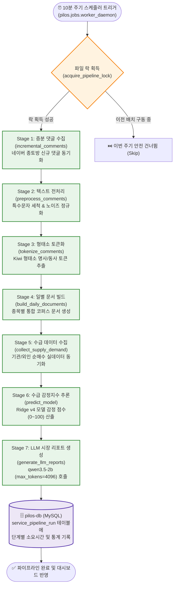

# A-Team Pilos 주식 수급 감정지수 플랫폼 & 워커 데몬 (A-Team Pilos)

| 항목 | 내용 |
| :--- | :--- |
| **문서 버전** | v1.2 (2026-08) |
| **서비스 도메인** | 네이버 금융 종목토론방 댓글 수집, Ridge v4 수급 감정지수 산출 & LLM 리포트 |
| **웹 대시보드 URL** | `https://ezenitac.duckdns.org/ateam/pilos` (Flask + Chart.js) |
| **백그라운드 데몬** | `pilos-worker` (10분 간격 정기 스케줄링) |
| **데이터베이스** | MySQL 8.0 (`pilos-db`: 2.69GB 종목/댓글 데이터 복원 완결) |
| **추론 모델** | Ridge Regression v4 (수급 감정 지표) + `qwen3.5-2b` (시장 코멘터리) |

---

## 1. 아키텍처 설계 의도 및 엔터프라이즈 배경 (Why & How)

### 💡 왜 머신러닝(Ridge v4)과 LLM 코멘터리의 결합인가?
1. **대량 비정형 데이터의 고속 계량화**:
   - 수만 건의 종목토론방 댓글을 매 주기마다 대형 LLM에 직접 입력할 경우 막대한 연산 비용과 지연이 발생합니다.
   - 1차로 한국어 형태소 분석기(Kiwi)와 사전 훈련된 Ridge Regression v4 선형 모델을 통해 **수급 감정지수(0~100점)**를 1초 이내에 초고속 산출합니다.
2. **금융 컴플라이언스 준수 LLM 시장 코멘터리**:
   - 산출된 감정지수 변화량, 5일 이동평균(MA5), 실제 기관/외인 수급 데이터를 정형화된 메타데이터로 구성하여 `qwen3.5-2b`에 전달하고, 금융 규제(단정적 주가 예측, 매수/매도 권유 금지)를 철저히 준수한 객관적 일별 코멘터리를 생성합니다.

---

## 2. 7단계 정기 배치 서비스 파이프라인 (Mermaid Dataflow)



---

## 3. 7단계 파이프라인 세부 설명

| 단계 번호 | 실행 모듈 | 주요 작업 내용 | 처리 대상 테이블 |
| :---: | :--- | :--- | :--- |
| **Stage 1** | `incremental_comments` | 종목별 최신 종토방 댓글 웹 크롤링 수집 | `stock_comments` |
| **Stage 2** | `preprocess_comments` | 불용어 제거, 이모지 필터링 및 텍스트 정규화 | `stock_comments` |
| **Stage 3** | `tokenize_comments` | Kiwi 엔진 기반 형태소 분석 및 토큰 추출 | `stock_comment_tokens` |
| **Stage 4** | `build_daily_documents` | 일자별·종목별 댓글 텍스트 묶음 코퍼스 생성 | `stock_daily_documents` |
| **Stage 5** | `collect_supply_demand` | KRX 거래량, 기관/외국인 매매동향 데이터 적재 | `stock_supply_demand` |
| **Stage 6** | `predict_model` | Ridge v4 가중치 기반 수급 감정지수 계산 | `stock_sentiment_predictions` |
| **Stage 7** | `generate_llm_reports` | `qwen3.5-2b`를 통한 컴플라이언스 코멘터리 생성 | `stock_daily_reports` |

---

## 4. 운영 및 수동 트리거 명령어

```bash
# 1. 파이프라인 즉시 1회 수동 실행
docker exec -it pilos-worker python -m pilos.jobs.run_service_pipeline

# 2. 워커 데몬 실시간 로그 모니터링
docker logs -f --tail 50 pilos-worker

# 3. Pilos 웹 헬스체크
curl http://localhost:5000/
```

---

## 🔗 관련 문서 바로가기
- 🏛️ [통합 시스템 아키텍처 상세](architecture.md)
- ⚡ [Model Gateway & GPU 서빙 상세](model_gateway.md)
- 💄 [B-Team Oliview 플랫폼 상세](bteam_oliview.md)
- 🛡️ [보안 가드레일 & 토큰 정책](security_guardrails.md)
- 🏠 [메인 README로 돌아가기](../README.md)
