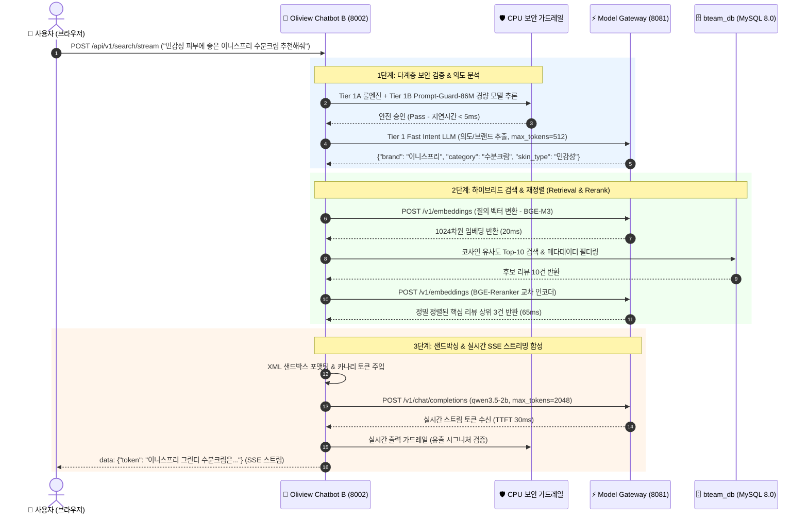

# B-Team Oliview 뷰티 리뷰 분석 플랫폼 & 챗봇 상세 (B-Team Oliview)

| 항목 | 내용 |
| :--- | :--- |
| **문서 버전** | v1.2 (2026-08) |
| **서비스 도메인** | 올리브영 화장품 실사용자 리뷰 빅데이터 감정 분석 & AI 뷰티 가이드 |
| **웹 대시보드 URL** | `https://ezenitac.duckdns.org/bteam/oliview` (React 18 + Vite) |
| **올리챗 A URL** | `https://ezenitac.duckdns.org/bteam/chata` (Streamlit 뷰티 가이드) |
| **올원챗 B URL** | `https://ezenitac.duckdns.org/bteam/chatb` (FastAPI 실시간 하이브리드 RAG) |
| **데이터베이스** | MySQL 8.0 (`bteam_db`: 1.26GB 화장품/리뷰 백업 복원 완결) |

---

## 1. 아키텍처 설계 의도 및 엔터프라이즈 배경 (Why & How)

### 💡 왜 올리챗 A와 올원챗 B의 투 트랙(Two-Track) 챗봇인가?
1. **사용자 페르소나별 맞춤 UI/UX 제공**:
   - **올리챗 A (초보자용 뷰티 가이드)**: Streamlit 기반의 친근하고 직관적인 대화형 UI를 통해 자신의 피부 타입(지성, 건성, 복합성, 민감성)과 고민을 탐색하고 제품 간 비교표를 추천받습니다.
   - **올원챗 B (전문가/파워유저용 하이브리드 RAG)**: 실시간 SSE(Server-Sent Events) 스트리밍과 밀집 벡터 검색(BGE-M3) + 교차 인코더 재정렬(BGE-Reranker)을 통해 대규모 실사용자 리뷰 근거를 실시간으로 인용·검증하며 맞춤 답변을 얻습니다.
2. **리뷰 팩트 기반 신뢰도 보장**:
   - 허위 환각(Hallucination)을 방지하기 위해 사용자의 질의와 가장 유사한 상위 3개의 실제 구매자 리뷰 원문을 추출하고, 이를 XML 샌드박싱하여 LLM 프롬프트에 주입합니다.

---

## 2. 올원챗 B 하이브리드 RAG & SSE 스트리밍 워크플로우 (Mermaid)



---

## 3. 챗봇 A vs 챗봇 B 기능 및 기술 비교

| 비교 항목 | 올리챗 A (Chatbot A) | 올원챗 B (Chatbot B) |
| :--- | :--- | :--- |
| **프론트엔드/백엔드** | Streamlit (Python 3.12 단일 스택) | FastAPI / Uvicorn + Vanilla JS |
| **접속 서브 경로** | `https://ezenitac.duckdns.org/bteam/chata` | `https://ezenitac.duckdns.org/bteam/chatb` |
| **전송 방식** | WebSocket 양방향 통신 | Server-Sent Events (SSE) 실시간 스트리밍 |
| **주요 추천 방식** | 카테고리별 브랜드 심층 비교표 및 가이드 | 하이브리드 벡터 검색(BGE-M3) + 교차 인코더(BGE-Reranker) |
| **생성 모델 및 토큰** | `qwen3.5-2b` (`max_tokens=2048`) | `qwen3.5-2b` (`max_tokens=2048`) |
| **보안 가드레일** | 4단계 CPU 심층 방어 가드레일 | 4단계 CPU 심층 방어 가드레일 |

---

## 4. 헬스체크 및 엔드포인트 검증

```bash
# 1. 챗봇 B 검색 엔드포인트 단일 호출 테스트
curl -X POST http://localhost:8002/api/v1/search \
  -H "Content-Type: application/json" \
  -d '{"query":"이니스프리 수분크림 추천","brand":"이니스프리","max_tokens":200}'

# 2. 챗봇 A 헬스체크
curl http://localhost:8501/bteam/chata/_stcore/health

# 3. Oliview 백엔드 브랜드 목록 API 테스트
curl http://localhost:5050/api/brands
```

---

## 🔗 관련 문서 바로가기
- 🏛️ [통합 시스템 아키텍처 상세](architecture.md)
- ⚡ [Model Gateway & GPU 서빙 상세](model_gateway.md)
- 📈 [A-Team Pilos 플랫폼 상세](ateam_pilos.md)
- 🛡️ [보안 가드레일 & 토큰 정책](security_guardrails.md)
- 🏠 [메인 README로 돌아가기](../README.md)
