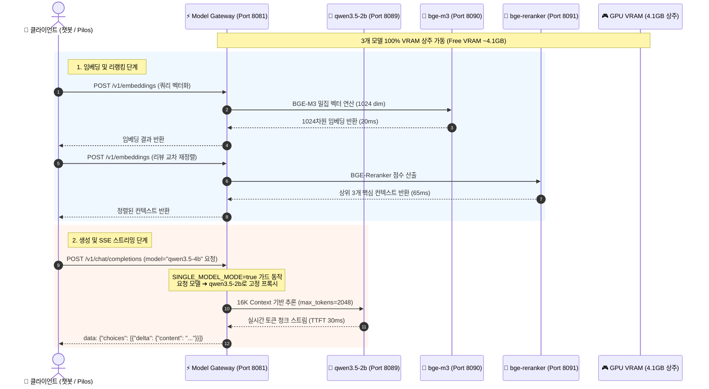
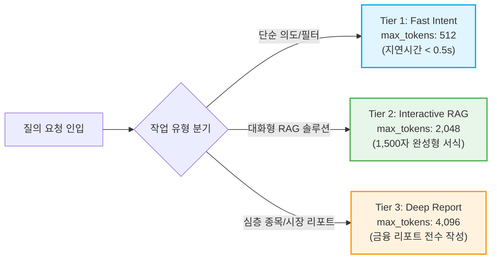

# Model Gateway & GPU 추론 서빙 상세 (Model Gateway)

| 항목 | 내용 |
| :--- | :--- |
| **문서 버전** | v1.2 (2026-08) |
| **엔진 스택** | FastAPI + `llama.cpp` (OpenAI 호환 API) |
| **호스트 GPU** | NVIDIA GeForce GTX 1070 (8,192 MiB VRAM / Pascal 아키텍처) |
| **기본 상주 모델** | `qwen3.5-2b` (16,384 ctx) + `bge-m3` + `bge-reranker-v2-m3` |
| **실측 VRAM 사용량** | **~4.1 GB / 8.0 GB (여유 마진 4.1 GB 확보)** |

---

## 1. 아키텍처 설계 의도 및 엔터프라이즈 배경 (Why & How)

### 💡 왜 2B 단일 상주 모델과 16K 컨텍스트인가? (Rationale)
1. **CUDA OOM 크래시 및 핫스왑 핑퐁(Hot-swap Ping-Pong) 종결**:
   - 과거 4B/9B 모델을 작업별로 동적 스왑할 때, 대량 Pilos 배치 작업과 챗봇 실시간 질문이 동시에 인입되면 프로세스 킬/재기동 루프가 발생하여 503 에러와 타임아웃이 발생했습니다.
   - 2B 모델(`Qwen3.5-2B-Q4_K_M.gguf`)을 GPU VRAM에 100% 영구 상주시킴으로써 프로세스 킬 없이 **TTFT 0.03초(30ms)**의 초고속 무중단 서빙을 실현했습니다.
2. **16K 컨텍스트 윈도우 기반 심층 맥락 추론**:
   - 2B 모델의 컨텍스트 윈도우를 `16384`로 서빙하고 2,048 토큰 이상의 하이브리드 토큰을 할당함으로써, 4B 모델 대비 손색없는 완성형 마크다운 비교표 및 장문 시장 코멘터리를 절단 없이 완벽하게 생성합니다.
3. **무손실 미래 마이그레이션 호환성 (`SINGLE_MODEL_MODE`)**:
   - `SINGLE_MODEL_MODE=true` 플래그를 통해 저용량 GPU(8GB)에서는 2B 모델로 안전하게 고정 라우팅하고, 향후 고용량 GPU(RTX 4090 24GB, A100) 마이그레이션 시 `SINGLE_MODEL_MODE=false` 전환만으로 기존 4B/9B 다중 모델 카탈로그를 즉시 복원할 수 있습니다.

---

## 2. GPU VRAM 토폴로지 및 요청 처리 시퀀스 (Mermaid)



---

## 3. GPU VRAM 상세 배분 현황 (실측 기준)

| 모델 컴포넌트 | 내부 포트 | 파라미터 / 양자화 | Context Size | 실측 VRAM | 특징 |
| :--- | :---: | :---: | :---: | :---: | :--- |
| **`bge-m3`** | `8090` | 560M / Q8_0 | 2,048 | **~1.2 GB** | 밀집(Dense) + 희소(Sparse) 다국어 임베딩 |
| **`bge-reranker-v2-m3`** | `8091` | 560M / Q8_0 | 2,048 | **~1.2 GB** | 고정밀 교차 인코더 유사도 재정렬 |
| **`qwen3.5-2b`** | `8089` | 2.5B / Q4_K_M | **16,384 (16K)** | **~2.7 GB** | 메인 생성 모델 (GQA, FlashAttention 적용) |
| **합계 (Total Used)** | - | - | - | **~4.1 GB** | **8GB VRAM 대비 안전 여유분 4.1GB 확보** |

---

## 4. 3단계 하이브리드 토큰 정책



---

## 5. 운영 및 헬스체크 명령어

```bash
# 1. 게이트웨이 생존 확인
curl http://localhost:8081/health

# 2. VRAM 100% 상주 여부 및 서빙 준비 상태 확인
curl http://localhost:8081/health/readiness
# 정상 응답: {"status":"ready","vram_offloaded_100pct":true,"model_id":"qwen3.5-2b"}

# 3. GPU VRAM 점유량 실시간 모니터링
nvidia-smi --query-gpu=memory.used,memory.total,memory.free --format=csv
```

---

## 🔗 관련 문서 바로가기
- 🏛️ [통합 시스템 아키텍처 상세](architecture.md)
- 💄 [B-Team Oliview 플랫폼 상세](bteam_oliview.md)
- 📈 [A-Team Pilos 플랫폼 상세](ateam_pilos.md)
- 🛡️ [보안 가드레일 & 토큰 정책](security_guardrails.md)
- 🏠 [메인 README로 돌아가기](../README.md)
