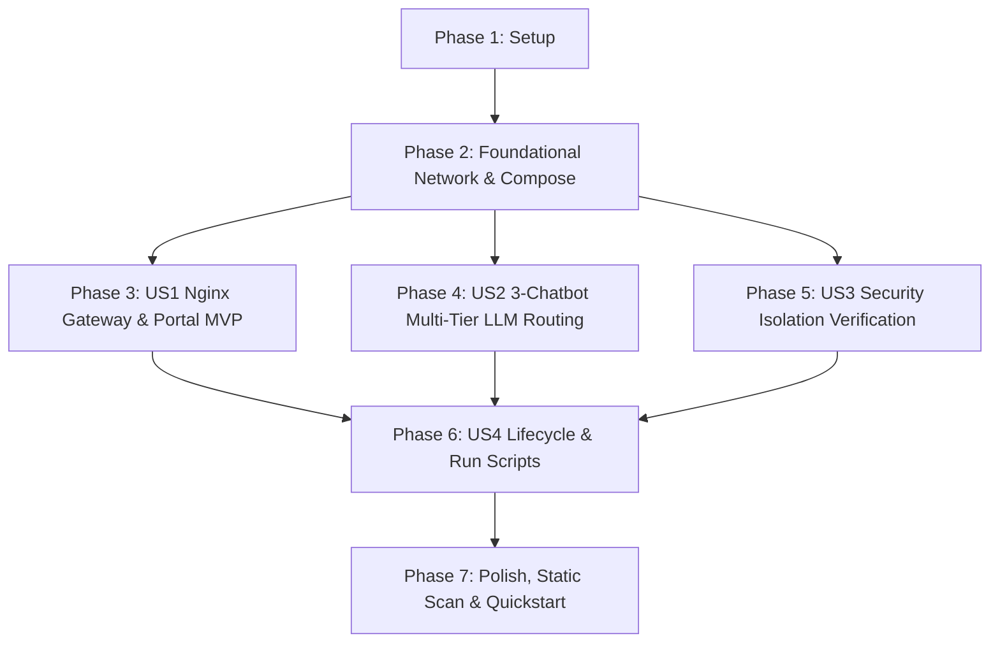

# Tasks: 통합 AI 서비스 단일 진입 게이트웨이 및 서비스 보안 격리 리팩토링 (Unified AI Services Gateway & Isolation)

**Input**: Design documents from `specs/001-unified-services-gateway/`

**Prerequisites**: [spec.md](file:///c:/AISERVICE/specs/001-unified-services-gateway/spec.md), [plan.md](file:///c:/AISERVICE/specs/001-unified-services-gateway/plan.md), [research.md](file:///c:/AISERVICE/specs/001-unified-services-gateway/research.md), [data-model.md](file:///c:/AISERVICE/specs/001-unified-services-gateway/data-model.md), [gateway-routing-contract.md](file:///c:/AISERVICE/specs/001-unified-services-gateway/contracts/gateway-routing-contract.md), [llm-gateway-api.yaml](file:///c:/AISERVICE/specs/001-unified-services-gateway/contracts/llm-gateway-api.yaml), [quickstart.md](file:///c:/AISERVICE/specs/001-unified-services-gateway/quickstart.md)

**Organization**: Tasks are grouped by user story to enable independent implementation and testing of each story.

## Format: `- [ ] [TaskID] [P?] [Story?] Description with file path`

- **[P]**: Can run in parallel (different files, no dependencies)
- **[Story]**: Which user story this task belongs to (`[US1]`, `[US2]`, `[US3]`, `[US4]`)
- Include exact file paths in descriptions

---

## Phase 1: Setup (Shared Infrastructure)

**Purpose**: Project initialization, directory structure setup, and root environment configuration.

- [X] T001 Create `gateway/` directory structure and placeholder assets in `gateway/`
- [X] T002 Create root unified `.env.example` template with `GATEWAY_PORT`, `SERVER_HOST`, `FAST_LLM_MODEL`, `SYNTHESIS_LLM_MODEL`, and database configurations in `.env.example`
- [X] T003 [P] Verify Docker & Compose environment configurations across subprojects in `c:/AISERVICE`

---

## Phase 2: Foundational (Blocking Prerequisites)

**Purpose**: Core Docker network and base orchestration that MUST be complete before user story work begins.

**⚠️ CRITICAL**: No user story implementation can proceed until the unified network and base compose definitions are established.

- [X] T004 Create root `docker-compose.yml` declaring unified bridge network `aiservice-network` and orchestrating all sub-services in `docker-compose.yml`
- [X] T005 [P] Unify `model_gateway/docker-compose.yml` on `aiservice-network` and remove external host port bindings in `model_gateway/docker-compose.yml`
- [X] T006 [P] Unify `bteam/docker-compose.yml` on `aiservice-network` with `bteam_db` port isolated and healthy start period configured in `bteam/docker-compose.yml`
- [X] T007 [P] Unify `ateam/docker-compose.yml` on `aiservice-network` with `pilos-db` port isolated and healthy start period configured in `ateam/docker-compose.yml`

**Checkpoint**: Base `aiservice-network` topology and compose foundations ready - user story implementation can now begin.

---

## Phase 3: User Story 1 - 통합 Nginx 역방향 프록시 라우팅 및 통합 포털 (Priority: P1) 🎯 MVP

**Goal**: 단일 진입점(HTTP 80)을 통해 통합 포털(`/`), B-Team 메인(`/bteam/oliview`), 올리챗(`/bteam/chata`), 올원챗(`/bteam/chatb`), A-Team 메인(`/ateam/pilos`)으로의 무결한 서브 URL 라우팅 및 B-Team 사이드바 내비게이션 완성.

**Independent Test**: Nginx 게이트웨이를 기동하고 브라우저에서 루트(`/`) 및 4개 하위 URL로 접속하여 화면과 정적 자산(CSS/JS)이 정상 로드되는지 확인하고, B-Team 사이드바의 챗봇 버튼 클릭 시 올바른 하위 URL로 이동하는지 검증.

### Implementation for User Story 1

- [X] T008 [P] [US1] Create integrated portal landing page with modern responsive card UI in `gateway/html/index.html`
- [X] T009 [P] [US1] Implement Nginx reverse proxy configuration with sub-path routing, WebSocket map, SSE streaming, 300s timeout, `client_max_body_size 100M`, and `proxy_redirect off` in `gateway/nginx.conf`
- [X] T010 [US1] Create Alpine Nginx container build recipe in `gateway/Dockerfile`
- [X] T011 [P] [US1] Configure Vite base path `base: '/bteam/oliview/'` in `bteam/Oliview_Project/frontend/vite.config.js`
- [X] T012 [P] [US1] Refactor sidebar chatbot navigation links and relative API base path in `bteam/Oliview_Project/frontend/src/App.jsx`
- [X] T013 [US1] Update B-Team backend Dockerfile to run production Gunicorn WSGI multi-worker server in `bteam/Oliview_Project/backend/Dockerfile`
- [X] T014 [US1] Validate User Story 1 sub-path routing, SPA refresh fallback, and portal navigation via browser and HTTP curl tests

**Checkpoint**: User Story 1 is fully functional and independently testable as an MVP increment.

---

## Phase 4: User Story 2 - 총 3개 챗봇 Multi-Tier LLM 연동 및 토큰 최적화 (Priority: P1)

**Goal**: A-Team 챗봇, B-Team 올리챗, B-Team 올원챗에서 작업 난이도별 `qwen3.5-2b`(Fast) / `qwen3.5-4b`(Synthesis) 다계층 라우팅을 적용하고 최대 2048~4096 토큰 완결 응답 생성 보장.

**Independent Test**: 각 챗봇 UI에서 질의를 전송하고, 내부 Docker DNS(`http://vllm-serv-gateway:8081`)를 통해 연결되어 적절한 모델(2B/4B)이 호출되고 토큰 잘림 없이 2,000자 이상 완결 답변이 생성되는지 검증.

### Implementation for User Story 2

- [X] T015 [P] [US2] Update Chatbot A configuration to remove legacy `192.168.x.x` IPs in `bteam/Oliview_chatbot_a/config.json`
- [X] T016 [P] [US2] Refactor Chatbot A LLM client logic to support Multi-tier 2B/4B routing and scale `max_tokens` up to 4096 in `bteam/Oliview_chatbot_a/llm_common.py`
- [X] T017 [P] [US2] Update Chatbot A Dockerfile with Streamlit `--server.baseUrlPath=bteam/chata` and `--server.enableCORS=false` in `bteam/Oliview_chatbot_a/Dockerfile`
- [X] T018 [P] [US2] Refactor Chatbot B FastAPI application with `FastAPI(root_path="/bteam/chatb")`, environment-based `SERVER_HOST`, `qwen3.5-4b` synthesis model routing, and 4096 token output budget in `bteam/Oliview_chatbot_b/project_ragapi.py`
- [X] T019 [P] [US2] Refactor A-Team Flask web app with `ProxyFix` middleware and unified Model Gateway endpoints in `ateam/pilos-sentiment-index/pilos/web/app.py`
- [X] T020 [US2] Validate 3-chatbot LLM connectivity, streaming responsiveness, and token truncation elimination against Model Gateway

**Checkpoint**: User Stories 1 and 2 work seamlessly together across all 3 AI chatbots.

---

## Phase 5: User Story 3 - 내부 DBMS 및 LLM 서비스 보안 격리 (Priority: P2)

**Goal**: 외부 공용 인터넷에서 MySQL 데이터베이스(3306) 및 vLLM 추론 엔진(8081)으로의 직접적인 접근을 100% 차단하고 내부 Docker 네트워크로만 격리.

**Independent Test**: 외부 호스트 터미널에서 포트 3306 및 8081로 직접 소켓/HTTP 연결을 시도하여 `Connection Refused`가 발생하는지 확인.

### Implementation for User Story 3

- [X] T021 [P] [US3] Verify and enforce MySQL port isolation (remove host `ports:` bindings) in `bteam/docker-compose.yml` and `ateam/docker-compose.yml`
- [X] T022 [P] [US3] Verify and enforce Model Gateway port 8081 external isolation in `model_gateway/docker-compose.yml`
- [X] T023 [US3] Execute external port scanning and socket rejection penetration verification tests against ports 3306, 3307, 8081

**Checkpoint**: Security isolation is fully verified with zero public exposure of databases and model engines.

---

## Phase 6: User Story 4 - 모듈형 실행 라이프사이클 및 오케스트레이션 (Priority: P3)

**Goal**: 단일 실행 스크립트로 전체 시스템을 원클릭 기동하고, 대용량 DB(2.7GB / 1.25GB) 초기화 콜드스타트 보호 및 독립 서브프로젝트 재시작 복원력 확보.

**Independent Test**: 콜드 상태에서 원클릭 스크립트로 전체 스택을 가동하여 헬스체크 순차 기동을 검증하고, 개별 서브프로젝트 재시작 후 통신 복원력 확인.

### Implementation for User Story 4

- [X] T024 [P] [US4] Create Windows batch launch script for one-click startup and teardown in `run_all_services.bat`
- [X] T025 [P] [US4] Create Linux/macOS shell launch script for one-click startup and teardown in `run_all_services.sh`
- [X] T026 [P] [US4] Configure DB healthcheck parameters (`start_period: 60s`, `retries: 20`) and `depends_on` service_healthy conditions in `docker-compose.yml`
- [X] T027 [US4] Validate cold-start startup sequence and selective individual container restart resilience

**Checkpoint**: All user stories are complete with robust operational orchestration.

---

## Phase 7: Polish & Cross-Cutting Concerns

**Purpose**: Cleanup, zero-hardcoding static analysis validation, and documentation updates.

- [X] T028 [P] Remove legacy network references (`bteam_net`, `model_gateway_default`) across all repository files
- [X] T029 [P] Run static grep scan to verify zero occurrences of `192.168.x.x` legacy IP addresses in active source code
- [X] T030 Execute full end-to-end verification test suite following `specs/001-unified-services-gateway/quickstart.md`
- [X] T031 Update root repository `README.md` with unified architecture overview, URL routing guide, and quickstart instructions in `README.md`

---

## Dependencies & Execution Order

### Phase Dependencies

- **Setup (Phase 1)**: No dependencies - can start immediately.
- **Foundational (Phase 2)**: Depends on Setup completion - **BLOCKS all user stories**.
- **User Stories (Phase 3 ~ 6)**: All depend on Foundational phase completion.
  - User Story 1 (P1 - Nginx Gateway & Portal) and User Story 2 (P1 - 3 Chatbots LLM Routing) can execute in parallel or sequentially.
  - User Story 3 (P2 - Security Isolation) verifies network isolation built in Phase 2.
  - User Story 4 (P3 - Lifecycle & Scripts) provides convenience tooling for the completed stack.
- **Polish (Phase 7)**: Depends on all user stories being implemented.

### User Story Dependencies

### Parallel Opportunities

- **Setup Phase**: T001, T002, T003 can execute in parallel.
- **Foundational Phase**: T005, T006, T007 can be edited in parallel across subprojects.
- **User Story 1**: T008 (Portal HTML), T009 (Nginx conf), T011 (Vite config), T012 (App.jsx) can be developed in parallel.
- **User Story 2**: T015/T016/T017 (Chatbot A), T018 (Chatbot B), T019 (A-Team Pilos) touch completely distinct files and can run in parallel.
- **User Story 4**: T024 (Windows bat) and T025 (Linux sh) can be written in parallel.

---

## Implementation Strategy

### MVP First (User Story 1)
1. Complete Phase 1 (Setup) + Phase 2 (Foundational).
2. Complete Phase 3 (User Story 1 - Nginx Gateway, Portal Landing, B-Team Sidebar navigation).
3. **Stop & Validate**: Access `http://localhost/` and navigate to `/bteam/oliview`, `/bteam/chata`, `/bteam/chatb`, `/ateam/pilos`.

### Incremental Delivery
1. **Increment 1 (MVP)**: Gateway + Portal + Sub-path routing operational.
2. **Increment 2 (AI Intelligence)**: Multi-tier 2B/4B LLM routing + 4096 token scaling in all 3 chatbots.
3. **Increment 3 (Security & Reliability)**: DBMS/vLLM port blocking verified + DB cold-start healthchecks.
4. **Increment 4 (Operations)**: One-click launch scripts + Clean zero-hardcoded codebase.
