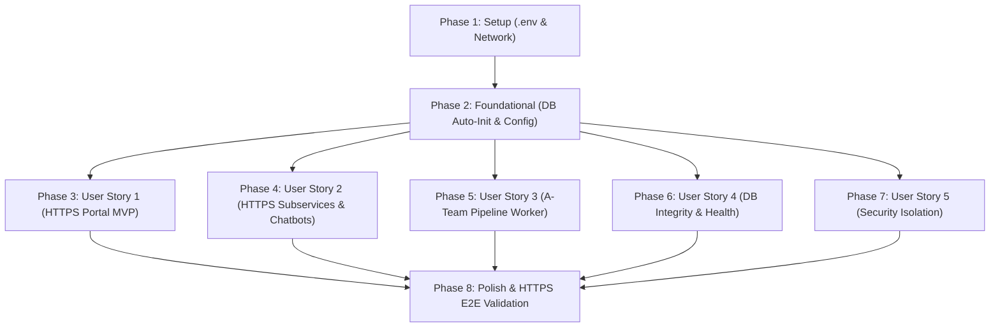

# Tasks: 공인 DDNS HTTPS(`https://ezenitac.duckdns.org`) 및 8080 게이트웨이 연동, 내부 백엔드·DB·LLM 연결 정상화 및 A-Team 파이프라인 워커 활성화

**Feature Branch**: `002-public-domain-duckdns-gateway` | **Spec**: [spec.md](file:///c:/AISERVICE/specs/002-public-domain-duckdns-gateway/spec.md) | **Plan**: [plan.md](file:///c:/AISERVICE/specs/002-public-domain-duckdns-gateway/plan.md)

---

## Phase 1: Setup (Shared Configuration & Environment)

**Purpose**: 프로젝트 전역 환경 변수 및 공통 도커 네트워크/볼륨 기본 구성

- [ ] T001 루트 `.env.example` 및 `.env` 파일에 통합 DB 이름(`PILOS_DB_NAME=pilos_v2`, `BTEAM_DB_NAME=cosmetic_db`) 및 게이트웨이 포트(`GATEWAY_PORT=80`) 동기화 in `c:\AISERVICE\.env`
- [ ] T002 [P] Docker Compose `aiservice-network` 브리지 네트워크 정의 및 볼륨(`bteam_mysql_data`, `ateam_db_data`) 설정 점검 in `c:\AISERVICE\docker-compose.yml`

---

## Phase 2: Foundational (Database Initialization & Auto-Mount Prerequisites)

**Purpose**: 모든 백엔드/웹/워커 컨테이너 기동의 필수 선결 조건인 데이터베이스 자동 적재 및 헬스체크 체계 수립

⚠️ **CRITICAL**: 이 단계가 완료되어야 개별 서브 서비스(User Story) 작업이 정상 동작합니다.

- [ ] T003 `pilos_db` 컨테이너에 `ateam/pilos_v2.sql`을 `/docker-entrypoint-initdb.d/01_pilos_v2.sql:ro`로 마운트하고 헬스체크 `start_period: 300s`, `retries: 30` 구성 in `c:\AISERVICE\docker-compose.yml`
- [ ] T004 [P] `bteam_db` 컨테이너에 `bteam/oliview_project_backup_0813.sql` 마운트 및 `cosmetic_db` 헬스체크 설정 in `c:\AISERVICE\docker-compose.yml`
- [ ] T005 [P] A-Team 데이터베이스 설정 모듈 `pilos/storage/db.py`의 `DB_NAME` 기본값을 `pilos_v2`로 보장 및 환경변수 예외 처리 강화 in `c:\AISERVICE\ateam\pilos-sentiment-index\pilos\storage\db.py`
- [ ] T006 [P] B-Team 백엔드 데이터베이스 환경변수 매핑(`cosmetic_db`) 일치화 in `c:\AISERVICE\docker-compose.yml`

**Checkpoint**: 데이터베이스 덤프 자동 복원 및 헬스체크 기반 안정적 DB 환경 준비 완료

---

## Phase 3: User Story 1 - 공인 HTTPS 도메인을 통한 통합 포털 단일 진입 (Priority: P1) 🎯 MVP

**Goal**: 외부 사용자가 `https://ezenitac.duckdns.org/` (또는 대체 포트 `http://ezenitac.duckdns.org:8080/`)으로 접속 시 단일 진입 포털 랜딩 페이지에 접속하고 4대 서비스로 이동할 수 있도록 HTTPS Ingress 및 게이트웨이 라우팅 구성

**Independent Test**: 브라우저에서 `https://ezenitac.duckdns.org/` 및 `http://ezenitac.duckdns.org/` (301 리다이렉트) 접속 시 200 OK와 함께 4개 서비스 카드가 렌더링되고 링크가 정상 동작하는지 확인

- [ ] T007 [US1] 게이트웨이 Nginx 설정에 `listen 80;`, `listen 8080;` 듀얼 포트 바인딩 및 `port_in_redirect off;` 적용 in `c:\AISERVICE\gateway\nginx.conf`
- [ ] T008 [P] [US1] 게이트웨이 포털 랜딩 페이지에 4대 핵심 서비스 링크 카드 및 메타 태그 최신화 in `c:\AISERVICE\gateway\html\index.html`
- [ ] T009 [US1] Kubernetes Ingress(`ddns/ingress-ezenitac.yaml`)에 `gateway-svc` 서비스 및 엔드포인트(:8080) 정의 배포 in `c:\AISERVICE\ddns\ingress-ezenitac.yaml`

**Checkpoint**: 공인 DDNS HTTPS 도메인을 통한 단일 진입 통합 포털(MVP) 가동 완료

---

## Phase 4: User Story 2 - 공인 HTTPS 도메인 기반 서브 서비스 및 AI 챗봇 무결성 통신 (Priority: P1)

**Goal**: B-Team Oliview, 올리챗(chata), 올원챗(chatb), A-Team Pilos의 HTTPS Same-Origin API 및 `vllm-serv-gateway:8090/8081` HTTP API 무결성 연동

**Independent Test**: HTTPS 환경에서 올리챗 질의 시 FileNotFoundError 없이 8090 임베딩 및 8081 LLM 스트리밍 답변 수신 확인, 올원챗 질의 시 404 오류 없이 RAG 응답 카드 출력 확인

- [ ] T010 [P] [US2] B-Team 올리챗(`Oliview_chatbot_a`)용 공통 HTTP BGE-M3 임베딩 클라이언트 모듈 작성 in `c:\AISERVICE\bteam\Oliview_chatbot_a\common\embedding_client.py`
- [ ] T011 [US2] B-Team 올리챗 진입점(`06.app.py`, `05.chatbot.py`)에서 로컬 모델 의존성을 제거하고 HTTP 임베딩 클라이언트 및 vLLM 8081 LLM 엔드포인트 연동 in `c:\AISERVICE\bteam\Oliview_chatbot_a\06.app.py`
- [ ] T012 [P] [US2] B-Team 올원챗(`Oliview_chatbot_b`) 프론트엔드 API 엔드포인트를 게이트웨이 상대 경로 `/bteam/chatb/api/v1/search`로 수정 in `c:\AISERVICE\bteam\Oliview_chatbot_b\index.html`
- [ ] T013 [US2] B-Team 올원챗 FastAPI 백엔드에 `root_path="/bteam/chatb"` 및 `http://vllm-serv-gateway:8090/v1` 임베딩 연동 in `c:\AISERVICE\bteam\Oliview_chatbot_b\project_ragapi.py`
- [ ] T014 [P] [US2] B-Team Vite 프론트엔드 `vite.config.js`에 `allowedHosts: true` 및 base 경로 `/bteam/oliview/` 보장 in `c:\AISERVICE\bteam\Oliview_Project\frontend\vite.config.js`
- [ ] T015 [US2] Nginx 게이트웨이에 올리챗 Streamlit WSS 웹소켓(`_stcore/stream`), 올원챗 FastAPI, Oliview 백엔드 프록시 헤더 최적화 in `c:\AISERVICE\gateway\nginx.conf`

**Checkpoint**: B-Team 4대 서브 서비스의 공인 HTTPS Same-Origin 라우팅 및 LLM/임베딩 원격 추론 정상화 완료

---

## Phase 5: User Story 3 - A-Team 백그라운드 수집·분석 파이프라인 워커 상시 가동 및 상태 모니터링 (Priority: P1)

**Goal**: `pilos_worker` 컨테이너 추가, 주기적 7단계 파이프라인 스케줄러 데몬 구동, `service_pipeline_run` 기록 및 웹 대시보드(`/api/pipeline/status`) 실시간 연동

**Independent Test**: `docker compose logs pilos-worker`에서 7단계 파이프라인 주기 완결 확인 및 대시보드 상단 상태 카드 렌더링 검증

- [ ] T016 [US3] A-Team 파이프라인 주기 실행 및 프로세스 락 관리 스케줄러 데몬 모듈 구현 in `c:\AISERVICE\ateam\pilos-sentiment-index\pilos\jobs\worker_daemon.py`
- [ ] T017 [US3] `docker-compose.yml`에 `pilos_worker` 컨테이너 정의 추가 (환경변수 `PIPELINE_INTERVAL_SECONDS=600`, 볼륨 마운트, `depends_on: pilos_db`) in `c:\AISERVICE\docker-compose.yml`
- [ ] T018 [P] [US3] A-Team `pilos-web` Flask 대시보드의 `/api/pipeline/status` 및 `/api/stocks` 엔드포인트 DB 조회 로깅 및 예외 처리 검증 in `c:\AISERVICE\ateam\pilos-sentiment-index\pilos\web\app.py`
- [ ] T019 [US3] A-Team 웹 대시보드 프론트엔드 자바스크립트의 파이프라인 상태 폴링 및 에러 렌더링 정상화 in `c:\AISERVICE\ateam\pilos-sentiment-index\pilos\web\static\js\main.js`

**Checkpoint**: A-Team 수집·분석 파이프라인 상시 스케줄링 및 웹 대시보드 상태 동기화 완료

---

## Phase 6: User Story 4 - B-Team 및 A-Team 대용량 데이터베이스 자동 초기화 및 무결성 연결 (Priority: P1)

**Goal**: 대용량 SQL 덤프 자동 복원 완료 대기 및 모든 백엔드 컨테이너의 DB 무결성 헬스체크 연결 보장

**Independent Test**: `verify_db.py` 실행 시 100% 테이블 데이터 수신 확인 및 웹 API 200 OK 검증

- [ ] T020 [US4] `pilos_db` 및 `bteam_db` 컨테이너 헬스체크 커맨드 및 타임아웃 파라미터 최적화 in `c:\AISERVICE\docker-compose.yml`
- [ ] T021 [P] [US4] A-Team 데이터베이스 검증 스크립트 `verify_db.py`를 `pilos_v2` DB 스키마에 맞추어 검증 로직 최신화 in `c:\AISERVICE\ateam\scripts\verify_db.py`
- [ ] T022 [US4] 모든 백엔드 서비스(`oliview_backend`, `oliview_chatbot_a`, `oliview_chatbot_b`, `pilos_web`, `pilos_worker`)의 DB 의존성 `depends_on: condition: service_healthy` 적용 in `c:\AISERVICE\docker-compose.yml`

**Checkpoint**: A-Team 및 B-Team 대용량 데이터베이스의 무결한 백엔드 서빙 체계 확립

---

## Phase 7: User Story 5 - 공인 IP 노출 환경에서의 데이터베이스 및 추론 엔진 철저 격리 (Priority: P2)

**Goal**: 외부 공인 인터넷에서 사설 DB(3306, 3307) 및 vLLM 추론 엔진(8081, 8090, 8091) 포트 접근 100% 차단 검증

**Independent Test**: PowerShell `Test-NetConnection`으로 외부 포트 소켓 연결 실패(False) 검증

- [ ] T023 [US5] `docker-compose.yml` 내 `bteam_db`, `pilos_db`, `vllm-serv`의 외부 `ports:` 노출 제거 및 `aiservice-network` 내부 전용 바인딩 확인 in `c:\AISERVICE\docker-compose.yml`
- [ ] T024 [P] [US5] 외부 공인 포트 차단 검증 스크립트 작성 in `c:\AISERVICE\specs\002-public-domain-duckdns-gateway\scripts\verify_security_isolation.ps1`

**Checkpoint**: 공인 인터넷 노출 환경에서의 사설 인프라 보안 무결성 확보 완료

---

## Phase 8: Polish & Cross-Cutting Concerns

**Purpose**: 통합 오케스트레이터 스크립트 동기화, 문서 최신화 및 E2E 종합 검증

- [ ] T025 통합 오케스트레이터 스크립트(`run_all_services.bat`)에 `pilos_worker` 및 전체 10개 컨테이너 제어 명령 갱신 in `c:\AISERVICE\run_all_services.bat`
- [ ] T026 [P] Linux/WSL용 통합 오케스트레이터 스크립트 동기화 in `c:\AISERVICE\run_all_services.sh`
- [ ] T027 [P] README.md 및 아키텍처 다이어그램 최신화 in `c:\AISERVICE\README.md`
- [ ] T028 [quickstart.md](file:///c:/AISERVICE/specs/002-public-domain-duckdns-gateway/quickstart.md) 기반 전체 10개 컨테이너 기동 및 4대 서브 서비스 HTTPS E2E 검증 실행

---

## Dependencies & Execution Order

