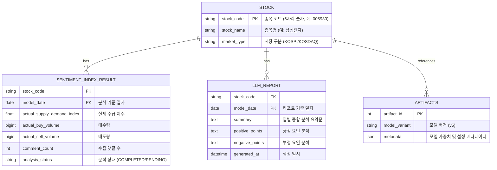
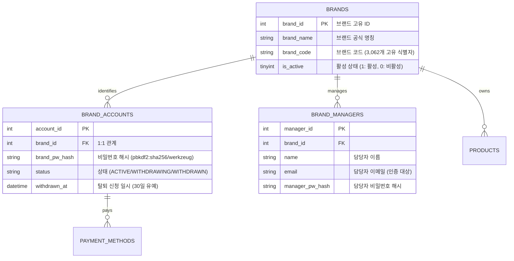

# Phase 1 Data Model: E2E 서비스 안정화 및 서브서비스 종합 점검 (003-e2e-service-stabilization)

**Feature Branch**: `003-e2e-service-stabilization`  
**Created**: 2026-08-17  
**Spec**: [spec.md](file:///c:/AISERVICE/specs/003-e2e-service-stabilization/spec.md)

---

## 1. A-Team Pilos 데이터 모델 (`pilos_v2` DB)



### Validation Rules
- `stock_code`: 6자리 숫자 정규식 (`^\d{6}$`). 빈 문자열 불허.
- `model_date`: `YYYY-MM-DD` ISO 8601 포맷.
- `analysis_status`: `COMPLETED`, `PENDING`, `ERROR` 중 하나.

---

## 2. B-Team Oliview 데이터 모델 (`oliview_project` DB & In-Memory)



### In-Memory Entity: `AuthCodeSession` (이메일 인증 세션)

| 필드 | 타입 | 설명 | 유효성 검증 / 제약 |
|---|---|---|---|
| `email` | `string` | 인증 대상 이메일 | 표준 이메일 형식 정규식 |
| `code` | `string` | 6자리 난수 인증코드 | `^\d{6}$` (100000 ~ 999999) |
| `created_at` | `float` | 생성 Unix timestamp | 현재 시각 |
| `expires_at` | `float` | 만료 Unix timestamp | `created_at + 300` (TTL 5분) |
| `attempts` | `int` | 검증 실패 시도 횟수 | 최대 5회 초과 시 강제 무효화 |

---

## 3. Model Gateway & Embedding/LLM DTO (`vllm-serv-gateway`)

### 1) HTTP Embedding Request & Response (BGE-M3 Port 8090)
- **Endpoint**: `POST /v1/embeddings`
- **Request DTO**:
  ```json
  {
    "model": "bge-m3",
    "input": ["건성 피부 보습 앰플 추천", "컬러그램 탕후루 꿀로스 발림성"]
  }
  ```
- **Response DTO**:
  ```json
  {
    "object": "list",
    "data": [
      {
        "object": "embedding",
        "embedding": [0.0123, -0.0456, "... 1024차원 float 배열 ..."],
        "index": 0
      }
    ],
    "model": "bge-m3",
    "usage": { "prompt_tokens": 12, "total_tokens": 12 }
  }
  ```

---

## 4. 올원챗 (ChatB FastAPI) RAG 검색 엔티티

### 1) `RagSearchRequest` & `RagSearchResponse`
- **Endpoint**: `POST /bteam/chatb/api/v1/search`
- **Request DTO**:
  ```json
  {
    "query": "건성 피부 보습 앰플",
    "top_n": 5,
    "model": null
  }
  ```
- **Response DTO**:
  ```json
  {
    "llm_answer": "건성 피부 보습을 위해 추천하는 상위 앰플 제품은...",
    "search_results": [
      {
        "product_id": 1024,
        "product_name": "토리든 다이브인 저분자 히알루론산 세럼",
        "brand_name": "토리든",
        "category": "에센스/세럼/앰플",
        "review_score": 4.8,
        "separated_sentence": "속건조를 꽉 잡아줘서 사계절 내내 사용하기 좋아요.",
        "display_name": "보습력",
        "sentiment_label": "positive"
      }
    ],
    "model_used": "qwen3.5-9b"
  }
  ```
