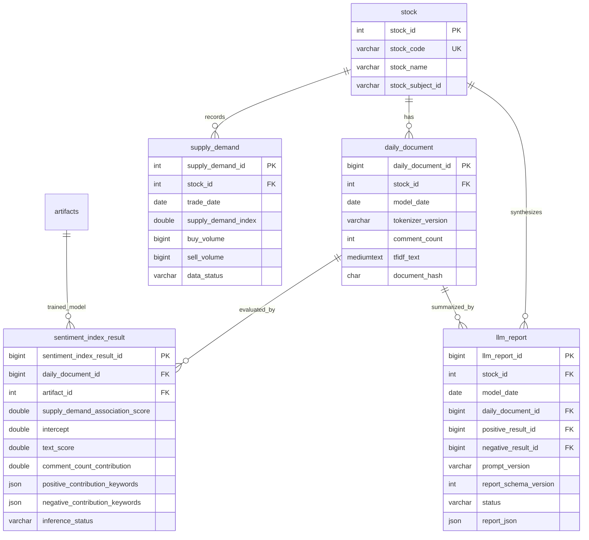

# Data Model: 007-pilos-report-data-restoration

## Entity Relational Architecture (Pilos Core Schema)

## Resolution & Integrity Rules

1. **Document-Report Join Invariant**:
   For any stock $S$ and date $D$, an LLM report is considered `ready` if there exists an `llm_report` row linked to `daily_document` that joins to valid `positive_result_id` and `negative_result_id` in `sentiment_index_result`.
2. **Worker Idempotency Invariant**:
   A daily document for stock $S$ and date $D$ with tokenizer version $T$ SHALL NOT be inserted if a document for $(S, D, T)$ already exists in `daily_document`.
