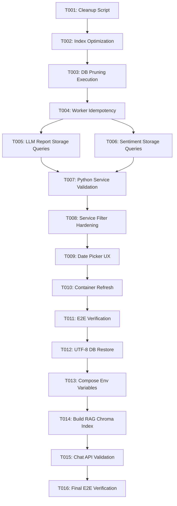

# Tasks: 007-pilos-report-data-restoration

**Feature Branch**: `007-pilos-report-data-restoration`
**Spec**: [spec.md](spec.md) | **Plan**: [plan.md](plan.md)

---

## Phase 1: Setup & Safety

**Purpose**: Prepare database migration scripts and index optimizations for clean document management.

- [X] T001 Create database cleanup script in `ateam/pilos-sentiment-index/scripts/restore_pilos_reports.py`
- [X] T002 [P] Create index on `daily_document_comment(daily_document_id)` in MySQL `pilos_v2` database

---

## Phase 2: Foundational (Data Pruning & Worker Idempotency)

**Purpose**: Eliminate redundant un-inferred documents and ensure the worker daemon cannot re-corrupt data.

- [X] T003 Execute database cleanup script `restore_pilos_reports.py` to prune un-inferred `daily_document` rows (IDs > 5969)
- [X] T004 Enforce idempotency in `select_pending_daily_document_targets` in `ateam/pilos-sentiment-index/pilos/storage/daily_document_db.py`

**Checkpoint**: Database cleaned; `daily_document` references genuine analyzed dump data (IDs <= 5969).

---

## Phase 3: User Story 1 - View Historical Stock Report & Commentary (Priority: P1) 🎯 MVP

**Goal**: Ensure any historical date with existing sentiment index and LLM report returns HTTP 200 OK and displays full commentary.

**Independent Test**:
- Query `GET /api/stocks/005380/llm-reports?model_date=2026-08-11`.
- Verify response returns HTTP 200 OK with `status: "ready"` and populated `market_commentary`.

### Implementation for User Story 1

- [X] T005 [P] [US1] Update `_SELECT_LATEST_DOCUMENT` and `_SELECT_LLM_REPORT` in `ateam/pilos-sentiment-index/pilos/storage/llm_report_storage.py`
- [X] T006 [P] [US1] Update `_SELECT_DETAIL_SENTIMENT_INDEXES_BY_STOCK_CODE` in `ateam/pilos-sentiment-index/pilos/storage/sentiment_index_storage.py`
- [X] T007 [US1] Validate Python service layer `get_llm_report_for_display("005380", date(2026, 8, 11))`

**Checkpoint**: Historical LLM reports and sentiment index metrics for `2026-08-11` load completely.

---

## Phase 4: User Story 2 - Resilient Document Resolution in Storage Layer (Priority: P2)

**Goal**: Protect storage queries against un-inferred duplicate snapshots so background ingestion cannot invalidate reports.

**Independent Test**:
- Verify SQL queries select documents that have `sentiment_index_result` and `llm_report` entries.

### Implementation for User Story 2

- [X] T008 [US2] Update `get_stock_detail_sentiment_indexes` in `ateam/pilos-sentiment-index/pilos/service/sentiment_index_service.py` to filter out un-inferred documents

**Checkpoint**: Storage layer resolution is fully hardened.

---

## Phase 5: User Story 3 - Clean Date Picker Navigation (Priority: P3)

**Goal**: Ensure the stock detail UI date picker indexes and navigates through analyzed dates.

**Independent Test**:
- Inspect stock detail view at `http://localhost:8080/ateam/pilos/stocks/005380` and verify date navigation hint.

### Implementation for User Story 3

- [X] T009 [US3] Update date picker logic in `ateam/pilos-sentiment-index/pilos/web/static/js/detail.js` to ensure smooth navigation across analyzed dates

---

## Phase 6: Polish & E2E Verification

**Purpose**: End-to-end integration validation across all 10 KOSPI stocks and web endpoints.

- [X] T010 [P] Recreate `pilos_web` container with latest code
- [X] T011 Run diagnostic test suite `verify_e2e_services.ps1` to confirm 10/10 PASS (100%)

---

## Dependencies & Execution Order

---

## Phase 7: Convergence

**Purpose**: Remediate garbled Korean characters (`???`) in LLM reports and restore PILOS Guide chatbot functionality.

- [X] T012 Re-import clean UTF-8 database dump (`pilos_v2_core.sql`) directly inside `pilos-db` container and execute `restore_pilos_reports.py` to fix Korean encoding corruption (`???`) per Constitution I and FR-005 (contradicts)
- [X] T013 Update `docker-compose.yml` and `.env` to configure `SERVICE_KNOWLEDGE_VERSION`, `RERANK_BASE_URL`, `RERANK_MODEL`, and `CHAT_LLM_MODEL` for `pilos_web` and `pilos_worker` per FR-005 and Constitution III (missing)
- [X] T014 Execute `build_rag_index.py` with `docs/work/PRESENTATION_FEATURE_BRIEF.md` to populate Chroma vector index at `artifacts/rag_chroma` per FR-005 (missing)
- [X] T015 Verify `POST /api/chat` and `POST /api/stocks/<stock_code>/chat` for both service knowledge questions and stock metric queries return HTTP 200 OK per FR-005 (missing)
- [X] T016 Validate that all 10 stocks on date `2026-08-11` display non-corrupted Korean commentary in the web UI and rerun E2E suite `verify_e2e_services.ps1` per SC-001, SC-002, SC-004 (partial)

