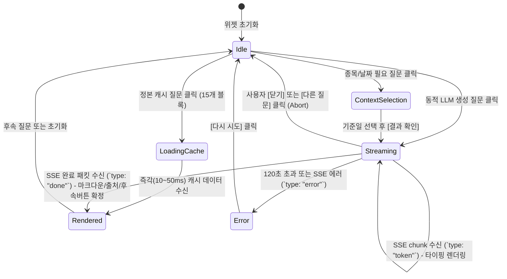

# Data Model: PILOS 챗봇 지식 캐시 및 스트리밍 엔티티

## 1. 정본 지식 캐시 모델 (KnowledgeCacheEntry)

사전 정의된 15개 서비스 지식 블록에 대한 사전 검증 정본 응답 엔티티입니다.

| 필드명 | 타입 | 필수 여부 | 설명 |
| :--- | :--- | :---: | :--- |
| `block_key` | `str` | Y | 등록된 질문 블록 고유 키 (예: `service_overview`, `service_models`, `service_interpretation` 등) |
| `status` | `str` | Y | 응답 상태 (`ready`) |
| `answer` | `str` | Y | 공식 검증된 마크다운 형식의 한글 서비스 설명문 |
| `route` | `str` | Y | 라우팅 기능 분류 (`service_knowledge`) |
| `sources` | `list[dict]` | Y | 공식 문서 출처 메타데이터 리스트 (`type: "service_document"`, `label`, `version`) |
| `warnings` | `list[str]` | Y | 사용자 주의 안내문 목록 (빈 리스트 또는 고지 사항) |

---

## 2. 실시간 스트리밍 이벤트 모델 (StreamEvent)

Flask 백엔드와 프론트엔드(`chat.js`) 간의 SSE(`text/event-stream`) 프로토콜 패킷 엔티티입니다.

### 2.1 토큰 델타 이벤트 (`type: "token"`)
LLM이 생성한 개별 토큰 조각을 실시간 전달할 때 사용합니다.

```json
{
  "type": "token",
  "delta": "투자심리"
}
```

| 필드명 | 타입 | 설명 |
| :--- | :--- | :--- |
| `type` | `"token"` | 토큰 스트리밍 이벤트 식별자 |
| `delta` | `str` | 새로 생성된 텍스트 조각 |

### 2.2 추론 완료 이벤트 (`type: "done"`)
LLM 추론이 완료되고 최종 메타데이터를 클라이언트에 전달할 때 사용합니다.

```json
{
  "type": "done",
  "status": "ready",
  "answer": "PILOS는 ... (전체 완성된 텍스트)",
  "route": "service_knowledge",
  "stock_code": null,
  "as_of": null,
  "sources": [
    {
      "type": "service_document",
      "label": "PILOS 서비스 문서",
      "version": "1.0"
    }
  ],
  "warnings": []
}
```

| 필드명 | 타입 | 설명 |
| :--- | :--- | :--- |
| `type` | `"done"` | 추론 완료 이벤트 식별자 |
| `status` | `str` | 최종 응답 상태 (`ready`, `not_found` 등) |
| `answer` | `str` | 최종 누적된 완결 텍스트 |
| `route` | `str` | 라우트 분류 (`service_knowledge`, `stock_analysis` 등) |
| `sources` | `list[dict]` | 출처 메타데이터 목록 |
| `warnings` | `list[str]` | 경고 및 고지 사항 목록 |

### 2.3 에러 이벤트 (`type: "error"`)
추론 중 예외나 타임아웃 발생 시 안전한 폴백을 위해 전송합니다.

```json
{
  "type": "error",
  "status": "unavailable",
  "message": "현재 로컬 모델 응답이 지연되고 있습니다. 잠시 후 다시 시도해주세요."
}
```

---

## 3. 프론트엔드 상태 전이 모델 (Frontend Chat State Transition)


