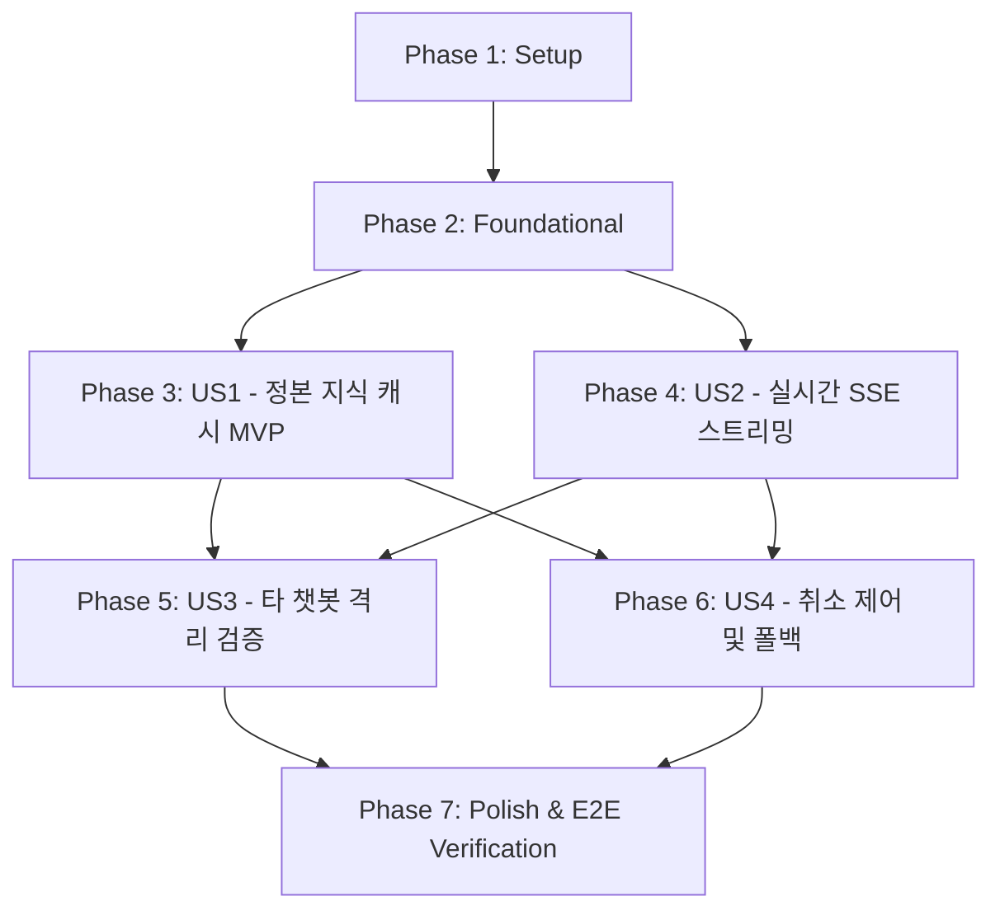

# Tasks: PILOS 챗봇 로컬 GPU 지연 해소 및 스트리밍·정본 캐시 가속 (008-pilos-chatbot-latency-optimization)

## Phase 1: Setup (환경 설정 및 기본 구조)

**Purpose**: 프로젝트 기반 설정 및 타임아웃 환경변수 구성

- [X] T001 [P] 환경변수 파일에 `CHAT_LLM_TIMEOUT_SECONDS=120` 및 `LLM_TIMEOUT_SECONDS=120` 기본값 구성 in `ateam/pilos-sentiment-index/.env.example`
- [X] T002 [P] 15개 정본 지식 블록의 마크다운 텍스트와 출처 메타데이터를 담은 정본 지식 데이터셋 구조 설계 in `ateam/pilos-sentiment-index/pilos/service/knowledge_cache.py`

---

## Phase 2: Foundational (공통 기반 및 프록시 무결성 검증)

**Purpose**: 모든 사용자 스토리가 시작되기 전에 완료되어야 하는 게이트웨이 및 기본 AI 클라이언트 설정

- [X] T003 Nginx 게이트웨이의 `/api/` 및 `/ateam/pilos/` 프록시 버퍼링 비활성화(`proxy_buffering off;`) 및 타임아웃 300s 검증 in `gateway/nginx.conf`
- [X] T004 [P] 고정 종목 모드 API 엔드포인트(`/api/stocks/<stock_code>/chat`)의 라우팅 유효성 검증 및 404 방어 핸들러 정규화 in `ateam/pilos-sentiment-index/pilos/web/app.py`

**Checkpoint**: 게이트웨이 및 프록시 설정 완비 - 사용자 스토리 구현 시작 가능

---

## Phase 3: User Story 1 - 정본 서비스 지식 10초 이내 고속 반환 (Priority: P1) 🎯 MVP

**Goal**: 15개 서비스 지식 질문 블록(연구 대상, 두 방향 모델, 데이터 항목 등)을 인메모리 정본 캐시에서 10~50ms 내에 즉각 반환하여 GPU 부하를 0%로 제거

**Independent Test**:
- 챗봇에서 "PILOS 연구 알아보기"의 15개 질문 블록 클릭 시 GPU 대기 없이 10초 이내(실측 50ms 미만)에 완결된 답변 및 출처가 정상 출력되는지 검증

### Tests for User Story 1 (TDD - Test-First) ⚠️
- [X] T005 [P] [US1] 15개 서비스 지식 질문 블록의 정본 캐시 조회 단위 테스트 작성 in `ateam/pilos-sentiment-index/tests/test_knowledge_cache.py`
- [X] T006 [P] [US1] `ChatbotService.answer_service_knowledge`의 캐시 우선 조회 및 즉각 반환 계약 테스트 작성 in `ateam/pilos-sentiment-index/tests/test_chatbot_service.py`

### Implementation for User Story 1
- [X] T007 [US1] 15개 질문 블록(`service_overview`, `service_research_target`, `service_models`, `service_positive_model`, `service_negative_model`, `service_model_difference`, `service_score_calculation`, `service_interpretation`, `service_columns`, `service_cautions`, `column_*`)의 정본 텍스트 및 출처 딕셔너리 캐시 구현 in `ateam/pilos-sentiment-index/pilos/service/knowledge_cache.py`
- [X] T008 [US1] `ChatbotService`에서 서비스 지식 요청 시 `knowledge_cache`를 우선 조회하여 10ms 내에 즉시 반환하도록 라우팅 통합 in `ateam/pilos-sentiment-index/pilos/service/chatbot_service.py`
- [X] T009 [US1] 캐시 적재 및 조회 성능 로깅 추가 in `ateam/pilos-sentiment-index/pilos/service/chatbot_service.py`

**Checkpoint**: User Story 1 (MVP) 완결 - 서비스 지식 15개 블록이 GPU 연산 없이 즉각 100% 정상 출력됨

---

## Phase 4: User Story 2 - 동적 LLM 생성 실시간 SSE 스트리밍 (Priority: P1)

**Goal**: 동적 LLM 질의 요청 시 첫 토큰을 수 초 내에 방출하고 실시간 점진 타이핑으로 렌더링하며, 완료 시 출처 및 후속 질문 메타데이터를 매끄럽게 활성화

**Independent Test**:
- 동적 질의 시 브라우저 화면에 글자가 실시간으로 타이핑되고, `type: "done"` 수신 즉시 출처 뱃지와 후속 질문 버튼이 활성화되는지 확인

### Tests for User Story 2 (TDD - Test-First) ⚠️
- [X] T010 [P] [US2] `OpenAICompatibleLlmClient`의 스트리밍 제너레이터(`stream=True`) 토큰 방출 단위 테스트 작성 in `ateam/pilos-sentiment-index/tests/test_llm_client_stream.py`
- [X] T011 [P] [US2] Flask SSE 스트리밍 엔드포인트(`text/event-stream`) 패킷 시퀀스(`token` -> `done` -> `[DONE]`) 통합 테스트 작성 in `ateam/pilos-sentiment-index/tests/test_chat_api_stream.py`

### Implementation for User Story 2
- [X] T012 [US2] `OpenAICompatibleLlmClient.create_chat_completion`에 `stream=True` 제너레이터 모드 추가 및 120초 타임아웃 단일 완결 호출 구현 in `ateam/pilos-sentiment-index/pilos/collection/ai_clients/llm_client.py`
- [X] T013 [US2] `rag_service.py`에 스트리밍 제너레이터 래퍼 함수(`stream_service_knowledge_answer`) 구현 in `ateam/pilos-sentiment-index/pilos/service/rag_service.py`
- [X] T014 [US2] Flask `app.py`에 `Response(generate_stream(), mimetype="text/event-stream")` 스트리밍 엔드포인트 핸들러 구현 in `ateam/pilos-sentiment-index/pilos/web/app.py`
- [X] T015 [US2] 프론트엔드 `chat.js`의 `requestChat`을 `ReadableStream`(`response.body.getReader()`) 실시간 토큰 파서로 확장 in `ateam/pilos-sentiment-index/pilos/web/static/js/chat.js`
- [X] T016 [US2] `type: "done"` 수신 시 마크다운 서식 확정, 출처 칩(`sources`) 부착 및 후속 질문(`follow_ups`) 렌더러 구현 in `ateam/pilos-sentiment-index/pilos/web/static/js/chat.js`

**Checkpoint**: User Story 1 & 2 완결 - 캐시 질문은 즉각 응답, 동적 질문은 실시간 타이핑 스트리밍으로 완벽 렌더링

---

## Phase 5: User Story 3 - 타 챗봇(올리챗, 올원챗) 무결성 격리 및 회귀 방지 (Priority: P1)

**Goal**: Pilos 최적화 작업이 B-Team 챗봇(올리챗, 올원챗)에 일체의 부작용을 일으키지 않음을 검증하고, GPU 자원 경합을 완화하여 서비스 전체의 안정성을 보장

**Independent Test**:
- B-Team 올리챗(`https://ezenitac.duckdns.org/bteam/chata/`) 및 올원챗(`https://ezenitac.duckdns.org/bteam/chatb/`)의 모든 기능이 100% 정상 작동(HTTP 200)하는지 확인

### Implementation & Verification for User Story 3
- [X] T017 [US3] B-Team 소스코드(`bteam/`) 및 독립 환경변수 미수정 상태 무결성 확인
- [X] T018 [US3] `gateway/nginx.conf`의 B-Team 라우팅 경로(`/bteam/chata/`, `/bteam/chatb/`, `/bteam/oliview/`) 정상 동작 검증
- [X] T019 [US3] 공유 모델 게이트웨이(`llm-server:8000`)와의 통신 부하 완화 및 서브시스템 간 비간섭 상태 진단 테스트 작성 in `ateam/pilos-sentiment-index/tests/test_service_isolation.py`

**Checkpoint**: User Story 3 완결 - 타 챗봇 100% 정상 가동 확인

---

## Phase 6: User Story 4 - 사용자 취소 제어 및 안전 폴백 안내 (Priority: P2)

**Goal**: 스트리밍 도중 사용자 전환/닫기 시 즉각적인 요청 중단(`AbortController`) 및 예외 발생 시 친절한 정본 폴백 안내 제공

**Independent Test**:
- 스트리밍 도중 닫기 또는 다른 질문 클릭 시 이전 네트워크 요청이 즉시 abort되고 UI가 정상 리셋되는지 확인

### Implementation for User Story 4
- [X] T020 [P] [US4] 프론트엔드 `chat.js`에서 질문 변경, 패널 닫기, 리셋 시 `AbortController.abort()` 트리거 및 잔여 스트림 소멸 처리 in `ateam/pilos-sentiment-index/pilos/web/static/js/chat.js`
- [X] T021 [P] [US4] 120초 타임아웃 또는 모델 에러 시 '요청 실패 (404)' 대신 정본 지식 요약 및 [다시 시도] 버튼 렌더링 폴백 핸들러 구현 in `ateam/pilos-sentiment-index/pilos/web/static/js/chat.js`

**Checkpoint**: 모든 사용자 스토리 구현 완료

---

## Phase 7: Polish & Cross-Cutting Concerns

**Purpose**: 코드 품질 정제, E2E 종합 검증 및 문서 동기화

- [X] T022 [P] A-Team Pilos 전체 단위 및 계약 테스트 스위트 실행 (`uv run unittest`)
- [X] T023 [P] `quickstart.md`에 정의된 4개 시나리오 기반 수동/자동 E2E 검증 실행
- [X] T024 코드 주석 정리 및 Constitution 품질 게이트 최종 적합성 검토

---

## Dependencies & Execution Order

