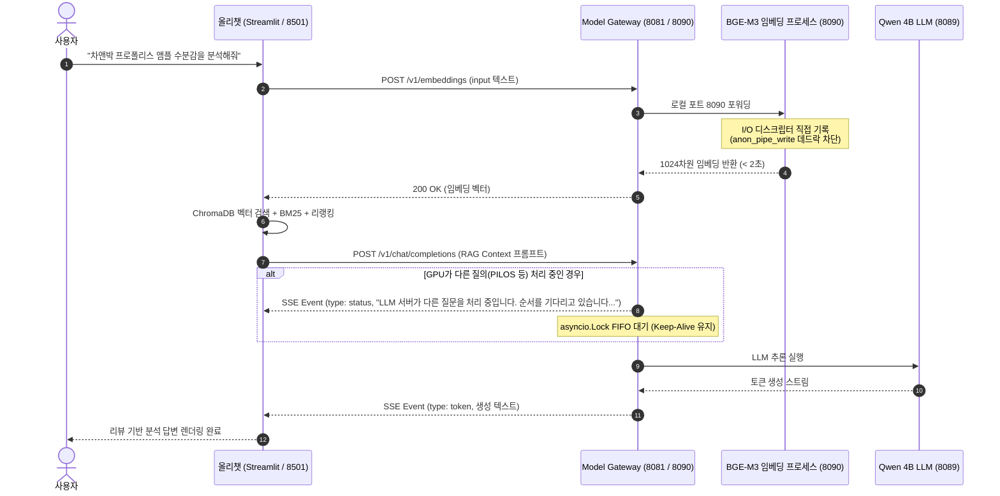

# Implementation Plan: 올리챗·올원챗 임베딩 타임아웃 해소, 순차 대기 큐 및 3대 챗봇 통합 회귀 검증 (009-fix-ollychat-embedding-timeout)

**Branch**: `009-fix-ollychat-embedding-timeout` | **Date**: 2026-08-18 | **Spec**: [spec.md](file:///c:/AISERVICE/specs/009-fix-ollychat-embedding-timeout/spec.md)

**Input**: Feature specification from `specs/009-fix-ollychat-embedding-timeout/spec.md`

---

## Summary

올리챗(Streamlit) 및 올원챗(FastAPI)의 RAG 리뷰 분석 질의 시 발생하는 60초 임베딩 타임아웃(Read timed out) 및 500 서버 에러의 근본 원인인 **Model Gateway 서브프로세스(포트 8090/8091) I/O 파이프 버퍼 포화 데드락(`anon_pipe_write`)을 파일 디스크립터 직접 리다이렉션으로 완전 해소**하고, 단일 GPU 환경에서의 동시 LLM 요청을 **스트리밍 킵얼라이브 순차 대기 큐(Option A)**로 안정화하며, 작업 최종 단계에 **3대 챗봇(PILOS, 올리챗, 올원챗) 통합 자동화 회귀 테스트 스위트**를 구축하여 100% 통과를 달성한다.

---

## Technical Context

- **Language/Version**: Python 3.12 (Model Gateway, PILOS, 올리챗, 올원챗)
- **Primary Dependencies**: FastAPI, Uvicorn, Streamlit, LangChain, ChromaDB, llama-cpp-python, Requests, PyNVML
- **Storage**: ChromaDB (벡터 저장소), MySQL 8.0 (`cosmetic_db`, `pilos_v2`), 로컬 GGUF 모델 가중치 (`qwen3.5-4b`, `bge-m3`, `bge-reranker-v2-m3`)
- **Testing**: Python `unittest` (단위, 계약, 통합, E2E 회귀 테스트)
- **Target Platform**: Windows 11 + Docker Desktop (WSL2 Linux 컨테이너 환경)
- **Project Type**: 통합 AI 마이크로서비스 생태계 (Model Gateway + A-Team PILOS + B-Team 올리챗/올원챗/올리뷰)
- **Performance Goals**:
  - 임베딩 호출(8090): 5초 이내 완료 (1024차원 고밀도 벡터)
  - PILOS 정본 지식(15종): 10~50ms 즉각 반환 (GPU 0%)
  - LLM 순차 큐 대기: 유휴 소켓 타임아웃(30초) 단절 0건 (실시간 킵얼라이브 안내)
- **Constraints**:
  - 단일 로컬 NVIDIA GeForce GTX 1070 (8GB VRAM) 환경: LLM은 GPU 단일 점유, 임베딩/리랭커는 CPU 멀티스레드 상주
  - B-Team 서브시스템 소스코드 및 데이터 무결성 보존

---

## Constitution Check

*GATE: Must pass before Phase 0 research. Re-check after Phase 1 design.*

| 원칙 | 상태 | 검증 결과 및 준수 전략 |
|:---|:---:|:---|
| **I. 언어 및 커뮤니케이션 (Korean)** | **PASS** | 모든 명세서, 계획서, 작업 목록, 코드 주석 및 사용자 커뮤니케이션을 한국어로 작성. |
| **II. TDD 및 테스트 우선주의** | **PASS** | I/O 리다이렉션 단위 테스트, 임베딩 계약 테스트, 3대 챗봇 통합 회귀 테스트 스위트를 선행 작성. |
| **III. 서비스 모듈화 및 격리** | **PASS** | A-Team과 B-Team의 도메인 코드를 엄격히 분리하고, Model Gateway 공통 레이어에서 I/O 데드락과 Concurrency Lock을 격리 처리. |
| **IV. 관측 가능성 및 로깅** | **PASS** | 서브프로세스 표준 출력을 `logs/benchmark.log` 및 `logs/error.log` 파일로 직접 안전하게 회전 기록. |
| **V. 단순성 및 점진적 진화 (YAGNI)** | **PASS** | 복잡한 외부 브로커(RabbitMQ, Redis) 도입 없이 표준 `asyncio.Lock`과 파일 디스크립터 직접 리다이렉션의 가장 단순하고 견고한 설계 채택. |

---

## Project Structure

### Documentation (this feature)

```text
specs/009-fix-ollychat-embedding-timeout/
├── spec.md              # Feature Specification (Clarifications 포함)
├── plan.md              # This file (구현 계획서)
├── research.md          # 장애 원인 분석 및 I/O 파이프/순차 큐 의사결정
├── data-model.md        # Concurrency Queue & Test Report 데이터 모델
├── quickstart.md        # 3대 챗봇 및 임베딩 검증 가이드
├── contracts/           # Model Gateway Concurrency & Embedding API 계약
│   └── model_gateway_concurrency_contract.md
├── checklists/
│   └── requirements.md  # Specification Quality Checklist (16/16 PASS)
└── tasks.md             # 세부 작업 목록 (/speckit-tasks 산출물)
```

### Source Code Touchpoints

```text
model_gateway/
├── src/core/
│   ├── process_manager.py        # [MODIFY] stdout/stderr 파일 디스크립터 직접 리다이렉션
│   └── auxiliary_manager.py      # [MODIFY] 보조 프로세스(8090/8091) I/O 무결성 보장
└── src/api/routes/
    └── inference_api.py          # [MODIFY] asyncio.Lock 기반 스트리밍 킵얼라이브 순차 큐 구현

bteam/
├── Oliview_chatbot_a/
│   └── common/embedding_client.py  # [MODIFY] timeout 120초 현실화 및 에러 핸들링
└── Oliview_chatbot_b/
    └── app.py (or config)          # [MODIFY] 임베딩 타임아웃 120초 정합성 확인

tests/
└── test_multi_chatbot_regression.py # [NEW] 3대 챗봇(PILOS, 올리챗, 올원챗) 통합 회귀 테스트 스위트
```

---

## Architecture & Implementation Workflow



---

## Phase Breakdown

### Phase 1: Setup & Diagnostics
- [P] Model Gateway `ProcessManager`의 서브프로세스 생성 로직 분석 및 재현 테스트 작성.

### Phase 2: Core Engine Fix (Model Gateway I/O Redirection)
- [US4] `process_manager.py`의 `create_subprocess_exec`에서 `PIPE` 대신 `open(bench_log_path, 'a')` 파일 디스크립터 직접 연결 적용.
- [US4] 포트 8090(`bge-m3`) 및 포트 8091(`bge-reranker-v2-m3`)의 `anon_pipe_write` 블로킹 0건 검증.

### Phase 3: Client Timeout & Concurrency Queue
- [US1, US2] `bteam/Oliview_chatbot_a/common/embedding_client.py`의 타임아웃을 120초로 구성.
- [US3] `model_gateway/src/api/routes/inference_api.py`에 `asyncio.Lock` 및 스트리밍 킵얼라이브(`"LLM 서버가 다른 질문을 처리 중입니다. 순서를 기다리고 있습니다..."`) 대기 패킷 방출 로직 구현.

### Phase 4: Container Build & Hot Reload
- `docker compose build vllm-serv oliview_chatbot_a oliview_chatbot_b`
- `docker compose up -d vllm-serv oliview_chatbot_a oliview_chatbot_b`

### Phase 5: Multi-Chatbot Regression Test Suite (품질 게이트)
- [US5] `tests/test_multi_chatbot_regression.py` 작성:
  - Scenario 1: PILOS 챗봇 (정본 캐시 10ms + 동적 스트리밍 200 OK)
  - Scenario 2: 올리챗 (BGE-M3 임베딩 + Chroma RAG 리뷰 분석 200 OK)
  - Scenario 3: 올원챗 (FastAPI `/analyze` 맞춤 솔루션 200 OK)
  - Scenario 4: 동시 요청 시 순차 대기 큐 및 비간섭 무결성 검증 (100% 통과)

---

## Complexity Tracking

> Constitution Check 위반 항목 없음 (모든 원칙 100% 준수).
