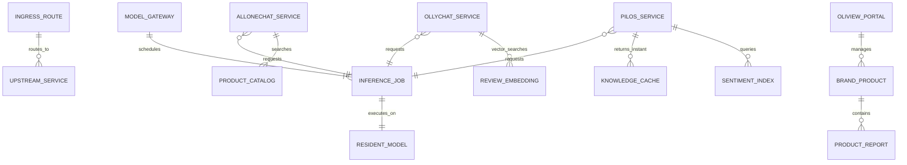
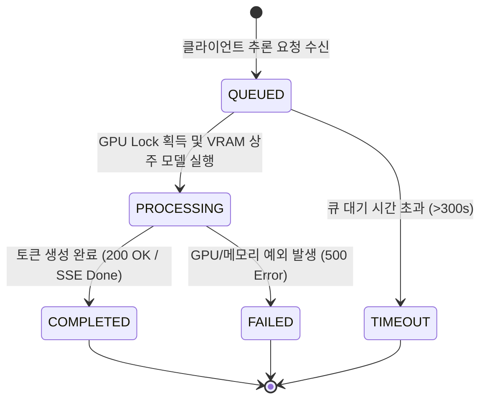
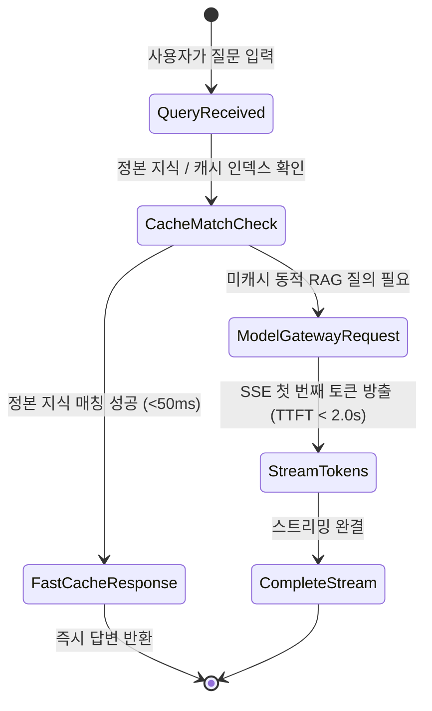

# Data Model: 통합 시스템 아키텍처 및 서비스 개체 모델 (010-refactor-unified-system-architecture)

---

## 1. 개체 개요 (Entity Overview)

본 문서는 AISERVICE 통합 플랫폼의 4대 핵심 계층(인프라 게이트웨이, AI 모델 게이트웨이, A-Team 서브시스템, B-Team 서브시스템)의 주요 데이터 개체, 필드 정의, 관계 및 생명주기 상태 전이를 정의한다.

---

## 2. 핵심 데이터 개체 정의 (Core Entities)

### 2.1 Model Gateway & Inference Entities

#### 1) `ResidentModel` (상주 서빙 모델)
- **설명**: 단일 GPU VRAM(8GB) 상에 고정 상주하여 핫스왑 없이 연속 서빙되는 모델 인스턴스.
- **필드 정의**:
  - `model_id` (string, PK): 서빙 식별자 (예: `qwen3.5-4b`, `bge-m3`, `bge-reranker-v2-m3`)
  - `model_type` (enum): `llm` | `embedding` | `reranker`
  - `port` (integer): 내부 서빙 포트 (LLM: `8089/8081`, Embed: `8090`, Rerank: `8091`)
  - `vram_allocated_mb` (integer): 점유 VRAM 용량 (예: LLM 3200MB, Embed 1500MB, Rerank 1500MB)
  - `max_context_length` (integer): 지원 최대 컨텍스트 토큰 (4096)
  - `is_resident` (boolean): 상주 고정 여부 (`true`)

#### 2) `InferenceJob` (추론 작업 및 큐)
- **설명**: 서브시스템 챗봇들이 모델 게이트웨이에 요청하는 동기/스트리밍 추론 요청.
- **필드 정의**:
  - `job_id` (uuid, PK): 고유 작업 ID
  - `requester_service` (string): 호출자 (`pilos-web`, `pilos-worker`, `oliview_chatbot_a`, `oliview_chatbot_b`)
  - `model_id` (string): 요청 모델 (`qwen3.5-4b`)
  - `is_stream` (boolean): SSE 스트리밍 여부
  - `status` (enum): `QUEUED` | `PROCESSING` | `COMPLETED` | `FAILED` | `TIMEOUT`
  - `created_at` (timestamp): 큐 등록 일시
  - `started_at` (timestamp, nullable): GPU 추론 개시 일시
  - `completed_at` (timestamp, nullable): 추론 완료 일시

---

### 2.2 A-Team PILOS Financial Entities

#### 3) `KnowledgeCacheItem` (정본 지식 및 정적 응답 캐시)
- **설명**: LLM 호출 없이 즉시(<50ms) 반환되는 서비스 안내, 용어집, 해석 가이드 캐시 개체.
- **필드 정의**:
  - `cache_key` (string, PK): 질의 정규화 키 (예: `pilos_interpret_guide`, `service_intro`)
  - `query_patterns` (list[string]): 매칭 키워드/정규식 목록
  - `answer_markdown` (string): 사전 검증된 마크다운 응답 본문
  - `version` (string): 지식 버전 (`1.0`)
  - `ttl_seconds` (integer, nullable): 캐시 수명 (정본 지식은 영구/무기한)

#### 4) `DailySentimentIndex` (일별 감정 지수 및 종목 데이터)
- **설명**: MySQL `pilos_v2`에 사전 적재된 뉴스 감정 분석 및 종목별 종합 리포트 개체.
- **필드 정의**:
  - `stock_code` (string, PK Part): 종목 코드 (예: `005930`)
  - `target_date` (date, PK Part): 산출 기준 일자
  - `sentiment_score` (float): -1.0 ~ +1.0 정량 감정 지수
  - `confidence_score` (float): 신뢰도 지수
  - `pregenerated_report` (text): 사전 생성된 일일 분석 리포트 전문
  - `cached_at` (timestamp): 생성/적재 일시

---

### 2.3 B-Team Oliview & Chatbot Entities

#### 5) `BrandProduct` & `ProductReport` (내 브랜드 상품 및 리포트)
- **설명**: Oliview 메인 웹 대시보드에서 조회되는 상품 상세 정보 및 AI 감성 분석 리포트.
- **필드 정의**:
  - `product_id` (string, PK): 올리브영 상품 코드
  - `brand_name` (string): 브랜드명 (예: `차앤박`)
  - `product_name` (string): 상품명
  - `category` (string): 상품 카테고리
  - `api_base_url` (string): 프론트엔드 라우팅 기본값 (`/bteam/oliview`)
  - `positive_ratio` (float): 긍정 리뷰 비율 (%)
  - `negative_ratio` (float): 부정 리뷰 비율 (%)
  - `top_keywords` (list[string]): 핵심 추출 키워드 목록
  - `ai_summary` (text): AI 종합 분석 요약

---

### 2.4 Ingress Routing Entities

#### 6) `IngressRoute` (Nginx 역방향 프록시 라우트 규칙)
- **설명**: Nginx 역방향 프록시(`gateway/nginx.conf`)에 매핑된 서브시스템 라우트.
- **필드 정의**:
  - `path_pattern` (string, PK): 매칭 경로 (예: `/bteam/oliview/api/`, `/ateam/pilos/`, `/bteam/chata/`)
  - `upstream_service` (string): 타깃 컨테이너명 및 포트
  - `buffering` (boolean): 버퍼링 활성 여부 (`false` for SSE/WebSocket)
  - `read_timeout_seconds` (integer): 읽기 타임아웃 (300s, WebSocket은 86400s)
  - `cors_enabled` (boolean): CORS 헤더 적용 여부

---

## 3. 상태 전이 모델 (State Transitions)

### 3.1 Inference Job Lifecycle (추론 작업 상태 흐름)

### 3.2 PILOS Chat Request Routing Flow

