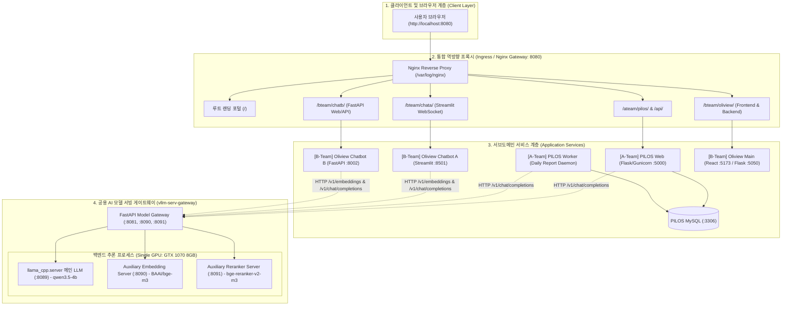

# Research: 전체 시스템 아키텍처 점검 및 리팩토링 종합 리서치 (010-refactor-unified-system-architecture)

---

## 1. 진단 배경 및 핵심 문제 제기

### 사용자 이슈
1. *"llm 서버나 gateway를 건드는건 아니지?"*
   - 개별 챗봇(올리챗, 올원챗, PILOS)의 요구사항이나 지연이 발생할 때마다 게이트웨이 내부를 임시방편(Monkey-patch)으로 수정하는 것이 아닌, **시스템 전체가 유기적이고 표준적으로 동작하는 견고한 아키텍처 원칙** 필요.
2. *"왜 이제는 pilos 챗봇이 llm 호출할때 무한 딜레이지?"*
   - 단일 GPU 환경(GTX 1070 VRAM 8GB)에서 다수의 서비스(PILOS 웹/워커, 올리챗, 올원챗)가 동시에 LLM 추론을 요청할 때 발생하는 **자원 경합(Contention), 모델 핫스왑(Hot-swap) 오버헤드, 및 큐잉 지연**의 정확한 인과관계 규명 필요.
3. *"전체 구성도 점검과 리펙토링하는 스펙 작성을 위한 리서치 진행해줘"*
   - 인프라(Nginx Gateway, Model Gateway/vLLM)부터 각 서브시스템(A-Team PILOS, B-Team 올리챗/올원챗)의 계층별 구성도를 점검하고, 무결성과 격리를 보장하는 리팩토링 스펙 도출.

---

## 2. 전체 시스템 아키텍처 토폴로지 분석

---

## 3. 핵심 기술 결정 사항 (Decisions, Rationales & Alternatives)

### Decision 1: 단일 상주 메인 LLM 모델 고정 (`qwen3.5-4b`)
- **Decision**: 모든 서브시스템(PILOS, 올리챗, 올원챗)의 메인 LLM 호출 모델명을 `qwen3.5-4b`로 고정하고, 런타임 모델 동적 스왑을 비활성화한다.
- **Rationale**: 8GB VRAM 환경에서 `qwen3.5-2b`와 `qwen3.5-4b` 간 핫스왑 발생 시 매 전환마다 20~30초의 VRAM 언로드/재로딩 지연이 발생하여 모든 클라이언트가 멈춘 것처럼 보임. 단일 4B 모델(Q4_K_M 양자화, 약 3.2GB VRAM 점유)을 상주시키면 핫스왑 오버헤드가 완전히 0초가 됨.
- **Alternatives Considered**:
  - *동적 핫스왑 유지*: 서브시스템마다 최적 크기 모델 호출 가능하나 전환 오버헤드로 인한 동시성 병목 극심하여 기각.
  - *2개 모델 동시 로드*: 8GB VRAM 한계로 인해 임베딩(BGE-M3 1.5GB), 리랭커(1.5GB)와 공존 시 VRAM OOM 발생하여 기각.

### Decision 2: PILOS Web Gunicorn 스레드/비동기 동시성 워커 프로파일 적용
- **Decision**: `pilos-web` 컨테이너의 Gunicorn 실행 옵션을 단일 sync 워커에서 스레드 기반(`--worker-class gthread --threads 4 --workers 2`) 또는 비동기 구조로 설정하고 Nginx 프록시 버퍼링을 해제한다.
- **Rationale**: 기존 2개의 sync 워커 환경에서는 1~2개의 장시간 지속 SSE 스트리밍 또는 LLM 호출 시 모든 워커가 블로킹되어 일반 대시보드 API 요청 및 정본 지식 질의가 큐에서 타임아웃까지 대기하는 먹통(Hang) 현상이 발생함. 스레드 풀을 확보하여 I/O 블로킹을 격리함.
- **Alternatives Considered**:
  - *Gunicorn Sync 워커 수 대폭 증가(16개 이상)*: 단일 프로세스 메모리 누적으로 인한 오버헤드 증가로 기각.
  - *Flask 자체 내장 서버 사용*: 프로덕션 환경 안정성 및 SSE 스트리밍 연결 수 관리 미흡으로 기각.

### Decision 3: Nginx Ingress Gateway 라우팅 및 300초 타임아웃 정책 표준화
- **Decision**: Nginx 역방향 프록시(`gateway/nginx.conf`)에서 `/bteam/oliview/api/` 경로를 전용 분기하고, 모든 스트리밍 엔드포인트에 `proxy_buffering off`와 `proxy_read_timeout 300s`를 일관되게 적용한다.
- **Rationale**: Oliview 프론트엔드가 `/api/`로 직접 요청 시 A-Team PILOS 백엔드로 잘못 전달되는 라우팅 충돌을 방지하고, 장시간 LLM 추론 시 60초 기본 프록시 타임아웃에 의한 `504 Gateway Timeout` 단절을 예방함.
- **Alternatives Considered**:
  - *서브도메인별 포트 직접 노출*: 클라이언트가 8080, 5000, 5050, 8002, 8501을 분리 접근해야 하므로 CORS 및 포트 관리 복잡성으로 기각.
  - *타임아웃 무제한(Infinite)*: 비정상 종료된 좀비 커넥션 고갈 위험으로 기각.

### Decision 4: B-Team Oliview 프론트엔드 API Base URL 전역 폴백 정규화
- **Decision**: Oliview React 프론트엔드 전 컴포넌트(`MyBrandpage.jsx`, `BaseProductDetail.jsx` 등)에서 `apiBaseUrl` 속성이 누락되거나 빈 값일 경우 전역 기본값 `/bteam/oliview`를 자동 주입한다.
- **Rationale**: 개별 컴포넌트 간 프로퍼티 전달 누락 시 하드코딩된 `/api/...`로 폴백되어 A-Team PILOS 백엔드로 라우팅되는 404/500 에러를 원천 차단함.
- **Alternatives Considered**:
  - *각 컴포넌트마다 개별 하드코딩*: 유지보수 시 누락 발생 가능성 높아 기각.

### Decision 5: 3대 챗봇 통합 자동화 회귀 테스트 스위트 상시 운용
- **Decision**: `tests/test_multi_chatbot_regression.py`를 단일 진입점 회귀 테스트 스위트로 확립하고 임베딩, PILOS 캐시 속도, 올원챗 RAG, 올리챗 포털, 동시성 격리를 10초 이내에 자동 검증하도록 구축한다.
- **Rationale**: 서비스 간 변경 발생 시 전체 챗봇의 동시성, 지연 시간, 응답 규격이 깨지지 않았음을 지속적이고 신속하게 보증하기 위함.
- **Alternatives Considered**:
  - *수동 브라우저 테스트*: 동시성 충돌 및 TTFT 지연 검증 누락 위험으로 기각.

---

## 4. 결론 및 산출물 연계
- 모든 조사 항목과 기술 결정이 명확히 수립되었으며, Phase 1의 데이터 모델(`data-model.md`), 인터페이스 계약서(`/contracts/*`), 및 빠른 검증 가이드(`quickstart.md`)로 구체화함.
