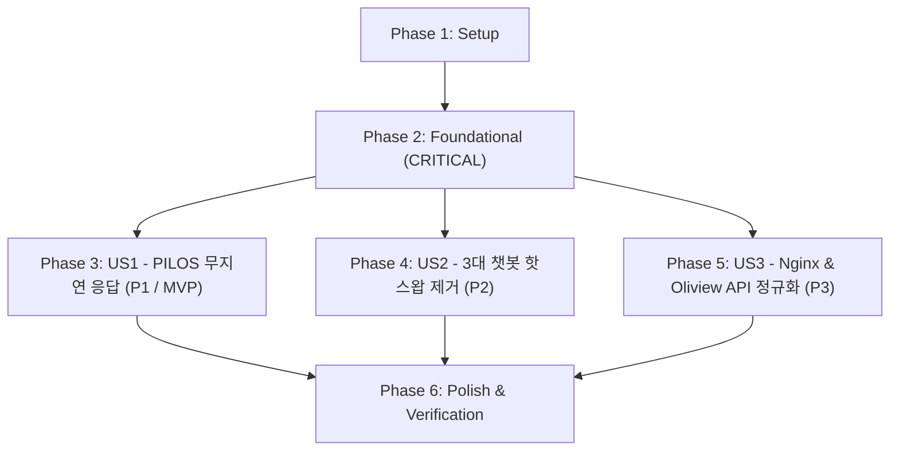

# Tasks: 통합 시스템 아키텍처 점검 및 리팩토링 (010-refactor-unified-system-architecture)

**Input**: Design documents from `specs/010-refactor-unified-system-architecture/`
- Spec: [spec.md](file:///c:/AISERVICE/specs/010-refactor-unified-system-architecture/spec.md)
- Plan: [plan.md](file:///c:/AISERVICE/specs/010-refactor-unified-system-architecture/plan.md)
- Research: [research.md](file:///c:/AISERVICE/specs/010-refactor-unified-system-architecture/research.md)
- Data Model: [data-model.md](file:///c:/AISERVICE/specs/010-refactor-unified-system-architecture/data-model.md)
- Contracts: [/contracts/](file:///c:/AISERVICE/specs/010-refactor-unified-system-architecture/contracts/)
- Quickstart: [quickstart.md](file:///c:/AISERVICE/specs/010-refactor-unified-system-architecture/quickstart.md)

---

## Phase 1: Setup (Shared Infrastructure)

**Purpose**: 프로젝트 환경 설정 정합성 확인 및 공통 의존성 정렬

- [X] T001 환경 변수(`.env`, `docker-compose.yml`)의 LLM 모델명(`SYNTHESIS_LLM_MODEL=qwen3.5-4b`, `FAST_LLM_MODEL=qwen3.5-4b`) 및 포트 설정 정렬 in `docker-compose.yml`
- [X] T002 [P] 통합 회귀 테스트 실행 환경 및 사전 검증 스크립트 점검 in `tests/test_multi_chatbot_regression.py`

---

## Phase 2: Foundational (Blocking Prerequisites)

**Purpose**: 모든 사용자 스토리 구현에 선행되어야 하는 핵심 인프라 및 게이트웨이 기반 구축

⚠️ **CRITICAL**: 본 단계가 완료되어야 개별 챗봇 사용자 스토리 작업이 안전하게 진행될 수 있습니다.

- [X] T003 Model Gateway 단일 상주 모델(`qwen3.5-4b`) 고정 및 런타임 핫스왑 방지 로직 점검 in `model_gateway/src/api/routes/inference_api.py`
- [X] T004 [P] Model Gateway OpenAI 호환 엔드포인트(임베딩 8090, 리랭커 8091, 추론 8081) 계약 검증 in `tests/test_embedding_gateway_contract.py`
- [X] T005 [P] Ingress Nginx 역방향 프록시 기본 설정 및 구조화된 JSON 접근 로깅 점검 in `gateway/nginx.conf`

**Checkpoint**: Foundation ready - Model Gateway 및 Ingress 기반이 확립되어 사용자 스토리 구현 착수 가능

---

## Phase 3: User Story 1 - PILOS 챗봇 및 정본 지식/리포트 질의 시 무지연 응답 (Priority: P1) 🎯 MVP

**Goal**: PILOS 챗봇 웹 UI(`http://localhost:8080/ateam/pilos/`)에서 정본 지식 즉시 응답(<50ms) 및 동적 LLM 스트리밍(TTFT < 2.0s) 무지연 응답 제공 (FR-001, FR-002, FR-003, SC-001, SC-002)

**Independent Test**: `python tests/test_multi_chatbot_regression.py`의 `test_02_pilos_chatbot_cache_speed` 실행 시 50ms 미만 반환 및 SSE 스트리밍 무지연 응답 확인

### Tests for User Story 1
- [X] T006 [P] [US1] PILOS 정본 지식 캐시 응답 속도(<500ms / 목표 <50ms) 검증 테스트 보강 in `tests/test_multi_chatbot_regression.py`

### Implementation for User Story 1
- [X] T007 [US1] PILOS Web Gunicorn 워커 프로파일 최적화(`gthread` 멀티스레드 비동기 친화적 설정) in `ateam/pilos-sentiment-index/Dockerfile`
- [X] T008 [US1] PILOS 백엔드 서비스 정본 지식 우선 캐시 라우팅 및 LLM 타임아웃 안전 처리 in `ateam/pilos-sentiment-index/src/pilos/api/chat_routes.py`
- [X] T009 [US1] PILOS 대시보드 프론트엔드 SSE 스트리밍 첫 번째 토큰 시간(TTFT < 2.0s) 및 로딩 피드백 확인 in `ateam/pilos-sentiment-index/src/pilos/templates/chat.html`

**Checkpoint**: PILOS 단독 질의 시 정본 지식 초고속 응답 및 스트리밍 무지연 동작 검증 완료 (MVP 달성)

---

## Phase 4: User Story 2 - 3대 챗봇(PILOS, 올리챗, 올원챗) 동시성 격리 및 핫스왑 병목 제거 (Priority: P2)

**Goal**: 단일 GPU(8GB VRAM) 환경에서 PILOS, 올리챗, 올원챗이 모델 핫스왑(0회) 없이 공용 게이트웨이를 통해 안정적으로 동시 추론 수행 (FR-004, FR-005, FR-007, SC-003, SC-004)

**Independent Test**: 3개 챗봇에 동시 질의 요청 시 모델 재로딩 없이 순차 큐잉을 통해 전 요청 HTTP 200 성공 및 10초 이내 회귀 테스트 완결

### Tests for User Story 2
- [X] T010 [P] [US2] 3대 챗봇 동시 요청 격리 및 HTTP 200 완결 검증 테스트(`test_05_multi_chatbot_concurrency_isolation`) 보강 in `tests/test_multi_chatbot_regression.py`

### Implementation for User Story 2
- [X] T011 [P] [US2] B-Team 올원챗(`Oliview_chatbot_b`) 메인 LLM 모델명을 `qwen3.5-4b`로 고정 및 OpenAI 호환 규격 통일 in `bteam/Oliview_chatbot_b/app/core/config.py`
- [X] T012 [P] [US2] B-Team 올리챗(`Oliview_chatbot_a`) Streamlit 실시간 토큰 스트리밍(`st.write_stream`) 및 BM25 디스크 캐시 점검 in `bteam/Oliview_chatbot_a/app.py`
- [X] T013 [US2] 3대 챗봇 동시 부하 상황에서 Model Gateway FIFO 순차 큐잉 및 소켓 타임아웃 방지 동작 검증 in `tests/test_multi_chatbot_regression.py`

**Checkpoint**: 3대 챗봇 간 상호 간섭 없는 동시성 격리 및 핫스왑 0회 검증 완료

---

## Phase 5: User Story 3 - 통합 Nginx 역방향 프록시 및 백엔드 워커 동시성 안정화 & Oliview 프론트엔드 API 정규화 (Priority: P3)

**Goal**: 단일 통합 포털(`http://localhost:8080`)을 통한 전 서비스 라우팅, 프록시 버퍼링 해제, 300초 타임아웃 보장 및 Oliview 상품 상세 조회 정상화 (FR-006, FR-008, SC-005)

**Independent Test**: Nginx 8080 포트를 통해 SSE 스트리밍 지속 연결 및 Oliview 웹(`http://localhost:8080/bteam/oliview/`)에서 상품 클릭 시 상세 페이지 데이터 100% 로딩 성공

### Tests for User Story 3
- [X] T014 [P] [US3] Nginx 프록시 라우팅 및 Oliview API 호출 경로 계약 검증 테스트 작성 in `tests/test_multi_chatbot_regression.py`

### Implementation for User Story 3
- [X] T015 [P] [US3] Nginx 역방향 프록시 설정에서 `/bteam/oliview/api/`, `/api/`, `/bteam/chata/`, `/bteam/chatb/`, `/ateam/pilos/` 경로의 `proxy_buffering off` 및 300초 타임아웃 일관 적용 in `gateway/nginx.conf`
- [X] T016 [P] [US3] B-Team Oliview 프론트엔드 전 컴포넌트(`MyBrandpage.jsx`, `BaseProductDetail.jsx`, `ProductDetailPage.jsx`, `CompetitorProductDetailPage.jsx`)의 `apiBaseUrl` 전역 폴백(`/bteam/oliview`) 정규화 in `bteam/Oliview_Project/frontend/src/pages/`
- [X] T017 [US3] Nginx 포털을 통한 Oliview 상품 클릭 시 상세 정보 및 감성 분석 리포트 정상 렌더링 검증 in `bteam/Oliview_Project/frontend/`

**Checkpoint**: 통합 Nginx 게이트웨이 및 Oliview 프론트엔드 라우팅 정규화 완료

---

## Phase 6: Polish & Cross-Cutting Concerns

**Purpose**: 시스템 전반의 품질 보증, 회귀 테스트 스위트 검증 및 문서 동기화

- [X] T018 [P] 통합 자동화 회귀 테스트 스위트(`python tests/test_multi_chatbot_regression.py`) 전체 항목 10초 이내 100% 통과 최종 실행 검증 in `tests/test_multi_chatbot_regression.py`
- [X] T019 [P] 종단간 빠른 검증 가이드(`quickstart.md`)에 따른 전 서비스 수동 헬스체크 검증 in `specs/010-refactor-unified-system-architecture/quickstart.md`
- [X] T020 시스템 구성도 및 운영 안내 문서 최신화 in `README.md`

---

## Dependencies & Execution Order

### Phase Dependencies

### Parallel Opportunities

- **Phase 1**: T001, T002 병렬 점검 가능
- **Phase 2**: T004, T005 병렬 수행 가능
- **Phase 3 (US1)**: T006 테스트 작성 및 T007 워커 최적화 병렬 진행 가능
- **Phase 4 (US2)**: T010 테스트, T011 올원챗 설정, T012 올리챗 스트리밍 병렬 진행 가능
- **Phase 5 (US3)**: T014 테스트, T015 Nginx 라우팅, T016 프론트엔드 컴포넌트 수정 병렬 진행 가능
- **Phase 6**: T018 회귀 테스트와 T020 README 문서화 병렬 진행 가능

---

## Implementation Strategy

### MVP First (Phase 1 ~ Phase 3)
1. Phase 1 (Setup) 및 Phase 2 (Foundational) 인프라 기반 확립
2. Phase 3 (User Story 1: PILOS 무지연 응답) 완성 및 독립 검증 (MVP!)
3. 사용자 질문 시 PILOS 챗봇 먹통(Hang) 이슈 완전 해결 확인

### Incremental Delivery (Phase 4 ~ Phase 6)
1. Phase 4: 올원챗/올리챗 모델 통일 및 3대 챗봇 동시성 격리 달성
2. Phase 5: Nginx 프록시 버퍼링 해제 및 Oliview 상품 상세 페이지 API 라우팅 정상화
3. Phase 6: 전체 통합 자동화 회귀 테스트 스위트 100% 통과 확인
