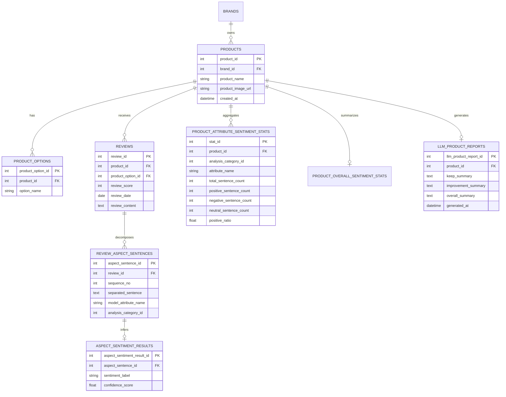
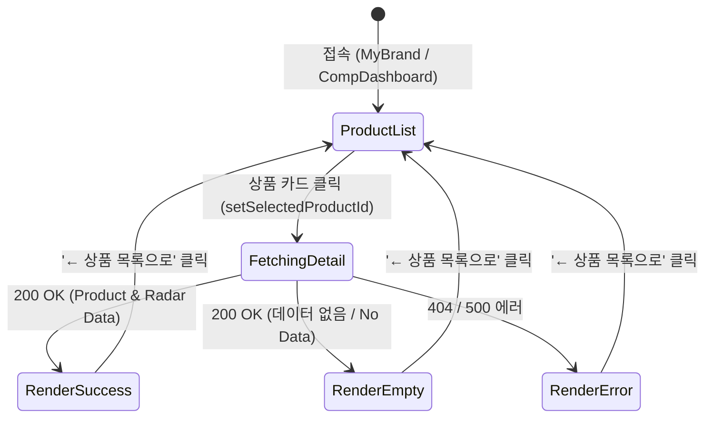

# Data Model: Oliview 상품 상세 및 감성 분석 리포트

**Feature**: `011-fix-oliview-product-detail-routing` | **Date**: 2026-08-18

---

## 1. Entity Definitions & Schema



---

## 2. API Response Data Models

### 2.1 Product Detail Response (`GET /bteam/oliview/api/products/{id}`)
```json
{
  "success": true,
  "product": {
    "product_id": 7,
    "brand_id": 1,
    "brand_name": "헤라",
    "product_name": "블랙 쿠션 SPF34 PA++",
    "product_image_url": "https://image.oliveyoung.co.kr/...",
    "created_at": "2026-01-01 00:00:00"
  },
  "options": [
    {
      "product_option_id": 12,
      "product_id": 7,
      "option_name": "21N1 바닐라 (본품+리필)"
    }
  ],
  "reviews": []
}
```

### 2.2 Analysis Report Response (`GET /bteam/oliview/api/products/{id}/analysis-report?tab=maintain`)
```json
{
  "success": true,
  "radar_data": [
    {
      "attribute_id": 1,
      "attribute_name": "밀착력",
      "total_count": 150,
      "pos_count": 135,
      "neg_count": 10,
      "neu_count": 5,
      "score": 0.90,
      "positive_summary": "피부에 얇고 균일하게 밀착되어 묻어남이 적다는 호평이 다수입니다.",
      "negative_summary": "건성 피부의 경우 기초가 부족하면 건조하게 밀착된다는 의견이 있습니다."
    }
  ],
  "overall_stats": {
    "total_sentence_count": 1200,
    "positive_count": 980,
    "negative_count": 150,
    "neutral_count": 70,
    "positive_ratio": 81.67,
    "negative_ratio": 12.50
  },
  "overall_report": {
    "keep_summary": "우수한 밀착력과 커버력, 고급스러운 패키지 디자인이 핵심 강점입니다.",
    "improvement_summary": "건성 피부를 위한 보습감 보완 및 다양한 호수 확장이 요구됩니다.",
    "overall_summary": "프리미엄 쿠션 시장에서 독보적인 유지력과 커버력을 제공하는 스테디셀러입니다."
  },
  "reviews_data": [
    {
      "review_id": 1024,
      "sequence_no": 1,
      "sentiment_sentence": "바르자마자 피부에 싹 밀착돼서 너무 좋아요.",
      "sentiment_label": "positive",
      "rating": 5,
      "review_created_at": "2026-08-10",
      "option_name": "21N1 바닐라",
      "full_review_text": "바르자마자 피부에 싹 밀착돼서 너무 좋아요. 마스크에도 거의 안 묻어납니다.",
      "attribute_name": "밀착력"
    }
  ]
}
```

---

## 3. UI State Transitions


