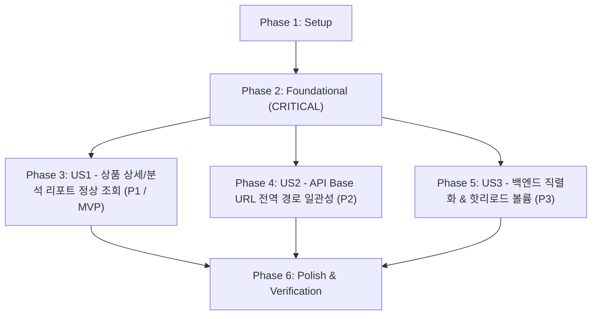

# Tasks: Oliview 상품 상세 조회 404 경로 오류 해결 및 라우팅 정상화

**Feature**: `011-fix-oliview-product-detail-routing` | **Date**: 2026-08-18 | **Spec**: [spec.md](./spec.md) | **Plan**: [plan.md](./plan.md)

---

## Phase 1: Setup (Shared Infrastructure)

**Purpose**: 프로젝트 환경 설정 및 인프라 의존성 정합성 점검

- [X] T001 환경 변수 및 포트 바인딩 정합성 검증 in `.env`
- [X] T002 [P] Docker Compose 서비스 의존성 및 `aiservice-network` 브리지 네트워크 구성 점검 in `docker-compose.yml`

---

## Phase 2: Foundational (Blocking Prerequisites)

**Purpose**: 모든 User Story가 의존하는 핵심 게이트웨이 라우팅 및 백엔드 DB 연결 기반 확립

⚠️ **CRITICAL**: 아래 작업이 완료된 후 User Story 구현을 시작합니다.

- [X] T003 [P] Nginx 역방향 프록시 `/bteam/oliview/api/` 경로 매핑 및 300초 타임아웃 구성 점검 in `gateway/nginx.conf`
- [X] T004 [P] Flask 백엔드 DB 연결 헬퍼(`get_db_connection`) 및 타임아웃 설정 검증 in `bteam/Oliview_Project/backend/db_helper.py`

**Checkpoint**: 게이트웨이 및 DB 인프라 검증 완료 - User Story 구현 시작 가능

---

## Phase 3: User Story 1 - 내 브랜드 및 타사 브랜드 상품 상세/분석 리포트 정상 조회 (Priority: P1) 🎯 MVP

**Goal**: 사용자가 Oliview 포털에서 상품 클릭 시 404/JSON 파싱 오류 없이 상품 상세 정보, 옵션, 속성별 레이더 차트, AI 감성 분석 리포트 즉시 로딩 (FR-001, FR-002, SC-001, SC-002)

**Independent Test**: Nginx 8080 포트를 통해 브라우저에서 '내 브랜드' 접속 후 상품 클릭 시 상품 상세 데이터 및 감성 분석 리포트가 100% 정상 렌더링되고 브라우저 콘솔 에러가 0건임을 확인

### Tests for User Story 1
- [X] T005 [P] [US1] 상품 상세(`GET /bteam/oliview/api/products/1`) 및 분석 리포트 API 응답 계약 검증 테스트 작성 in `tests/test_multi_chatbot_regression.py`

### Implementation for User Story 1
- [X] T006 [US1] `BaseProductDetail.jsx` 내 `baseUrl` 기본 폴백(`/bteam/oliview`) 설정 및 엔드포인트 URL 정규화 in `bteam/Oliview_Project/frontend/src/BaseProductDetail.jsx`
- [X] T007 [P] [US1] `ProductDetailPage.jsx` 내 `propProductId` 지원 및 `useEffect` 상태 동기화 구현 in `bteam/Oliview_Project/frontend/src/ProductDetailPage.jsx`
- [X] T008 [P] [US1] `CompetitorProductDetailPage.jsx` 내 `propProductId` 지원 및 `useEffect` 상태 동기화 구현 in `bteam/Oliview_Project/frontend/src/CompetitorProductDetailPage.jsx`
- [X] T009 [US1] `MyBrandpage.jsx` 내 상품 클릭 시 `ProductDetailPage`로 `productId` 및 `apiBaseUrl={baseUrl}` 전달 구현 in `bteam/Oliview_Project/frontend/src/MyBrandpage.jsx`
- [X] T010 [US1] Nginx 포털을 통한 상품 클릭 시 상세 정보 및 감성 분석 리포트 정상 렌더링 검증 in `bteam/Oliview_Project/frontend/`

**Checkpoint**: User Story 1 (MVP) 독립 검증 완료 - 상품 클릭 시 상세 페이지 및 감성 분석 리포트 완벽 작동

---

## Phase 4: User Story 2 - Nginx 및 프론트엔드 API Base URL 전역 경로 일관성 보장 (Priority: P2)

**Goal**: 프론트엔드 전 컴포넌트의 API 호출 경로를 `/bteam/oliview/api/*`로 단일화하여 PILOS 공용 `/api/*` 경로와의 충돌 및 404 방지 (FR-001, FR-003, SC-002)

**Independent Test**: 브라우저 네트워크 탭에서 모든 XHR 요청이 `/bteam/oliview/api/...`로 전송되고 PILOS로 라우팅되지 않음을 검증

### Implementation for User Story 2
- [X] T011 [P] [US2] 프론트엔드 전 컴포넌트(`CompetitorDashboardPage.jsx`, `SubscriptionPage.jsx`, `BrandInfoPage.jsx`, `LoginPage.jsx`, `RegisterPage.jsx`)의 `apiBaseUrl` 전역 폴백 정규화 in `bteam/Oliview_Project/frontend/src/`
- [X] T012 [US2] Nginx `/bteam/oliview/api/` 프록시와 PILOS `/api/` 간 경로 충돌 방지 라우팅 회귀 검증 in `gateway/nginx.conf`

**Checkpoint**: User Story 1 & 2 통합 검증 완료 - 프론트엔드 전 화면 API 경로 완전 격리

---

## Phase 5: User Story 3 - 백엔드 데이터 직렬화 안전성 및 핫리로드 볼륨 마운트 보장 (Priority: P3)

**Goal**: Flask 백엔드의 `datetime`/`Decimal` 타입 JSON 직렬화 500 에러를 원천 방어하고, 도커 환경 소스 코드 실시간 핫리로드 보장 (FR-004, FR-005, SC-003)

**Independent Test**: 백엔드 API에서 다양한 날짜 및 특수 필드가 포함된 응답 반환 시 500 에러 없이 유효한 JSON으로 반환되는지 확인

### Implementation for User Story 3
- [X] T013 [P] [US3] `app.py` 내 `serialize_val`, `serialize_row`, `serialize_rows` 직렬화 헬퍼 함수 구현 in `bteam/Oliview_Project/backend/app.py`
- [X] T014 [US3] `get_product_detail`, `get_products`, `get_brand_categories`, `get_product_analysis_report` 엔드포인트에 직렬화 헬퍼 적용 in `bteam/Oliview_Project/backend/app.py`
- [X] T015 [P] [US3] `docker-compose.yml` 내 `oliview_backend` 및 `oliview_frontend` 소스 코드 볼륨 마운트 설정 in `docker-compose.yml`

**Checkpoint**: 전 User Story 구현 완료 - 백엔드 직렬화 무결성 및 도커 실시간 동기화 확보

---

## Phase 6: Polish & Cross-Cutting Concerns

**Purpose**: 시스템 전반의 회귀 테스트 스위트 검증, 빠른 검증 가이드 수행 및 문서 동기화

- [X] T016 [P] 통합 자동화 회귀 테스트 스위트(`python tests/test_multi_chatbot_regression.py`) 전체 항목 100% 통과 실행 검증 in `tests/test_multi_chatbot_regression.py`
- [X] T017 [P] 종단간 빠른 검증 가이드(`quickstart.md`)에 따른 전 서비스 수동 헬스체크 검증 in `specs/011-fix-oliview-product-detail-routing/quickstart.md`
- [X] T018 시스템 구성도 및 운영 안내 문서 최신화 in `README.md`

---

## Dependencies & Execution Order

### Phase Dependencies

### Parallel Opportunities

- **Phase 1**: T001, T002 병렬 점검 가능
- **Phase 2**: T003, T004 병렬 검증 가능
- **Phase 3 (US1)**: T005 계약 테스트 작성과 T007, T008 컴포넌트 Props 수정 병렬 진행 가능
- **Phase 4 (US2)**: T011 프론트엔드 전 컴포넌트 수정과 T012 Nginx 라우팅 검증 병렬 진행 가능
- **Phase 5 (US3)**: T013 직렬화 헬퍼 구현과 T015 Docker 볼륨 마운트 설정 병렬 진행 가능
- **Phase 6**: T016 회귀 테스트 실행과 T018 README 문서화 병렬 진행 가능
