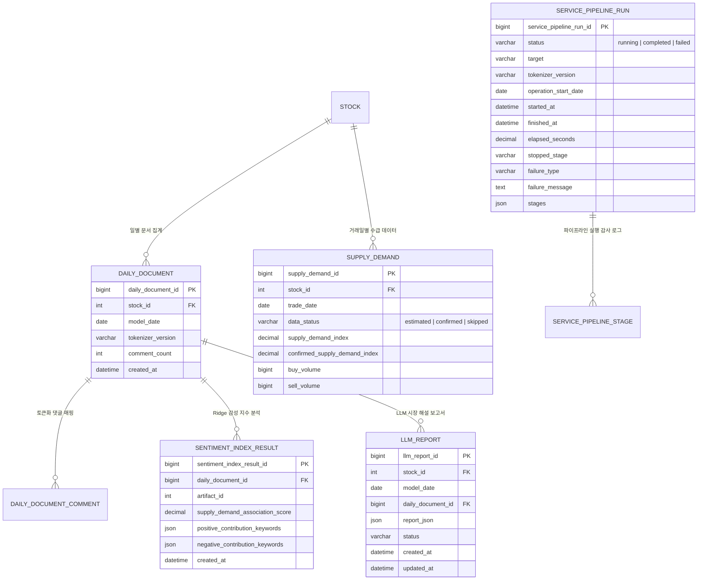

# Data Model: 012-restore-pilos-pipeline

**Feature**: [`012-restore-pilos-pipeline`](file:///c:/AISERVICE/specs/012-restore-pilos-pipeline/spec.md)  
**Date**: 2026-08-19  
**Status**: Specified  

---

## 1. 주요 엔터티 및 관계도 (Entity Relationship)

---

## 2. 엔터티 세부 명세 (Entity Specifications)

### 2.1 `daily_document` (일별 문서)
- **설명**: 특정 거래일 동안 수집·전처리·토큰화된 댓글을 취합한 모델 입력 단위.
- **불변 규칙**: 동일 `(stock_id, model_date, tokenizer_version)`에 대해 중복 레코드를 허용하지 않음.

### 2.2 `sentiment_index_result` (감성 지수 결과)
- **설명**: `daily_document`에 대해 Ridge 회귀 모델을 적용하여 산출된 감성 연관도 점수 및 상위 긍정/부정 기여 키워드.
- **필드**:
  - `supply_demand_association_score`: 수급 연관 감성 점수 (-1.0 ~ +1.0)
  - `positive_contribution_keywords`: 긍정 키워드 가중치 리스트 (JSON)
  - `negative_contribution_keywords`: 부정 키워드 가중치 리스트 (JSON)

### 2.3 `llm_report` (AI 시장 해설 보고서)
- **설명**: 감성 지표, 키워드 기여도 및 수급 상황을 종합하여 LLM(`qwen3.5-2b`)이 자연어로 합성한 최종 리포트.
- **상태 전이 (State Transitions)**:
  - `pending` (생성 대기) → `generating` (추론 중) → `completed` (성공 완료) 또는 `failed` (최대 2회 실패 후 격리).
- **보고서 본문 (`report_json`)**:
  - `market_commentary`: 시장 요약 및 종합 해설 본문
  - `direction`: 시장 심리 방향 (`BULLISH` | `BEARISH` | `NEUTRAL`)
  - `signal_score`: 신호 강도 점수
  - `evidence`: 근거 데이터 및 키워드 요약

### 2.4 `supply_demand` (수급 데이터)
- **설명**: 키움 OpenAPI로부터 수집된 투자자별 수급 데이터.
- **결함 허용 상태**:
  - API 키 부재 시 레코드 생성을 건너뛰며, `JobResult`에 `reason_code: "no_credentials"`로 상태를 반환함.

### 2.5 `service_pipeline_run` (파이프라인 실행 감사 로그)
- **설명**: 10분 주기 자동 실행기의 7개 단계별 실행 결과, 경과 시간, 성공 건수, 실패 원인을 기록하는 감사 엔터티.
- **단계 목록**:
  1. `comment_collection` (댓글 증분 수집)
  2. `comment_preprocessing` (텍스트 정제 및 마스킹)
  3. `comment_tokenization` (Kiwi 형태소 토큰화)
  4. `daily_document` (일별 문서 취합)
  5. `supply_demand` (수급 데이터 수집 - Graceful Fallback 지원)
  6. `model_inference` (Ridge 감성 지표 산출)
  7. `llm_report` (LLM 시장 해설 보고서 생성)
