# Tasks: 012-restore-pilos-pipeline

**Input**: Design documents from [`specs/012-restore-pilos-pipeline/`](file:///c:/AISERVICE/specs/012-restore-pilos-pipeline/)  
**Prerequisites**: [`plan.md`](file:///c:/AISERVICE/specs/012-restore-pilos-pipeline/plan.md), [`spec.md`](file:///c:/AISERVICE/specs/012-restore-pilos-pipeline/spec.md), [`research.md`](file:///c:/AISERVICE/specs/012-restore-pilos-pipeline/research.md), [`data-model.md`](file:///c:/AISERVICE/specs/012-restore-pilos-pipeline/data-model.md), [`contracts/pipeline_contract.md`](file:///c:/AISERVICE/specs/012-restore-pilos-pipeline/contracts/pipeline_contract.md)  

---

## Phase 1: Setup (Shared Configuration & Model Gateway Optimization)

**Purpose**: 모델 서빙 게이트웨이의 경량 LLM(`qwen3.5-2b`) 기본화 및 VRAM 4GB 이하 최적화 환경 구성

- [x] T001 Configure default lightweight model (`qwen3.5-2b`) and VRAM limit (4000MB) in `model_gateway/config/server_config.json`
- [x] T002 [P] Update LLM model environment variables (`SYNTHESIS_LLM_MODEL=qwen3.5-2b`, `FAST_LLM_MODEL=qwen3.5-2b`, `REPORT_LLM_MODEL=qwen3.5-2b`, `CHAT_LLM_MODEL=qwen3.5-2b`) in `docker-compose.yml`
- [x] T003 [P] Update LLM model configuration in `ateam/docker-compose.yml` and `ateam/pilos-sentiment-index/.env`

---

## Phase 2: Foundational (Graceful Fallback & Pipeline Resilience)

**Purpose**: 키움 API Key 부재 시 수급 수집 단계 Graceful Fallback 구현 및 파이프라인 연쇄 중단 방지

- [x] T004 [P] Write unit tests for Kiwoom API missing credentials fallback (`JobStatus.SKIPPED`, `JobReason.NO_CREDENTIALS`) in `ateam/pilos-sentiment-index/tests/test_supply_demand_job.py`
- [x] T005 [P] Write regression tests for pipeline stage skipping and non-fatal status handling in `ateam/pilos-sentiment-index/tests/test_pipeline_status.py`
- [x] T006 Implement Graceful Fallback in `run_supply_demand_collection` when Kiwoom API credentials are not configured or external API is unavailable in `ateam/pilos-sentiment-index/pilos/jobs/collect_supply_demand.py`
- [x] T007 Update `run_service_pipeline` to handle `supply_demand` stage `SKIPPED` status without terminating the pipeline in `ateam/pilos-sentiment-index/pilos/jobs/run_service_pipeline.py`

**Checkpoint**: 수급 API 키가 없는 환경에서도 파이프라인이 5단계에서 멈추지 않고 6, 7단계로 정상 진행됨을 확인.

---

## Phase 3: User Story 1 - 최신 일자(8월 12일 이후) 분석 보고서 및 감성 지표 복구 (Priority: P1) 🎯 MVP

**Goal**: 8월 12일부터 현재(8월 19일)까지 누락된 감성 지표 및 AI 시장 해설 보고서를 10개 전 종목에 대해 100% 소급 생성하여 웹에서 정상 표시

**Independent Test**:
- 브라우저에서 `http://localhost:8080/ateam/pilos/` 접속 후 `2026-08-12` ~ `2026-08-19` 일자 선택 시 시장 해설 본문과 감성 점수가 즉시 200 OK로 렌더링되는지 확인.

### Tests for User Story 1
- [x] T008 [P] [US1] Write test verifying 200 OK report retrieval and non-empty commentary for dates 2026-08-12 onwards in `ateam/pilos-sentiment-index/tests/test_llm_report_web.py`

### Implementation for User Story 1
- [x] T009 [US1] Run historical Ridge sentiment model inference across 10 target stocks for missing dates (2026-08-12 ~ 2026-08-19) via `ateam/pilos-sentiment-index/pilos/jobs/predict_model.py`
- [x] T010 [US1] Run LLM market commentary report generation across 10 target stocks for missing dates (2026-08-12 ~ 2026-08-19) using `qwen3.5-2b` via `ateam/pilos-sentiment-index/pilos/jobs/generate_llm_reports.py`
- [x] T011 [US1] Verify web API endpoint `GET /api/stocks/<stock_code>/llm-reports` returns HTTP 200 OK for all 10 stocks on 2026-08-12 through 2026-08-19 in `ateam/pilos-sentiment-index/pilos/web/routes.py`

**Checkpoint**: 8월 12일 이후 모든 거래일에 대해 10개 종목의 AI 보고서가 100% 채워지고 웹 UI에서 정상 표시됨.

---

## Phase 4: User Story 2 - 자동 데이터 수집 및 분석 파이프라인의 주기적 정상 실행 (Priority: P2)

**Goal**: 백그라운드 워커 데몬이 10분 주기마다 수집부터 보고서 생성까지 7개 전 단계를 무중단 자동 완수

**Independent Test**:
- `pilos-worker` 컨테이너에서 파이프라인 1회 전체 실행 시 `status: completed` 기록 및 데몬 정기 루프 정상 동작 확인.

### Tests for User Story 2
- [x] T012 [P] [US2] Write test for 10-minute worker daemon loop execution and non-blocking file lock handling in `ateam/pilos-sentiment-index/tests/test_job_execution_contracts.py`

### Implementation for User Story 2
- [x] T013 [US2] Implement single-stock LLM generation retry (max 2 attempts) and fault isolation in `ateam/pilos-sentiment-index/pilos/jobs/generate_llm_reports.py`
- [x] T014 [US2] Verify end-to-end execution of `run_service_pipeline` in Docker container `pilos-worker` completing all 7 stages with `status: completed`
- [x] T015 [US2] Restart and verify `pilos-worker` daemon running continuously in background in `ateam/pilos-sentiment-index/pilos/jobs/worker_daemon.py`

**Checkpoint**: 워커 데몬이 10분마다 중단 없이 7개 단계를 자동 순환하며 감사 로그를 기록함.

---

## Phase 5: User Story 3 - 파이프라인 장애 감지 및 소급 복구(Backfill) 메커니즘 (Priority: P3)

**Goal**: 임의의 과거 기간 누락 발생 시 CLI/파라미터 기반으로 안전하게 소급 복구하고 감사 이력을 추적

**Independent Test**:
- `--start-date` 및 `--end-date` 인자를 사용한 소급 실행 시 지정 구간만 선별 처리되고 `service_pipeline_run`에 기록되는지 확인.

### Tests for User Story 3
- [x] T016 [P] [US3] Write test for date-range backfill CLI argument parsing and error reporting in `ateam/pilos-sentiment-index/tests/test_llm_report_generation_job.py`

### Implementation for User Story 3
- [x] T017 [US3] Verify `service_pipeline_run` database table records accurate stage duration, status, and transition logs in `ateam/pilos-sentiment-index/pilos/storage/pipeline_run_db.py`

---

## Phase 6: Polish & Cross-Cutting Concerns

**Purpose**: 시스템 전반의 VRAM 안정성, 단위 테스트 스위트 100% 통과 및 최종 E2E 검증

- [x] T018 [P] Validate host GPU VRAM usage (`nvidia-smi`) stays under 4.0GB with `qwen3.5-2b` resident serving
- [x] T019 [P] Run full A-Team PILOS regression test suite via `docker exec pilos-web pytest /app/tests/`
- [x] T020 Execute `quickstart.md` validation workflow and verify web dashboard at `http://localhost:8080/ateam/pilos/`

---

## Dependencies & Execution Order

```mermaid
flowchart TD
    subgraph Phase1["Phase 1: Setup"]
        T001["T001: server_config.json (qwen3.5-2b)"]
        T002["T002: docker-compose.yml 환경변수"]
        T003["T003: ateam .env 환경변수"]
    end

    subgraph Phase2["Phase 2: Foundational"]
        T004["T004: 수급 Fallback 테스트"]
        T005["T005: 파이프라인 상태 테스트"]
        T006["T006: collect_supply_demand.py Fallback 구현"]
        T007["T007: run_service_pipeline.py 스킵 허용"]
    end

    subgraph Phase3["Phase 3: User Story 1 (P1 MVP)"]
        T008["T008: 보고서 웹 조회 테스트"]
        T009["T009: 8/12~19 감성 지표 소급 추론"]
        T010["T010: 8/12~19 LLM 보고서 소급 생성"]
        T011["T011: 웹 대시보드 200 OK 검증"]
    end

    subgraph Phase4["Phase 4: User Story 2 (P2)"]
        T012["T012: 데몬/락 테스트"]
        T013["T013: LLM 2회 재시도 & 단일 격리"]
        T014["T014: 7단계 파이프라인 완료 검증"]
        T015["T015: pilos-worker 데몬 재가동"]
    end

    subgraph Phase5["Phase 5: User Story 3 (P3)"]
        T016["T016: 소급 CLI 테스트"]
        T017["T017: service_pipeline_run 감사 로그"]
    end

    subgraph Phase6["Phase 6: Polish"]
        T018["T018: VRAM 점유량 < 4GB 검증"]
        T019["T019: 전체 회귀 테스트 스위트"]
        T020["T020: Quickstart E2E 종합 검증"]
    end

    Phase1 --> Phase2
    Phase2 --> Phase3
    Phase3 --> Phase4
    Phase4 --> Phase5
    Phase5 --> Phase6
```

---

## Parallel Execution Opportunities

- **Phase 1**: `T002`와 `T003`은 파일이 독립적이므로 병렬 실행 가능.
- **Phase 2**: `T004`와 `T005` 테스트 작성은 병렬 실행 가능.
- **Phase 3**: `T008` 테스트 작성과 사전 검증은 병렬 실행 가능.
- **Phase 6**: `T018`과 `T019`는 병렬 실행 가능.

---

## Implementation Strategy

### 1. MVP First (Phase 1 ~ Phase 3)
1. 경량 LLM(`qwen3.5-2b`) 기본 설정 적용 (Phase 1).
2. 키움 수급 Graceful Fallback 구현으로 파이프라인 중단 해소 (Phase 2).
3. 8월 12일~19일 10개 전 종목 소급 복구 실행 및 웹 렌더링 즉시 회복 (Phase 3).

### 2. Incremental Delivery (Phase 4 ~ Phase 6)
4. 단일 종목 재시도/격리 로직 적용 및 10분 주기 백그라운드 데몬 가동 (Phase 4).
5. 감사 로그 및 소급 CLI 검증 (Phase 5).
6. GPU VRAM 점유량 < 4.0GB 및 전체 회귀 테스트 최종 완결 (Phase 6).
