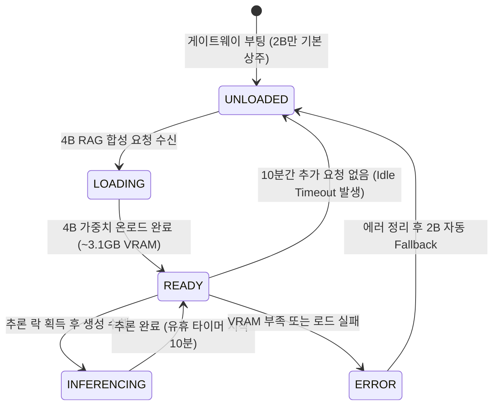

# Data Model Specification: 013-tiered-llm-model-routing

**Feature**: `013-tiered-llm-model-routing`  
**Created**: 2026-08-19  
**Status**: Draft  
**Spec Reference**: [spec.md](./spec.md)

---

## 1. 개요 (Overview)

본 문서는 전사 2단계 계층형 LLM 모델 라우팅, 우선순위 큐잉, VRAM 모니터링 및 서비스 설정에 사용되는 핵심 데이터 모델, 스키마 및 상태 전이 다이어그램을 정의합니다.

---

## 2. 핵심 엔티티 정의 (Key Entities)

### 2.1 Model Tier Configuration (`ModelTierConfig`)
각 LLM 모델의 서빙 티어, 하드웨어 파라미터 및 컨텍스트 한도를 정의하는 엔티티입니다.

| 필드명 | 타입 | 필수 여부 | 기본값 | 설명 |
|---|---|:---:|---|---|
| `model_id` | `str` | 필수 | `"qwen3.5-2b"` | 모델 고유 식별자 (`qwen3.5-2b`, `qwen3.5-4b`) |
| `tier` | `Enum` | 필수 | `"FAST"` | 모델 티어 (`FAST`, `DEEP`) |
| `target_device` | `str` | 필수 | `"GPU"` | 실행 디바이스 (`GPU`, `CPU`) |
| `context_window` | `int` | 필수 | `8192` | 최대 컨텍스트 토큰 크기 (2B: 8192~16384, 4B: 2048~4096) |
| `kv_quantization` | `str` | 필수 | `"q8_0"` | KV 캐시 양자화 포맷 (`q8_0`, `q4_0`, `f16`) |
| `prompt_caching` | `bool` | 필수 | `True` | 시스템 프롬프트 캐싱 활성화 여부 |
| `idle_timeout_seconds` | `int` | 선택 | `600` | 유휴 시 VRAM 자동 회수 시간 (초, 4B 전용) |

---

### 2.2 Priority Inference Request (`InferenceRequestPayload`)
클라이언트가 모델 게이트웨이에 전달하는 요청 페이로드 및 우선순위 메타데이터입니다.

| 필드명 | 타입 | 필수 여부 | 기본값 | 설명 |
|---|---|:---:|---|---|
| `model` | `str` | 필수 | `"qwen3.5-2b"` | 요청 모델 ID |
| `messages` | `list[dict]` | 필수 | `[]` | OpenAI 규격 대화 메시지 배열 |
| `priority` | `Enum` | 선택 | `"high"` | 추론 스케줄링 우선순위 (`high`: 인터랙티브 챗봇, `low`: 백그라운드 배치) |
| `temperature` | `float` | 선택 | `0.3` | 생성 다양성 제어 파라미터 |
| `max_tokens` | `int` | 선택 | `1024` | 최대 생성 토큰 수 |
| `response_format` | `dict` | 선택 | `None` | 구조화된 출력 규격 (예: `{"type": "json_object"}`) |
| `stream` | `bool` | 선택 | `False` | SSE 스트리밍 여부 |

---

### 2.3 VRAM & Gateway Metrics (`GatewayStatusResponse`)
`GET /health/vram` 엔드포인트에서 반환하는 실시간 게이트웨이 및 GPU 상태 모델입니다.

| 필드명 | 타입 | 필수 여부 | 설명 |
|---|---|:---:|---|
| `status` | `str` | 필수 | 서비스 상태 (`healthy`, `degraded`, `error`) |
| `active_llm_models` | `list[str]` | 필수 | 현재 GPU에 로드된 모델 목록 (`["qwen3.5-2b", "qwen3.5-4b"]`) |
| `gpu_vram_total_mb` | `int` | 필수 | 총 물리 VRAM (8192 MB) |
| `gpu_vram_used_mb` | `int` | 필수 | 현재 GPU VRAM 점유량 (OS GUI 포함, <= 5000 MB 목표) |
| `gpu_vram_free_mb` | `int` | 필수 | 현재 가용 VRAM |
| `auxiliary_status` | `dict` | 필수 | 임베딩/리랭커 상태 (`{"embedding": "CPU_READY", "reranker": "CPU_READY"}`) |
| `queue_stats` | `dict` | 필수 | 대기 큐 통계 (`{"high_priority_waiting": 0, "low_priority_waiting": 0}`) |

---

## 3. 상태 전이 모델 (State Transitions)

### 3.1 4B 모델 온디맨드 로딩 및 유휴 회수 라이프사이클 (4B Lifecycle)

---

## 4. 유효성 검증 규칙 (Validation Rules)

1. **RAG 프롬프트 토큰 예산 규칙**:
   - 4B 모델로 요청되는 RAG Context는 `len(tokenizer.encode(prompt)) <= 1500` 조건을 만족해야 하며, 초과 시 하위 관련성 리뷰를 잘라내어(Truncate) 1,500 토큰 이내로 맞춤.
2. **VRAM 상한선 가드레일**:
   - `gpu_vram_used_mb > 5000`인 상태에서 4B 로드 시도 시 즉시 거부하고 2B Fallback 트리거.
3. **JSON Schema 강제 규칙**:
   - `response_format={"type": "json_object"}` 요청 시 문법 검증기(XGrammar)를 통해 100% Valid JSON 보장.
