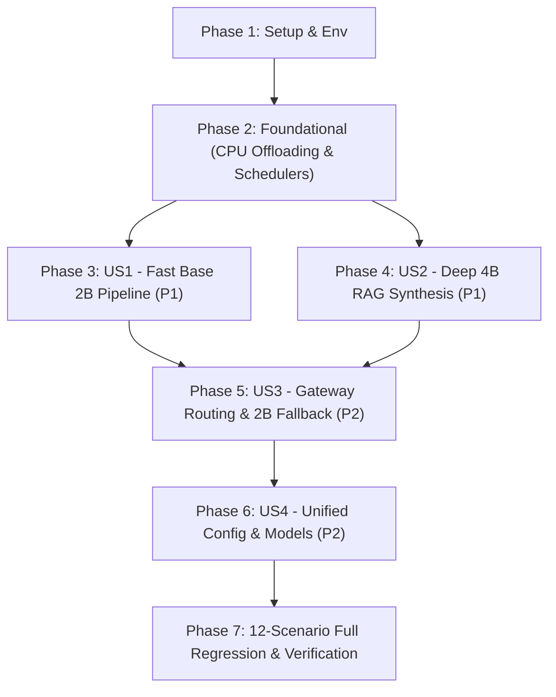

# Tasks: 013-tiered-llm-model-routing

**Feature**: `013-tiered-llm-model-routing`  
**Spec Reference**: [spec.md](./spec.md) | **Plan Reference**: [plan.md](./plan.md)  
**Status**: Ready for Implementation

---

## Dependencies & Story Execution Order

---

## Phase 1: Setup & Environment Configuration

- [ ] T001 [P] Update root `.env` and `.env.example` with `FAST_LLM_MODEL=qwen3.5-2b`, `SYNTHESIS_LLM_MODEL=qwen3.5-4b`, and `VRAM_SAFETY_LIMIT_MB=5000` in `.env`
- [ ] T002 [P] Update service environment variable mappings in `docker-compose.yml` for `vllm-serv`, `pilos_worker`, `pilos_web`, `oliview_backend`, `oliview_chatbot_a`, `oliview_chatbot_b`
- [ ] T003 [P] Create contract and regression test suite skeleton in `tests/test_tiered_routing_contract.py`

---

## Phase 2: Foundational Infrastructure (CPU Offloading & Schedulers)

- [ ] T004 [P] Force `-ngl 0` (CPU mode) for `bge-m3` and `bge-reranker-v2-m3` to ensure 0 MB GPU VRAM in `model_gateway/src/core/auxiliary_manager.py`
- [ ] T005 [P] Configure `--ctk q8_0 --ctv q8_0` KV cache quantization, prompt caching, and differentiated context windows (2B: 8K/16K, 4B: 2K/4K) in `model_gateway/src/core/process_manager.py` and `model_gateway/config/server_config.json`
- [ ] T006 Implement `PriorityPreemptionScheduler` with `_llm_inference_lock` for sequential queuing in `model_gateway/src/core/scheduler.py`
- [ ] T007 [P] Implement `GET /health/vram` real-time GPU VRAM and queue monitoring endpoint in `model_gateway/src/api/routes/health_api.py`

---

## Phase 3: User Story 1 (Priority: P1) - 고속 기본 서빙 및 대용량 배치 처리 (Tier 1: `qwen3.5-2b`)

**Goal**: A팀 10분 정기 10개 종목 보고서 및 단일 댓글 감성 분석, B팀 챗봇 메타데이터 추출을 초고속(70+ tok/s) `qwen3.5-2b`로 일괄 처리  
**Independent Test**: `generate_llm_reports.py` 실행 시 10개 종목이 25초 이내에 JSON 보고서로 정상 생성되고, B팀 메타데이터 추출이 0.5초 이내에 완료됨

- [ ] T008 [P] [US1] Update `ateam/pilos-sentiment-index/pilos/collection/ai_clients/llm_report_client.py` to use `FAST_LLM_MODEL` with `priority: "low"`
- [ ] T009 [P] [US1] Update `ateam/pilos-sentiment-index/pilos/jobs/generate_llm_reports.py` with 2B structured JSON verification and fallback recovery template
- [ ] T010 [P] [US1] Update `ateam/pilos-sentiment-index/pilos/service/single_comment_service.py` to use `FAST_LLM_MODEL` with `priority: "high"`
- [ ] T011 [P] [US1] Update `bteam/Oliview_chatbot_a/05.chatbot.py` to route metadata extraction and intent filtering to `FAST_LLM_MODEL`

---

## Phase 4: User Story 2 (Priority: P1) - RAG 멀티리뷰 심층 비교 및 고품질 전문가 상담 (Tier 2: `qwen3.5-4b`)

**Goal**: B팀 OllyChat 다중 리뷰 종합 비교 및 A팀 심층 투자 상담에 1,500 토큰 가드레일과 함께 고품질 `qwen3.5-4b` 호출 적용  
**Independent Test**: B팀 5개 이상 리뷰 기반 RAG 질의 시 4B 모델을 통해 5초 이내에 풍부한 장단점 비교 답변이 생성됨

- [ ] T012 [P] [US2] Implement 1,500 token budget slicing guardrail in `bteam/Oliview_chatbot_a/05.chatbot.py` and `bteam/Oliview_chatbot_b/project_ragapi.py`
- [ ] T013 [P] [US2] Update RAG deep synthesis logic in `bteam/Oliview_chatbot_a/05.chatbot.py` and `bteam/Oliview_chatbot_b/project_ragapi.py` to invoke `SYNTHESIS_LLM_MODEL` (`qwen3.5-4b`, `priority: "high"`)
- [ ] T014 [P] [US2] Update `ateam/pilos-sentiment-index/pilos/service/chatbot_service.py` with 2B simple query vs 4B complex investment discussion routing

---

## Phase 5: User Story 3 (Priority: P2) - 모델 게이트웨이 동적 라우팅, 0초 2B Fallback 및 유휴 회수

**Goal**: 게이트웨이 레벨에서 4B 요청을 적절한 포트로 프록시하고, 4B 타임아웃/오류 시 즉각 2B Fallback 및 10분 유휴 메모리 자동 회수  
**Independent Test**: 4B 호출 실패 시에도 클라이언트에 에러 없이 2B 모델로 대체 답변이 100% 반환됨

- [ ] T015 [US3] Update `model_gateway/src/api/routes/inference_api.py` with priority-aware model routing, dynamic 4B load, and zero-downtime 2B fallback
- [ ] T016 [US3] Implement 10-minute idle timeout automatic memory reclamation (`IdleReclamationTask`) in `model_gateway/src/core/llama_manager.py`

---

## Phase 6: User Story 4 (Priority: P2) - 전사 설정 일원화 및 동적 카탈로그 동기화

**Goal**: 하드코딩된 모델 호출 제거, A팀/B팀 config 일원화 및 `GET /v1/models` 카탈로그 동기화  
**Independent Test**: 환경변수 변경 시 코드 수정 없이 모든 서비스의 모델 파라미터가 동적으로 변경됨

- [ ] T017 [P] [US4] Update `bteam/Oliview_chatbot_a/config.json` and `bteam/Oliview_chatbot_b/common.py` with unified `fast_llm_model` and `synthesis_llm_model`
- [ ] T018 [US4] Verify `GET /v1/models` dynamic availability catalog in `model_gateway/src/api/routes/inference_api.py`

---

## Phase 7: Full 12-Scenario Regression & End-to-End Verification

- [ ] T019 [P] Execute automated contract test suite `tests/test_tiered_routing_contract.py`
- [ ] T020 Verify REG-A1 ~ REG-A4 (A-Team 10-min daemon, 10 stocks reports, single comment, dashboard & chatbot)
- [ ] T021 Verify REG-B1 ~ REG-B4 (B-Team product details, metadata filter, 4B RAG synthesis, 2B fallback)
- [ ] T022 Verify REG-G1 ~ REG-G4 (CPU embedding/reranking 0MB VRAM, VRAM <= 5.0GB ceiling, public portal 2x2 grid)

---

## Parallel Execution Examples

- **Batch 1 (Setup & Infra)**: `T001`, `T002`, `T003`, `T004`, `T005`, `T007` (Parallel across config, compose, tests, core)
- **Batch 2 (User Story 1)**: `T008`, `T009`, `T010`, `T011` (Parallel across A-team client, batch job, service, and B-team chatbot)
- **Batch 3 (User Story 2)**: `T012`, `T013`, `T014` (Parallel across B-team RAG guardrail, synthesis, and A-team chatbot)
- **Batch 4 (Gateway & Polish)**: `T015`, `T016`, `T017`, `T018` (Gateway routing, idle task, configs)
- **Batch 5 (Verification)**: `T019`, `T020`, `T021`, `T022` (Full regression test suite)
