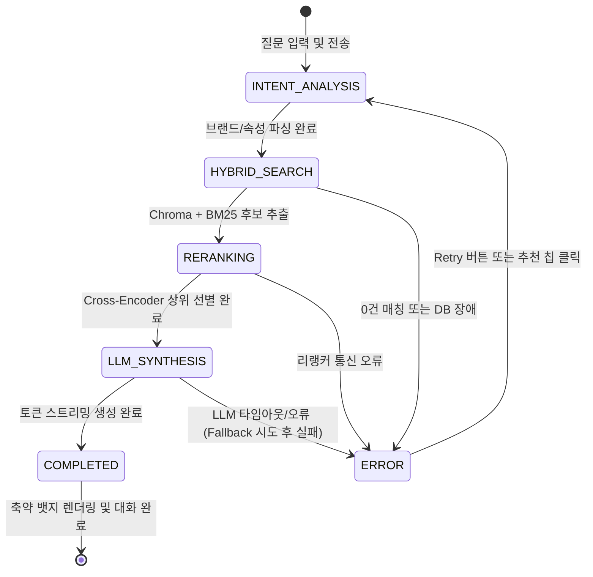

# Data Model & Schema Specification: OllyChat RAG 파이프라인 실시간 시각적 진행과정

**Feature**: `014-ollychat-process-visualization`  
**Date**: 2026-08-19  
**Status**: Approved  

---

## 1. 개요

본 문서는 올리챗 A(Streamlit) 및 올리챗 B(FastAPI/Web)의 실시간 RAG 진행 상태 시각화, 토큰 스트리밍, 참조 리뷰 아코디언, 복구 칩에 사용되는 핵심 데이터 모델과 스키마를 정의합니다.

---

## 2. 핵심 엔티티 및 스키마 정의

### 2.1 `PipelinePhase` (수명 주기 단계 열거형)

```python
from enum import Enum

class PipelinePhase(str, Enum):
    INTENT_ANALYSIS = "INTENT_ANALYSIS"   # 1단계: 질문 의도 및 화장품 속성 분석
    HYBRID_SEARCH = "HYBRID_SEARCH"       # 2단계: 리뷰 하이브리드 검색 (BM25 + BGE-M3)
    RERANKING = "RERANKING"               # 3단계: BGE-Reranker 순위 재정렬
    LLM_SYNTHESIS = "LLM_SYNTHESIS"       # 4단계: LLM 심층 분석 및 맞춤 답변 생성
    COMPLETED = "COMPLETED"               # 5단계: 종합 분석 완료
    ERROR = "ERROR"                       # 에러/장애 상태
```

### 2.2 `PipelineStepEvent` (실시간 진행 이벤트 패킷)

진행 단계의 진입, 전환, 완료 상태를 UI로 브로드캐스팅하는 이벤트 모델입니다.

| 필드명 | 타입 | 필수 여부 | 설명 | 예시 |
|---|---|---|---|---|
| `phase` | `PipelinePhase` | 필수 | 현재 실행 중인 파이프라인 단계 | `PipelinePhase.HYBRID_SEARCH` |
| `label` | `str` | 필수 | 화면에 노출되는 직관적인 한국어 라벨 | `"📚 리뷰 하이브리드 검색 중 (BM25 + BGE-M3)"` |
| `status` | `str` | 필수 | 진행 상태 (`"running"`, `"complete"`, `"warning"`, `"error"`) | `"running"` |
| `elapsed_sec` | `float` | 필수 | 해당 단계 진입 시점까지의 누적 경과 시간(초) | `0.42` |
| `message` | `Optional[str]` | 선택 | 단계별 부가 설명 또는 상세 로그 | `"식물나라 브랜드 관련 리뷰 20건 검색 완료"` |
| `progress_percent` | `int` | 필수 | 진행률 퍼센티지 (0 ~ 100) | `50` |

### 2.3 `ReferenceReview` (참조 리뷰 원문 엔티티)

답변 하단 접이식 아코디언에 표시되는 상위 선별 리뷰 원문 모델입니다.

| 필드명 | 타입 | 필수 여부 | 설명 | 예시 |
|---|---|---|---|---|
| `rank` | `int` | 필수 | 리랭킹 최종 순위 (1 ~ N) | `1` |
| `product_name` | `str` | 필수 | 올리브영 상품명 | `"컬러그램 탕후루 탱글 꿀로스"` |
| `brand_name` | `str` | 필수 | 브랜드명 | `"컬러그램"` |
| `category` | `str` | 필수 | 화장품 카테고리 | `"립메이크업"` |
| `review_score` | `int` | 필수 | 구매자 평점 (1 ~ 5) | `5` |
| `attribute_tag` | `str` | 필수 | 분석된 핵심 속성명 | `"발림성"` |
| `sentiment_label` | `str` | 필수 | 긍정/부정/중립 감정 라벨 | `"긍정"` |
| `separated_sentence`| `str` | 필수 | 실제 근거로 활용된 리뷰 원문 문장 | `"끈적임 없이 부드럽고 촉촉하게 발려요."` |
| `rerank_score` | `float` | 필수 | BGE-Reranker 관련성 스코어 | `0.895` |

### 2.4 `RagExecutionMetadata` (분석 완료 메타데이터 요약)

최종 축약 뱃지(`st.status(expanded=False)`) 및 정보 요약에 사용되는 모델입니다.

| 필드명 | 타입 | 필수 여부 | 설명 | 예시 |
|---|---|---|---|---|
| `total_latency_sec` | `float` | 필수 | 전체 RAG 파이프라인 처리 소요 시간 | `1.65` |
| `searched_review_count`| `int` | 필수 | 1차 검색(BM25/Chroma) 추출 후보 리뷰 수 | `15` |
| `selected_review_count`| `int` | 필수 | 2차 Cross-Encoder 최종 선별 리뷰 수 | `5` |
| `model_used` | `str` | 필수 | 최종 답변 생성에 사용된 LLM 모델명 | `"qwen3.5-4b"` |
| `fallback_triggered` | `bool` | 필수 | 2B Fallback 발동 여부 | `False` |
| `reference_reviews` | `List[ReferenceReview]` | 필수 | 상위 선별 리뷰 목록 | `[...]` |

### 2.5 `FallbackRecommendation` (장애/0건 복구 칩 모델)

검색 실패 또는 에러 발생 시 사용자에게 제공하는 원클릭 복구 데이터입니다.

| 필드명 | 타입 | 필수 여부 | 설명 | 예시 |
|---|---|---|---|---|
| `retry_query` | `str` | 필수 | 재시도할 원본 질문 | `"컬러그램 탕후루 탱글 꿀로스"` |
| `suggested_chips` | `List[str]` | 필수 | 범위를 완화한 추천 검색어 칩 목록 | `["컬러그램 꿀로스", "립메이크업 발림성", "식물나라 선크림"]` |
| `error_message` | `str` | 필수 | 사용자 친화적인 원인 설명 | `"일치하는 리뷰를 찾지 못했습니다."` |

---

## 3. 상태 전이 다이어그램 (State Transition)



---

## 4. 유효성 검증 규칙 (Validation Rules)

1. `progress_percent`는 반드시 `0 <= progress_percent <= 100` 범위를 만족해야 합니다.
2. `reference_reviews`는 최대 5건(`len <= 5`)으로 제한하며, `rerank_score` 내림차순으로 정렬되어야 합니다.
3. `total_latency_sec`는 소수점 둘째 자리까지 반올림하여 사용자에게 표기합니다.
4. 에러 발생 시 `PipelineStepEvent.status`는 `"error"`로 설정되고, `FallbackRecommendation` 객체가 함께 수반되어야 합니다.
