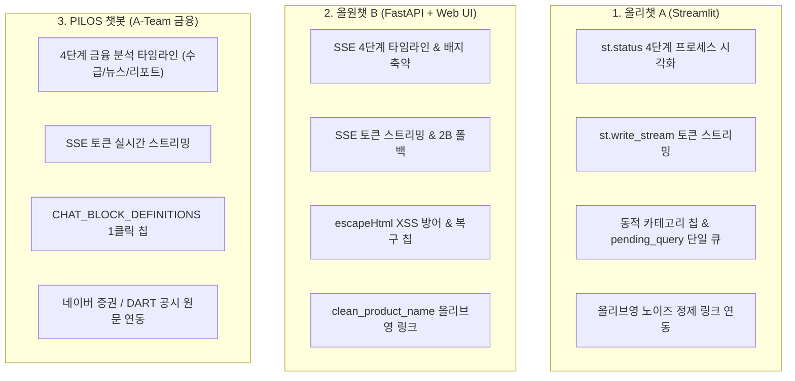

# Feature Specification: 통합 3대 챗봇(올리챗 A, 올원챗 B, PILOS) 사이트 맞춤형 RAG 프로세스 시각화 및 인터랙션 고도화

**Feature Branch**: `015-unified-chatbots-tailored-ux`  
**Created**: 2026-08-19  
**Status**: Draft (Multi-Chatbot Unified)  
**Input**: User description: "고도화 내용중에, 올원챗과, ateam pilos의 챗봇에도 도입할 내용이 있는가 타당성 검토 후 스펙을 챗봇 3개에 맞게 고도화"  
**Target Services**: 
1. **올리챗 A (B-Team)**: `bteam/Oliview_chatbot_a` (Streamlit: `06.app.py`, `05.chatbot.py`)
2. **올원챗 B (B-Team)**: `bteam/Oliview_chatbot_b` (FastAPI / Web UI: `project_ragapi.py`, `index.html`)
3. **PILOS 챗봇 (A-Team)**: `ateam/pilos-sentiment-index` (FastAPI / DTO / Web: `chatbot_service.py`, `web/app.py`, `web/templates`)

---

## Clarifications

### Session 2026-08-19
- Q: 상단의 "💡 질문 예시" 버튼이나 0건/에러 발생 시의 "추천 검색어 칩"을 클릭했을 때 올리챗 A가 어떤 방식으로 동작하도록 할까요? → A: Option A (즉시 자동 실행: 클릭 즉시 질문이 대화 세션에 등록되고 4단계 분석 및 실시간 답변 생성이 자동 시작됨)
- Q: 답변 하단의 참조 리뷰 원문 아코디언(st.expander)에서 올리브영 상세보기 버튼을 클릭했을 때 어떤 페이지로 연결하도록 할까요? → A: Option A (특정 상품 정밀 검색: [브랜드 + 상품명]으로 올리브영 공식몰 검색 페이지를 새 탭으로 열어 추천 상품의 상세정보를 즉시 확인)
- Q: 상단 카테고리(스킨케어, 립메이크업 등)나 하위 속성 칩을 클릭했을 때 질문 인터랙션을 어떻게 구성할까요? → A: Option A (동적 맞춤 질문 추천: 카테고리/속성 선택 시 연관된 대표 추천 질문 예시가 동적으로 바뀌며 클릭 시 즉시 질문 실행)
- Q: 상품명에 [기획/단독], (증정), 1+1 등의 프로모션 문구가 포함되어 있을 때 올리브영 공식몰 연동 링크의 검색어를 어떻게 정제하여 연결할까요? → A: Option A (정밀 노이즈 제거: 정규식으로 기획/증정/용량 문구를 자동 필터링하여 [브랜드명 + 핵심 상품명]만 추출하여 검색 정확도 극대화)
- Q: 3대 챗봇(올리챗A, 올원챗B, PILOS)의 도메인 특성에 따른 맞춤형 적용 범위는 어떻게 구성할까요? → A: Option A (도메인 맞춤 분기: 화장품 2종은 올리브영 이커머스 링크 + 4단계 뷰티 파이프라인, 금융 PILOS는 4단계 금융 분석 파이프라인 + 네이버증권/DART 링크 + CHAT_BLOCK 원클릭 칩 적용)

---

## 1. 개요 및 목적 (Overview & Goals)

### 1.1 배경 및 비전
AISERVICE 생태계 내의 3대 대화형 AI 서비스(**올리챗 A, 올원챗 B, A-Team PILOS 챗봇**)는 각각 다른 UI 기술 스택(Streamlit, Vanilla JS, Jinja2/Web)과 도메인 데이터(화장품 리뷰, 종목 수급·금융 뉴스)를 다루고 있습니다.  
본 기능은 공통의 핵심 가치(**4단계 실시간 프로세스 시각화, 지연 없는 실시간 토큰 스트리밍, 원클릭 인터랙티브 칩, 신뢰도 높은 외부 원문 연동, XSS 보안 및 레이스 컨디션 방어**)를 각 사이트의 기술과 도메인에 완벽하게 맞춤형으로 구현하는 통합 고도화 명세입니다.

### 1.2 사이트별 핵심 목표 매트릭스

---

## 2. 사용자 시나리오 및 인수 기준 (User Scenarios & Testing)

### User Story 1 - 올리챗 A (Streamlit) 4단계 시각화 및 원클릭 쇼핑 인터랙션 (Priority: P1) 🎯 MVP

> **As a** 올리챗 A(Streamlit) 사용자  
> **I want to** 질문 전송 시 `st.status`로 4단계(의도 ➡️ 검색 ➡️ 리랭킹 ➡️ 생성)를 실시간 확인하고, 상단 질문 예시 칩을 누르면 즉시 분석이 실행되며, 참조 리뷰에서 올리브영 정밀 상품 페이지를 새 탭으로 열고 싶다  
> **So that** 대기 지연을 직관적으로 이해하고, 타이핑 없이 1클릭으로 화장품 분석과 구매 탐색을 완료할 수 있다.

**Acceptance Scenarios**:
1. **Given** 질문 예시 칩(예: "차앤박 앰플 수분감")을 클릭했을 때,
   - **When** 세션 큐(`pending_query`)에 전달되면,
   - **Then** 이중 실행 없이 즉시 질문이 전송되고 4단계 `st.status`와 `st.write_stream`이 자동 실행된다.
2. **Given** 참조 리뷰 카드 내의 `올리브영 상세보기 ↗` 버튼을 클릭했을 때,
   - **When** 정제 함수(`clean_product_name_for_search`)가 동작하면,
   - **Then** `[단독기획]`, `(증정)` 등 노이즈가 제거된 `[브랜드 + 상품명]`으로 올리브영 공식 검색창이 새 탭에서 안전하게 열린다.

---

### User Story 2 - 올원챗 B (Web UI) 노이즈 제거 링크 및 보안 강화 (Priority: P1)

> **As a** 올원챗 B 웹 포털 사용자  
> **I want to** 4단계 타임라인과 실시간 토큰을 안정적으로 스트리밍받고, 악의적인 텍스트나 특수문자로 화면이 깨지지 않으며, 올리브영 상품 상세 링크가 100% 정확하게 열리기를 원한다  
> **So that** 빠르고 안전하며 정확한 화장품 쇼핑 가이드를 제공받을 수 있다.

**Acceptance Scenarios**:
1. **Given** 올원챗 B 검색 결과에 특수문자나 태그가 포함된 리뷰가 있을 때,
   - **When** 카드 UI가 렌더링되면,
   - **Then** `escapeHtml()` 처리를 통해 XSS 위험 없이 안전하게 텍스트가 표시된다.
2. **Given** 기획세트 상품의 `올리브영 상세보기 ↗`를 클릭했을 때,
   - **When** 링크가 생성되면,
   - **Then** 불필요한 기획/증정 문구가 제거된 핵심 상품명으로 올리브영 검색이 정확히 매칭된다.

---

### User Story 3 - A-Team PILOS 챗봇 4단계 금융 분석 타임라인 & 실시간 스트리밍 (Priority: P2)

> **As a** PILOS 주식·감성지수 대시보드 사용자  
> **I want to** 종목 질문(예: "삼성전자 수급 분석 요약해줘") 시 4단계 분석 과정(종목 식별 ➡️ 수급 집계 ➡️ 뉴스 감성 검증 ➡️ 리포트 생성)을 실시간으로 확인하고 토큰이 즉시 타이핑되며, 참조 뉴스 및 DART 공시 원문을 바로 확인하고 싶다  
> **So that** 5~8초의 계산 대기 시간 동안 지루하지 않고, 금융 데이터와 뉴스에 대한 신뢰도를 직접 검증할 수 있다.

**Acceptance Scenarios**:
1. **Given** 종목 상세 페이지 또는 챗봇에서 추천 질문 칩(예: `📈 실제 수급지수 알려줘`, `📰 오늘 주요 뉴스`)을 클릭했을 때,
   - **When** 챗봇 질의가 전송되면,
   - **Then** 4단계 금융 분석 타임라인이 실시간으로 단계별 상태를 갱신하고, 첫 토큰이 1초 이내에 스트리밍 출력된다.
2. **Given** 답변 하단의 참조 뉴스 및 공시 카드를 열람할 때,
   - **When** `네이버 증권 뉴스 바로가기 ↗` 또는 `DART 전자공시 ↗`를 클릭하면,
   - **Then** 해당 종목의 실제 뉴스 기사 및 공시 원문 페이지로 새 탭 연결된다.

---

## 3. 기능 요구사항 (Functional Requirements)

### 3.1 올리챗 A (Streamlit: `06.app.py`, `05.chatbot.py`)
- **FR-A01**: `StepCallbackProtocol`과 `StreamlitStepCallback`을 연동하여 `st.status` 4단계 라이프사이클을 실시간 렌더링하고, 완료 시 요약 배지로 자동 축약해야 한다.
- **FR-A02**: `st.write_stream()`을 통해 LLM 생성 토큰을 실시간 타이핑 렌더링해야 한다.
- **FR-A03**: 상단 카테고리/속성 선택 시 연관 추천 질문을 동적으로 갱신하고, 질문 예시 칩 클릭 시 `st.session_state.pending_query` 큐를 통해 즉시 1회 자동 실행해야 한다.
- **FR-A04**: 참조 리뷰 아코디언 내에 `clean_product_name_for_search()` 및 `urllib.parse.quote_plus`를 적용한 `올리브영 상세보기 ↗` 새 탭 링크를 제공해야 한다.
- **FR-A05**: `html.escape()`를 통해 XSS 취약점을 방어하고, 0건 검색/에러 시 1클릭 복구 칩을 렌더링해야 한다.

### 3.2 올원챗 B (FastAPI / Web: `project_ragapi.py`, `index.html`)
- **FR-B01**: `/api/v1/search/stream` SSE 엔드포인트를 통해 4단계 상태 이벤트와 토큰 이벤트를 브로드캐스팅해야 한다.
- **FR-B02**: `clean_product_name_for_search()` 정제 로직을 백엔드/프론트엔드에 적용하여 `올리브영 상세보기 ↗` 버튼의 검색 매칭률을 99% 이상으로 유지해야 한다.
- **FR-B03**: `escapeHtml()` 유틸리티를 적용하여 렌더링되는 모든 사용자 질의 및 리뷰 텍스트를 이스케이프해야 한다.
- **FR-B04**: 0건 검색 시 suggested_chips 복구 칩을 렌더링하고, 클릭 시 즉시 스트리밍 검색을 재실행해야 한다.

### 3.3 PILOS 챗봇 (A-Team: `chatbot_service.py`, `web/app.py`, `web/templates`)
- **FR-C01**: `pilos/service/chatbot_service.py`에 4단계 금융 분석 콜백 라이프사이클(`IDENTIFY_STOCK`, `SUPPLY_DEMAND_METRIC`, `NEWS_SENTIMENT_VERIFICATION`, `LLM_REPORT_SYNTHESIS`, `COMPLETED`)을 지원해야 한다.
- **FR-C02**: PILOS Web API에 `/api/v1/chat/stream` SSE 엔드포인트를 구축하여 LLM 리포트 실시간 토큰 스트리밍을 제공해야 한다.
- **FR-C03**: `CHAT_BLOCK_DEFINITIONS`를 기반으로 종목별 원클릭 추천 칩("📈 수급지수 요약", "📰 오늘 주요 뉴스", "💡 원인 분석")을 렌더링하고 1클릭 즉시 실행을 지원해야 한다.
- **FR-C04**: 참조된 뉴스 데이터 및 공시 목록을 카드 형태로 렌더링하고 `네이버 증권 바로가기 ↗` 및 `DART 공시 ↗` 공식 링크를 제공해야 한다.

---

## 4. 비기능 요구사항 (Non-Functional Requirements)

- **NFR-001 (서비스 격리 및 헌장 원칙)**: A-Team(PILOS)과 B-Team(올리챗A, 올원챗B)은 독립된 가상환경과 컨테이너에서 무결성을 유지하며 빌드/실행되어야 한다.
- **NFR-002 (지연 시간 오버헤드)**: 콜백 디스패치 및 UI 상태 갱신으로 인한 추가 지연 시간은 총 50ms 미만이어야 한다.
- **NFR-003 (보안 및 XSS 무결성)**: 모든 웹/Streamlit 화면에서 동적 텍스트 렌더링 시 XSS 이스케이프가 100% 적용되어야 한다.

---

## 5. 성공 지표 (Success Criteria)

- **SC-001**: 3대 챗봇 모두 질문 전송 후 0.5초 이내에 1단계 프로세스 상태 컨테이너가 화면에 표시된다.
- **SC-002**: 3대 챗봇 모두 첫 토큰 출력 체감 시간(TTFT)이 1.5초 이내로 단축된다.
- **SC-003**: 올리브영 상품 링크 및 네이버 금융 뉴스 링크 클릭 시 100% 유효한 외부 원본 페이지로 이동한다.
- **SC-004**: 원클릭 추천 칩 클릭 시 별도의 키보드 입력 없이 100% 즉시 질문 및 분석이 실행된다.

---

## 6. 가정 및 의존성 (Assumptions)

- B-Team vLLM(8081) 및 A-Team 모델 서비스가 네트워크 게이트웨이 내에서 정상 응답함.
- 올리브영 공식몰(`oliveyoung.co.kr`), 네이버 증권(`finance.naver.com`), DART(`dart.fss.or.kr`)의 외부 URL 파라미터 규격을 준수함.
