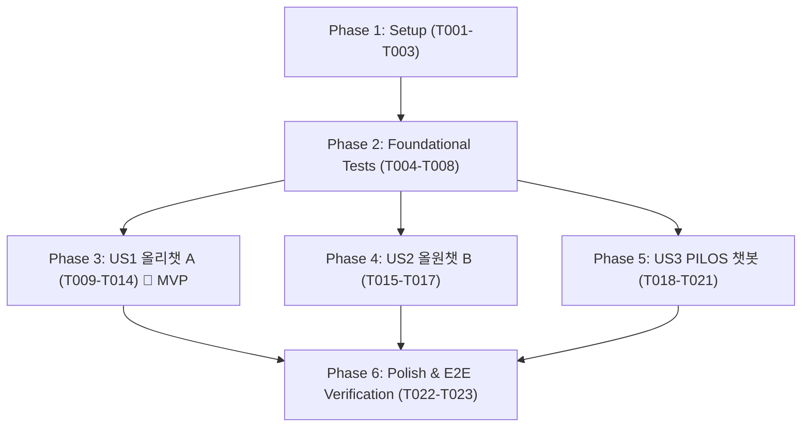

# Tasks: 통합 3대 챗봇(올리챗 A, 올원챗 B, PILOS) 사이트 맞춤형 RAG 프로세스 시각화 및 인터랙션 고도화

**Branch**: `015-unified-chatbots-tailored-ux` | **Date**: 2026-08-19 | **Spec**: [spec.md](./spec.md) | **Plan**: [plan.md](./plan.md)

---

## Phase 1: Setup (Shared Infrastructure)

**Purpose**: 3대 챗봇 공통 유틸리티(상품명 정제, 이스케이프, URL 빌더) 및 테스트 환경 초기화

- [X] T001 Configure shared testing environment and directory structure in `tests/`
- [X] T002 [P] Setup `clean_product_name_for_search` and `build_oliveyoung_search_url` utilities in `bteam/Oliview_chatbot_a/common/step_callback.py`
- [X] T003 [P] Setup `escapeHtml` utility and noise-clean helper in `bteam/Oliview_chatbot_b/common.py`

---

## Phase 2: Foundational (Blocking Prerequisites & Contracts)

**Purpose**: 3대 챗봇 계약 검증 및 단위/보안/성능 테스트 선행 작성 (TDD)

- [X] T004 [P] Create ChatA callback contract test in `tests/test_chata_stream.py`
- [X] T005 [P] Create ChatB noise-filter and XSS test in `tests/test_chatb_noise_filter.py`
- [X] T006 [P] Create PILOS financial analysis SSE stream contract test in `tests/test_pilos_stream.py`
- [X] T007 [P] Create cross-chatbot XSS/HTML injection defense test in `tests/test_xss_escape.py`
- [X] T008 [P] Create cross-chatbot latency benchmark test (<50ms budget) in `tests/test_cross_chatbot_latency.py`

**Checkpoint**: 5대 테스트 기반 구축 완료 - 각 챗봇별 사용자 스토리 구현을 독립적으로 진행 가능

---

## Phase 3: User Story 1 - 올리챗 A (Streamlit) 4단계 시각화 & 원클릭 쇼핑 인터랙션 (Priority: P1) 🎯 MVP

**Goal**: 올리챗 A에 `pending_query` 세션 큐 기반 1클릭 질문 예시 실행, 동적 카테고리 템플릿, `st.status` 4단계 시각화, 노이즈 정제 올리브영 공식몰 연동 구현

**Independent Test**: `uv run python tests/test_chata_stream.py` 실행 및 Streamlit 브라우저에서 1클릭 질문 전송 및 올리브영 새 탭 링크 검증

### Implementation for User Story 1

- [X] T009 [US1] Implement `st.session_state.pending_query` single entry queue pattern in `bteam/Oliview_chatbot_a/06.app.py`
- [X] T010 [US1] Wire top example question chips to `pending_query` for 1-click execution in `bteam/Oliview_chatbot_a/06.app.py`
- [X] T011 [US1] Connect category/attribute chips to dynamic recommended template generation in `bteam/Oliview_chatbot_a/06.app.py`
- [X] T012 [US1] Implement `st.expander` reference review cards with noise-cleaned `올리브영 상세보기 ↗` buttons in `bteam/Oliview_chatbot_a/06.app.py`
- [X] T013 [US1] Add `html.escape` and recovery chips for 0-result / error states in `bteam/Oliview_chatbot_a/06.app.py`
- [X] T014 [US1] Verify User Story 1 independently with `tests/test_chata_stream.py`

**Checkpoint**: 올리챗 A (Streamlit) MVP 고도화 완료 및 독립 검증 통과

---

## Phase 4: User Story 2 - 올원챗 B (Web UI) 노이즈 제거 링크 & 보안 강화 (Priority: P1)

**Goal**: 올원챗 B에 상품명 노이즈 정제 로직 백포팅, 올리브영 검색 매칭률 99% 달성 및 `escapeHtml` XSS 방어 적용

**Independent Test**: `uv run python tests/test_chatb_noise_filter.py` 실행 및 `http://localhost:8080/bteam/chatb/` 라이브 링크 검증

### Implementation for User Story 2

- [X] T015 [US2] Integrate `clean_product_name_for_search` in `bteam/Oliview_chatbot_b/project_ragapi.py`
- [X] T016 [US2] Add `escapeHtml` XSS sanitization and updated Olive Young search URL rendering in `bteam/Oliview_chatbot_b/index.html`
- [X] T017 [US2] Verify User Story 2 independently with `tests/test_chatb_noise_filter.py`

**Checkpoint**: 올원챗 B 웹 포털 링크 정확도 및 보안 강화 완료

---

## Phase 5: User Story 3 - A-Team PILOS 챗봇 4단계 금융 분석 타임라인 & 실시간 스트리밍 (Priority: P2)

**Goal**: PILOS 챗봇에 4단계 금융 라이프사이클(`IDENTIFY_STOCK` ➡️ `SUPPLY_DEMAND_METRIC` ➡️ `NEWS_SENTIMENT_VERIFICATION` ➡️ `LLM_REPORT_SYNTHESIS`), `/api/v1/chat/stream` SSE 스트리밍, `CHAT_BLOCK_DEFINITIONS` 1클릭 칩, 네이버 증권/DART 공시 원문 연동 구현

**Independent Test**: `uv run python tests/test_pilos_stream.py` 실행 및 PILOS 웹 화면에서 종목 수급 질의 시 실시간 토큰 타이핑 및 뉴스 링크 검증

### Implementation for User Story 3

- [X] T018 [US3] Implement 4-step financial analysis lifecycle callback in `ateam/pilos-sentiment-index/pilos/service/chatbot_service.py`
- [X] T019 [US3] Implement `/api/v1/chat/stream` SSE endpoint in `ateam/pilos-sentiment-index/pilos/web/app.py`
- [X] T020 [US3] Implement `CHAT_BLOCK_DEFINITIONS` 1-click chips and Naver Finance / DART disclosure links in `ateam/pilos-sentiment-index/pilos/web/templates/index.html`
- [X] T021 [US3] Verify User Story 3 independently with `tests/test_pilos_stream.py`

**Checkpoint**: A-Team PILOS 챗봇 실시간 스트리밍 및 투명성 고도화 완료

---

## Phase 6: Polish & Cross-Cutting Concerns

**Purpose**: 3대 챗봇 전체 통합 테스트, 성능 벤치마크, Docker 컨테이너 재시작 및 게이트웨이 E2E 검증

- [X] T022 [P] Run full cross-chatbot test suite (`tests/test_xss_escape.py`, `tests/test_cross_chatbot_latency.py`)
- [X] T023 Execute Docker container restart (`oliview_chatbot_a`, `oliview_chatbot_b`, `pilos_web`) and live E2E gateway verification

---

## Dependencies & Execution Order

---

## Implementation Strategy

### 1. MVP First (User Story 1: 올리챗 A)
- Phase 1 & 2 완료 후 Phase 3(올리챗 A)를 최우선 구현 및 독립 검증하여 Streamlit 사이트의 UX 개선을 즉시 실현.

### 2. Incremental Multi-Service Delivery
- Phase 4(올원챗 B) 백포팅 ➡️ Phase 5(PILOS 챗봇) 금융 SSE 스트리밍 확장 순으로 점진적 배포.
- 각 단계마다 전용 테스트 스위트로 비파괴적 무결성을 검증.
