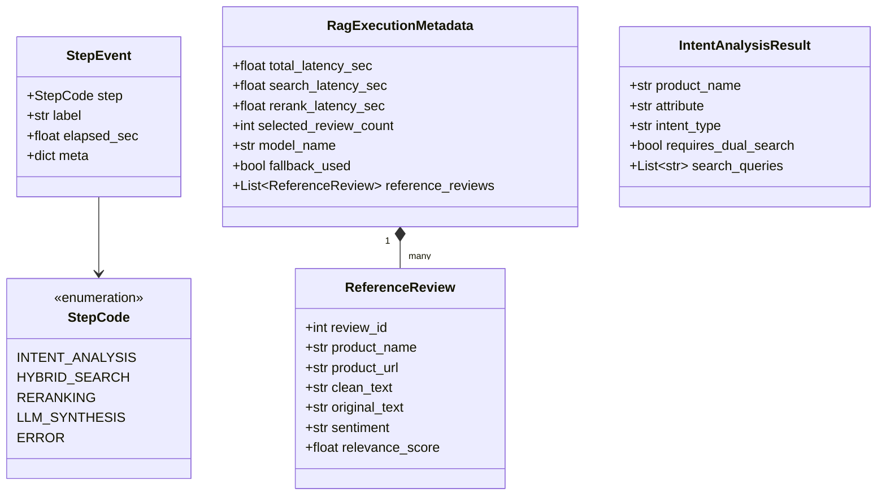

# Unified Data Model & Schemas: 016-system-codebase-refactoring

**Feature**: [spec.md](./spec.md) | **Date**: 2026-08-19 | **Status**: Complete

---

## 1. Core Data Models (`oliview_core.types`)



---

## 2. Model Definitions in Python

### 2.1 `StepEvent` & `StepCode`
```python
from enum import Enum
from dataclasses import dataclass, field
from typing import Any, Dict, Optional

class StepCode(str, Enum):
    INTENT_ANALYSIS = "INTENT_ANALYSIS"
    HYBRID_SEARCH = "HYBRID_SEARCH"
    RERANKING = "RERANKING"
    LLM_SYNTHESIS = "LLM_SYNTHESIS"
    ERROR = "ERROR"

@dataclass
class StepEvent:
    step: StepCode
    label: str
    elapsed_sec: float = 0.0
    meta: Dict[str, Any] = field(default_factory=dict)
```

### 2.2 `ReferenceReview` & `RagExecutionMetadata`
```python
from typing import List, Optional
from pydantic import BaseModel, Field

class ReferenceReview(BaseModel):
    review_id: int
    product_name: str
    product_url: str
    clean_text: str
    original_text: str = ""
    sentiment: str = "NEUTRAL"
    relevance_score: float = 0.0

class RagExecutionMetadata(BaseModel):
    total_latency_sec: float = 0.0
    search_latency_sec: float = 0.0
    rerank_latency_sec: float = 0.0
    selected_review_count: int = 0
    model_name: str = "qwen3.5-4b"
    fallback_used: bool = False
    reference_reviews: List[ReferenceReview] = Field(default_factory=list)
```

---

## 3. Configuration Model (`oliview_core.config`)

```python
from pydantic import BaseModel, Field
import os

class CoreSettings(BaseModel):
    # Model Gateway Configuration
    server_host: str = Field(default_factory=lambda: os.getenv("SERVER_HOST", "http://vllm-serv-gateway"))
    main_port: int = Field(default_factory=lambda: int(os.getenv("MAIN_PORT", "8081")))
    embed_port: int = Field(default_factory=lambda: int(os.getenv("EMBED_PORT", "8090")))
    rerank_port: int = Field(default_factory=lambda: int(os.getenv("RERANK_PORT", "8091")))
    
    # Models
    fast_llm_model: str = Field(default_factory=lambda: os.getenv("FAST_LLM_MODEL", "qwen3.5-2b"))
    synthesis_llm_model: str = Field(default_factory=lambda: os.getenv("SYNTHESIS_LLM_MODEL", "qwen3.5-4b"))
    rerank_model: str = Field(default_factory=lambda: os.getenv("RERANK_MODEL", "bge-reranker-v2-m3"))
    
    # MySQL Database
    db_host: str = Field(default_factory=lambda: os.getenv("DB_HOST", "bteam_db"))
    db_port: int = Field(default_factory=lambda: int(os.getenv("DB_PORT", "3306")))
    db_user: str = Field(default_factory=lambda: os.getenv("DB_USER", "gp123"))
    db_password: str = Field(default_factory=lambda: os.getenv("DB_PASSWORD", "GP123!"))
    db_name: str = Field(default_factory=lambda: os.getenv("DB_NAME", "oliview_project"))
    
    # Timeouts & Limits
    timeout_search_sec: float = 3.0
    timeout_rerank_sec: float = 2.0
    timeout_llm_sec: float = 10.0
```
