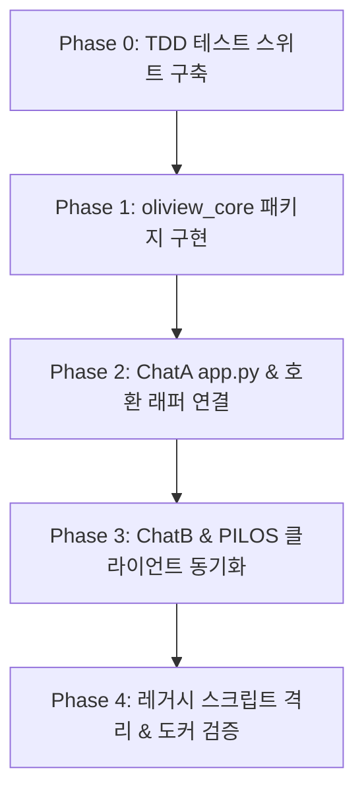

# Implementation Plan: 016-system-codebase-refactoring (통합 시스템 코드베이스 리팩토링 및 아키텍처 현대화)

**Branch**: `016-system-codebase-refactoring` | **Date**: 2026-08-19 | **Spec**: [spec.md](./spec.md)

**Input**: Feature specification from `specs/016-system-codebase-refactoring/spec.md`

---

## 1. Summary

본 리팩토링 계획은 B팀 올리뷰 챗봇 A의 레거시 순번 파일(`01~06`)과 취약한 `importlib` 동적 로더를 `bteam/oliview_core/` 표준 파이썬 패키지로 전환하고, A팀(PILOS)과 B팀(ChatA, ChatB) 간 중복 작성된 모델 게이트웨이 HTTP 클라이언트를 동기/비동기 이중 `AiGatewayClient`로 통합합니다. 
기존 `06.02.app.py` 및 `06.app.py`는 신규 코어 패키지를 호출하는 하위 호환 래퍼로 전환하여 Docker 런타임 및 외부 엔트리포인트를 100% 무중단 보존합니다.

---

## 2. Technical Context

- **Language/Version**: Python 3.12 / 3.11
- **Primary Dependencies**: `streamlit`, `fastapi`, `httpx`, `pydantic`, `sentence-transformers`, `faiss`, `pymysql`
- **Storage**: MySQL 8.0 (`bteam_db`, `pilos-db`), Faiss Local Vector Store (`bteam/Oliview_chatbot_a/faiss_index`)
- **Testing**: `pytest`, `pytest-asyncio`
- **Target Platform**: Docker Linux Container / Nginx Gateway (`aiservice-gateway`)
- **Project Type**: Modular AI Service Architecture (Package + Web Services)
- **Performance Goals**:
  - RAG 검색 & 리랭킹 (Steps 1~3): **<= 150ms** (GPU 원격 가속)
  - 로컬 Fallback 시: **<= 3.0s** Graceful Degradation
  - First Token Latency (TTFT): **<= 200ms**
- **Constraints**:
  - GPU VRAM 상시 상주 프로세스(`8089`, `8090`, `8091`) 100% 보존
  - Streamlit `st.status` 실시간 시각화 컨테이너 및 FastAPI SSE 스트리밍 UI 100% 무결성 유지
- **Scale/Scope**: 7개 핵심 모듈 리팩토링, 4개 래퍼 파일, 2개 도커 서비스 동기화

---

## 3. Constitution Check

*GATE: All core principles from `.specify/memory/constitution.md` satisfied.*

- [x] **I. Language Policy**: All documentation, code comments, and test descriptions written in Korean.
- [x] **II. Test-First (TDD)**: Comprehensive unit/integration tests created before modifying execution shims.
- [x] **III. Service Modularity**: `bteam/oliview_core` cleanly isolated within B-Team domain with clear boundaries.
- [x] **IV. Observability**: Structured JSON execution metadata (`RagExecutionMetadata`) and step logging.
- [x] **V. Simplicity (YAGNI)**: Minimal essential refactoring without speculative abstractions.

---

## 4. Project Structure & Code Layout

```text
c:\AISERVICE\
├── bteam/
│   ├── oliview_core/                 # [NEW] 표준 통합 RAG 코어 패키지
│   │   ├── __init__.py
│   │   ├── config.py                 # 환경변수 & 설정 관리 (Settings)
│   │   ├── types.py                  # Pydantic/Dataclass 스키마 모델
│   │   ├── client.py                 # vLLM/임베딩/리랭커 동기+비동기 클라이언트
│   │   ├── db.py                     # MySQL 커넥션 팩토리 & 쿼리 유틸
│   │   ├── sanitizer.py              # 상품명 매칭, 노이즈 정제, URL 생성
│   │   ├── retrieval.py              # Faiss + BM25 하이브리드 검색 엔진
│   │   ├── rerank.py                 # BGE 리랭커 (GPU 원격 + 로컬 Fallback)
│   │   ├── callback.py               # Streamlit/SSE StepCallback 규격
│   │   └── pipeline.py               # 2-Stage RAG 오케스트레이터
│   ├── Oliview_chatbot_a/
│   │   ├── app.py                    # [NEW] 표준화된 Streamlit 메인 앱
│   │   ├── 06.02.app.py              # [MODIFY] app.py를 호출하는 하위 호환 래퍼
│   │   ├── 06.app.py                 # [MODIFY] app.py를 호출하는 하위 호환 래퍼
│   │   ├── 05.chatbot.py             # [MODIFY] pipeline.py를 호출하는 하위 호환 래퍼
│   │   └── legacy_archive/           # [NEW] 레거시 순번 파일(01~05.01) 보관 격리
│   └── Oliview_chatbot_b/
│       └── project_ragapi.py         # [MODIFY] oliview_core.client & types 활용
├── tests/
│   ├── unit/
│   │   ├── test_oliview_core_imports.py
│   │   └── test_ai_gateway_client.py
│   └── integration/
│       └── test_pipeline_e2e.py
└── specs/016-system-codebase-refactoring/
    ├── spec.md
    ├── plan.md
    ├── research.md
    ├── data-model.md
    ├── quickstart.md
    └── contracts/
        ├── core_pipeline_contract.md
        ├── ai_gateway_client_contract.md
        └── streamlit_callback_contract.md
```

---

## 5. Implementation Phases



- **Phase 0**: 단위/통합 테스트 스위트 작성 (`tests/unit/`, `tests/integration/`)
- **Phase 1**: `bteam/oliview_core/` 8개 핵심 모듈 구축 (`config`, `types`, `client`, `db`, `sanitizer`, `retrieval`, `rerank`, `pipeline`)
- **Phase 2**: `Oliview_chatbot_a/app.py` 단일화 및 `06.02.app.py`, `05.chatbot.py` 하위 호환 래퍼 전환
- **Phase 3**: `Oliview_chatbot_b/project_ragapi.py`의 공통 클라이언트 및 데이터 모델 연동
- **Phase 4**: `legacy_archive/` 격리, `docker-compose.yml` `PYTHONPATH` 검증, 컨테이너 재기동 및 E2E 실서비스 검증
