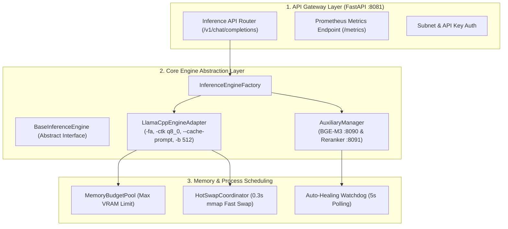

# Implementation Plan: 018-llm-server-refactoring-optimization (2026 최신 트렌드 기반 LLM 서빙 게이트웨이 현대화 및 추론 성능 최적화)

**Branch**: `018-llm-server-refactoring-optimization`
**Feature Spec**: [spec.md](./spec.md)
**Created**: 2026-08-19
**Status**: In Progress

---

## 1. Technical Context

- **LLM Gateway Service**: `model_gateway / vllm-serv-gateway` (FastAPI Server on Port 8081, Embedding Port 8090, Reranker Port 8091)
- **Core Engine Subsystem**: `model_gateway/src/core/` (`llama_manager.py`, `process_manager.py`, `auxiliary_manager.py`, `gpu_detector.py`, `config_manager.py`)
- **API Routing Subsystem**: `model_gateway/src/api/routes/` (`inference_api.py`, `dashboard_api.py`, `health_api.py`)
- **Client Calling Services**: `bteam/oliview_core/client.py`, `bteam/Oliview_chatbot_b/project_ragapi.py`, `ateam/pilos-sentiment-index/pilos/service/rag_service.py`
- **Target Hardware**: NVIDIA GeForce GTX 1070 (8,192 MiB VRAM, Compute Capability 6.1)
- **Optimization Flags**: FlashAttention (`-fa`), Prompt Caching (`--cache-prompt`), KV Cache Quantization (`-ctk q8_0 -ctv q8_0`), Chunked Prefill (`-b 512 -ub 256`)

---

## 2. Constitution Check

- [x] **I. 언어 및 커뮤니케이션 정책**: 모든 기술 문서, 코드 주석, 설정 필드 설명을 한국어로 표준화.
- [x] **II. TDD 및 테스트 우선주의**: VRAM 추정, 컨텍스트 검증, 문법 제약(JSON Schema), 핫스왑 라우팅 단위/통합 테스트를 선행 작성 후 구현.
- [x] **III. 서비스 모듈화 및 격리**: `BaseInferenceEngine` 추상 클래스를 신설하여 llama.cpp, vLLM, 보조 엔진의 결합도를 낮추고 모듈화.
- [x] **IV. 관측 가능성 및 로깅**: 프로메테우스 호환 메트릭스 및 실시간 TTFT, TPS, VRAM 점유량 대시보드 연동.
- [x] **V. 단순성 및 점진적 진화 (YAGNI)**: 불필요한 프레임워크 전면 교체 대신 검증된 고성능 플래그 및 클린 아키텍처 패턴으로 경량 최적화.

---

## 3. Architecture & Proposed Changes

---

## 4. Phase-by-Phase Plan

### Phase 0: Research & Benchmarking
- [research.md](./research.md): 2026 최신 llama.cpp/vLLM 추론 플래그, FlashAttention Pascal 호환성, KV Cache Q8_0 압축률 정리.

### Phase 1: Design & Contract Definition
- [data-model.md](./data-model.md): 엔진 설정 스키마 및 메트릭 데이터 모델.
- [contracts/llm_inference_engine_contract.md](./contracts/llm_inference_engine_contract.md): `BaseInferenceEngine` 및 API 인터페이스 계약.
- [quickstart.md](./quickstart.md): VRAM 실측 및 벤치마크 검증 가이드.

### Phase 2: Core Refactoring & Optimizations
1. `model_gateway/src/core/base_engine.py`: `BaseInferenceEngine` 추상 인터페이스 정의.
2. `model_gateway/src/core/process_manager.py`: `-fa`, `--cache-prompt`, `-ctk q8_0`, `-ctv q8_0`, `-b 512 -ub 256` 플래그 주입 및 VRAM 계산기 갱신.
3. `model_gateway/config/model_catalog.json` & `model_context_profiles.json`: 2B (`n_ctx=16,384`), 4B (`n_ctx=12,288`) 프로필 갱신.
4. `model_gateway/src/api/routes/inference_api.py`: `response_format` JSON Schema 디코딩 및 Prometheus `/metrics` 라우트 강화.
5. `model_gateway/src/api/routes/dashboard_api.py`: 실시간 VRAM, TTFT, TPS 메트릭 집계 고도화.
