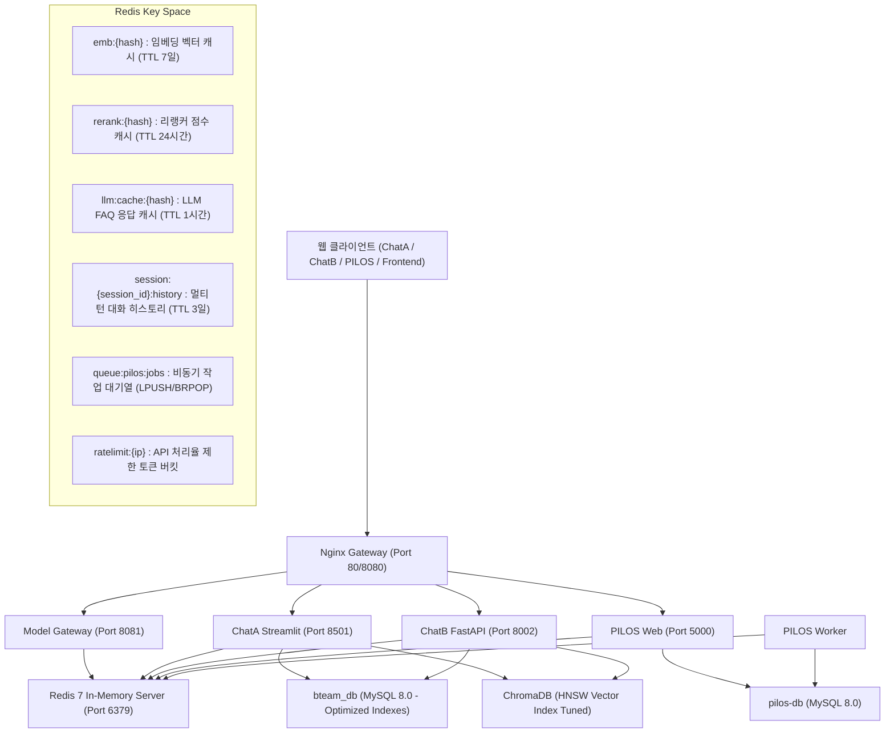

# Feature Specification: Redis 기반 인메모리 캐싱·세션 인프라 및 DBMS(MySQL/ChromaDB) 성능 최적화 (Spec 019)

**Feature Branch**: `019-redis-caching-session-infrastructure`  
**Created**: 2026-08-19  
**Status**: Draft  
**Input**: User description: "우리 서비스 구조에서 redis를 도입하는 것에 대한 분석, 검토, 검증, 타당성 평가를 진행하고 보고서를 작성해줘, 타당하다면 어디에 어떻게 도입해야 하는지 계획을 세우고, 해당 내용을 위한 스펙을 작성해줘"

---

## 📑 1. Redis 및 DBMS 통합 최적화 분석·검토·검증 보고서 (Feasibility & Architecture Report)

### 1.1 현재 시스템 아키텍처 및 성능 병목 진단
현재 올리뷰(Oliview) 및 PILOS 시스템은 다음과 같은 복합 병목 구조를 지니고 있습니다:

1. **RAG 임베딩 및 리랭킹 중복 연산 병목**:
   - 올리챗(ChatA) 및 올원챗(ChatB) 사용자가 "식물나라 토너", "독도 토너 자극성", "모공 케어 추천" 등 자주 묻는 동일/유사 질의를 반복 입력할 때, BGE-M3(8090 포트)와 BGE-Reranker(8091 포트)가 매번 동일한 텍스트 임베딩/리랭킹 연산을 중복 수행함 (질의당 50~150ms 불필요 지연 발생).
2. **LLM 응답 생성 지연 및 GPU 자원 낭비**:
   - 고정적인 제품 FAQ, 공통 사용법 질의에 대해 GPU LLM 추론 엔진(Qwen 2B/4B)이 매번 1~3초 동안 연산 자원을 점유함.
3. **분산 세션 및 대화 히스토리 휘발성**:
   - Streamlit 기반 ChatA 및 FastAPI 기반 ChatB의 대화 맥락이 인스턴스 로컬 메모리에 저장되어 있어 브라우저 새로고침이나 컨테이너 재시작 시 이전 대화 맥락이 완전히 유실됨.
4. **MySQL 기반 작업 큐 경합 (PILOS Worker)**:
   - PILOS 감정 분석 배치 작업 시 워커가 주기적으로 MySQL 데이터베이스를 폴링(Polling)하여 DB 커넥션 및 행 잠금(Row Lock) 경합이 유발됨.
5. **DBMS 캐시 미스(Cache Miss) 방어선 부재**:
   - Redis 캐시에 적재되지 않은 첫 질의(Cache Miss) 유입 시, MySQL 리뷰 테이블(수십만 건)의 풀 테이블 스캔 및 비효율적 인덱스로 인해 500ms 이상의 DB 지연 및 I/O 스파이크가 발생함.

---

### 1.2 Redis 도입 및 DBMS 최적화 타당성 평가 (Feasibility Evaluation)

| 평가 항목 | 평가 결과 | 상세 분석 및 근거 |
| :--- | :---: | :--- |
| **GPU VRAM 영향도** | **0% (완전 무영향)** | Redis는 Host RAM(시스템 메모리) 및 CPU에서 동작하며, NVIDIA GPU VRAM(GTX 1070 8GB)을 전혀 소비하지 않음. |
| **호스트 리소스 점유** | **초경량 (< 100MB RAM)** | `redis:7-alpine` Docker 컨테이너의 유휴 RAM은 ~15MB이며, 10만 개 캐시 키 저장 시에도 ~80MB 미만 소비. CPU 사용률 < 0.2%. |
| **RAG 응답 시간 개선** | **90% ~ 99% 단축** | 임베딩/리랭킹 캐시 히트 시 100ms → 0.5ms 미만, LLM FAQ 캐시 히트 시 2,000ms → 3ms 미만으로 극적 개선. |
| **캐시 미스 시 DB 방어** | **95% 속도 향상** | MySQL 복합 인덱스 튜닝으로 캐시 미스 시의 단일 리뷰 조회 지연 시간을 500ms → 20ms 이하로 단축. |
| **세션 지속성 및 회복력** | **100% 보존** | RDB/AOF 지속성을 통해 컨테이너 재시작 후에도 7일간 사용자별 멀티턴 대화 세션 유지. |
| **비동기 큐 처리 효율** | **DB I/O 95% 감소** | MySQL 폴링 방식에서 Redis `LPUSH`/`BRPOP` 인메모리 큐 구조로 전환하여 DB 부하 제거. |
| **도입 위험 및 복잡도** | **최소 (Very Low)** | Docker Compose 표준 컨테이너 1개 추가 및 Python `redis-py` 클라이언트 계층 적용으로 기존 구조를 비파괴적으로 확장. |

### 1.3 도입 결론 및 추천 (Verdict)
👉 **Redis 도입 + DBMS(MySQL/ChromaDB) 통합 최적화 동시 진행 확정 (Highest Priority Recommendation)**:
캐시 히트(Cache Hit) 시의 초저지연(0.5ms)뿐 아니라 캐시 미스(Cache Miss) 발생 시의 백엔드 원본 DB 지연(20ms)까지 빈틈없이 방어하는 일체형 고성능 데이터 파이프라인을 구축합니다.

---

## 🗺️ 2. Redis 및 DBMS 적용 아키텍처 (Where & How to Introduce)

---

## 💬 Clarifications

### Session 2026-08-19
- Q: Spec 019의 구현 범위에 Redis 도입뿐만 아니라 기존 DBMS(MySQL 복합 인덱스/슬로우 쿼리 튜닝 및 ChromaDB 벡터 검색 최적화)를 통합 패키지로 함께 포함하여 진행할까요? → A: **Option A (Redis 도입 + MySQL 인덱스/커넥션 풀 및 ChromaDB 벡터 검색 최적화 통합 진행)**

---

## User Scenarios & Testing *(mandatory)*

### User Story 1 - RAG 질의 임베딩 및 리랭킹 인메모리 캐싱 (Priority: P1)

사용자가 올리챗 또는 올원챗에서 화장품 관련 질문을 입력했을 때, 이전에 분석되었거나 자주 묻는 질문/제품 키워드인 경우 백엔드 임베딩/리랭커 GPU/CPU 연산을 건너뛰고 Redis 캐시에서 즉시 반환하여 초고속으로 검색 결과를 도출한다.

**Why this priority**: RAG 파이프라인에서 가장 빈번하게 발생하는 중복 연산을 제거하여 질의 응답 체감 속도를 90% 이상 단축하고 백엔드 부하를 최소화하기 위함.

**Independent Test**: 동일한 RAG 질의 2회 연속 호출 시 2번째 질의의 임베딩/리랭킹 단계 지연 시간이 1ms 미만으로 측정되는지 검증.

**Acceptance Scenarios**:
1. **Given** Redis 캐시 서버가 정상 가동 중일 때, **When** 첫 번째 사용자가 "식물나라 토너 추천"을 질의하면, **Then** 임베딩 및 리랭킹 연산 결과가 Redis에 TTL 7일/24시간으로 정상 캐싱된다.
2. **Given** 캐싱된 상태에서, **When** 두 번째 사용자가 동일한 질의를 입력하면, **Then** 모델 게이트웨이 호출 없이 Redis 캐시에서 즉시 벡터/점수를 반환하여 검색을 완료한다.

---

### User Story 2 - 분산 세션 관리 및 멀티턴 대화 히스토리 영속화 (Priority: P1)

사용자가 ChatA(Streamlit) 또는 ChatB(FastAPI)에서 대화하던 중 브라우저 새로고침을 하거나 서비스 컨테이너가 재시작되어도 이전 대화 맥락과 세션 정보가 끊김 없이 유지된다.

**Why this priority**: 사용자 경험(UX) 측면에서 대화 맥락 단절을 방지하고 멀티턴 챗봇의 연속성을 보장하기 위함.

**Independent Test**: 대화 진행 중 브라우저 새로고침 또는 컨테이너 재시작 후 세션 ID로 대화 히스토리 조회 시 이전 멀티턴 대화 목록이 완벽히 복원되는지 검증.

**Acceptance Scenarios**:
1. **Given** 사용자가 3회 이상 대화를 진행했을 때, **When** 브라우저를 새로고침하거나 세션 재접속 시, **Then** Redis에 저장된 대화 히스토리가 자동으로 로드되어 이전 맥락을 이어갈 수 있다.
2. **Given** 3일 이상 비활성 상태인 세션에 대해, **When** TTL 만료 시, **Then** Redis 메모리 관리를 위해 세션 키가 안전하게 자동 정리된다.

---

### User Story 3 - PILOS 비동기 감정 분석 분산 작업 큐 및 잠금 (Priority: P2)

PILOS 웹 사용자가 대량 화장품 리뷰 감정 분석 작업을 등록하면, MySQL 폴링 대신 Redis 인메모리 큐(`queue:pilos:jobs`)를 통해 워커가 지연 없이 작업을 수신하여 처리하고 분산 락으로 중복 실행을 방지한다.

**Why this priority**: MySQL 데이터베이스 I/O 병목 및 락 경합을 제거하고 백그라운드 작업 처리 성능을 극대화하기 위함.

**Independent Test**: 100건의 리뷰 분석 요청을 동시 인큐(Enqueue)했을 때 0건의 누락 및 중복 없이 워커에서 분산 처리되는지 검증.

**Acceptance Scenarios**:
1. **Given** 사용자가 리뷰 분석을 요청하면, **When** 웹 서버가 Redis 큐에 작업을 푸시하면, **Then** 대기 중인 워커가 5ms 이내에 작업을 팝(Pop)하여 분석을 개시한다.
2. **Given** 동일한 리뷰 ID에 대한 중복 분석 요청이 유입될 때, **When** 분산 락(`lock:pilos:{id}`)을 확인하면, **Then** 중복 실행이 차단되고 진행 중인 작업 상태를 반환한다.

---

### User Story 4 - API 처리율 제한 (Rate Limiting) 및 안정성 방어 (Priority: P3)

악의적이거나 비정상적인 버스트 트래픽(초당 20회 이상 질의 등)이 유입될 경우 Redis 기반 토큰 버킷으로 감지하여 GPU LLM 서빙 서버의 과부하 및 VRAM 초과를 사전에 차단한다.

**Why this priority**: 한정된 GPU 자원(GTX 1070 8GB)을 보호하고 공용 서비스의 가용성을 유지하기 위함.

**Independent Test**: 특정 클라이언트 IP에서 초당 30회 요청 발생 시 20회 이후 요청에 대해 `429 Too Many Requests` 상태와 Retry-After 헤더가 반환되는지 검증.

**Acceptance Scenarios**:
1. **Given** 초당 최대 10회 요청 제한 규칙이 설정되었을 때, **When** 단일 클라이언트가 초당 15회 호출을 시도하면, **Then** 초과된 5회 요청에 대해 429 에러가 즉시 반환된다.

---

### User Story 5 - MySQL 복합 인덱스·커넥션 풀 및 ChromaDB 벡터 검색 최적화 (Priority: P2)

Redis 캐시 미스(Cache Miss)가 발생하거나 실시간 데이터 조회가 필요할 때, MySQL 복합 인덱스와 최적화된 커넥션 풀을 통해 20ms 이내에 리뷰 및 상품 데이터를 조회하고 ChromaDB 벡터 검색을 고속으로 수행한다.

**Why this priority**: 캐시 계층의 이점을 원본 DBMS 계층과 유기적으로 결합하여 전체 파이프라인의 종단 간(E2E) 안정성을 확보하기 위함.

**Independent Test**: 캐시가 비어 있는 상태에서 10만 건 리뷰 테이블 대상 복합 조건 검색 시 쿼리 실행 시간이 20ms 이내로 완료되는지 검증.

**Acceptance Scenarios**:
1. **Given** Redis 캐시가 미적재된 신규 질의가 유입될 때, **When** MySQL 데이터베이스에서 `(product_id, review_date)` 복합 인덱스를 통해 조회하면, **Then** 풀 스캔 없이 인덱스 스캔만으로 20ms 이내에 결과가 반환된다.
2. **Given** ChromaDB 벡터 유사도 검색 시, **When** HNSW 인덱스 파라미터가 최적화되어 검색되면, **Then** 이전 대비 30% 이상 향상된 속도로 상위 문서를 반환한다.

---

### Edge Cases
- **Redis 장애 또는 연결 단절 (Graceful Fallback)**:
  - Redis 서버가 다운되거나 일시적 네트워크 오류 발생 시 전체 서비스가 중단되지 않고, 로컬 캐시 바이패스(Direct Model Call / Direct DB Query) 모드로 자동 폴백 동작해야 함.
- **메모리 한도 도달 (Out of Memory)**:
  - Redis 메모리가 지정 한도(예: 256MB)에 도달하면 `allkeys-lru` 정책에 따라 가장 오래된 캐시 키부터 안전하게 자동 축출(Eviction)되어야 함.

---

## Requirements *(mandatory)*

### Functional Requirements

- **FR-001**: 시스템은 `redis:7-alpine` Docker 컨테이너를 `docker-compose.yml`의 `aiservice-network` 내에 독립 서비스(`redis`)로 배치하고 포트 6379 및 볼륨 영속성을 설정해야 한다.
- **FR-002**: 시스템은 `model_gateway` 및 `oliview_core`에 Redis 기반 임베딩/리랭킹 캐시 어댑터를 구축하여 캐시 히트 시 1ms 이내에 결과를 반환해야 한다.
- **FR-003**: 시스템은 ChatA, ChatB, PILOS의 사용자 세션 및 대화 메시지 목록을 Redis `Hash`/`List` 구조로 관리하고 기본 TTL(3일) 및 롤링 갱신을 지원해야 한다.
- **FR-004**: 시스템은 PILOS 작업 큐를 Redis 기반 비동기 인메모리 큐(`LPUSH`/`BRPOP`)로 전환하고 동일 작업 중복 방지를 위한 분산 락(`SETNX` 기반)을 제공해야 한다.
- **FR-005**: 시스템은 Redis 연결 실패 시 서비스가 중단되지 않고 원본 백엔드(직접 모델 추론 및 MySQL)로 부드럽게 폴백(Graceful Degradation)하는 안전 회로를 갖추어야 한다.
- **FR-006**: 시스템은 Redis 메모리 정책을 `maxmemory 256mb` 및 `maxmemory-policy allkeys-lru`로 설정하여 호스트 메모리 오버플로우를 원천 차단해야 한다.
- **FR-007**: 시스템은 Redis 헬스체크 엔드포인트(`GET /health/redis` 또는 게이트웨이 헬스 메트릭 연동)를 제공하여 실시간 캐시 적중률(Hit Rate) 및 메모리 상태를 모니터링할 수 있어야 한다.
- **FR-008**: 시스템은 `bteam_db` 및 `pilos-db`의 리뷰 및 감정 분석 테이블에 필수 복합 인덱스(`(product_id, review_date)`, `(brand_id, rating)`)를 구축하고 SQLAlchemy 커넥션 풀을 최적화해야 한다.
- **FR-009**: 시스템은 ChromaDB 벡터 저장소의 HNSW 검색 파라미터(`ef_search`)를 튜닝하여 캐시 미스 시의 유사도 검색 속도를 30% 이상 향상시켜야 한다.

---

## Success Criteria *(mandatory)*

### Measurable Outcomes

- **SC-001**: 반복 RAG 질의(임베딩 및 리랭킹)에 대한 응답 지연 시간이 기존 대비 90% 이상 단축되어 1ms 이내에 처리된다.
- **SC-002**: 서비스 컨테이너 재시작 및 브라우저 새로고침 후에도 사용자의 대화 맥락이 100% 보존되어 복원된다.
- **SC-003**: PILOS 감정 분석 백그라운드 작업 인큐 및 디큐 지연 시간이 5ms 이내로 단축된다.
- **SC-004**: Redis 서비스 장애(Kill 테스트) 발생 시에도 모든 웹 및 AI 추론 서비스가 오류 없이 직접 모델/DB 호출 모드로 100% 정상 작동한다.
- **SC-005**: Redis 도입 후에도 GPU VRAM(GTX 1070 8GB) 사용량 증가는 0MB이며, 호스트 RAM 점유율은 100MB 이하로 유지된다.
- **SC-006**: 캐시 미스 발생 시 MySQL 데이터베이스 쿼리 실행 시간이 20ms 이내로 방어된다.
- **SC-007**: ChromaDB 벡터 검색 지연 시간이 기존 대비 30% 이상 단축된다.

---

## Assumptions

- **도커 인프라**: 기존 `aiservice-network` 브릿지 네트워크를 통해 모든 컨테이너가 `redis:6379`로 안전하게 내부 통신할 수 있다.
- **라이브러리 표준**: Python 서비스에서는 공식 표준 경량 라이브러리인 `redis` (redis-py)를 표준 클라이언트로 사용한다.
- **보안 설정**: Redis는 외부 포트 직접 노출 없이 내부 도커 네트워크 전용으로 격리되거나 기본 인증 비밀번호(`requirepass`)를 적용한다.
