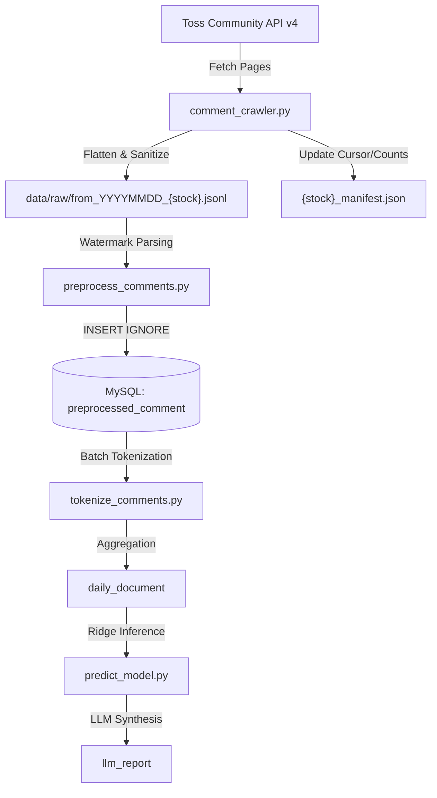

# Data Model: A-Team Pilos 댓글 크롤링 및 파이프라인 정합성 복원

**Feature**: `023-pilos-crawler-collection-audit`
**Date**: 2026-08-20

---

## 1. Core Entities

### 1.1 RawCommentRecord (토스 커뮤니티 원본 댓글 모델)
토스 증권 API (`https://wts-cert-api.tossinvest.com/api/v4/comments`)로부터 수신되는 원천 JSON 데이터.

| Field | Type | Required | Description |
| :--- | :--- | :---: | :--- |
| `commentId` | `int` | Yes | 댓글 고유 식별자 (단조 증가 ID) |
| `createdAt` | `str` (ISO-8601) | Yes | 댓글 작성 일시 (예: `"2026-08-19T14:30:00+09:00"`) |
| `body` / `content` | `str` | Yes | 댓글 본문 텍스트 |
| `author` | `dict` | No | 작성자 정보 객체 (`userProfileId`, `nickname`) |
| `authorUserProfileId` | `str` | No | 최상위 작성자 프로필 식별자 (미존재 시 `"ANONYMOUS_USER"`) |
| `likeCount` | `int` | No | 좋아요 수 (기본값: `0`) |
| `replyCount` | `int` | No | 답글/대댓글 수 (기본값: `0`) |
| `replies` / `subComments` | `list[dict]` | No | 하위 대댓글 리스트 (평탄화 대상) |

---

### 1.2 PreprocessedComment (DB 적재 엔티티: `preprocessed_comment`)
원본 댓글을 전처리 및 비식별화하여 MySQL `pilos_v2.preprocessed_comment` 테이블에 저장하는 정규화 엔티티.

| Column | Type | Constraints | Description |
| :--- | :--- | :--- | :--- |
| `preprocessed_comment_id` | `BIGINT` | PK, Auto-Inc | 테이블 고유 PK |
| `stock_id` | `INT` | FK -> `stock.stock_id` | 대상 종목 ID (1~10) |
| `comment_id` | `BIGINT` | Unique Index (`stock_id`, `comment_id`) | 원본 토스 댓글 ID |
| `author_user_profile_id_hash`| `VARCHAR(64)` | Not Null | SHA-256 비식별화 프로필 해시 |
| `nickname_hash` | `VARCHAR(64)` | Not Null | SHA-256 비식별화 닉네임 해시 |
| `clean_text` | `TEXT` | Not Null | 정규화/특수문자 정제된 본문 |
| `created_at` | `DATETIME` | Index | 댓글 작성 시각 (KST) |
| `source_comment_file_id` | `BIGINT` | FK -> `source_comment_file` | 출처 JSONL 파일 ID |
| `raw_line_number` | `INT` | Not Null | 원본 JSONL 물리적 행 번호 |

---

### 1.3 CrawlManifest (수집 상태 관리 엔티티: `data/raw/*_manifest.json`)
종목별 수집 진행 지점과 작성일별 통계를 관리하는 JSON 매니페스트.

```json
{
  "stock_name": "SK하이닉스",
  "stock_subject_id": "KR7000660001",
  "modes": {
    "backfill": {
      "cursor": 12345678,
      "status": "done",
      "last_run_at": "2026-08-20T00:00:00+09:00"
    },
    "incremental": {
      "recent_id": 98765432,
      "last_run_at": "2026-08-20T00:00:00+09:00"
    }
  },
  "daily_counts": {
    "20260818": 14122,
    "20260819": 25479
  }
}
```

---

## 2. Entity Lifecycle & Relationships


