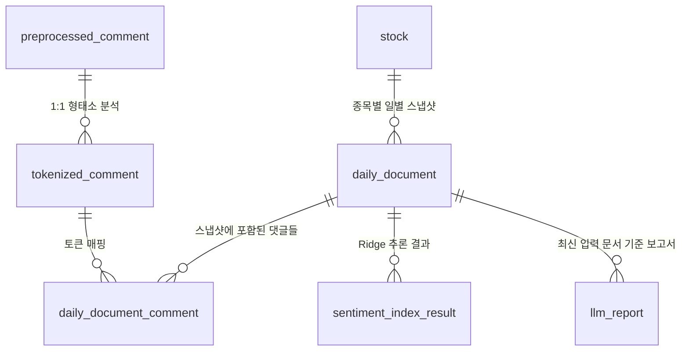

# Data Model: Pilos 일별 문서 증분 집계 및 보고서 자동 갱신 동기화

## 1. 주요 엔티티 및 스키마 관계

---

## 2. 테이블 세부 정의 및 필드 계약

### `daily_document` (일별 모델 입력 문서 스냅샷)
- `daily_document_id` (bigint, PK, auto_increment): 스냅샷 고유 식별자.
- `stock_id` (int, FK `stock.stock_id`): 대상 종목 ID.
- `model_date` (date): 댓글 수집 기준일 (YYYY-MM-DD).
- `tokenizer_version` (varchar(50)): 형태소 분석기 버전 (`kiwi_ver1`).
- `tfidf_text` (mediumtext): 당일 15:30 전까지 누적된 모든 댓글 토큰을 공백으로 연결한 문자열.
- `comment_count` (int): 문서를 구성한 실제 댓글 수.
- `document_hash` (char(64)): 일별 문서 해시값 (SHA-256).
- `created_at` (datetime): 스냅샷 생성 시각.
- **Unique Constraint**: `uq_daily_document_snapshot (stock_id, model_date, tokenizer_version, document_hash)`

### `daily_document_comment` (일별 문서 - 토큰화 댓글 매핑)
- `daily_document_comment_id` (bigint, PK, auto_increment).
- `daily_document_id` (bigint, FK `daily_document.daily_document_id`).
- `tokenized_comment_id` (int, FK `tokenized_comment.tokenized_comment_id`).
- `sequence_number` (int): 문서 내 댓글 순서 (1부터 시작).
- **Unique Constraint**: `uq_daily_document_comment (daily_document_id, tokenized_comment_id)`
- **Unique Constraint**: `uq_daily_document_sequence (daily_document_id, sequence_number)`
- **Index**: `idx_daily_document_comment_tokenized (tokenized_comment_id)`

---

## 3. 상태 전이 및 갱신 라이프사이클

1. **신규 댓글 수집 (`preprocessed_comment` -> `tokenized_comment`)**:
   - 크롤러 및 전처리기가 새 댓글을 수집하고 Kiwi 토큰화 레코드를 생성함.
2. **미매핑 토큰 감지 (`select_pending_daily_document_targets`)**:
   - `tokenized_comment` 중 `daily_document_comment`에 아직 연결되지 않은 토큰이 존재하는 `(stock_id, model_date)`를 추출.
3. **스냅샷 누적 생성 (`insert_daily_document_with_comments`)**:
   - 당일 장 마감 전(15:30)까지 누적된 전체 토큰으로 새 `daily_document` 레코드 생성 및 `daily_document_comment` 매핑 추가.
4. **추론 및 보고서 전이**:
   - 최신 `daily_document_id`에 대해 `sentiment_index_result` 생성 ➔ `llm_report` 생성 또는 `estimated`/`ready` 갱신.
