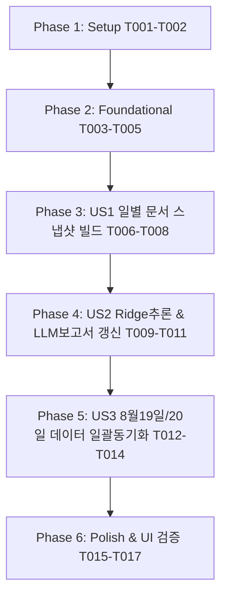

# Tasks: Pilos 일별 문서 증분 집계 및 보고서 자동 갱신 동기화 (025-pilos-daily-doc-incremental-sync)

**Input**: Design documents from `specs/025-pilos-daily-doc-incremental-sync/`  
**Prerequisites**: [plan.md](file:///c:/AISERVICE/specs/025-pilos-daily-doc-incremental-sync/plan.md), [spec.md](file:///c:/AISERVICE/specs/025-pilos-daily-doc-incremental-sync/spec.md), [data-model.md](file:///c:/AISERVICE/specs/025-pilos-daily-doc-incremental-sync/data-model.md), [contracts/pipeline-contracts.md](file:///c:/AISERVICE/specs/025-pilos-daily-doc-incremental-sync/contracts/pipeline-contracts.md)

---

## Phase 1: Setup (Environment & Test Setup)

**Purpose**: 테스트 환경 준비 및 기존 단위 테스트 확인

- [x] T001 [P] 환경 변수 및 테스트 베이스라인 확인 in ateam/pilos-sentiment-index/.env
- [x] T002 [P] 일별 문서 DB 접근 및 대상 조회 단위 테스트 파일 준비 in ateam/pilos-sentiment-index/tests/test_daily_document_db.py

---

## Phase 2: Foundational (Target Query & Unmapped Token Detection)

**Purpose**: 일별 문서 대상 판정 쿼리 개선 및 미매핑 토큰 감지 핵심 로직 구현

- [x] T003 [US1] 미매핑 토큰 감지 실패/성공 케이스 단위 테스트 작성 in ateam/pilos-sentiment-index/tests/test_daily_document_db.py
- [x] T004 [US1] select_pending_daily_document_targets 쿼리에서 NOT EXISTS (daily_document) 블록 제거 및 미매핑 토큰 필터링 개선 in ateam/pilos-sentiment-index/pilos/storage/daily_document_db.py
- [x] T005 [US1] 단위 테스트 실행하여 신규 토큰 유입 시 대상 종목·날짜가 정상 반환되는지 검증 in ateam/pilos-sentiment-index/tests/test_daily_document_db.py

**Checkpoint**: 일별 문서 대상 판정 로직 정상 동작 확인

---

## Phase 3: User Story 1 - 신규 댓글 수집에 따른 일별 문서 스냅샷 누적 갱신 (Priority: P1) 🎯 MVP

**Goal**: 신규 댓글이 수집되면 당일 장 마감 전(15:30) 누적 전체 댓글로 구성된 신규 `daily_document` 스냅샷 및 매핑 생성

**Independent Test**: 미매핑 토큰이 있는 종목에 대해 `run_daily_document_building()` 실행 시 신규 `daily_document_id`와 정확한 `comment_count`가 적재되는지 검증

- [x] T006 [US1] 장 마감 전(15:30) 누적 전체 댓글 취합 및 스냅샷 생성 로직 검증 in ateam/pilos-sentiment-index/pilos/jobs/build_daily_documents.py
- [x] T007 [US1] 중복 생성 방지(Idempotency: 동일 document_hash 시 기존 ID 재사용) 검증 in ateam/pilos-sentiment-index/pilos/storage/daily_document_db.py
- [x] T008 [US1] run_daily_document_building 실행하여 신규 스냅샷 생성 및 매핑 적재 동작 테스트 in ateam/pilos-sentiment-index/tests/test_daily_document_db.py

**Checkpoint**: User Story 1 (일별 문서 증분 누적 스냅샷 생성) 완료 및 독립 검증

---

## Phase 4: User Story 2 - 최신 일별 문서 기반 AI 모델 추론 및 LLM 보고서 자동 갱신 (Priority: P1)

**Goal**: 최신 생성된 `daily_document_id`에 대해 Ridge 감성 분석 및 LLM 보고서 자동 갱신(`estimated` 및 `ready`)

**Independent Test**: 신규 일별 문서 생성 후 `run_database_inference` 및 `run_pending_llm_report_generation` 실행 시 최신 문서 기준 결과 적재 확인

- [x] T009 [P] [US2] 모델 추론 시 최신 daily_document_id 조회 쿼리 동작 검증 in ateam/pilos-sentiment-index/pilos/storage/inference_db.py
- [x] T010 [P] [US2] input_hash 변경 감지 및 LLM 보고서 갱신 로직 검증 in ateam/pilos-sentiment-index/pilos/jobs/generate_llm_reports.py
- [x] T011 [US2] 7단계 전체 파이프라인(수집 ➔ 전처리 ➔ 토큰화 ➔ 일별문서 ➔ 수급 ➔ Ridge ➔ LLM) 1회 실행 통합 검증 in ateam/pilos-sentiment-index/pilos/jobs/run_service_pipeline.py

**Checkpoint**: User Story 2 (파이프라인 전체 자동 연계 갱신) 완료 및 독립 검증

---

## Phase 5: User Story 3 - 기존 누락된 대량 댓글 코퍼스 일괄 동기화 (Priority: P2)

**Goal**: 기존에 1~2개로 묶여있던 8월 19일치 35,999건 및 8월 20일 새벽 데이터 일괄 동기화 및 대시보드 반영

**Independent Test**: 파이프라인 1회 실행 후 MySQL 및 웹 대시보드에서 8월 19일과 8월 20일의 정확한 댓글 수와 분석 상태 확인

- [x] T012 [US3] 8월 19일 및 8월 20일 미반영 대량 댓글에 대해 일별 문서 스냅샷 일괄 빌드 in ateam/pilos-sentiment-index/pilos/jobs/build_daily_documents.py
- [x] T013 [US3] 동기화된 일별 문서에 대한 Ridge 감성 추론 및 LLM 보고서 갱신 실행 in ateam/pilos-sentiment-index/pilos/jobs/run_service_pipeline.py
- [x] T014 [US3] MySQL DB에서 8월 19일/20일 종목별 daily_document.comment_count 검증 in ateam/pilos-sentiment-index/pilos/storage/sentiment_index_storage.py

**Checkpoint**: User Story 3 (과거 및 당일 데이터 완전 동기화) 완료

---

## Phase 6: Polish & Verification (대시보드 UI 및 파이프라인 모니터링)

**Purpose**: 웹 대시보드 최종 표시 및 10분 워커 데몬 안정성 확인

- [x] T015 [P] 웹 API(/api/stocks) 응답 데이터 및 대시보드 화면 확인 in ateam/pilos-sentiment-index/pilos/web/app.py
- [x] T016 pilos-worker 데몬 로그에서 10분 주기 자동 실행 무결성 확인 in ateam/pilos-sentiment-index/pilos/jobs/worker_daemon.py
- [x] T017 quickstart.md 전체 가이드 시나리오 최종 검증 in specs/025-pilos-daily-doc-incremental-sync/quickstart.md

---

## Dependencies & Execution Order

---

## Implementation Strategy: MVP First

1. **Step 1 (Foundational & US1)**: `daily_document_db.py` 쿼리 수정 및 단위 테스트 통과 (T001~T008)
2. **Step 2 (US2 & US3)**: 전체 서비스 파이프라인 1회 수동 가동하여 8월 19일 3.6만 건 및 8월 20일 데이터 동기화 (T009~T014)
3. **Step 3 (Polish)**: MySQL 테이블 및 웹 대시보드 화면 최종 확인 (T015~T017)
