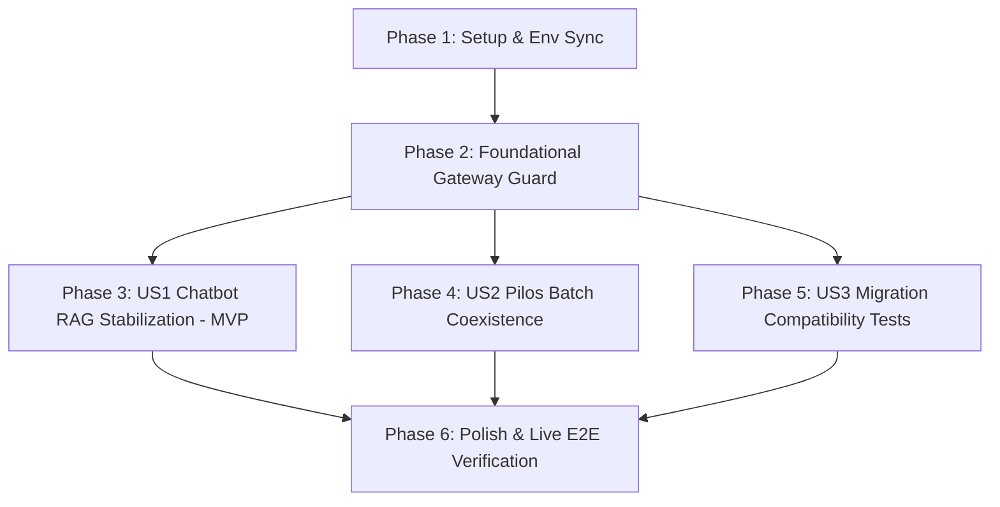

# Tasks: 026-stabilize-2b-llm-chatbot

**Branch**: `026-stabilize-2b-llm-chatbot` | **Spec**: [`specs/026-stabilize-2b-llm-chatbot/spec.md`](file:///c:/AISERVICE/specs/026-stabilize-2b-llm-chatbot/spec.md) | **Plan**: [`specs/026-stabilize-2b-llm-chatbot/plan.md`](file:///c:/AISERVICE/specs/026-stabilize-2b-llm-chatbot/plan.md)

## Phase 1: Setup & Environment Configuration

**Purpose**: 전사 환경 설정 파일(`.env`, `config.json`)을 `qwen3.5-2b` 및 `SINGLE_MODEL_MODE` 규격으로 동기화

- [x] T001 `model_gateway/.env` 및 `model_gateway/.env.example`에 `SINGLE_MODEL_MODE=true` 및 `DEFAULT_MODEL=qwen3.5-2b` 설정 추가
- [x] T002 [P] `bteam/.env` 및 `bteam/.env.example`에 `DEFAULT_MODEL=qwen3.5-2b`, `SYNTHESIS_LLM_MODEL=qwen3.5-2b`, `FAST_LLM_MODEL=qwen3.5-2b` 동기화
- [x] T003 [P] `model_gateway/config/model_config.json`의 기본 모델을 `qwen3.5-2b` (n_ctx: 16384)로 설정

---

## Phase 2: Foundational (Blocking Prerequisites)

**Purpose**: 게이트웨이 레벨 단일 모델 가드 구축 및 CPU 가드레일 오탐 방지

- [x] T004 `model_gateway/src/core/llama_manager.py`에서 `qwen3.5-2b` 상주 시 `n_ctx=16384` 보장 및 Pascal GPU 호환성 검증
- [x] T005 `model_gateway/src/api/routes/inference_api.py`에 `SINGLE_MODEL_MODE` 가드를 구현하여 프로세스 킬/핫스왑 우회 및 2B 고정 라우팅 적용
- [x] T006 [P] `bteam/oliview_core/guardrail.py`, `bteam/Oliview_chatbot_a/oliview_core/guardrail.py`, `bteam/Oliview_chatbot_b/oliview_core/guardrail.py`에서 `_RE_PROMPT_LEAK` 및 `SYSTEM_PROMPT_LEAK_OUTPUT` 화장품 리뷰 명사 오탐 제거

**Checkpoint**: 게이트웨이 및 가드레일 기반 마련 완료 — 챗봇 및 파이프라인 연동 작업 착수 가능

---

## Phase 3: User Story 1 - 2B 단일 모델 기반 챗봇 RAG 맞춤 솔루션 무중단 완결 생성 (Priority: P1) 🎯 MVP

**Goal**: 챗봇 A/B의 타임아웃 및 토큰 절단 결함을 해결하고, 1,500자 완성형 뷰티 솔루션을 10초 이내에 스트리밍으로 완결 제공

**Independent Test**: `quickstart.md` 시나리오 2를 실행하여 챗봇 B에서 문장 절단 없이 1,000자 이상의 맞춤 솔루션이 생성되는지 검증

- [x] T007 [P] [US1] `bteam/Oliview_chatbot_b/project_ragapi.py`에서 RAG 합성 `max_tokens`를 2048(2K)로 상향하고 SSE 스트림 파싱 버퍼 안정화
- [x] T008 [P] [US1] `bteam/Oliview_chatbot_a/llm_common.py` 및 `config.json`에서 합성 모델을 `qwen3.5-2b`, `max_tokens=2048`로 조정하여 타임아웃 방지
- [x] T009 [US1] 챗봇 B RAG 검색 엔드포인트(`POST /api/v1/search`) 및 스트리밍(`POST /api/v1/search/stream`) 완결성 검증
- [x] T010 [US1] 챗봇 A (`http://localhost:8501/bteam/chata`) 종합 답변 생성 라이브 호출 검증

**Checkpoint**: 챗봇 A와 B가 100% 무중단, 무절단으로 고품질 맞춤 솔루션을 생성함 (MVP 달성)

---

## Phase 4: User Story 2 - Pilos 데이터 파이프라인과 챗봇 동시 실행 시 안정성 보장 (Priority: P2)

**Goal**: Pilos 대량 일별 보고서 배치 작업 구동 중에도 챗봇 호출이 서버 프로세스 재시작(OOM) 없이 정상 처리되도록 보장

**Independent Test**: Pilos LLM 리포트 생성 작업을 실행한 상태에서 챗봇 질의를 동시에 전송하여 `OOM auto-restart recovery` 발생 0회 검증

- [x] T011 [US2] `ateam/pilos-sentiment-index/.env`의 `REPORT_LLM_MODEL=qwen3.5-2b` 및 타임아웃 설정을 점검하고 게이트웨이 동시성 호환성 보장
- [x] T012 [US2] Pilos 배치와 챗봇 동시 호출 시뮬레이션을 실행하여 `priority_scheduler`의 무중단 우선순위 처리 검증

---

## Phase 5: User Story 3 - 설정 플래그 기반 무손실 아키텍처 및 미래 GPU 마이그레이션 보장 (Priority: P3)

**Goal**: 향후 고용량 GPU 마이그레이션 시 `SINGLE_MODEL_MODE=false` 토글로 기존 4B/9B 카탈로그가 무손실 복원됨을 단위/계약 테스트로 검증

**Independent Test**: `SINGLE_MODEL_MODE=false` 설정 시 다중 모델 카탈로그 및 동적 핫스왑 경로가 정상 작동하는지 자동화 테스트로 검증

- [x] T013 [P] [US3] `model_gateway/tests/test_single_model_mode.py`에 단일 모델 모드/다중 모델 모드 토글 분기 단위 테스트 작성
- [x] T014 [P] [US3] `bteam/tests/unit/test_hybrid_token_budget.py`에 3단계 하이브리드 토큰(512/2048/4096) 할당 및 컨텍스트 예산 검증 테스트 작성

---

## Phase 6: Polish & Live Verification

**Purpose**: 컨테이너 반영, 전체 리소스(VRAM) 실측 및 최종 종합 검증

- [x] T015 Docker 컨테이너 재기동(`vllm-serv-gateway`, `oliview_chatbot_a`, `oliview_chatbot_b`) 및 `nvidia-smi`로 총 VRAM 점유량 <= 6.0 GB 실측 검증
- [x] T016 `specs/026-stabilize-2b-llm-chatbot/quickstart.md`의 전 시나리오를 전수 실행하여 100% 무결점 통과 확인

---

## Dependencies & Execution Order

### Parallel Opportunities

- **Phase 1**: T002, T003 동시 실행 가능
- **Phase 2**: T006 (가드레일 수정)은 T004, T005와 병렬 실행 가능
- **Phase 3**: T007 (Chatbot B)와 T008 (Chatbot A) 병렬 구현 가능
- **Phase 5**: T013과 T014 병렬 작성 가능

---

## Implementation Strategy (MVP First)

1. **1단계 (Phase 1 + 2)**: `.env` 및 `model_gateway`에 `SINGLE_MODEL_MODE=true`를 적용하여 핫스왑 OOM 루프를 즉시 차단.
2. **2단계 (Phase 3 - MVP)**: Chatbot A/B에 `qwen3.5-2b` + `max_tokens=2048`을 적용하여 타임아웃과 문장 잘림을 즉시 해결하고 서비스 정상화.
3. **3단계 (Phase 4 + 5 + 6)**: Pilos 파이프라인 동시 구동 검증, 마이그레이션 호환성 테스트 및 전체 라이브 검증 완료.
