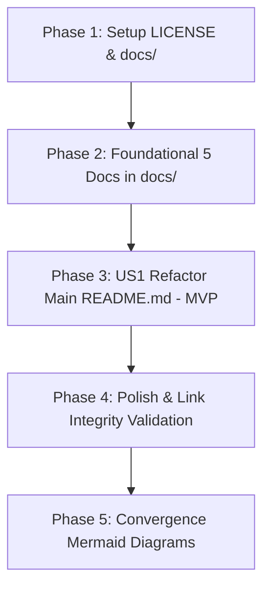

# Tasks: 027-update-readme-project-docs

**Branch**: `027-update-readme-project-docs` | **Spec**: [`specs/027-update-readme-project-docs/spec.md`](file:///c:/AISERVICE/specs/027-update-readme-project-docs/spec.md) | **Plan**: [`specs/027-update-readme-project-docs/plan.md`](file:///c:/AISERVICE/specs/027-update-readme-project-docs/plan.md)

## Phase 1: Setup (License & Directory Structure)

**Purpose**: MIT 라이센스 전문 파일 생성 및 `docs/` 디렉토리 기반 마련

- [x] T001 [P] 루트 디렉토리에 `LICENSE` 파일 생성 (MIT License 전문)
- [x] T002 [P] 세부 기술문서 디렉토리 `docs/` 생성

---

## Phase 2: Foundational (Sub-domain Detailed Documentation)

**Purpose**: 서브 도메인별 5대 심층 기술 명세서 작성

- [x] T003 [P] `docs/architecture.md` 작성 (K8s Ingress, Traefik HTTPS, Nginx 1.25 라우터, 도커 브리지 네트워크 격리 구조)
- [x] T004 [P] `docs/model_gateway.md` 작성 (vLLM/llama.cpp 서빙, `qwen3.5-2b` 상주 서빙, `SINGLE_MODEL_MODE=true`, 16K ctx, VRAM 토폴로지)
- [x] T005 [P] `docs/bteam_oliview.md` 작성 (Oliview React 18 SPA + Flask 백엔드, 챗봇 A Streamlit 뷰티 상담, 챗봇 B FastAPI RAG 스트리밍)
- [x] T006 [P] `docs/ateam_pilos.md` 작성 (Pilos 종목토론방 수급 감정지수 플랫폼, Ridge v4 추론 모델, 7단계 정기 배치 워커 데몬)
- [x] T007 [P] `docs/security_guardrails.md` 작성 (4단계 CPU 가드레일, 3단계 하이브리드 토큰 정책, Let's Encrypt HTTPS, Redis L2/L3 캐시)

**Checkpoint**: 5대 상세 기술문서 완비 — 메인 `README.md` 링크 및 총괄 대시보드 작성 가능

---

## Phase 3: User Story 1 - Main README.md 총괄 포털 재구성 (Priority: P1) 🎯 MVP

**Goal**: 메인 `README.md`를 6대 핵심 섹션으로 슬림화하여 전체 프로젝트의 청사진과 실행법, 상세 문서 목차를 직관적으로 제공

**Independent Test**: `quickstart.md` 검증 스크립트를 실행하여 메인 `README.md` 내 모든 상대 링크(`docs/*.md`, `LICENSE`)가 깨짐 없이 정상 연결되는지 검증

- [x] T008 [US1] `README.md`를 6대 섹션(개요, 아키텍처 다이어그램, 4대 서비스 라우팅 맵, 1-Click 빠른 시작, 상세 기술문서 목차/링크, MIT 라이센스)으로 전면 리팩토링
- [x] T009 [US1] `README.md`의 줄 수가 120줄 내외로 간결하게 유지되고 가독성이 극대화되었는지 확인

---

## Phase 4: Polish & Documentation Link Validation

**Purpose**: 전체 마크다운 링크 무결성 및 내용 정합성 최종 검증

- [x] T010 [P] `specs/027-update-readme-project-docs/quickstart.md`의 파이썬 검증 스크립트를 실행하여 0건의 Broken Link 및 100% 파일 실존 확인

---

---

## Phase 5: Convergence (Mermaid Diagrams Integration)

**Purpose**: 아키텍처 구조도, 파이프라인 워크플로우, 데이터 흐름도를 표준 Mermaid 다이어그램으로 전면 고도화

- [x] T011 `README.md`의 아키텍처 다이어그램을 Mermaid `flowchart TD`로 업그레이드 per user instruction (partial)
- [x] T012 `docs/architecture.md`의 시스템/네트워크 격리 구조도를 Mermaid `flowchart TD` (subgraph 포함)로 업그레이드 per user instruction (partial)
- [x] T013 `docs/model_gateway.md`에 GPU VRAM 토폴로지 및 2B 라우팅 Mermaid `sequenceDiagram` 추가 per user instruction (missing)
- [x] T014 `docs/bteam_oliview.md`에 하이브리드 RAG 검색 및 SSE 스트리밍 Mermaid `sequenceDiagram` 추가 per user instruction (missing)
- [x] T015 `docs/ateam_pilos.md`에 7단계 수집·분석·리포트 파이프라인 Mermaid `flowchart LR` 추가 per user instruction (missing)
- [x] T016 `docs/security_guardrails.md`의 4단계 보안 가드레일을 Mermaid `flowchart TD`로 업그레이드 per user instruction (partial)

---

## Dependencies & Execution Order

### Parallel Opportunities

- **Phase 1**: T001과 T002 동시 실행 가능
- **Phase 2**: T003, T004, T005, T006, T007 전 문서 병렬 작성 가능
- **Phase 4**: T010 검증 실행
- **Phase 5**: T011 ~ T016 병렬 구현 가능

---

## Implementation Strategy (MVP First)

1. **1단계 (Phase 1 + Phase 2)**: `LICENSE` 및 `docs/` 하위 5개 상세 기술문서를 먼저 완벽하게 작성하여 링크 대상 파일들을 실존시킴.
2. **2단계 (Phase 3 - MVP)**: 메인 `README.md`를 슬림화하고 생성된 `docs/*.md` 파일들로의 목차 및 상대 링크를 연결.
3. **3단계 (Phase 4)**: 자동화 스크립트로 링크 무결성 검증 및 커밋 완료.
4. **4단계 (Phase 5 - Convergence)**: 모든 구조도, 워크플로우, 데이터플로우를 네이티브 Mermaid 다이어그램으로 고도화.

