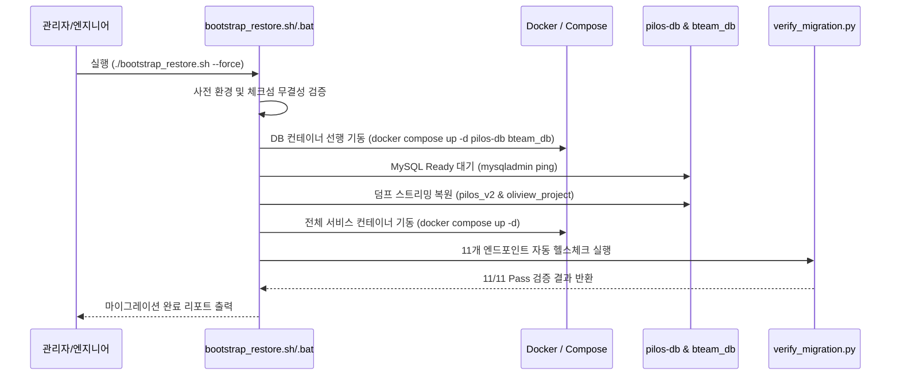

# CLI Interface Contracts: 028-cross-platform-migration-pack

**Feature**: [spec.md](file:///c:/AISERVICE/specs/028-cross-platform-migration-pack/spec.md)  
**Date**: 2026-08-20  
**Status**: Completed  

---

## 1. 데이터베이스 덤프 및 매니페스트 생성 도구 (`export_databases`)

### Command Interface
```bash
# Linux / macOS / WSL2
./migration_pack/scripts/export_databases.sh [OPTIONS]

# Windows
.\migration_pack\scripts\export_databases.bat [OPTIONS]
```

### Options & Flags
- `--output-dir <PATH>` (Default: `migration_pack/database`): 덤프 파일 저장 경로 지정
- `--no-compression`: gzip 압축 없이 `.sql` 플랫 파일로 저장 (디버깅용)
- `--skip-checksum`: SHA-256 체크섬 발행 건너뛰기
- `-h, --help`: 사용법 안내

### Exit Codes & Outputs
- `0`: 성공 (`pilos_v2.sql.gz`, `oliview_project.sql.gz`, `checksums.sha256`, `migration_manifest.json` 생성 완료)
- `1`: 소스 DB 컨테이너 미실행 오류
- `2`: 디스크 용량 부족 오류

---

## 2. 단일 아카이브 패키징 도구 (`pack_archive`)

### Command Interface
```bash
# Linux / macOS / WSL2
./migration_pack/scripts/pack_archive.sh [OPTIONS]

# Windows
.\migration_pack\scripts\pack_archive.bat [OPTIONS]
```

### Options & Flags
- `--output <FILE>` (Default: `aiservice_migration_pack_YYYYMMDD.tar.gz` 또는 `.zip`): 아카이브 파일명 지정
- `--format <tar.gz|zip>` (Default: Linux `tar.gz`, Windows `zip`): 압축 포맷 지정
- `--include-models`: 오프라인 모델 가중치 디렉터리(`models/`)를 포함하여 풀 아카이브 생성

---

## 3. 원클릭 부트스트랩 복원 도구 (`bootstrap_restore`)

### Command Interface
```bash
# Linux / macOS / WSL2
./migration_pack/scripts/bootstrap_restore.sh [OPTIONS]

# Windows
.\migration_pack\scripts\bootstrap_restore.bat [OPTIONS]
```

### Options & Flags
- `--force, -f, --yes, -y`: 기존 데이터베이스가 발견되어도 확인 없이 무인 덮어쓰기 복원
- `--skip-db-restore`: DB 복원을 건너뛰고 컨테이너 오케스트레이션만 실행
- `--skip-verification`: 복원 완료 후 `verify_migration.py` 자동 실행 건너뛰기
- `--env-file <PATH>` (Default: `.env`): 적용할 환경 설정 파일 지정

### Execution Workflow Sequence


---

## 4. 통합 엔드포인트 검증기 (`verify_migration.py`)

### Command Interface
```bash
python migration_pack/scripts/verify_migration.py [OPTIONS]
```

### Options & Flags
- `--gateway-url <URL>` (Default: `http://127.0.0.1:80`): 테스트 대상 게이트웨이 주소
- `--alt-gateway-url <URL>` (Default: `http://127.0.0.1:8080`): 대체 게이트웨이 주소
- `--json-report <PATH>`: 검증 결과를 JSON 파일로 출력
- `--timeout <SECONDS>` (Default: `30`): 엔드포인트별 타임아웃 제한 시간

### Standard JSON Output Format
```json
{
  "timestamp": "2026-08-20T20:00:00Z",
  "total_endpoints": 11,
  "passed_count": 11,
  "failed_count": 0,
  "status": "PASS",
  "endpoints": {
    "gateway_port_80": { "status_code": 200, "latency_ms": 12, "result": "PASS" },
    "gateway_port_8080": { "status_code": 200, "latency_ms": 14, "result": "PASS" },
    "model_gateway_health": { "status_code": 200, "latency_ms": 25, "result": "PASS" },
    "llm_chat_completion": { "status_code": 200, "latency_ms": 420, "result": "PASS" },
    "bge_m3_embedding": { "status_code": 200, "latency_ms": 85, "result": "PASS" },
    "bge_reranker": { "status_code": 200, "latency_ms": 110, "result": "PASS" },
    "pilos_web": { "status_code": 200, "latency_ms": 30, "result": "PASS" },
    "oliview_backend": { "status_code": 200, "latency_ms": 18, "result": "PASS" },
    "oliview_frontend": { "status_code": 200, "latency_ms": 22, "result": "PASS" },
    "oliview_chatbot_a": { "status_code": 200, "latency_ms": 45, "result": "PASS" },
    "oliview_chatbot_b": { "status_code": 200, "latency_ms": 38, "result": "PASS" }
  },
  "database_integrity": {
    "pilos_v2_tables": { "status": "VERIFIED", "total_tables": 11 },
    "oliview_project_tables": { "status": "VERIFIED", "total_tables": 22 }
  }
}
```
