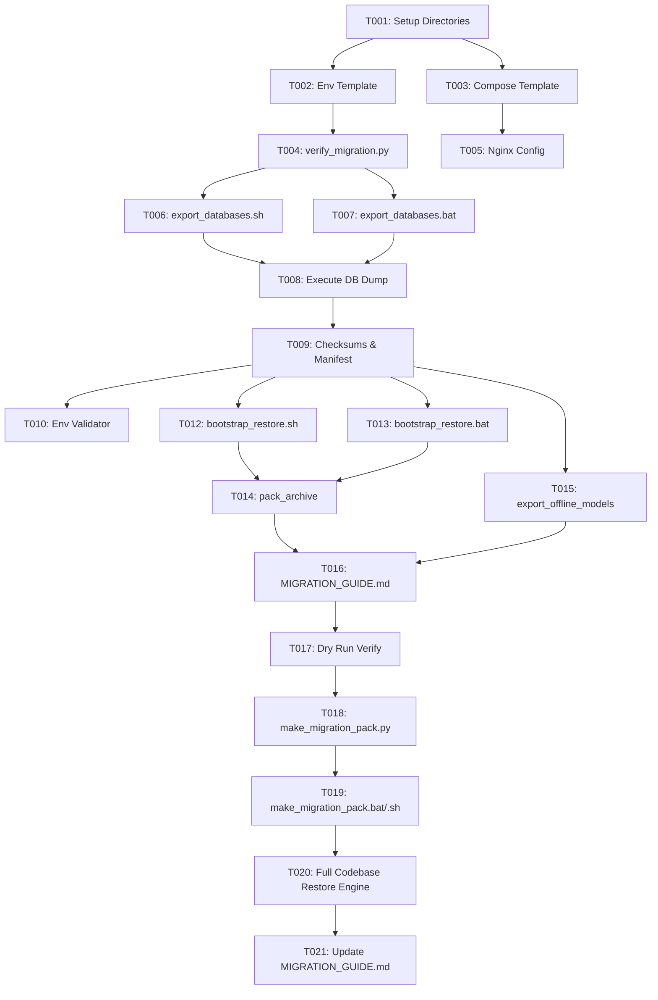

# Tasks: 028-cross-platform-migration-pack

**Input**: Design documents from `specs/028-cross-platform-migration-pack/`  
**Prerequisites**: [plan.md](file:///c:/AISERVICE/specs/028-cross-platform-migration-pack/plan.md), [spec.md](file:///c:/AISERVICE/specs/028-cross-platform-migration-pack/spec.md), [research.md](file:///c:/AISERVICE/specs/028-cross-platform-migration-pack/research.md), [data-model.md](file:///c:/AISERVICE/specs/028-cross-platform-migration-pack/data-model.md), [contracts/migration-cli-contracts.md](file:///c:/AISERVICE/specs/028-cross-platform-migration-pack/contracts/migration-cli-contracts.md), [quickstart.md](file:///c:/AISERVICE/specs/028-cross-platform-migration-pack/quickstart.md)

---

## Phase 1: Setup (Directory Structure & Config Packaging)

**Purpose**: 마이그레이션 팩 루트 및 설정 디렉터리 레이아웃 구축

- [X] T001 Create migration pack directory structure (`migration_pack/database/`, `migration_pack/scripts/`, `migration_pack/config/`)
- [X] T002 [P] Create environment configuration template in `migration_pack/config/.env.migration.template`
- [X] T003 [P] Create cross-platform Docker Compose template in `migration_pack/docker-compose.yml`

---

## Phase 2: Foundational (Verification & Integrity Engine)

**Purpose**: 마이그레이션 무결성 검증 및 E2E 테스트 스위트 선행 구현

- [X] T004 [P] Implement automated 11-endpoint & DB integrity test suite in `migration_pack/scripts/verify_migration.py`
- [X] T005 [P] Create Nginx reverse proxy configuration in `migration_pack/config/nginx.conf`

**Checkpoint**: Foundation ready - User Story tasks can now proceed in parallel.

---

## Phase 3: User Story 1 - One-Click Database Lossless Dump Engine (Priority: P1) 🎯 MVP

**Goal**: `pilos_v2`(3.4GB) 및 `oliview_project`(950MB) MySQL 데이터베이스를 `utf8mb4` 인코딩, 뷰, 트리거, 1024차원 임베딩 벡터의 손실 없이 압축 덤프(`.sql.gz`) 및 SHA-256 체크섬으로 추출

**Independent Test**: `export_databases.bat` 실행 후 `migration_pack/database/`에 `pilos_v2.sql.gz`, `oliview_project.sql.gz`, `checksums.sha256`, `migration_manifest.json`이 정상 생성되고 체크섬이 일치하는지 확인

- [X] T006 [P] [US1] Implement Linux/WSL2 database export script with streaming mysqldump and gzip compression in `migration_pack/scripts/export_databases.sh`
- [X] T007 [P] [US1] Implement Windows database export batch script with containerized mysqldump and sha256 generation in `migration_pack/scripts/export_databases.bat`
- [X] T008 [US1] Execute database dump extraction for `pilos_v2` and `oliview_project` into `migration_pack/database/`
- [X] T009 [US1] Generate SHA-256 checksum manifest in `migration_pack/database/checksums.sha256` and metadata in `migration_pack/migration_manifest.json`

**Checkpoint**: User Story 1 (DB 무손실 백업 추출) 완료 및 독립 검증 가능.

---

## Phase 4: User Story 2 - Platform-Independent Environment & Secret Matrix (Priority: P2)

**Goal**: 타겟 플랫폼 환경(IP, 도메인, 포트, GPU 지원)에 따라 `.env`를 안전하게 주입/동기화하는 번들러 구축

**Independent Test**: `migration_pack/config/.env.migration.template`을 기반으로 타겟 환경 변수가 누락 없이 정상 매핑되는지 검증

- [X] T010 [P] [US2] Implement `.env` profile validator and configuration generator in `migration_pack/scripts/configure_env.py`
- [X] T011 [US2] Package DDNS and security configuration templates in `migration_pack/config/`

**Checkpoint**: User Story 1 & 2 연동 완료.

---

## Phase 5: User Story 3 - Target Host One-Click Restore & Auto-Bootstrap (Priority: P3)

**Goal**: 신규 타겟 서버에서 단일 스크립트 실행으로 DB 무인 복원, Docker Compose 빌드/기동, 11개 엔드포인트 헬스체크까지 완전 자동화

**Independent Test**: 깨끗한 타겟 환경에서 `bootstrap_restore.sh/.bat --force` 실행 시 11개 전 엔드포인트가 HTTP 200 OK를 반환하는지 검증

- [X] T012 [P] [US3] Implement Linux one-click bootstrap restore script with safe DB auto-detection in `migration_pack/scripts/bootstrap_restore.sh`
- [X] T013 [P] [US3] Implement Windows one-click bootstrap restore script with safe DB auto-detection in `migration_pack/scripts/bootstrap_restore.bat`
- [X] T014 [US3] Implement single archive packaging tools in `migration_pack/scripts/pack_archive.sh` and `migration_pack/scripts/pack_archive.bat`

**Checkpoint**: User Story 1, 2, 3 복원 및 배포 자동화 완료.

---

## Phase 6: User Story 4 - Model Weights Packaging & Offline Downloader (Priority: P4)

**Goal**: 폐쇄망 배포를 위한 AI 모델 가중치(Qwen3.5, BGE-M3, Reranker, Prompt-Guard) 선택적 오프라인 번들러 구현

**Independent Test**: `export_offline_models.bat` 실행 시 로컬/컨테이너 모델 캐시가 `migration_pack/models/`로 정확히 아카이빙되는지 검증

- [X] T015 [P] [US4] Implement offline model weights export scripts in `migration_pack/scripts/export_offline_models.sh` and `migration_pack/scripts/export_offline_models.bat`

---

## Phase 7: Polish & Documentation

**Purpose**: 플랫폼별 이전 가이드 작성 및 최종 E2E 검증

- [X] T016 [P] Create comprehensive cross-platform manual in `migration_pack/MIGRATION_GUIDE.md`
- [X] T017 Execute end-to-end dry run verification using `migration_pack/scripts/verify_migration.py`

---

## Phase 8: Convergence - Master Migration Pack Generator Engine

**Purpose**: 언제든 원클릭으로 최신 소스코드와 최신 DB 덤프를 결합하여 완전한 배포용 마이그레이션 팩 아카이브를 재생성하는 마스터 빌더 스크립트 구축

- [X] T018 [US1] Implement master migration pack builder engine `make_migration_pack.py` at project root with clean source bundling and DB extraction
- [X] T019 [US1] Implement Windows one-click wrapper `make_migration_pack.bat` and Linux wrapper `make_migration_pack.sh`
- [X] T020 [US3] Ensure target restore unpacks and provisions full project codebase alongside databases seamlessly
- [X] T021 [US1] Update `MIGRATION_GUIDE.md` to document the repeatable pack generator workflow

---

## Dependencies & Execution Order

