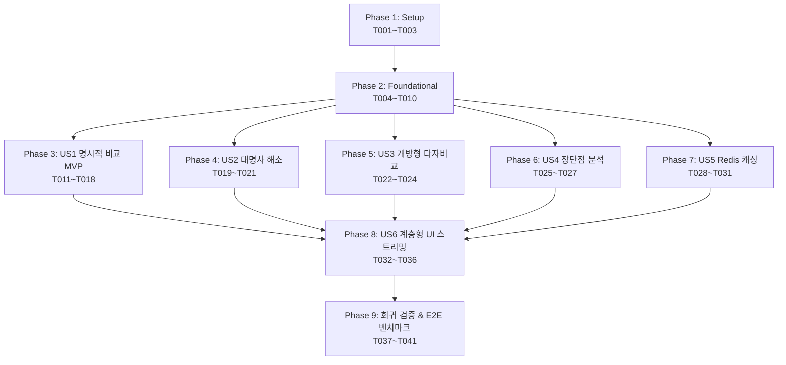

# Tasks: 030-reranker-pipeline-optimization (리랭커 파이프라인 및 LangGraph / Redis 기반 다중 타겟 RAG 오케스트레이션)

**Input**: Design documents from `/specs/030-reranker-pipeline-optimization/`
- Spec: `specs/030-reranker-pipeline-optimization/spec.md`
- Plan: `specs/030-reranker-pipeline-optimization/plan.md`
- Research: `specs/030-reranker-pipeline-optimization/research.md`
- Data Model: `specs/030-reranker-pipeline-optimization/data-model.md`
- Contracts: `specs/030-reranker-pipeline-optimization/contracts/`
- Quickstart: `specs/030-reranker-pipeline-optimization/quickstart.md`

**Prerequisites**: Docker containers (`vllm-serv-gateway`, `aiservice-redis`, `aiservice-mysql`, `oliview-streamlit`, `oliview-chatbot-b`) 가동 상태

**Organization**: 각 사용자 스토리(P1~P6)별 독립 구현 및 테스트가 가능하도록 구성되었으며, **시스템 고도화 및 리팩토링 후 기존 기능의 100% 정상 작동을 검증하기 위한 회귀 테스트(Regression Tests)**가 필수 단계로 포함되어 있습니다.

---

## Format: `- [ ] [TaskID] [P?] [Story?] Description with file path`

- **[P]**: 병렬 실행 가능 (상호 독립 파일 및 의존성 없음)
- **[Story]**: 해당 사용자 스토리 태그 ([US1] ~ [US6])

---

## Phase 1: Setup (인프라 환경 및 핵심 패키지 구성)

**Purpose**: 프로젝트 패키지 의존성 및 공통 설정 기반 구축

- [X] T001 [P] `langgraph>=0.2.0,<0.3.0`, `langchain-core>=0.3.0,<0.4.0`, `aiomysql>=0.2.0` 의존성 패키지 명시 및 설치 in `bteam/oliview_core/requirements.txt`
- [X] T002 [P] 16K 대형 컨텍스트(입력 6K/생성 4K 토큰), 5.0s 타임아웃, `FEATURE_LANGGRAPH_RAG` 핫스왑 피처 플래그 환경 설정 in `bteam/oliview_core/config.py`
- [X] T003 [P] 요청별 `trace_id` 발급 및 단계별 지연 시간 로깅을 위한 구조화된 JSON 로거 설정 in `bteam/oliview_core/logger.py`

---

## Phase 2: Foundational (공통 인프라 & 레거시 회귀 베이스라인)

**Purpose**: 모든 사용자 스토리가 공유하는 핵심 인프라 싱글톤 구축 및 기존 레거시 기능 기준점 확보

**⚠️ CRITICAL**: 본 단계가 완료되어야 개별 사용자 스토리 구현을 안전하게 시작할 수 있습니다.

- [X] T004 [P] 비동기 MySQL 커넥션 풀(`aiomysql.create_pool(maxsize=10)`) 및 컨텍스트 매니저 구현 in `bteam/oliview_core/db_pool.py`
- [X] T005 [P] 전역 `redis.ConnectionPool` 싱글톤 및 `socket_timeout=0.2s` Fail-Fast 클라이언트, Single-flight 락 구현 in `bteam/oliview_core/redis_pool.py`
- [X] T006 [P] 올리브영 50대 주요 브랜드 영문 약칭(`CNP`→`차앤박`, `Dr.G`→`닥터지`) 및 공백 정규화 사전 구현 in `bteam/oliview_core/alias_dictionary.py`
- [X] T007 [P] `RagGraphState`, `TargetEntity`, `CandidateReview`, `RerankedReview`, `SubStepEvent` 데이터 모델 정의 in `bteam/oliview_core/graph_state.py`
- [X] T008 `AiGatewayClient` 리팩토링 (`asyncio.Semaphore(3)` 동시성 가드, 8091 BGE-Reranker 5.0s 단일 타임아웃, CPU 로컬 폴백 제거, Redis L2/L3 캐시 연동) in `bteam/oliview_core/client.py`
- [X] T009 리뷰 본문 내 HTML/XML 특수문자 이스케이핑(`&lt;`, `&gt;`, `&amp;`) 간접 프롬프트 인젝션 방어 함수 추가 in `bteam/oliview_core/guardrail.py`
- [X] T010 [P] 기존 레거시 단일 쿼리 검색, 가드레일, 브랜드 추출 검증용 회귀 테스트 베이스라인 작성 in `bteam/tests/regression/test_legacy_regression.py`

**Checkpoint**: Foundational 인프라 구축 및 회귀 테스트 베이스라인 준비 완료.

---

## Phase 3: User Story 1 - 명시적 다중 제품/브랜드 비교 분석 (Priority: P1) 🎯 MVP

**Goal**: "A사 제품과 B사 제품 비교해줘" 질의 시, 각 제품별 병렬 검색(10건씩) + 1회 통합 배치 리랭킹 + 타겟별 쿼터 파티셔닝(각 상위 3건 선별)을 통해 공정한 1:1 비교 답변 도출

**Independent Test**: "차앤박 프로폴리스 앰플과 식물나라 시카 토너 수분감 비교해줘" 질의 시, 두 제품의 리뷰가 각각 3건씩 고르게 인용되고 4,096토큰 이내의 완결형 비교 표가 5.0초 이내에 생성되는지 검증

### Tests for User Story 1
- [X] T011 [P] [US1] 2개 제품 병렬 분할 검색 및 통합 배치 리랭킹 계약 테스트 in `bteam/tests/unit/test_explicit_compare.py`
- [X] T012 [P] [US1] 타겟별 쿼터 파티셔닝(특정 제품 쏠림 0% 검증) 단위 테스트 in `bteam/tests/unit/test_quota_partitioning.py`

### Implementation for User Story 1
- [X] T013 [P] [US1] `intent_router_node`: 명시적 다중 제품 비교 패턴(`PATTERN_EXPLICIT_COMPARE`) 감지 및 엔티티 유효성 검증 게이트 구현 in `bteam/oliview_core/nodes/router_node.py`
- [X] T014 [P] [US1] `search_subgraph`: LangGraph `Send` API 기반 타겟별 병렬 하이브리드 검색 노드 구현 in `bteam/oliview_core/nodes/search_node.py`
- [X] T015 [US1] `reranker_node`: 수집된 후보군 단일 통합 배치 리랭킹 및 타겟별 쿼터(상위 3건) 독립 추출 로직 구현 in `bteam/oliview_core/nodes/rerank_node.py`
- [X] T016 [US1] `context_builder_node`: 제품 스펙 헤더(정가/용량/주성분) 번들링 및 6,000토큰 XML 샌드박스 주입 조립기 구현 in `bteam/oliview_core/nodes/context_node.py`
- [X] T017 [US1] `synthesis_stream_node`: Qwen 3.5 2B 실시간 토큰 스트리밍 및 Tier 4 카나리아 검증 노드 구현 in `bteam/oliview_core/nodes/synthesis_node.py`
- [X] T018 [US1] LangGraph `StateGraph` 컴파일 및 `MultiTargetGraphOrchestrator` 클래스 조립 in `bteam/oliview_core/graph_orchestrator.py`

**Checkpoint**: User Story 1 (MVP) 독립 기능 완료 및 1:1 비교 검증 통과.

---

## Phase 4: User Story 2 - 멀티턴 대화 맥락 대명사 해소 비교 (Priority: P2)

**Goal**: "그거랑 식물나라 토너 비교해줘"와 같이 대명사("그거") 사용 시, Redis L4 세션에서 직전 제품을 복원하여 누락 없는 2개 타겟 비교 RAG 수행

**Independent Test**: 1턴 "차앤박 앰플 어때?" ➔ 2턴 "그거랑 식물나라 토너 비교해줘" 입력 시 '그거'를 '차앤박 앰플'로 정상 해소하여 비교 파이프라인이 실행되는지 검증

### Tests for User Story 2
- [X] T019 [P] [US2] 멀티턴 대명사("그거", "전자", "후자") 엔티티 해소 단위 테스트 in `bteam/tests/unit/test_anaphora_resolver.py`

### Implementation for User Story 2
- [X] T020 [US2] Redis L4 대화 히스토리에서 직전 턴 언급 브랜드/제품명을 파싱하는 `ConversationalEntityResolver` 구현 in `bteam/oliview_core/anaphora_resolver.py`
- [X] T021 [US2] `intent_router_node`에 대명사 해소기를 사전 연동하여 결손된 타겟 자동 보원 로직 추가 in `bteam/oliview_core/nodes/router_node.py`

**Checkpoint**: User Story 2 멀티턴 대명사 비교 연속 대화 검증 통과.

---

## Phase 5: User Story 3 - 특정 기능/효과 중심의 개방형 다자 비교 추천 (Priority: P3)

**Goal**: "속건조에 좋은 인기 앰플들 비교해줘" 질의 시, 해당 속성 만족도 상위 대표 제품 최대 3개를 자동 선정하여 각 제품별 병렬 검색 & 다자 비교 리포트 생성

**Independent Test**: "진정 효과 좋은 스킨케어 제품들 비교해줘" 질의 시, 진정 속성 상위 3개 제품 자동 선별 및 각 제품별 10건 검색, 통합 리랭킹(각 2건씩 총 6건) 비교 표가 도출되는지 검증

### Tests for User Story 3
- [X] T022 [P] [US3] 속성 기반 대표 제품 선별 및 3자 비교 오케스트레이션 테스트 in `bteam/tests/unit/test_feature_discovery.py`

### Implementation for User Story 3
- [X] T023 [US3] 속성/기능 키워드 긍정 리뷰 비율 기준 상위 대표 제품 Top-3 발굴 로직 구현 in `bteam/oliview_core/retrieval.py`
- [X] T024 [US3] `intent_router_node`에 개방형 다자 비교 패턴(`PATTERN_FEATURE_DISCOVERY`) 분기 엣지 추가 in `bteam/oliview_core/nodes/router_node.py`

**Checkpoint**: User Story 3 개방형 다자 비교 추천 기능 검증 통과.

---

## Phase 6: User Story 4 - 단일 제품의 다중 속성 및 장단점 객관 분석 (Priority: P4)

**Goal**: "특정 제품의 장단점을 솔직하게 분석해줘" 질의 시, 긍정(장점)과 부정(주의점) 또는 각 평가 속성을 분할 검색하여 객관적 균형 분석 답변 생성

**Independent Test**: "헤라 블랙쿠션 장단점 알려줘" 질의 시, 긍정 리뷰 3건과 부정 리뷰 3건이 쿼터 선별되어 장단점 대비 답변이 도출되는지 검증

### Tests for User Story 4
- [X] T025 [P] [US4] 장단점(긍정/부정 극성 분할) 및 다중 속성 분할 검색 테스트 in `bteam/tests/unit/test_aspect_pros_cons.py`

### Implementation for User Story 4
- [X] T026 [US4] 긍정 리뷰(`rating >= 4`)와 주의점 리뷰(`rating <= 3` 또는 부정 키워드) 분할 하이브리드 검색 로직 구현 in `bteam/oliview_core/retrieval.py`
- [X] T027 [US4] `intent_router_node`에 다중 속성/장단점 분석 패턴(`PATTERN_ASPECT_PROS_CONS`) 분기 엣지 추가 in `bteam/oliview_core/nodes/router_node.py`

**Checkpoint**: User Story 4 장단점 객관 분석 기능 검증 통과.

---

## Phase 7: User Story 5 - Redis 다계층 캐시를 통한 반복 질의 초고속(0.1초대) 응답 (Priority: P5)

**Goal**: 동일 질문 재입력 또는 인기 질문 클릭 시 L1(검색 풀), L2(임베딩), L3(리랭킹 점수) 캐시 히트를 통해 0.1초대 즉시 답변 스트리밍 개시

**Independent Test**: 동일 질문 2회 연속 실행 시 2회차 전처리 지연 시간이 10ms 이내로 측정되고 즉시 토큰이 생성되는지 검증

### Tests for User Story 5
- [X] T028 [P] [US5] L1(검색 풀), L2(임베딩), L3(리랭킹), L4(체크포인터) 4단계 캐시 히트/미스 및 만료 테스트 in `bteam/tests/unit/test_redis_cache_4tier.py`

### Implementation for User Story 5
- [X] T029 [US5] 1차 검색 풀 L1 캐시 (`v1:rag:pool:{target}:{attr}`, TTL 12h) 조회 및 저장 연동 in `bteam/oliview_core/retrieval.py`
- [X] T030 [US5] LangGraph StateGraph 체크포인터로 Redis L4 연동 in `bteam/oliview_core/session.py`
- [X] T031 [US5] Chatbot B(`project_ragapi.py`)에서 독자 `httpx` 호출을 완전히 제거하고 `MultiTargetGraphOrchestrator` 및 Redis 캐시 공유 클라이언트로 전면 전환 in `bteam/Oliview_chatbot_b/project_ragapi.py`

**Checkpoint**: User Story 5 Redis 4단계 캐시 정상화 및 0.1초대 응답 검증 통과.

---

## Phase 8: User Story 6 - 실시간 계층형 타임라인 UI 출력 및 안전 폴백 (Priority: P6)

**Goal**: 작업이 끝난 후 한 번에 표시되던 기존 방식을 개선하여, LangGraph `astream_events`를 수신해 상위 4단계 하위에 타겟별 서브스텝(`[1/2] 제품 A 10건 수집 완료`)을 100ms 이내 실시간 렌더링하고, 타임아웃 시 `"⚡ 신속 분석 모드"` 친화적 라벨 노출

**Independent Test**: 다중 비교 질문 입력 즉시 실시간 타임라인 트리가 순차 갱신되고, 8091 타임아웃 주입 시 즉시 "⚡ 신속 분석 모드" 배지로 전환되는지 검증

### Tests for User Story 6
- [X] T032 [P] [US6] SSE `SubStepEvent` 프로토콜 직렬화 및 스트리밍 이벤트 무결성 테스트 in `bteam/tests/unit/test_substep_events.py`

### Implementation for User Story 6
- [X] T033 [US6] LangGraph 비동기 이벤트를 Streamlit 스레드 안전 동기 제너레이터로 래핑하는 `StreamlitGraphAdapter` 구현 in `bteam/Oliview_chatbot_a/graph_adapter.py`
- [X] T034 [US6] Chatbot A(Streamlit) UI에서 `st.status()` 하위 타겟별 실시간 서브스텝 및 "⚡ 신속 분석 모드" 렌더링 적용 in `bteam/Oliview_chatbot_a/06.02.app.py`
- [X] T035 [US6] Chatbot B(FastAPI) SSE 스트리밍 루프에 `await request.is_disconnected()` 클라이언트 단절 시 GPU 태스크 즉시 취소(Abort) 핸들러 구현 in `bteam/Oliview_chatbot_b/project_ragapi.py`
- [X] T036 [US6] Chatbot B 웹 프론트엔드(`templates/index.html`)에 실시간 계층형 타임라인 서브스텝 동적 트리 렌더링 및 폴백 배지 UI 구현 in `bteam/Oliview_chatbot_b/templates/index.html`

**Checkpoint**: User Story 6 양대 챗봇(A/B) 실시간 계층형 서브스텝 UI 및 폴백 인터랙션 완성.

---

## Phase 9: Polish, Comprehensive Regression & E2E Validation

**Purpose**: 전체 리팩토링 및 고도화 완료 후, 기존 레거시 기능이 100% 보존되었는지 검증하는 회귀 테스트 수행 및 A/B 챗봇 성능/레이턴시 벤치마크 확정

- [X] T037 [P] **[회귀 테스트]** 기존 단일 화장품 질의 20종, 악성 프롬프트 인젝션 10종, 피부타입 필터링 10종에 대한 레거시 회귀 테스트 실행 및 기능 보존 검증 in `bteam/tests/regression/test_legacy_regression.py`
- [X] T038 [P] **[A/B 성능 정합성 벤치마크]** 동일 10개 질문 세트에 대한 Chatbot A vs Chatbot B 전처리 소요 시간 격차(1.0s 이내) 및 E2E 지연시간 벤치마크 스크립트 작성 및 실행 in `scratch/benchmark_rag_orchestrator.py`
- [X] T039 **[부분 장애 격리 검증]** 1개 타겟 DB 에러 주입 시 500 에러 없이 잔여 타겟으로 100% 정상 완결되는지 검증 in `bteam/tests/unit/test_fault_isolation.py`
- [X] T040 **[클라이언트 단절 자원 회수 검증]** SSE 스트리밍 도중 연결 단절 시 GPU 태스크 500ms 이내 취소 완료 검증 in `bteam/tests/unit/test_disconnect_abort.py`
- [X] T041 [quickstart.md](file:///c:/AISERVICE/specs/030-reranker-pipeline-optimization/quickstart.md)의 모든 시나리오(명세서 SC-001 ~ SC-017) 최종 점검 및 통과 확인

---

## Dependencies & Execution Order

### Parallel Opportunities

- **Phase 1**: T001, T002, T003 병렬 실행 가능.
- **Phase 2**: T004(MySQL), T005(Redis), T006(별칭 사전), T007(데이터 모델), T010(회귀 테스트) 동시 병렬 구현 가능.
- **Phase 3~7**: Foundational(Phase 2) 완료 후, US1~US5의 단위 테스트([P]) 및 독립 노드 구현 병렬 진행 가능.
- **Phase 9**: T037(회귀 테스트), T038(A/B 벤치마크), T039(장애 격리 테스트) 동시 병렬 검증 가능.

---

## Implementation Strategy

### MVP First (Phase 1 + Phase 2 + Phase 3: User Story 1)
1. Phase 1 & 2 기본 인프라(MySQL 풀, Redis 풀, 클라이언트 리팩토링, 회귀 베이스라인) 완료.
2. Phase 3 (User Story 1 - 명시적 2개 제품 비교 병렬 검색 및 단일 배치 리랭킹) 구현.
3. **STOP & VALIDATE**: "차앤박 앰플 vs 식물나라 토너" 비교 RAG 5.0초 이내 정상 동작 독립 검증.

### Incremental Delivery (Phase 4 ~ 8)
- Phase 4 (멀티턴 대명사 해소) ➔ Phase 5 (개방형 다자 비교) ➔ Phase 6 (장단점 분석) ➔ Phase 7 (Redis 4-Tier 캐시) ➔ Phase 8 (실시간 계층형 UI 렌더링)을 순차적으로 결합.

### Final Verification (Phase 9: Comprehensive Legacy Regression)
- 기존 단일 질의, 가드레일, 감정 분석 및 A/B 챗봇 전처리 레이턴시 격차(1.0s 이내) 회귀 검증을 통과하여 100% 무결점 릴리즈 완료.
