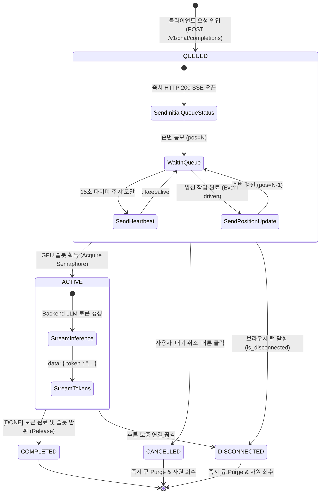

# Data Model: 031-gpu-queue-timeout-extension

**Feature**: `031-gpu-queue-timeout-extension`  
**Date**: 2026-08-26  
**Status**: Completed  

---

## 1. Core Data Entities

### 1.1 `QueueTicket` (큐 티켓 관리 객체)
모델 게이트웨이 내부 큐에서 각 요청의 대기 및 라이프사이클을 추적하는 엔티티입니다.

| Field | Type | Description |
|---|---|---|
| `ticket_id` | `str` | UUID 기반 고유 요청 식별자 (`req_...`) |
| `tenant_id` | `str` | 서비스 테넌트 식별자 (`chata`, `chatb`, `default`) |
| `session_id` | `str` | 사용자 대화 세션 ID |
| `prompt_hash` | `str` | 질의 프롬프트 SHA256 해시 (Request Coalescing 멱등성 검증용) |
| `created_at` | `float` | 큐 진입 시각 (UNIX Timestamp) |
| `state` | `QueueStateEnum` | `QUEUED`, `ACTIVE`, `COMPLETED`, `CANCELLED`, `DISCONNECTED` |
| `queue_position` | `int` | 현재 대기 순번 (1-indexed, 0 = Active) |
| `estimated_wait_s` | `float` | 예상 대기 시간 (초) |
| `cancel_event` | `asyncio.Event` | 클라이언트 이탈/취소 감지 이벤트 |
| `broadcaster` | `asyncio.Queue` | 스트림 토큰 및 큐 상태 브로드캐스터 (Coalescing 멀티플렉싱용) |

```python
from enum import Enum
import asyncio
from dataclasses import dataclass, field

class QueueStateEnum(str, Enum):
    QUEUED = "QUEUED"
    ACTIVE = "ACTIVE"
    COMPLETED = "COMPLETED"
    CANCELLED = "CANCELLED"
    DISCONNECTED = "DISCONNECTED"

@dataclass
class QueueTicket:
    ticket_id: str
    tenant_id: str
    session_id: str
    prompt_hash: str
    created_at: float
    state: QueueStateEnum = QueueStateEnum.QUEUED
    queue_position: int = 1
    estimated_wait_s: float = 0.0
    cancel_event: asyncio.Event = field(default_factory=asyncio.Event)
    subscriber_count: int = 1
```

---

### 1.2 `QueueStatusPayload` (SSE 큐 상태 이벤트 스키마)
게이트웨이가 클라이언트(Chat A, Chat B)에 스트리밍하는 SSE 페이로드입니다.

```json
{
  "event": "queue_status",
  "data": {
    "ticket_id": "req_8af43ba1",
    "tenant_id": "chata",
    "status": "QUEUED",
    "queue_position": 1,
    "total_queued": 2,
    "active_slots": 1,
    "max_slots": 1,
    "estimated_wait_sec": 3.5,
    "elapsed_sec": 1.2,
    "timestamp": 1724670000.123
  }
}
```

---

### 1.3 `TenantProfile` (테넌트 공정 스케줄링 메타데이터)
Deficit Round Robin(DRR) 공정 큐잉을 위한 테넌트별 상태 객체입니다.

| Field | Type | Description |
|---|---|---|
| `tenant_id` | `str` | `chata`, `chatb`, `admin` 등 |
| `weight` | `int` | 테넌트 가중치 (기본 1) |
| `deficit_counter` | `int` | DRR 퀀텀 잔여 카운터 |
| `active_requests` | `int` | 현재 실행 중인 요청 수 |
| `queue` | `asyncio.Queue` | 해당 테넌트 전용 대기 큐 |

---

## 2. State Transition Diagram


