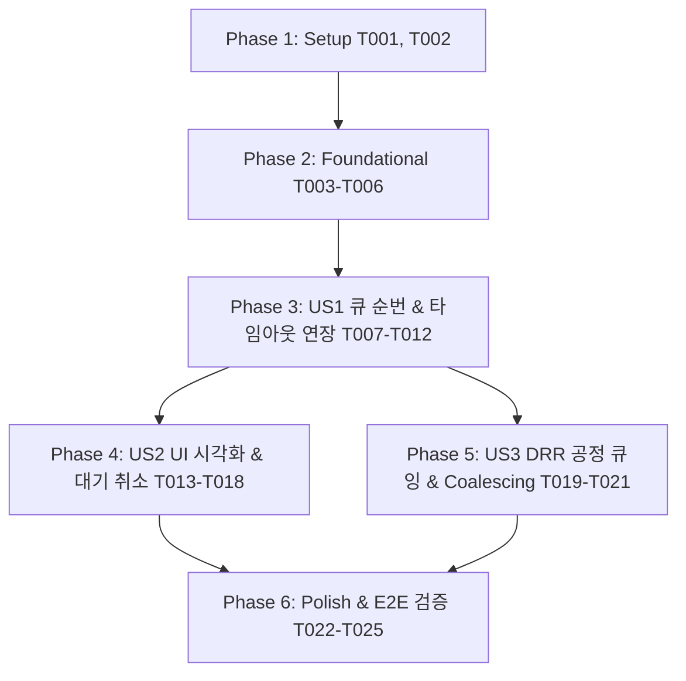

# Tasks: 031-gpu-queue-timeout-extension

**Input**: Design artifacts from `/specs/031-gpu-queue-timeout-extension/` (`spec.md`, `plan.md`, `data-model.md`, `contracts/queue_sse_contract.md`, `research.md`, `quickstart.md`)

---

## Phase 1: Setup (Shared Infrastructure)

**Purpose**: Project initialization and configuration setup

- [ ] T001 Initialize queue configuration environment variables (`MAX_GPU_CONCURRENT_SLOTS=1`, `QUEUE_CAPACITY=30`, `HEARTBEAT_INTERVAL_S=15`) in `model_gateway/src/core/config_manager.py`
- [ ] T002 [P] Configure client inactivity timeout parameters (`inactivity_timeout_s=15.0`) in `bteam/oliview_core/config.py`

---

## Phase 2: Foundational (Blocking Prerequisites)

**Purpose**: Core QueueTicket entities and variable-slot queue management engine

- [ ] T003 Create `QueueTicket`, `QueueStateEnum`, and `TenantProfile` data models in `model_gateway/src/core/queue_models.py`
- [ ] T004 Implement `AsyncFairQueue` core engine with dynamic semaphore (`active_slots=1` default) in `model_gateway/src/core/queue_manager.py`
- [ ] T005 [P] Create contract test for `POST /v1/chat/completions` SSE queue events in `model_gateway/tests/test_queue_contract.py`
- [ ] T006 [P] Create unit tests for `AsyncFairQueue` slot acquisition, release, and capacity guard in `model_gateway/tests/test_fair_queue.py`

**Checkpoint**: Foundation ready - Model Gateway queue engine can now manage tickets and slots.

---

## Phase 3: User Story 1 - 큐 진입 순번 안내 & 타임아웃 자동 연장 (Priority: P1) 🎯 MVP

**Goal**: GPU 슬롯 포화 시 신규 요청에 대해 큐 대기 상태를 생성하고, 15초 Keep-Alive 하트비트 및 순번 갱신을 통해 클라이언트 타임아웃(504 / ReadTimeout) 없이 정상 서빙.

**Independent Test**: 단일 GPU 연산 중 3개 이상의 요청 인입 시 `event: queue_status` 및 `: keepalive`가 스트리밍되어 클라이언트가 타임아웃 없이 정상 완료됨을 검증 (`quickstart.md` Scenario 1).

### Implementation for User Story 1
- [ ] T007 [US1] Integrate `AsyncFairQueue.enqueue()` into `/v1/chat/completions` handler in `model_gateway/src/api/routes/inference_api.py`
- [ ] T008 [US1] Implement 15-second background Keep-Alive task (`: keepalive\n\n`) during queue wait in `model_gateway/src/core/queue_manager.py`
- [ ] T009 [US1] Implement Event-Driven queue position broadcast ($N \to N-1$) in `model_gateway/src/core/queue_manager.py`
- [ ] T010 [US1] Implement Sliding Inactivity Timeout (`read=15.0s`, `timeout=None`) in `bteam/oliview_core/client.py`
- [ ] T011 [US1] Update `AiGatewayClient.generate_stream` to parse `event: queue_status` and forward to RAG callback in `bteam/oliview_core/client.py`
- [ ] T012 [US1] Add `StepEvent.QUEUE_WAITING` event and metadata forwarding in `bteam/oliview_core/callback.py` and `bteam/oliview_core/graph_orchestrator.py`

**Checkpoint**: At this point, User Story 1 is fully functional and eliminates timeouts under concurrency.

---

## Phase 4: User Story 2 - 실시간 대기 순번 UI 시각화 & 대기 취소 (Priority: P2)

**Goal**: Chat A(Streamlit) 및 Chat B(Web UI)에서 실시간 대기 순번/소요 시간 뱃지 렌더링 및 `[대기 취소]` 버튼 인터랙션 제공.

**Independent Test**: 다중 요청 시 UI에 "⏳ 대기 순번: 1번" 뱃지가 실시간 변경되고, 취소 클릭 시 1.0초 이내에 큐에서 즉시 방출됨을 확인.

### Implementation for User Story 2
- [ ] T013 [P] [US2] Implement `POST /v1/queue/cancel` endpoint in `model_gateway/src/api/routes/inference_api.py`
- [ ] T014 [US2] Implement `request.is_disconnected()` listener to automatically purge disconnected tickets in `model_gateway/src/core/queue_manager.py`
- [ ] T015 [US2] Update `StreamlitGraphAdapter` in `bteam/Oliview_chatbot_a/graph_adapter.py` to render real-time queue badge (`⏳ GPU 대기 중 (순번 N번)`)
- [ ] T016 [US2] Add queue waiting status UI and cancellation handling in `bteam/Oliview_chatbot_a/06.02.app.py`
- [ ] T017 [US2] Update SSE event generator in `bteam/Oliview_chatbot_b/project_ragapi.py` to bridge `queue_status` and add cancel proxy route
- [ ] T018 [US2] Update `bteam/Oliview_chatbot_b/index.html` to render dynamic `대기 순번: N번` badge and `[대기 취소]` button

**Checkpoint**: At this point, both Chat A and Chat B provide real-time queue visibility and user cancellation.

---

## Phase 5: User Story 3 - 테넌트 간 공정 스케줄링 & 중복 요청 병합 (Priority: P3)

**Goal**: Chat A와 Chat B 간의 Deficit Round Robin(DRR) 공정 큐잉 및 더블 클릭/네트워크 재시도 시 Request Coalescing 병합.

**Independent Test**: Chat A의 연속 질의 중 Chat B 질의 인입 시 기아 없이 교차 배정되고, 동일 질의 연타 시 1개의 GPU 슬롯만 사용하는지 검증.

### Implementation for User Story 3
- [ ] T019 [P] [US3] Implement Deficit Round Robin (DRR) tenant scheduler in `model_gateway/src/core/queue_manager.py`
- [ ] T020 [US3] Implement Request Coalescing (prompt hash deduplication & stream multiplexing) in `model_gateway/src/core/queue_manager.py`
- [ ] T021 [US3] Add `X-Tenant-Id` header injection in `bteam/oliview_core/client.py` and `bteam/Oliview_chatbot_b/project_ragapi.py`

**Checkpoint**: All user stories functional, fair, and idempotent.

---

## Phase 6: Polish & Cross-Cutting Verification

**Purpose**: E2E validation, Docker synchronization, and regression testing

- [ ] T022 [P] Add concurrency stress test script in `bteam/tests/integration/test_concurrency_queue.py`
- [ ] T023 Run end-to-end multi-client concurrency verification scenario per `quickstart.md`
- [ ] T024 Sync changes to Docker containers (`docker restart aiservice-model-gateway oliview_chatbot_a oliview_chatbot_b`)
- [ ] T025 Update `specs/031-gpu-queue-timeout-extension/quickstart.md` with final verification results

---

## Dependencies & Execution Order

### Parallel Opportunities
- **Phase 1**: `T002` [P] parallel with `T001`.
- **Phase 2**: `T005` [P] and `T006` [P] parallel with `T004`.
- **Phase 4 & 5**: Once US1 completes, US2 (UI Cancel) and US3 (DRR & Coalescing) can proceed in parallel.
- **Phase 6**: `T022` [P] parallel with doc updates.
