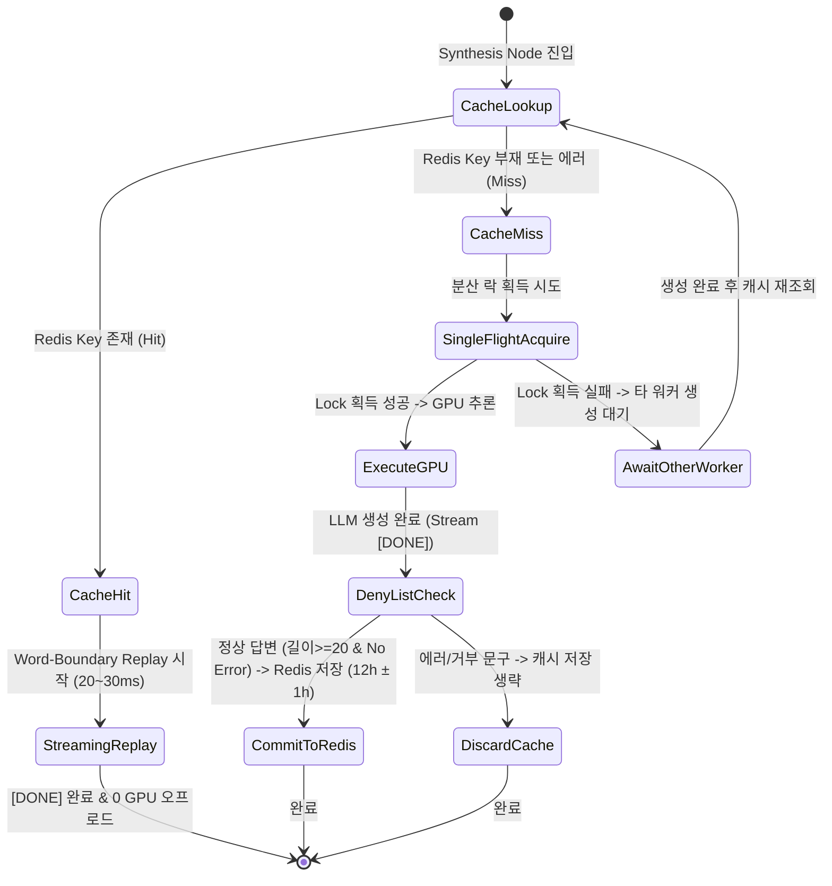

# Data Model: 032-llm-response-caching

**Feature**: `032-llm-response-caching`  
**Date**: 2026-08-26  
**Status**: Ready  

---

## 1. Entities & Schema Definitions

### 1.1 `L5CacheKeyParams` (캐시 키 생성 입력 파라미터)
L5 고유 캐시 키를 도출하기 위해 정규화 및 결합되는 인자 명세:

```python
class L5CacheKeyParams(BaseModel):
    tenant_id: str = Field(default="chata", description="서비스 테넌트 식별자 (chata, chatb)")
    rewritten_query: str = Field(..., description="대명사 해소 및 탈맥락화된 사용자 질의")
    doc_ids: List[str] = Field(..., description="리랭킹 상위 선별 문서 ID 목록")
    model_id: str = Field(default="qwen3.5-2b", description="LLM 모델 식별자")
    prompt_version: str = Field(default="v1.0", description="시스템 프롬프트 템플릿 버전")
```

* **정규화 및 해시 규칙**:
  1. `cleaned_query = re.sub(r'\s+', ' ', unicodedata.normalize('NFKC', rewritten_query)).strip().lower()`
  2. `doc_ids_sorted = sorted(str(d) for d in doc_ids)`
  3. `doc_ids_hash = hashlib.sha256(",".join(doc_ids_sorted).encode('utf-8')).hexdigest()[:16]`
  4. `raw_payload = f"{tenant_id}:{cleaned_query}:{doc_ids_hash}:{model_id}:{prompt_version}"`
  5. `key_hash = hashlib.sha256(raw_payload.encode('utf-8')).hexdigest()[:32]`
  6. **최종 Redis Key**: `olliview:l5:{tenant_id}:{key_hash}`

---

### 1.2 `L5ResponseCachePayload` (Redis 직렬화 엔티티)
Redis에 JSON 문자열 또는 바이너리로 저장되는 완성된 LLM 응답 페이로드:

```python
class L5ResponseCachePayload(BaseModel):
    response_text: str = Field(..., description="완성된 전체 마크다운 답변 텍스트 (길이 >= 20)")
    model_id: str = Field(default="qwen3.5-2b", description="생성에 사용된 모델 식별자")
    prompt_version: str = Field(default="v1.0", description="프롬프트 템플릿 버전")
    tenant_id: str = Field(..., description="서비스 테넌트 식별자")
    doc_ids_hash: str = Field(..., description="참조된 RAG 문서 목록 해시")
    created_at: float = Field(..., description="캐시 생성 유닉스 타임스탬프")
    estimated_tokens: int = Field(default=0, description="생성된 토큰 수 추정치")
```

* **유효성 검증 규칙 (Validation Rules)**:
  * `len(response_text) >= 20` (단문 오류 방지)
  * `any(deny in response_text for deny in DENY_LIST) == False` (오염 방지)
  * `created_at > 0`

---

### 1.3 `CacheReplayChunk` (스트리밍 Replay 패킷)
캐시된 답변을 단어 단위 스트리밍으로 Replay할 때 생성되는 데이터 구조:

```python
class CacheReplayChunk(BaseModel):
    chunk_index: int = Field(..., description="스트리밍 청크 순번 (0-indexed)")
    delta_content: str = Field(..., description="단어/공백 단위 텍스트 증분")
    is_cached: bool = Field(default=True, description="캐시 히트 여부 플래그")
    latency_saved_s: float = Field(default=0.0, description="절감된 GPU 추론 시간 추정치")
```

---

## 2. State & Lifecycle Transitions


