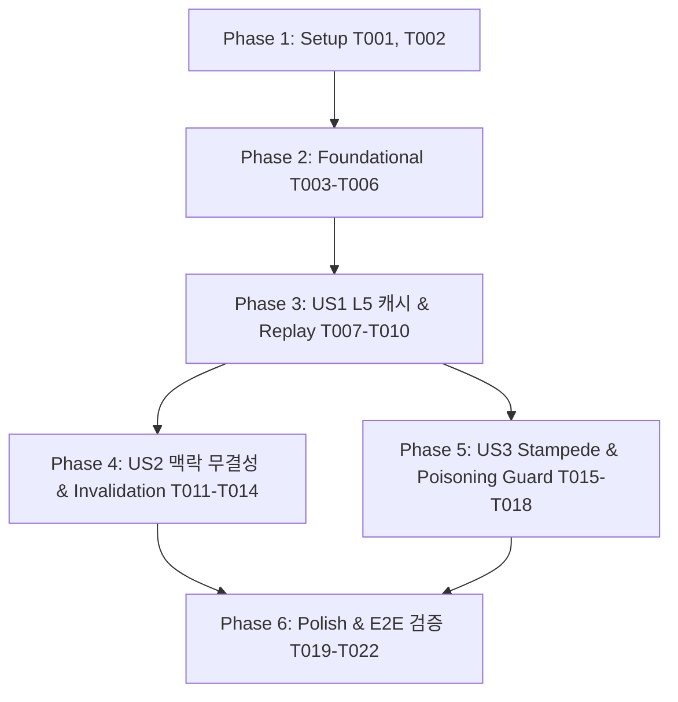

# Tasks: 032-llm-response-caching

**Input**: Design artifacts from `/specs/032-llm-response-caching/` (`spec.md`, `plan.md`, `data-model.md`, `contracts/l5_cache_contract.md`, `research.md`, `quickstart.md`)

---

## Phase 1: Setup (Shared Infrastructure)

**Purpose**: Project initialization and configuration setup

- [x] T001 Initialize L5 Redis configuration parameters (`redis_ttl_llm_response=43200`, `redis_ttl_llm_jitter=3600`, `enable_l5_cache=True`) in `bteam/oliview_core/config.py`
- [x] T002 [P] Define `L5CacheKeyParams`, `L5ResponseCachePayload`, and `CacheReplayChunk` Pydantic models in `bteam/oliview_core/types.py`

---

## Phase 2: Foundational (Blocking Prerequisites)

**Purpose**: Core L5 Redis helper functions, key builders, and Replay stream generators

**⚠️ CRITICAL**: No user story work can begin until this phase is complete

- [x] T003 [P] Create unit test suite for L5 cache key generation, normalization, and TTL jitter in `bteam/tests/unit/test_l5_cache.py`
- [x] T004 [P] Implement `build_l5_key()` with Unicode NFKC, whitespace collapsing, and sorted doc_ids hashing in `bteam/oliview_core/redis_pool.py`
- [x] T005 Implement `get_l5_response()` (0.2s Fail-Fast timeout) and `set_l5_response()` with TTL Jitter in `bteam/oliview_core/redis_pool.py`
- [x] T006 [P] Implement `replay_cached_stream()` word-boundary async generator in `bteam/oliview_core/redis_pool.py`

**Checkpoint**: Foundation ready - L5 cache engine and replay utilities are ready for node integration.

---

## Phase 3: User Story 1 - 동일 질문에 대한 초고속 LLM 캐시 응답 (Priority: P1) 🎯 MVP

**Goal**: 완전히 동일한 질문 재인입 시 GPU 추론(4~8초)을 건너뛰고 Redis L5 캐시에서 즉시 인출하여 TTFT < 50ms로 단어 단위 고속 스트리밍 답변을 제공.

**Independent Test**: "차앤박 프로폴리스 앰플 장점 알려줘" 질의를 1회 실행하여 캐시 생성 후, 2회차 재질의 시 GPU 슬롯을 점유하지 않고 50ms 이내에 응답이 스트리밍 완료됨을 검증 (`quickstart.md` Scenario 1).

### Tests for User Story 1
- [x] T007 [P] [US1] Create contract and unit tests for L5 cache hit replay and TTFT < 50ms in `bteam/tests/unit/test_l5_replay.py`

### Implementation for User Story 1
- [x] T008 [US1] Integrate L5 cache lookup and `replay_cached_stream` into `bteam/oliview_core/nodes/synthesis_node.py` before `generate_stream`
- [x] T009 [US1] Collect full stream completion text and commit to L5 cache upon successful generation in `bteam/oliview_core/nodes/synthesis_node.py`
- [x] T010 [US1] Update `stream_rag` in `bteam/oliview_core/graph_orchestrator.py` to handle `is_cached: true` step events and observability metadata

**Checkpoint**: User Story 1 is fully functional and delivers 100% GPU offloading for exact query cache hits.

---

## Phase 4: User Story 2 - RAG 컨텍스트 갱신 및 멀티턴 맥락 무결성 보장 (Priority: P2)

**Goal**: 멀티턴 대명사 질의("이거 얼마야?")를 탈맥락화하여 맥락 오염을 차단하고, 리뷰 크롤링/분석 배치가 돌아 문서 내용이 바뀌면 자동 캐시 미스를 유발하여 최신성 보장.

**Independent Test**: "헤라 블랙쿠션" 질의 후 "이거 지속력 어때?"를 질의했을 때 롬앤 쿠션 캐시와 충돌하지 않고 정확한 헤라 쿠션 답변이 생성되는지 검증 (`quickstart.md` Scenario 2).

### Tests for User Story 2
- [x] T011 [P] [US2] Create unit tests for multi-turn rewritten query and doc IDs hash invalidation in `bteam/tests/unit/test_l5_invalidation.py`

### Implementation for User Story 2
- [x] T012 [US2] Connect `state["rewritten_query"]` from `bteam/oliview_core/nodes/router_node.py` to `synthesis_node.py` L5 key builder
- [x] T013 [US2] Integrate top-K doc_ids from `bteam/oliview_core/nodes/rerank_node.py` into `synthesis_node.py` L5 key calculation
- [x] T014 [US2] Add `tenant_id` namespace parameter propagation from `graph_orchestrator.py` to `synthesis_node.py`

**Checkpoint**: User Stories 1 AND 2 are both active and preserve 100% data and conversation integrity.

---

## Phase 5: User Story 3 - Cache Stampede 방지 및 안전성 가드레일 (Priority: P3)

**Goal**: 인기 질의 캐시 만료 시 SingleFlight 분산 락으로 GPU 스파이크를 방어하고, 에러/인젝션 문구가 캐시에 영구 적재(Poisoning)되는 것을 차단.

**Independent Test**: 동일 질의 3건 동시 유입 시 GPU 추론 1회만 발생하고 나머지는 캐시를 대기/공유하며, 20자 미만 응답은 캐시되지 않음을 검증 (`quickstart.md` Scenario 3).

### Tests for User Story 3
- [x] T015 [P] [US3] Create unit tests for SingleFlight concurrent stampede and Poisoning Deny-List in `bteam/tests/unit/test_l5_stampede_guard.py`

### Implementation for User Story 3
- [x] T016 [US3] Implement `SingleFlightLock` wrapper around L5 cache miss in `bteam/oliview_core/nodes/synthesis_node.py`
- [x] T017 [US3] Implement `Poisoning Deny-List Guard` (blocking error phrases, refusals, <20 chars) before `set_l5_response` in `bteam/oliview_core/redis_pool.py`
- [x] T018 [US3] Implement `Cache-Control: no-cache` and `X-Bypass-Cache: true` bypass support in `bteam/oliview_core/nodes/synthesis_node.py`

**Checkpoint**: All user stories functional, protected against stampedes, and immune to cache poisoning.

---

## Phase 6: Polish & Cross-Cutting Verification

**Purpose**: E2E validation, Docker synchronization, and regression testing

- [x] T019 [P] Create end-to-end integration test suite in `bteam/tests/integration/test_l5_cache_integration.py`
- [x] T020 Run end-to-end quickstart validation scenarios per `quickstart.md`
- [x] T021 Sync changes to Docker containers (`docker restart oliview_chatbot_a oliview_chatbot_b`)
- [x] T022 Update `specs/032-llm-response-caching/quickstart.md` with final verification results

---

## Dependencies & Execution Order

---

## Implementation Strategy

### MVP First (User Story 1 Only)
1. Complete Phase 1: Setup (T001, T002)
2. Complete Phase 2: Foundational (T003 ~ T006)
3. Complete Phase 3: User Story 1 (T007 ~ T010)
4. **STOP and VALIDATE**: Verify TTFT < 50ms on warm query
5. Proceed to US2 and US3
