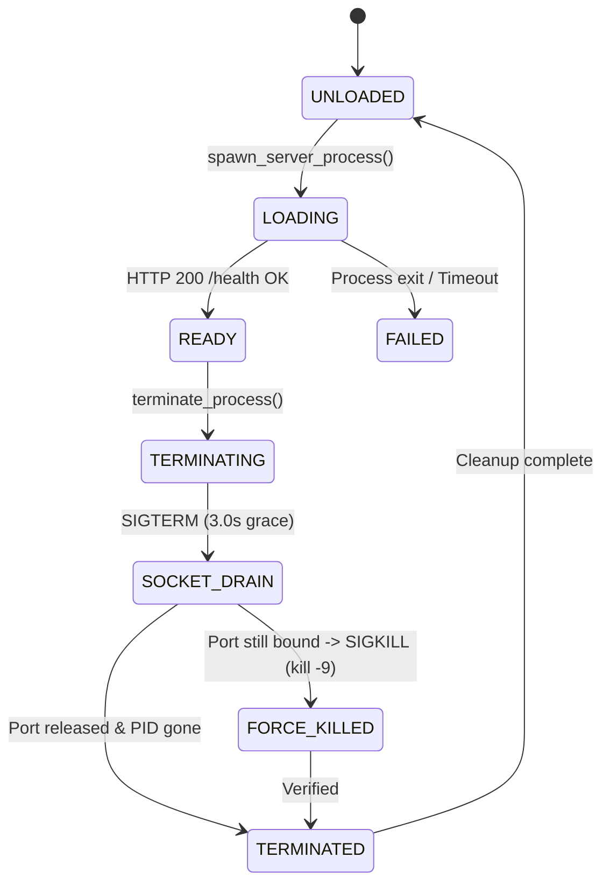

# Data Model: Dynamic Context Sizing, Hardware Profiling & Zero-Hardcoding

**Feature**: `034-audit-config-oom-guards`  
**Date**: 2026-08-26  
**Status**: Completed

---

## 1. 하드웨어 티어 및 동적 프로파일 스키마 (Pydantic v2)

```python
from enum import Enum
from typing import Optional, List, Dict, Any
from pydantic import BaseModel, Field


class HardwareTierEnum(str, Enum):
    TIER_1_8GB = "tier_1_8gb"          # GTX 1070 / RTX 2060 (2B @ 16K~32K)
    TIER_2_11GB = "tier_2_11gb"        # GTX 1080Ti (4B @ 32K~48K)
    TIER_3_12GB = "tier_3_12gb"        # RTX 3060 / 4070 (4B @ 64K)
    TIER_4_16GB = "tier_4_16gb"        # RTX 4080 (4B @ 128K or 9B @ 32K)
    TIER_5_24GB = "tier_5_24gb"        # RTX 3090 / 4090 / A100 (9B @ 128K)


class DynamicHardwareProfile(BaseModel):
    """실시간 물리 GPU VRAM 및 Compute Capability 실측 기반 프로파일"""
    device_name: str = Field(..., description="GPU 장치명 (예: NVIDIA GeForce GTX 1070)")
    compute_capability: float = Field(..., description="CUDA Compute Capability (예: 6.1, 8.6, 8.9)")
    total_vram_mb: int = Field(..., description="전체 물리 VRAM (MB)")
    free_vram_mb: int = Field(..., description="현재 가용 VRAM (MB)")
    hardware_tier: HardwareTierEnum = Field(..., description="산출된 하드웨어 티어")
    supports_flash_attn: bool = Field(..., description="FlashAttention 지원 여부 (SM >= 8.0)")
    recommended_model: str = Field(..., description="VRAM 최적 추천 상주 모델 (qwen3.5-2b / qwen3.5-4b / qwen3.5-9b)")
    dynamic_n_ctx: int = Field(..., description="VRAM 예산 기반 동적 산출 최대 컨텍스트 윈도우")
    use_q8_kv: bool = Field(default=True, description="Q8_0 KV Cache 양자화 활성화 여부")


class ConfigAuditReport(BaseModel):
    """전사 하드코딩 및 설정 우선순위 정합성 감사 레포트"""
    scanned_files_count: int = Field(..., description="점검된 전체 소스코드 파일 수")
    hardcoded_fallbacks_found: int = Field(default=0, description="발견된 레거시 하드코딩 잔재 수")
    shadowed_configs_fixed: int = Field(default=0, description="교정된 설정값 덮어쓰기 항목 수")
    is_fully_compliant: bool = Field(default=True, description="전사 하드코딩 0건 및 SSOT 규격 준수 여부")
```

---

## 2. 프로세스 생명주기 및 좀비 방어 상태 머신


