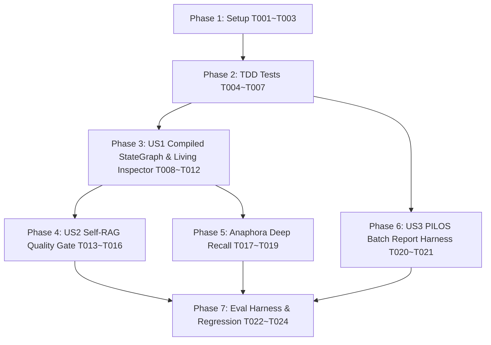

# Tasks: Spec 035 - Agentic AI Architecture, Harness Engineering & Dynamic Context Window Expansion

**Branch**: `035-service-context-window-expansion` | **Spec**: [`spec.md`](file:///c:/AISERVICE/specs/035-service-context-window-expansion/spec.md) | **Plan**: [`plan.md`](file:///c:/AISERVICE/specs/035-service-context-window-expansion/plan.md)

---

## Phase 1: Setup (Pydantic Schemas & Shared Models)

**Purpose**: 3-Tier 컨텍스트 하네스, Self-RAG 판정, Living Inspector 이벤트 및 StateGraph 데이터 모델 정의

- [x] T001 Create Pydantic data schemas (`QualityGradeVerdict`, `LivingInspectorEvent`, `DeepRecallTurnPayload`, `ContextHarnessProfile`, `RagGraphState`) in `bteam/oliview_core/graph_state.py`
- [x] T002 Implement 3-Tier (`16K_BASELINE`, `32K_STANDARD`, `ULTRA`) Dynamic Context Budgeting logic in `bteam/oliview_core/config.py`
- [x] T003 [P] Implement `PreFlightContextGuard` (85% safe margin validation) in `bteam/oliview_core/guardrail.py`

---

## Phase 2: Foundational (TDD Tests & Prerequisites)

**Purpose**: 비동기 컴파일드 StateGraph, Self-RAG 품질 검증, 암묵적 역참조 회상 및 예산 분배 TDD 테스트 선행 작성

**⚠️ CRITICAL**: 사용자 스토리 구현 전 테스트 선행 작성 및 검증

- [x] T004 [P] Create TDD unit test for 3-Tier Context Budgeting in `bteam/tests/test_dynamic_context_harness.py`
- [x] T005 [P] Create TDD unit test for Self-RAG Quality Gate in `bteam/tests/test_self_rag_quality_gate.py`
- [x] T006 [P] Create TDD unit test for Implicit Anaphora & Deep Recall in `bteam/tests/test_anaphora_deep_recall.py`
- [x] T007 [P] Create TDD integration test for LangGraph Compiled StateGraph in `bteam/tests/test_compiled_stategraph.py`

**Checkpoint**: Foundational TDD tests ready.

---

## Phase 3: User Story 1 (Priority: P1) 🎯 MVP - True Compiled StateGraph & Living Process Inspector

**Goal**: 절차형 파이프라인을 `langgraph.graph.StateGraph` 컴파일드 런타임으로 전면 승격하고, 16K/32K 컨텍스트 하네스 및 실시간 동적 DAG UI 인스펙터 구현

**Independent Test**: 다중 제품 비교 질의 실행 시 컴파일된 StateGraph가 실행되고, 5~15개 리뷰가 16K/32K 샌드박스로 조립되며, UI Inspector에 동적 노드와 마이크로 뱃지가 렌더링되는지 검증

### Implementation for User Story 1

- [x] T008 [US1] Update `router_node.py` and `search_node.py` in `bteam/oliview_core/nodes/` to dynamically scale candidate pools based on `ContextHarnessProfile`
- [x] T009 [US1] Refactor `bteam/oliview_core/nodes/context_node.py` to assemble 16K (10,000 tokens) and 32K (22,000 tokens) high-density XML sandbox contexts
- [x] T010 [US1] Refactor `bteam/oliview_core/nodes/synthesis_node.py` to accept expanded output token budgets (2,048 ~ 4,096 tokens)
- [x] T011 [US1] Refactor `bteam/oliview_core/graph_orchestrator.py` to instantiate `langgraph.graph.StateGraph`, define edges, compile, and stream SSE events via `astream_events`
- [x] T012 [US1] Refactor frontend `bteam/Oliview_chatbot_b/index.html` to implement `Living Agent Inspector` with dynamic DOM node insertion, sub-branch styling (`↳ 🔄`), micro-telemetry badges, and auto-collapse

**Checkpoint**: User Story 1 MVP fully functional and independently testable.

---

## Phase 4: User Story 2 (Priority: P2) - Active Agentic Reflection & Retrieval Quality Gate (Self-RAG)

**Goal**: 1차 검색 품질 평가(`QualityGradeNode`) 및 사전 동의어 + Fast LLM 문맥 재작성 하이브리드 재검색 루프(최대 1회) 구축

**Independent Test**: 모호한 복합 질의 주입 시 1차 점수 미달을 감지하여 StateGraph 조건부 엣지가 재검색 노드로 분기하고, 하이브리드 쿼리로 2차 보량 검색을 완결하는지 검증

### Implementation for User Story 2

- [x] T013 [US2] Implement `bteam/oliview_core/nodes/quality_grade_node.py` to evaluate rerank scores and candidate sufficiency
- [x] T014 [US2] Implement `bteam/oliview_core/nodes/reformulation_node.py` to perform hybrid query expansion (alias dictionary + fast LLM context query)
- [x] T015 [US2] Configure conditional routing edges (`should_retry_search`) and 1-iteration loop guard in `bteam/oliview_core/graph_orchestrator.py`
- [x] T016 [US2] Integrate `LivingInspectorEvent` for reformulation branch (`is_branch: true`, `↳ 🔄 2차 재검색 중`) into `graph_orchestrator.py` and `index.html`

**Checkpoint**: User Stories 1 AND 2 fully functional together.

---

## Phase 5: User Story 1 Extension - Implicit Anaphora Resolution & Redis On-Demand Deep Recall

**Goal**: 비명시적 대명사 질의("아까 그 크림") 시 3단계 파이프라인으로 대상 턴을 O(1)/유사도 매칭하고 Redis L4에서 원본 스펙을 온디맨드 복원 주입

**Independent Test**: 15턴 이전의 과거 대화에 대해 "아까 그 크림" 질문 시 Redis L4에서 Turn 7 원본 스펙을 복원하여 100% 무손실 답변을 생성하는지 검증

### Implementation for Anaphora Deep Recall

- [x] T017 [US1] Implement hierarchical memory summary with `[Turn N: Entity/Attribute]` metadata tags in `bteam/oliview_core/session.py`
- [x] T018 [US1] Implement 3-stage Anaphora Resolution & in-memory BGE cosine similarity matching in `bteam/oliview_core/anaphora_resolver.py`
- [x] T019 [US1] Implement `bteam/oliview_core/nodes/deep_recall_node.py` to query Redis L4 session cache and inject `<recalled_context>` sandbox

---

## Phase 6: User Story 3 (Priority: P2) - PILOS (A-Team) Large Batch Report Execution Harness

**Goal**: PILOS 일일/주간 감성 리포트 생성 시 30~60건 이상의 뉴스 기사를 단일 프롬프트에 일괄 주입하는 `PilosExecutionHarness` 구축

**Independent Test**: 50건 뉴스 기사를 단일 프롬프트로 전송하여 Truncation 없이 종합 감성 지수 및 3대 핵심 이슈 요약 보고서가 생성되는지 검증

### Implementation for User Story 3

- [x] T020 [US3] Implement `PilosExecutionHarness` in `ateam/pilos-sentiment-index/pilos/collection/ai_clients/llm_report_client.py`
- [x] T021 [US3] Create validation benchmark test in `ateam/pilos-sentiment-index/tests/test_llm_report_harness.py`

---

## Phase 7: User Story 4 (Priority: P3) & Polish - Evaluation Benchmark & Full Regression

**Purpose**: 16K/32K 대용량 컨텍스트 벤치마크, 전사 5대 회귀 테스트 스위트 통과 및 검증 가이드 완결

- [x] T022 [US4] Create automated evaluation benchmark script `bteam/tests/run_evaluation_harness.py` measuring faithfulness, TTFT, and context utilization
- [x] T023 Run full regression test suites across `bteam/` and `model_gateway/`
- [x] T024 Update `specs/035-service-context-window-expansion/quickstart.md` with live container execution logs and benchmark results

---

## Dependencies & Execution Order

---

## Parallel Execution Opportunities

- **Phase 1**: `T003` (Guardrail) can run in parallel with `T001` & `T002`.
- **Phase 2**: `T004`, `T005`, `T006`, `T007` (TDD unit tests) can all be authored in parallel across independent test files.
- **Phase 6**: `T020` & `T021` (PILOS A-Team) can be developed in parallel with B-Team tasks.
