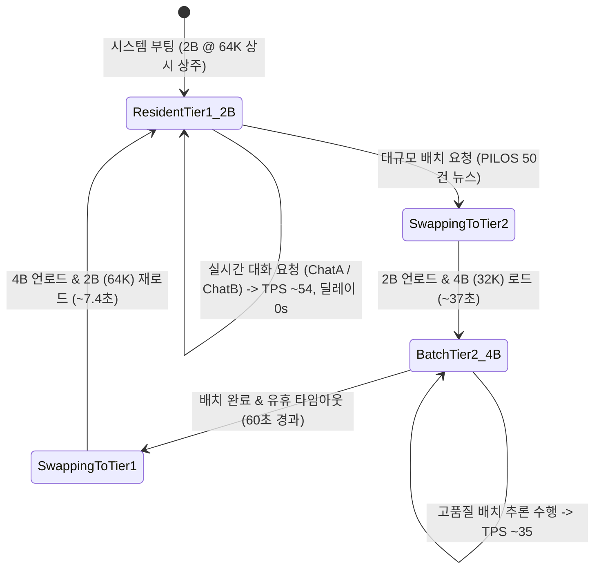

# Data Model & Entity Specifications: 036-hardware-context-benchmark-expansion

**Feature**: [spec.md](./spec.md) | **Plan**: [plan.md](./plan.md)  
**Date**: 2026-08-26  
**Status**: Complete

---

## 1. Entities & Schemas

### 1) HardwareTierEnum
플랫폼 GPU VRAM 용량에 따른 하드웨어 티어 분류 열거형입니다.

```python
from enum import Enum

class HardwareTierEnum(str, Enum):
    BASELINE_8GB = "BASELINE_8GB"          # GTX 1070, GTX 1080 (VRAM < 11GB)
    MID_16GB_24GB = "MID_16GB_24GB"        # RTX 3060 12GB, RTX 4070 16GB, RTX 3090/4090 24GB (11GB <= VRAM < 40GB)
    HIGH_48GB_PLUS = "HIGH_48GB_PLUS"      # A100 40GB/80GB, H100 80GB, Dual RTX 4090 (VRAM >= 40GB)
```

---

### 2) ModelContextCapacityProfile
각 모델별 실측 VRAM 가중치, 컨텍스트 스케일링 한도 및 TPS 성능 기준을 정의하는 엔티티입니다.

```python
from pydantic import BaseModel, Field
from typing import List, Dict, Optional

class ModelContextCapacityProfile(BaseModel):
    model_id: str = Field(..., description="모델 고유 식별자 (예: qwen3.5-2b, qwen3.5-4b)")
    display_name: str = Field(..., description="모델 표시 이름")
    quant_type: str = Field(default="q4_k_m", description="가중치 양자화 포맷")
    vram_weight_mb: int = Field(..., description="모델 순수 가중치 VRAM 점유량 (MB)")
    default_n_ctx: int = Field(default=65536, description="기본 서빙 컨텍스트 (tokens)")
    max_safe_n_ctx: int = Field(default=131072, description="실측 최대 안전 컨텍스트 (tokens)")
    context_buffer_costs_mb: Dict[int, int] = Field(
        default_factory=dict,
        description="컨텍스트 윈도우별 추가 Compute Buffer VRAM 비용 매핑 (예: {16384: 493, 32768: 598, 65536: 810, 131072: 1100})"
    )
    measured_tps: float = Field(..., description="실측 토큰 생성 속도 (tokens/sec)")
    measured_ttft_ms: float = Field(..., description="실측 첫 토큰 지연 시간 (ms)")
    min_tps_sla: float = Field(default=30.0, description="보장 최소 생성 속도 SLA (tokens/sec)")
```

---

### 3) HardwarePlatformProfile
시스템 부팅 및 실시간 텔레메트리를 통해 판정된 현재 노드의 하드웨어 서빙 프로파일입니다.

```python
class HardwarePlatformProfile(BaseModel):
    tier: HardwareTierEnum
    device_name: str
    compute_capability: float
    total_vram_mb: int
    free_vram_mb: int
    system_reserved_vram_mb: int = Field(default=1350, description="OS/GUI 예약 VRAM")
    aux_models_reserved_mb: int = Field(default=1600, description="BGE-M3 + Reranker 예약 VRAM")
    recommended_resident_model: str = Field(..., description="상시 서빙 권장 모델 (예: qwen3.5-2b)")
    recommended_batch_model: str = Field(..., description="고품질 배치 권장 모델 (예: qwen3.5-4b)")
    resident_standard_n_ctx: int = Field(default=65536, description="상시 모델 표준 컨텍스트")
    resident_ultra_n_ctx: int = Field(default=131072, description="상시 모델 울트라 컨텍스트")
    batch_standard_n_ctx: int = Field(default=32768, description="배치 모델 표준 컨텍스트")
    use_flash_attn: bool
    use_q8_kv: bool
```

---

### 4) ContextHarnessProfile (B-Team & A-Team Client Layer)
챗봇 및 분석 파이프라인에서 사용하는 3-Tier 컨텍스트 하네스 설정입니다.

```python
class ContextTierEnum(str, Enum):
    BASELINE_16K = "16K_BASELINE"
    STANDARD_64K = "64K_STANDARD"
    ULTRA_128K = "128K_ULTRA"

class ContextHarnessProfile(BaseModel):
    tier: ContextTierEnum = ContextTierEnum.STANDARD_64K
    n_ctx: int = 65536
    max_output_tokens: int = 4096
    max_input_tokens: int = 61440
    reviews_per_target_cap: int = 15      # 64K 환경에서 타겟당 최대 15개 리뷰 인용
    pilos_news_batch_cap: int = 60        # 64K 환경에서 일일 뉴스 최대 60건 일괄 주입
    system_prompt_budget: int = 1500
    preflight_safe_margin: float = 0.85   # 85% 안전 마진 임계치
```

---

## 2. State Transitions & Lifecycle (상태 전이 모델)


