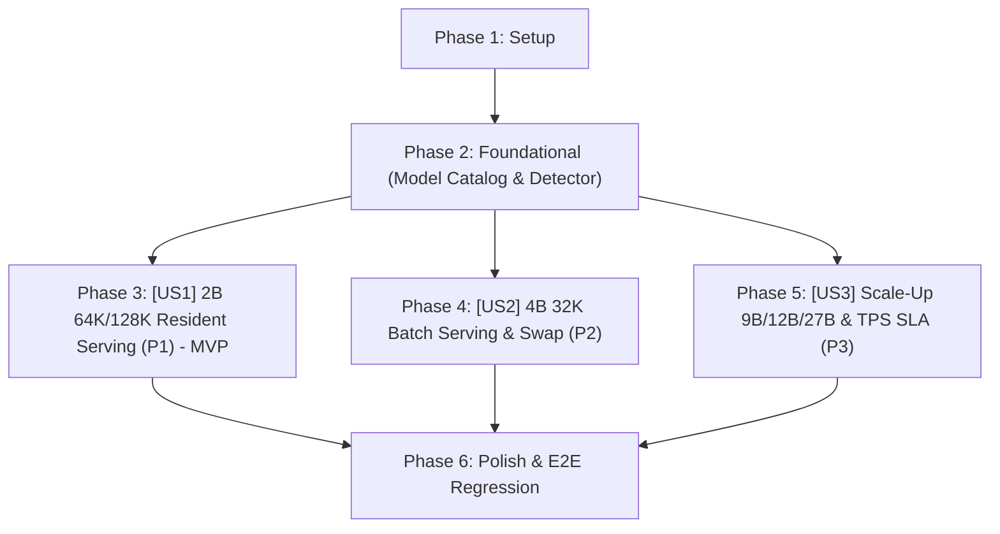

# Tasks: 036-hardware-context-benchmark-expansion

**Input**: Design documents from [`specs/036-hardware-context-benchmark-expansion/`](./)  
**Spec**: [spec.md](./spec.md) | **Plan**: [plan.md](./plan.md) | **Data Model**: [data-model.md](./data-model.md) | **Quickstart**: [quickstart.md](./quickstart.md)

---

## Dependencies & Execution Strategy

- **MVP Scope**: Phase 1 + Phase 2 + Phase 3 (User Story 1 - 2B 64K 상시 서빙 완결)
- **Parallel Opportunities**: US1, US2, US3의 모델 카탈로그 및 클라이언트 설정 업데이트는 병렬 실행 가능 (`[P]`)

---

## Phase 1: Setup & Initialization

- [x] T001 Initialize branch context and verify container readiness in `model_gateway/src/benchmark_hardware_limits.py`
- [x] T002 Verify Docker service connectivity between `vllm-serv` and `oliview_chatbot_b`

---

## Phase 2: Foundational Prerequisites (Model Catalog & Hardware Profiles)

- [x] T003 Update model catalog in `model_gateway/config/model_catalog.json` for `qwen3.5-2b` (`default_n_ctx=65536`, `max_n_ctx=131072`) and `qwen3.5-4b` (`default_n_ctx=32768`)
- [x] T004 Define `HardwareTierEnum` and `HardwarePlatformProfile` schemas in `model_gateway/src/core/gpu_detector.py`
- [x] T005 Update `calculate_3axis_dynamic_context` in `model_gateway/src/core/gpu_detector.py` to reflect empirical 8GB VRAM budgets and Pascal FA fallback

---

## Phase 3: User Story 1 (P1) - Qwen 3.5 2B 상시 서빙 (64K Standard / 128K Ultra)

**Goal**: Qwen 3.5 2B를 64K Standard 및 128K Ultra 모드로 VRAM에 상시 고정 상주시켜 0초 로드 대기 시간, 50+ TPS, 0.2s TTFT 초고속 응답성을 제공.  
**Independent Test**: `quickstart.md` 시나리오 1 실행 (2B @ 64K 한국어 질의 호출 시 TTFT $\le 300\text{ms}$, TPS $\ge 50\text{ tokens/s}$).

- [x] T006 [P] [US1] Configure default resident model parameters in `model_gateway/src/core/process_manager.py` for `qwen3.5-2b` at 64K Standard
- [x] T007 [P] [US1] Update 3-Tier Harness profile in `oliview_core/config.py` to support `STANDARD_64K` (65,536 tokens) and `ULTRA_128K` (131,072 tokens)
- [x] T008 [US1] Expand review citation cap to 15 per target in `oliview_core/config.py`
- [x] T009 [US1] Implement `/v1/profile` and `/v1/hardware/capacity` capacity inspection endpoints in `model_gateway/src/api/routes.py`
- [x] T010 [US1] Verify 2B 64K and 128K live inference in `oliview_chatbot_b` container

---

## Phase 4: User Story 2 (P2) - Qwen 3.5 4B 고품질 배치 32K 서빙 및 지능형 스왑

**Goal**: Qwen 3.5 4B 모델을 32K 모드로 온디맨드 스케줄링하여 대규모 뉴스 50건 분석 및 심층 리포트를 35 TPS로 안정 수행하고 자동 복귀.  
**Independent Test**: `quickstart.md` 시나리오 2 실행 (4B 32K 스왑 로드 후 뉴스 분석 완결 및 2B 자동 복귀).

- [x] T011 [P] [US2] Configure 4B batch profile (`default_n_ctx=32768`, `use_flash_attn=False` on Pascal) in `model_gateway/src/core/process_manager.py`
- [x] T012 [P] [US2] Update PILOS news batch injection capacity to 60 articles in `oliview_core/config.py`
- [x] T013 [US2] Implement idle timeout auto-revert mechanism (4B ➔ 2B 64K after 60s inactivity) in `model_gateway/src/core/process_manager.py`
- [x] T014 [US2] Verify 4B 32K batch inference and clean swap latency in `vllm-serv` container

---

## Phase 5: User Story 3 (P3) - 고성능 플랫폼 스케일업(9B, 12B, 27B) 및 TPS SLA 라우팅

**Goal**: 16GB, 24GB, 48GB+ GPU 환경에서 `model_catalog.json`의 9B/12B/27B 모델을 VRAM 예산 및 TPS $\ge 30\text{ tokens/s}$ SLA에 따라 자동 선별·서빙.  
**Independent Test**: 다양한 VRAM 티어(8GB, 16GB, 24GB, 80GB) 시뮬레이션 단위 테스트 통과.

- [x] T015 [P] [US3] Implement dynamic model recommendation logic for 9B, 12B, and 27B based on detected VRAM in `model_gateway/src/core/gpu_detector.py`
- [x] T016 [P] [US3] Implement TPS SLA monitoring and automatic fallback guard in `model_gateway/src/core/process_manager.py`
- [x] T017 [US3] Add unit tests for hardware tiering and auto-scaling rules in `model_gateway/tests/test_hardware_scaling_tiers.py`

---

## Phase 6: Polish, E2E Integration & 7-Suite Regression Verification

- [x] T018 Run Model Gateway unit tests with `pytest model_gateway/tests`
- [x] T019 Run B-Team 7-Suite Regression Test Runner in `docker compose exec -T oliview_chatbot_b python tests/run_all_regression_tests.py`
- [x] T020 Validate VRAM telemetry and log zero memory leaks via `nvidia-smi`
