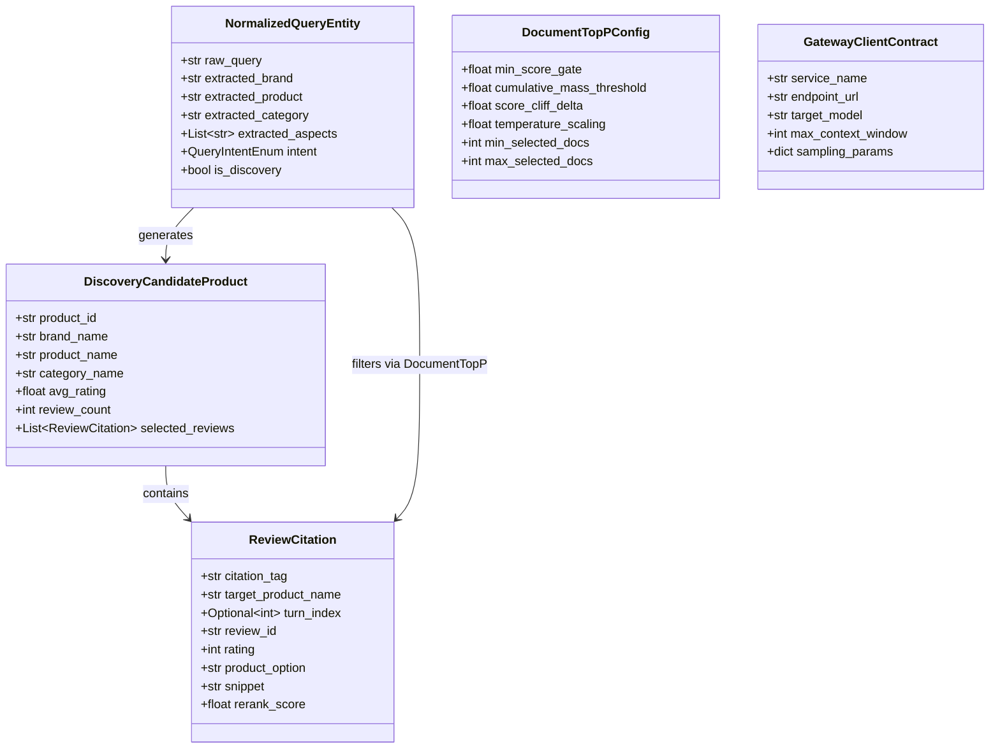

# Data Model: 037-cross-service-llm-integration-and-citation-fix

**Branch**: `037-cross-service-llm-integration-and-citation-fix`  
**Date**: 2026-08-26  
**Status**: Completed  

---

## 1. Entity Overview



---

## 2. Entity Details

### 2.1 NormalizedQueryEntity
```python
from dataclasses import dataclass, field
from enum import Enum
from typing import List, Optional

class QueryIntentEnum(str, Enum):
    SINGLE_TARGET = "SINGLE_TARGET"
    COMPARISON = "COMPARISON"
    FEATURE_DISCOVERY = "FEATURE_DISCOVERY"
    GENERAL_CHAT = "GENERAL_CHAT"

@dataclass
class NormalizedQueryEntity:
    raw_query: str
    extracted_brand: Optional[str] = None
    extracted_product: Optional[str] = None
    extracted_category: Optional[str] = None
    extracted_aspects: List[str] = field(default_factory=list)
    intent: QueryIntentEnum = QueryIntentEnum.SINGLE_TARGET
    is_discovery: bool = False
```

### 2.2 DocumentTopPConfig
```python
@dataclass
class DocumentTopPConfig:
    min_score_gate: float = 0.35
    cumulative_mass_threshold: float = 0.85
    score_cliff_delta: float = 0.25
    temperature_scaling: float = 0.7
    min_selected_docs: int = 1
    max_selected_docs: int = 15
```

### 2.3 ReviewCitation
```python
@dataclass
class ReviewCitation:
    citation_tag: str            # e.g., "[리뷰 1]", "[롬앤 틴트 리뷰 2]", "[Turn 1 리뷰 1]"
    target_product_name: str     # e.g., "컬러그램 탕후루 탱글 꿀로스"
    review_id: str               # Unique DB review ID
    rating: int                  # 1 to 5
    product_option: str          # e.g., "01호 살구빛"
    snippet: str                 # Extracted sentence or snippet
    rerank_score: float          # BGE-Reranker normalized score
    turn_index: Optional[int] = None # None for current turn, integer for previous turns
```

### 2.4 GatewayClientContract
```python
@dataclass
class GatewayClientContract:
    service_name: str            # "pilos_report", "pilos_chat", "oliview_chata", "oliview_chatb"
    endpoint_url: str            # "http://127.0.0.1:8081/v1"
    target_model: str            # "qwen3.5-2b" or "qwen3.5-4b"
    max_context_window: int      # 65536 or 32768
    sampling_params: dict        # {"top_p": 0.85, "temperature": 0.3, "repetition_penalty": 1.05}
```
